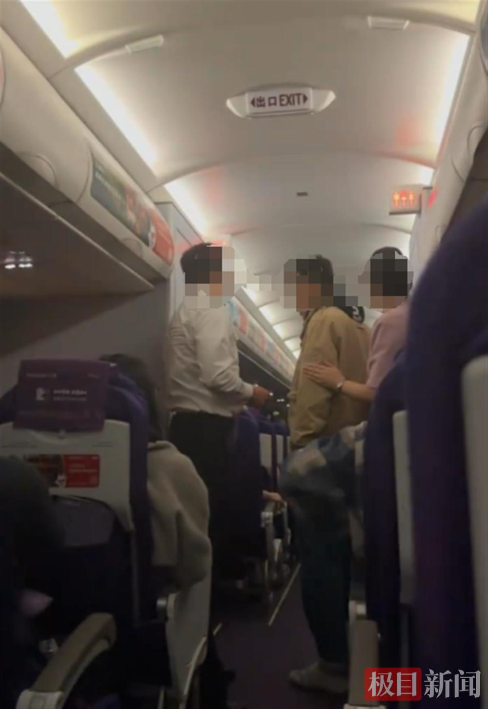

# 日本大阪飞上海航班一男子欲开舱门，吉祥航空：及时制止，已移交警方

极目新闻记者 邓波

11月3日，吉祥航空从大阪关西飞往上海浦东的HO1338航班在下降过程中，一名旅客擅自操作飞机舱门手柄，被机组及时发现并制止。5日，极目新闻记者从吉祥航空方面获悉，航班安全落地后，涉事旅客被移交警方接受调查。

据网友发布的视频，11月3日，吉祥航空从大阪飞往上海浦东机场的HO1338航班降落前，一名男性乘客准备打开应急舱门，机组人员和乘客及时将其制止。

11月5日，航班上一名乘客告诉极目新闻记者，事发时飞机正在降落过程中，涉事男子突然要去开舱门，有乘客看到情况后，大喊问他“要干什么”，随后机上乘务人员和乘客一起，将这名男子制止了，“我们正常下飞机就走了，没有耽误我们行程，他（涉事乘客）被留下来了。”

_客舱现场（图片来源：网络）_

极目新闻记者从吉祥航空方面获悉，11月3日，吉祥航空HO1338航班（大阪关西—上海浦东）在下降阶段，一名旅客擅自操作飞机舱门手柄被机组及时发现并制止。航班安全降落后，涉事旅客被移交警方接受调查。

熟悉航空法律实务的四川鼎尺律师事务所律师胡磊告诉极目新闻记者，现代民用客机为了满足机上人员的生理需求和舒适度需求，飞机通过增压系统给机舱内加压，使客舱压力达到所需的数值，“飞机在高空飞行时，客舱是处于增压状态，但随着飞行高度的降低，飞机内外的压差变小，在一定力量作用下，飞行中的飞机舱门是可以被打开的，比如早前就在韩国发生过落地前约200米的高度上空客飞机舱门被打开的事件。”

对于飞行中舱门被打开的后果，胡磊认为，无论是从飞行技术还是民航法规角度都是有严重影响的，“飞机处于增压状态下打开舱门，不仅客舱内乘客在高风噪的情况下会有严重的不舒适感，而且飞机应急撤离滑梯会释放，机组对飞机的操纵会被严重影响，机下人员也会有安全风险，稍有不慎就会有严重后果。”

胡磊分析表示，在没有造成严重后果的前提下，根据《治安管理处罚法》规定，“盗窃、损坏、擅自移动使用中的航空设施，或者强行进入航空器驾驶舱的，处十日以上十五日以下拘留”，对于此次发生的意图开启飞机应急舱门的行为，公安机关可以依法进行行政处罚，造成严重后果的，更可能适用“以危险方法危害公共安全罪”追究刑事责任，“一旦该乘客打开舱门释放了应急撤离滑梯，乘客更将面临航空公司至少十万元的索赔。”

（来源：极目新闻）

