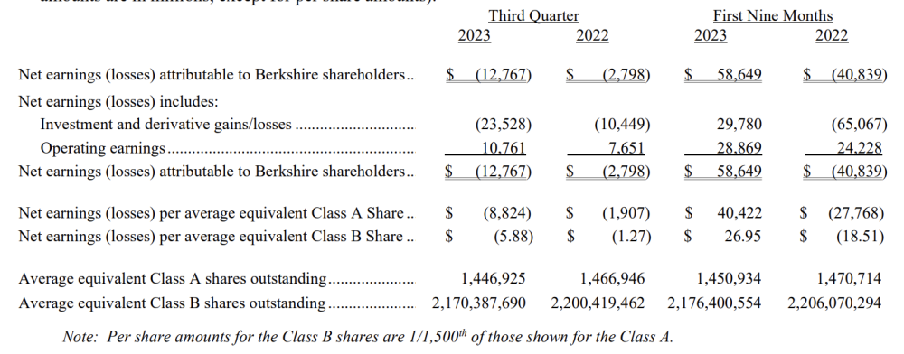

# 股神巴菲特也亏了：三季度证券投资巨亏241亿美元，持有现金创新高

“股神”巴菲特旗下伯克希尔·哈撒韦公司今年季报首次出现亏损。

北京时间11月4日，伯克希尔发布了2023年三季报。报告显示，伯克希尔2023年三季度净亏损127.67亿美元，这是今年来公司首度季报亏损，市场预期净盈利为89.46亿美元，去年同期净亏损27.98亿美元；营收932.1亿美元，市场预期为891.82亿美元，去年同期为769.04亿美元。今年前三季公司仍实现盈利586.49亿美元，远好于去年同期亏损408亿美元。

伯克希尔表示，经营业务受到地缘政治冲突发展、供应链中断和政府减缓通胀行动的影响。不过，保险业务业绩改善提振了运营利润，三季度运营利润107.6亿美元，同比增长40.6%。巴菲特最看重的盈利指标就是运营利润，他一直呼吁投资者减少关注其股权投资的季度波动，指出任何给定的季度投资收益（损失）数额通常是没有意义的，并且提供的每股净收益数据可能对那些对会计规则知之甚少或一无所知的投资者极具误导性。

其中，三季度保险承销运营利润24.2亿美元，季环比增长94%；保险投资运营利润24.7亿美元，季环比增长4.3%；其他控股业务运营利润33.4亿美元，季环比下滑4.6%。非控股业务运营利润2.26亿美元，季环比下滑58%。

运营利润增长但净利润仍下降的原因在于，三季度伯克希尔股权证券持仓的投资收益出现了241亿美元的巨额投资亏损。不过前三季度收益仍有235亿美元。

总资产规模方面，截至三季度末，伯克希尔总资产规模达10199.33亿美元，二季度伯克希尔总资产规模首次突破1万亿美元达10415.73亿美元，也就是说三季度公司总资产有小幅下降。

三季度，伯克希尔每股A类普通股亏损8824美元，而B类普通股亏损5.88美元。

此外，伯克希尔三季度末所持的现金总计为1572.4亿美元，创下历史新高，较一季度末的1306亿美元环比增长6.67%。

同时，该公司回购股票的速度有所放缓，三季度仅花费约11亿美元回购股票，今年以来累计回购金额达到70亿美元。9月末伯克希尔旗下保险公司的浮存金约1670亿美元，较去年末增加了30亿美元。

截至9月30日，伯克希尔约78%的股权投资公允价值集中在5家公司，与上季度相比没有发生变化，分别是苹果、美国运通、美国银行、可口可乐和雪佛龙公司。其中，对美国运通持股市值226亿美元，对苹果持股市值1568亿美元，美国银行283亿美元，可口可乐224亿美元，雪佛龙186亿美元。

截至11月3日，伯克希尔的A类股收盘价为534132美元，涨0.66%，今年以来已上涨近14%，在9月19日达到历史最高点后，其股价已从最高点下跌了约6%。

