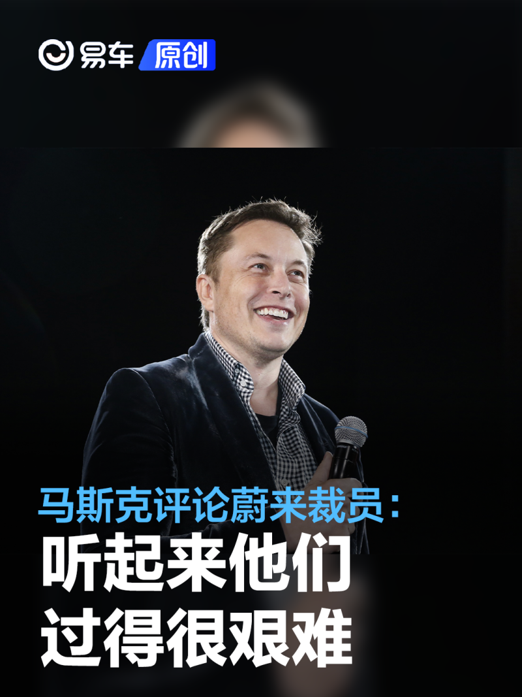
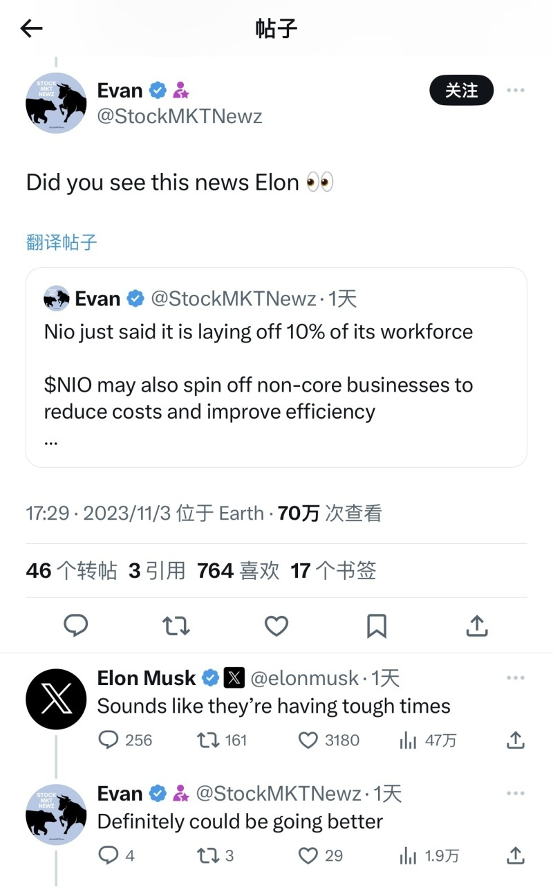
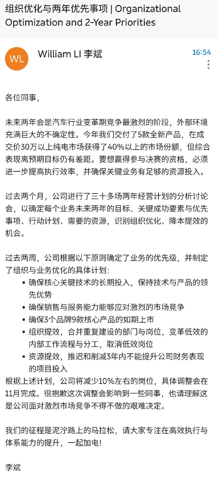

# 马斯克评论蔚来裁员：听起来他们过得很艰难

**易车讯**
日前，特斯拉CEO马斯克在X平台针对蔚来将减少10%左右的岗位进行了评论：“听起来他们过得很艰难。”11月3日，蔚来汽车董事长、CEO李斌发布针对蔚来员工的全员信，信中确认了蔚来将减少10%左右的岗位，具体调整会在11月完成。

李斌在全员信中指出，未来两年会是汽车行业变革期竞争最激烈的阶段，外部环境充满巨大的不确定性。今年我们交付了5款全新产品，在成交价30万以上纯电市场获得了40%以上的市场份额，但综合表现离预期目标仍有差距。要想赢得参与决赛的资格，必须进一步提高执行效率，并确保关键业务有足够的资源投入。

过去两个月，公司进行了三十多场两年经营计划的分析讨论会，以确定每个业务未来两年的目标、关键成功要素与优先事项、行动计划、需要的资源，识别组织优化、降本提效的机会。

李斌同时在信中表示，公司将确保核心关键技术的长期投入，保持技术与产品的领先优势；确保销售与服务能力能够应对激烈的市场竞争；确保3个品牌9款核心产品的如期上市。在此基础上，合并重复建设的部门与岗位，变革低效的内部工作流程与分工，取消低效岗位；资源提效，推迟和削减3年内不能提升公司财务表现的项目投入。

