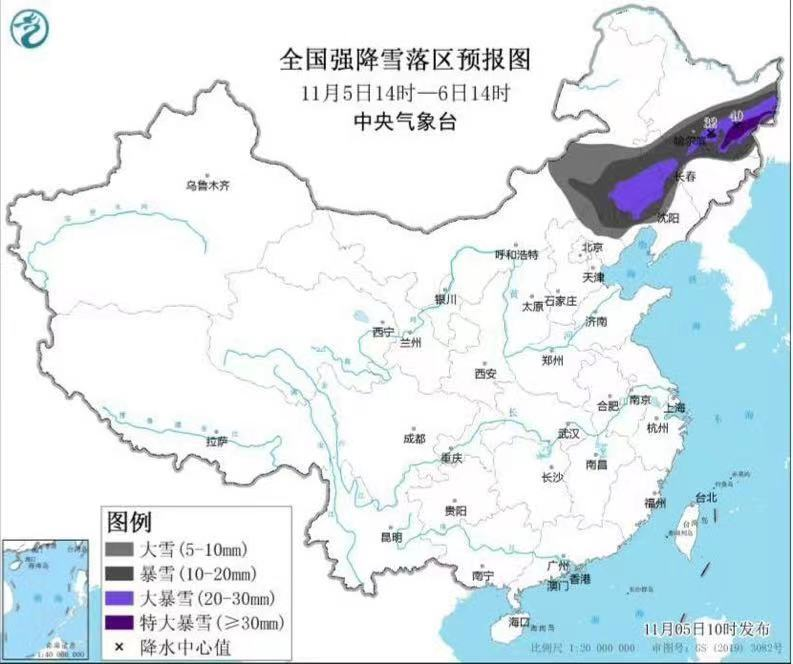

# 黑龙江、吉林启动暴雪应急响应 东北地区多趟列车停运

11月5日，中央气象台发布暴雪橙色预警，11月5日至7日，预计黑龙江、吉林等地有暴雪。东北地区多趟列车因雨雪、寒潮降温影响停运。目前，黑龙江已启动重大气象灾害（暴雪）三级应急响应，吉林省也启动暴雪冰冻灾害四级应急响应。

**中央气象台发布暴雪橙色预警 黑龙江、吉林等多省有暴雪 东北多趟列车停运**

中央气象台11月5日10时继续发布暴雪橙色预警：预计11月5日14时至11月7日14时，内蒙古中东部、东北地区中西部和北部等地自西向东先后有大到暴雪，部分地区有大暴雪，局地特大暴雪，新增积雪深度10~25厘米，局地可达35厘米以上。主要降雪时段5日夜间至6日。

11月5日14时至6日14时，内蒙古中东部、河北北部、辽宁西北部、吉林西部、黑龙江东南部等地的部分地区有暴雪到大暴雪，其中黑龙江东南部局地特大暴雪(30~40毫米)
;黑龙江东南部部分地区和吉林中北部等地局地有冻雨。上述部分地区新增积雪深度10~20厘米，局地可达30厘米以上。

11月6日14时至7日14时，黑龙江中东部、吉林中西部等地的部分地区有暴雪到大暴雪，其中黑龙江东北部局地特大暴雪(30~35毫米)
;吉林中西部、黑龙江东部等地局地有冻雨。上述地区新增积雪深度10~20厘米，局地可达25厘米以上。

另据沈阳铁路局消息，高空低涡和地面南方气旋北上共同影响，东北地区将出现今年秋冬季首场大范围雨雪、寒潮降温、大风天气过程。为确保旅客列车运行安全，11月5日至7日，部分旅客列车临时停运或调整运行区段：

1.11月5日、6日沈阳开K7507次、五女山开K7508次停运。

2.11月5日、6日沈阳开K7541次、辽源开K7542次停运。

3.11月5日、6日长春开K7571次、梅河口开K7572次停运。

4.11月5日至7日通化开4347次、集安开4348次停运。

5.11月5日至7日通化开4349次、临江开4350次停运。

6.11月5日至7日通化开4245次、长白山4246次停运。

7.11月5日、6日通化开4318/9次、丹东开4320/17次停运。

8.11月5日通化开K7386次、大连开K7385次停运。

9.11月5日通化开K430次、11月6日北京开K429次停运。

10.11月5日、6日呼和浩特开K2014/1/4次停运，11月6日、7日乌兰浩特开K2013/2/3次停运。

11.11月5日北京开K429次沈阳北至梅河口间改经由京哈、四梅线运行至梅河口站恢复原径路，迂回区段不办理客运业务。

铁路部门提示，已购买停运旅客列车车票的旅客，可于30日内，通过中国铁路12306网站、APP和全国铁路任一车站退票窗口等渠道，办理退票手续。请广大旅客及时关注中国铁路12306网站信息或车站公告，妥善安排出行。

**黑龙江启动重大气象灾害（暴雪）三级应急响应**

据黑龙江省人民政府对外宣传办公室11月5日消息，根据黑龙江省气象局消息，11月5日夜间至6日黑龙江省东部地区有大暴雪、雨雪冰冻天气，局地降水量将突破历史同期极值。11月4日11时，黑龙江省气象灾害应急指挥部启动重大气象灾害（暴雪）三级应急响应命令。

11月6日凌晨至上午，哈尔滨地区将出现冻雨。此次过程影响范围广、降雪量大、灾害种类多，有冻雨、湿雪、暴风雪、道路结冰，东部部分地区降水量可能接近或突破历史同期极值。对交通、通讯、城市运行、能源保供等影响较大。预计，5日8时至7日8时，哈尔滨、佳木斯、双鸭山、七台河、鸡西、牡丹江累计降水量为25～50毫米，其中双鸭山、七台河、鸡西、牡丹江东部局地50～60毫米；伊春南部、绥化东部、大庆南部、鹤岗累计降水量为5～20毫米；其它大部地区为1～5毫米。5-6日全省大部平均风力4～6级，阵风7～8级，局地可达9～10级，中东部地区将出现暴风雪。雪后降温明显，5-7日气温大幅下降，大部地区降温幅度8～10℃，局地10～12℃。7日白天大部地区最高气温-8～-3℃；夜间最低气温大兴安岭、黑河、伊春、鹤岗、佳木斯-20～-15℃，其它地区-15～-10℃。

11月4日11时，黑龙江省气象灾害应急指挥部启动重大气象灾害（暴雪）三级应急响应命令，各地各部门迅速进入三级应急响应状态，全力应对暴雪天气过程。

**吉林启动暴雪冰冻灾害四级应急响应**

据吉林省人民政府新闻办公室11月5日消息，据气象部门预测，5日夜间到6日夜间，白城东部、松原、长春、四平、吉林西部、辽源将出现暴雪，部分地方有大暴雪，其中松原北部、长春北部、吉林北部局部地方有冻雨，同时上述地区将伴有6-8级偏北大风。

根据《吉林省暴雪灾害应急预案》《吉林省冰冻灾害应急预案》规定，结合我省防御实际，省应对冰冻灾害指挥部决定于11月5日13时启动吉林省暴雪冰冻灾害四级应急响应。请有关地区坚持人民至上、生命至上，压紧压实防御责任，密切关注天气变化，加密会商频次，紧盯道路交通、设施农业、校舍、旅游景区、供电、供水、供热、通讯、矿山、危化品等重点领域和部位，落实好防范应对举措，加强巡查防护，积极除雪融冰，做好应急准备，全力避免人员伤亡。

文/北京青年报记者 戴幼卿

