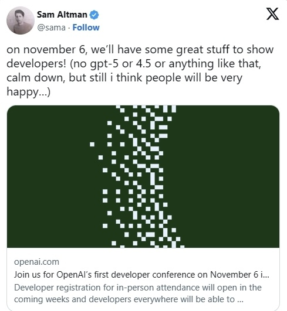

# OpenAI首届开发者大会前瞻：“个性化”GPT将亮相、新团队订阅计划出炉

**划重点：**

  * _1_ OpenAI计划发布ChatGPT的主要更新，包括允许第三方在其大语言模型（LLM）GPT-3.5和GPT-4的基础上构建自己的聊天机器人。
  * _2_ Gizmo工具将是此次更新的核心，据说其可以专门用于创建、管理和选择定制版聊天机器人。
  * _3_ OpenAI还可能引入新的企业订阅计划，月费30美元（或年费300美元）。

腾讯科技讯 美国当地时间11月6日，人工智能研究公司OpenAI将迎来其首届开发者大会OpenAI
DevDay，该公司联合创始人兼首席执行官萨姆·奥特曼（Sam Altman）已经开始在X上预热，称将“向开发者展示很多很棒的东西！”

据透露，OpenAI将在此次开发者大会上公布一系列更新。目前泄露的消息显示，这些更新包括为聊天机器人ChatGPT推出新的用户界面和全新功能，其中包括提供定制版聊天机器人、商业订阅服务以及第三方云连接器等。

增加模型内存和视觉功能

通过在开发者模型中增加内存存储和视觉功能，OpenAI将使其人工智能模型使用起来更便宜，功能更强大。

就在几周前，OpenAI发布了ChatGPT的语音和图像功能。该公司在帖子中表示：“ChatGPT能看、能听、能说，但只是面向消费者。”OpenAI正试图向开发者提供这些相同的功能，这样公司就可以开发出能看见东西的人工智能产品。

据称，OpenAI在首届开发者大会上公布的一项新功能就是增加模型的内存存储。从理论上讲，这将使应用程序开发者的成本降低20倍，解决了人工智能开发人员的一个主要问题，因为他们可能需要花费大量资金来开发这些产品。

科技分析师本·汤普森（Ben
Thompson）认为，与ChatGPT交谈的经历给人留下“深刻印象”，但从消费者的角度来看，其视觉功能还有些不足之处。也许更大的价值来自商业用途，例如公司可以使用具有广泛用例的大型视觉语言模型来构建产品。

视觉功能将使OpenAI的软件能够分析和描述图像，这将使开发者能够在从娱乐到医学等领域构建具有新用途的应用程序。

这些更新旨在鼓励公司使用OpenAI的技术来构建人工智能聊天机器人和自主代理，它们可以在没有人为干预的情况下执行任务。了解奥特曼想法的消息人士称，让OpenAI成为其他公司开发应用过程中不可或缺的一部分，是奥特曼最重要的战略目标之一。

通过Gizmo推出定制版聊天机器人

在X（前身为Twitter）上，用户CHOI分享了已被泄露功能的完整列表。根据他的说法，OpenAI将发布Gizmo工具，允许第三方在其大语言模型（LLM）GPT-3.5和GPT-4的基础上构建自己的聊天机器人，它们将具有不同风格、响应和限制。

Gizmo有望带来以下功能：

——沙盒：提供导入、测试和修改现有聊天机器人的环境

——自定义操作：使用OpenAPI规范为聊天机器人定义附加功能

——知识文件：添加聊天机器人可以引用的其他文件

——工具：提供基本工具，用于浏览网页浏览、创建图像等。

——分析：查看和分析聊天机器人的使用数据

——草稿：为用户创建的聊天机器人保存和共享草稿

——发布：发布定制完成的聊天机器人

——分享：建立和管理聊天机器人分享

——市场：浏览和分享由其他用户创建的聊天机器人

OpenAI还将发布Magic Creator或Magic Maker来 **帮助用户创建聊天机器人** ：

——用交互界面定义聊天机器人

——识别用户意图并创建聊天机器人

——实时测试创建的聊天机器人

——通过反复对话修改聊天机器人的行为

——共享和部署聊天机器人

OpenAI带来了工作空间管理功能和团队订阅计划

根据泄露的消息，该公司还将推出新的企业订阅服务和工作空间管理功能。其中， **团队计划的价格为每月30美元**
，年费为每月25美元（共300美元），但至少要包括三个用户。

团队计划提供了额外的好处，如无限制的快速访问GPT-4，提供4倍长的上下文和无限制地使用高级数据分析模型。此外，聊天模板可以共享，OpenAI不会将数据用于培训目的。

工作空间管理功能提供了个人和工作空间的分离，以及定义角色、部门或其他元数据的能力。应该能够集成外部ERP和CRM系统。

ChatGPT“连接器”链接谷歌Drive和Microsoft 365

此外，据说OpenAI还将提供“连接器”，允许用户将第三方云驱动器（包括谷歌Drive和Microsoft
365（来自OpenAI主要支持者微软)）连接到ChatGPT上，这允许将文档、电子表格或演示文稿附加到聊天或用作对话上下文。

这个工具将可以匹配甚至超越谷歌巴德（Bard）从Gmail和谷歌Drive中提取类似信息的能力。

不会发布GPT-5

除了上述更新，奥特曼已经明确表示，不会公布有关GPT-5的最新消息。不过，据说OpenAI已经有了一个名为Arrakis的强大模型。

奥特曼最近表示：“我们期待着展示我们的最新成果，让开发者能够创造出新的东西。”人们普遍猜测可能会有一场开发者之间的竞争，OpenAI可能会为他们的团队挑选人才。

奥特曼还表示，这是加入他们的绝佳时机。该团队正在不断扩大其办公室，并招聘各种角色，如工程师、数据科学家和开发者等。

涉足硬件领域

据报道，OpenAI现在也打算进入硬件业务。美国智能运动手环研发商WHOOP最近宣布，它将与OpenAI合作推出WHOOP
Coach，这是可穿戴设备有史以来发布的最先进的生成式人工智能功能。OpenAI可能会将更多的生成式人工智能功能整合到各种硬件设计中。

据最近的报道，苹果iPhone设计师乔尼·艾维（Jony
Ive）和奥特曼正在讨论一种新的人工智能硬件。OpenAI不太可能冒险进入手机市场，因为它需要数年时间才能建立制造工厂，与苹果等公司在市场上竞争。

而另一方面，苹果似乎更容易开发像GPT-4这样的大语言模型，并进入OpenAI所在的市场。

OpenAI可能只是想坚持产品开发的软件方面，并将其功能集成到其他产品中，就像它对WHOOP所做的那样。由于OpenAI致力于保持简单和快速突破，它可能会转向更小的边缘用例，如智能手表甚至智能戒指。

微软最近泄露了一款“人工智能包”，用户可以用它与人工智能模型进行交互。这也可以由OpenAI的GPT提供支持。但考虑到OpenAI和微软之间的关系，奥特曼领导的公司可能想要开创属于自己的东西。

此外，在苹果、Meta甚至微软发布的所有VR/AR/MR头显中，OpenAI都有可能涉足。该公司已经开发出了GPT-4V（视觉），这被视为其进一步进入计算机视觉产品领域的第一步。

考虑到最近的收购，OpenAI甚至可能进军游戏市场。最近，OpenAI收购了3D世界设计公司Global
Illumination，这暗示着OpenAI将全力投入到人工智能机器人的虚拟世界模拟中。这也可能是其进入游戏行业的一步。（文/金鹿）

