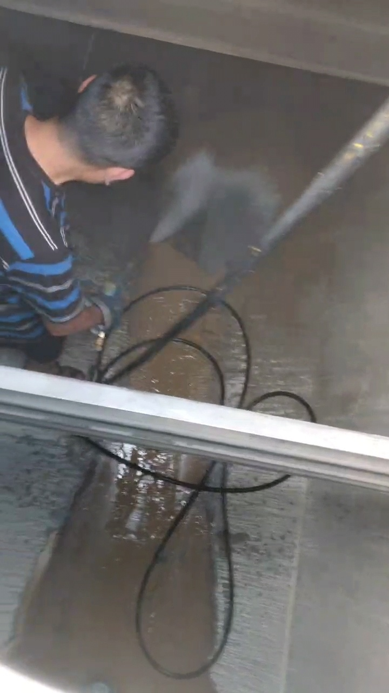
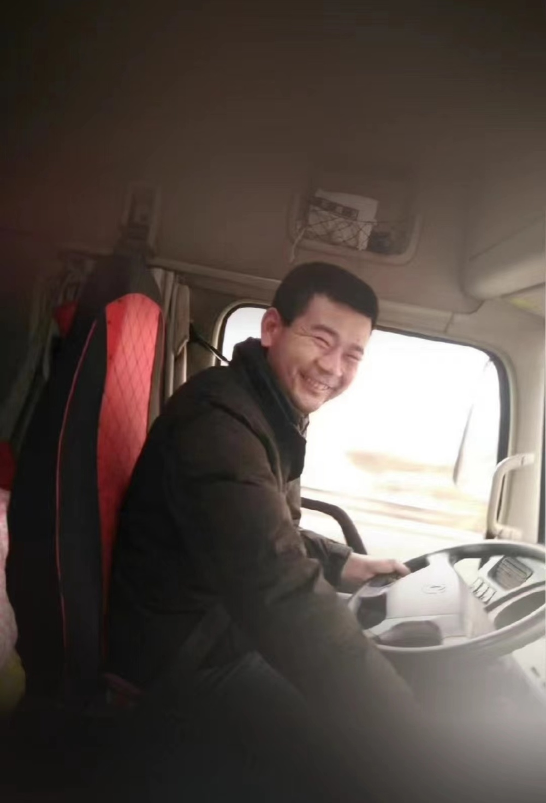
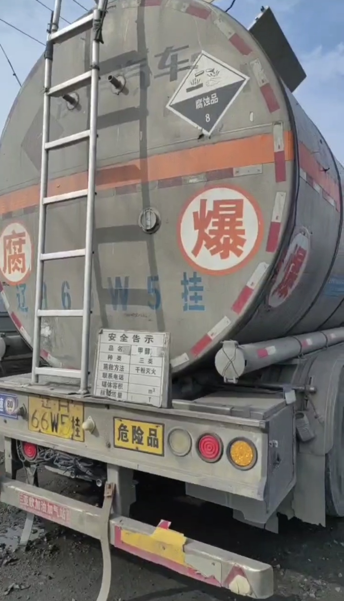
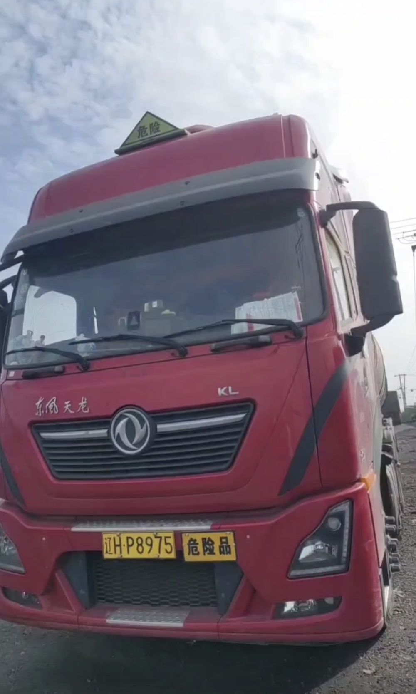
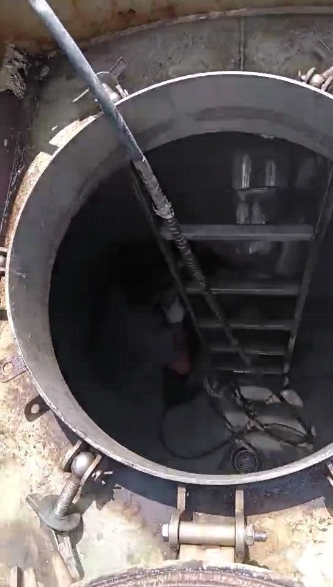

# “老板让你进罐，你不进？”危化车司机死亡背后的“夺命”槽罐清洗

又一名司机在清洗危化品运输车槽罐时不幸去世。

9月10日晚上9点半左右，在山西大同云岗镇刘官庄村，不过两三分钟的时间里，从那辆危化车罐口窜出的气体放倒了三个人：正在洗罐的47岁司机白莉波，晕倒后掉进罐内，窒息死亡，妻子叶秀香的侄子、危化品押运员叶振奇和一个前来搭救的路人也被送往医院。

洗罐的确是一项危险系数极高的工作。装着危险化学品的罐车，在卸下一批货物后，为避免残留的化学物质污染下一批货物，需要清洗罐体。一般来说，这需要人进入罐内操作，稍不注意，人很容易中毒或窒息。

新京报记者搜索发现，近年来，司机或洗车员因在缺乏安全防护、不遵守操作规程的情况下洗罐而丢掉性命的事故并不罕见。尽管有些地方出台了文件，要求危化车到指定的、具有资质的清洗场由专业人员清洗，但是，由于目前我国尚无全国层面的法律法规或部门文件对槽罐车清洗作出规定，相关的行业标准也尚未出台，在现实中，为了节省成本，一些私人车队老板仍会要求司机到普通洗车点自行清洗。

“挣人家钱，人家让你进罐，你不进？”很多司机一咬牙，铤而走险，钻进罐里。

_一次卸货后，白莉波在罐里冲洗槽罐内壁。 受访者供图_

**人像面条一样，“咚”一声滑进罐里**

这次拉的是一罐甲硫醇钠。

一种无色、透明的强碱性液体，能用于合成农药。“爆”“腐”“严禁烟火”“危险品”，鲜艳的标识贴在灰色槽罐的每一侧。这辆体型庞大的“辽HP8975”“辽H66W5挂”（危化品槽罐车有车头和车挂两个牌照）一上路，总带来点紧张的气氛。

红色的车头里坐着白莉波。他性格沉默，络腮胡覆盖了下半张脸，一打哈欠就露出被烟熏得黑黄的下牙。9月10日那天，他照旧一大早出发，行驶在宁夏中卫开往山西大同的国道上。

全程近一千公里的路，白莉波把车窗开着，提神。西北的风已经有些硬了，吹得人头皮发紧。

在妻子叶秀香看来，白莉波是个经验丰富的老司机，槽罐车开了23年，“13米长的油罐车，一把就倒进停车位，这么多年蹭都没蹭过。”

_白莉波。 受访者供图_

28岁的叶振奇坐在副驾，平时这个位置是姑姑叶秀香的。危化品槽罐车里，一个司机、一个押运员是标配。以往都是夫妻俩搭班，这次家中有事，叶秀香让前两年考了危险品运输押运员从业资格证的侄子帮她跑一趟。

9月10日晚上6点多，白莉波和叶振奇来到大同一家化工厂，卸下了这车甲硫醇钠。然后，白莉波下车接了一个电话，叶振奇没听到电话内容，“姑父只说接下来要往内蒙古开，去拉下一车货，中途找个洗罐的。”

这是叶振奇第一次拉危货。姑父嘱咐，化学品和普通货物不一样，卸货后，如果罐壁上的残留物会和下一车货物起化学反应，就得洗罐，如果不起就不用洗。“具体货物是什么性质、货物之间是否起反应，咱也不知道，总之，洗不洗罐都听车队老板的。”他听姑父说。

车又开出了一百多公里，大约晚上9点半，他们到了大同市云岗镇刘官庄村附近的国道上。附近很荒芜，路边有家工厂，一排简陋的饭店亮着灯，周围停着几辆大货车。白莉波把车停在一家招牌上写着“洗车加水”的饭店门口，招呼侄子下车洗罐。

白莉波怕水弄湿衣服，换上了短袖、短裤和拖鞋，戴了一双胶皮手套。车上有头盔和防毒面具，他没戴。叶振奇也没戴任何防护装备。

风很大，叶振奇拉上了长袖工作服的拉链。他绕到车后，打开槽罐后侧、胳膊粗细的阀门——冲罐的废水要通过这个阀门排到马路上。一股淡淡的农药味儿飘出来，他没在意。几小时前卸货时，他也闻到了这股味道，“现在淡多了。”

两人爬上罐顶。顶上有三个罐口，每个直径约80厘米，刚好能通过一个人。叶振奇在离一个罐口约半米远的位置，用钢管头拧开盖子上的螺丝，用力拉开盖子，翻到一边。

他回头看了一眼姑父——白莉波正站在靠近车尾的那个罐口旁，拿着水管往里面冲水。

还不着急拍视频。拍视频是为了给车队老板报账：洗罐要加水，水费一次大概200元。按规矩，视频必须得拍到司机进罐和在罐内冲洗的画面——这才能证明洗到位了。

白莉波拉过多次甲硫醇钠，知道这东西有毒，为了安全起见，他像往常那样，先站在罐顶冲水，放放味儿，打算过半小时再进罐。

一分钟后，叶振奇再次看向姑父。“他身子好像一下子就软了，正要往下坐。”

叶振奇感到情况不对，快步往姑父的方向走，还没到地方，就看着白莉波的身子像一根面条似的，顺着罐口，“咚”一声滑进罐里。

“糟了！”叶振奇心一沉，赶紧走过去，趴在罐口伸头往里看。天很黑，他什么都没看清，只感到一股刺鼻的农药味儿往鼻子和嘴巴里钻，大脑一下子空白了。

在路边饭店吃饭的一位大哥看到了这一幕，立即跑过来，爬上罐救人。事后，叶振奇听他说，自己倒在罐口旁，口吐白沫。热心的大哥把叶振奇救下来后，趴在罐口、想看看白莉波的情况，也什么都没看到，晕了过去。

饭店老板拨打了急救电话。叶振奇和热心的大哥被送到医院，被诊断为“有机溶剂中毒”，需要吸氧治疗。

掉进罐里的白莉波就没那么幸运了。他在里面待了近两个小时，“120急救人员和民警都不敢进罐救人，也担心中毒，最后是消防队把人捞上来的，当时人就已经没了。”叶秀香听办案民警说。

死亡证明上，白莉波的死因为“窒息”，“引起的疾病或情况”一栏中，写有“中毒”字样。

**装货前未洗罐或有风险，老板否认卸货后要求司机自行洗罐**

9月11日晚上6点多，接到消息的叶秀香和家人连夜赶到大同。

殡仪馆里，他们戴着口罩，仍然能闻到遗体上刺鼻的农药味。

叶秀香想不通：以前白莉波拉过甲硫醇钠后也洗过罐，为什么这次出事了？

长安大学汽车学院教授、交通部危险货物道路运输专家沈小燕告诉新京报记者，从查询到的甲硫醇钠化学品安全技术书来看，甲硫醇钠不属于剧毒化学品，应属于第8类腐蚀性物质。但同时需要关注，“这辆车在拉甲硫醇钠之前拉了什么？”

白莉波和叶振奇8月28日离开家，甲硫醇钠是这次出车、他们拉的第4种货。

 _事发时白莉波驾驶的危化品运输槽罐车。 受访者供图_

叶秀香提供的运单显示，上一车货物是乙醛肟，事发前一天在山西吕梁卸了货。叶振奇说，乙醛肟无色无味，老板没让洗罐，于是白莉波推测，乙醛肟不会和下批货起反应，就只是把罐口敞开，“晾了一路。”到宁夏中卫的化工厂装甲硫醇钠时，厂家的人也没问“有没有洗罐”。

但记者咨询业内专家了解到，在运输和储存过程中，乙醛肟在一定反应条件下可以与甲硫醇钠发生反应，增加其危险性。但从现场具备的反应条件和人的症状来看，沈小燕推断，主要原因还是甲硫醇钠在一定条件下生成的甲硫醇气体造成人员中毒：“甲硫醇气体具有毒性，吸入后可引起头痛、恶心及不同程度的麻醉效果，高浓度吸入可导致呼吸麻痹而死亡。”

老板张志民始终否认这次洗罐是由他安排的。“我一直都是要求去有资质的地方洗罐的。”他说，何况这次，下一车货物也是甲硫醇钠，他没有要求清洗，“卸甲硫醇钠再装甲硫醇钠，这个罐根本就不用清。到现在我也觉得（他为什么自己洗罐）是一个谜。”张志民对记者说，但他没有提供下一车货为甲硫醇钠的证据。

叶秀香不认可这一说法：“如果不是老板让洗罐，我老公为什么要平白无故地冒着生命危险，自己搭钱去洗罐？”

**涉事车辆是否具备承运甲硫醇钠的资质？罐检报告疑似造假**

事发后，大同市云冈区应急管理局联合各单位成立了事故调查组，调查事故原因。

目前，白莉波的尸体已经在殡仪馆停放了40多天，叶秀香在大同的各个部门间奔波，配合调查，想为丈夫的死讨个说法。

最早，白莉波在一家大型央企开油罐车，叶秀香在车队做饭。为了多挣点钱，2020年，他们经人介绍加入了张志民的车队，开始拉危险化学品。出事前，两人每月一共能挣两万多块。

白莉波是单驾司机，没人换班，一天开车时间长达十四五个小时，有时困得睁不开眼，叶秀香心疼，催他停车睡一会儿，他摆摆手，指一指车上的摄像头，担心老板催促。叶秀香只好接一桶水放车上，浸湿一条毛巾搭在丈夫头顶，避免他犯困出事故。

_事发时白莉波驾驶的危化品运输槽罐车。 受访者供图_

她也劝过丈夫，“这活儿太危险，咱们别干了，还回去开油罐车。”那是今年过年的时候。白莉波没答应，“再给儿子攒点钱，把今年熬过去。”

张志民的车队有十几辆危化品槽罐车，挂靠在辽宁省营口市聚通物流公司（以下简称“聚通公司”）。

记者查询发现，2020年施行的《危险货物道路运输安全管理办法》明令禁止危险货物运输车辆挂靠经营。但业内人士透露，私人车队无法办理承运危险货物所需的手续，挂靠企业经营其实很普遍。

沈小燕介绍，一辆车具体可以承运什么货物，既要符合道路运输经营许可证和道路运输证规定的经营范围，又要在罐体检验结论报告给出的车辆罐体适装介质列表范围内。

涉事车辆的确有这些证件：承运危险货物必须的道路运输经营许可证、道路运输证、罐体检验结论报告的所属方均是聚通公司，证件平时都放在车上，随时待查。

但蹊跷的是，叶秀香发现，车上有三份报告编号相同的罐检报告，只有一份报告列出的车辆罐体适装介质中包括甲硫醇钠。

“一个编号只能对应一份罐检报告，不可能出现三份报告编号相同的情况。在实际执法过程中，曾遇到过罐检报告造假的情况。”沈小燕表示。

叶秀香说，出具罐检报告的检测公司的一位负责人曾向她证实，他们给出的报告里，涉事车辆罐体适装介质中不包括甲硫醇钠。新京报记者致电该负责人，对方没有作出正面回答，只是表示“已将结论告知死者家属”。

对此，张志民回应：“（罐检报告）是物流公司（聚通公司）申请的，（罐检报告造假）这个我不清楚，司机和押运员知道这个情况。”

一位从业十余年的危化槽罐车司机告诉记者，一般来说，车队规模越大，货源越稳定，拉的货的种类也越固定，“不会出现今天拉这个介质，明天换个介质的情况。”但是规模小的私人车队里，有些老板会为了利益铤而走险，“什么货都接，如果超出罐检报告列表范围的，就只能造假，把货物种类加上去。”

**洗罐乱象：隐蔽的“黑作坊”，缺少防护的司机**

如果介质更换频繁，洗罐的频次也会相应增加。

新京报记者咨询了多家危化槽罐清洗机构和危化品运输业内人士，了解到目前清洗槽罐一般分为三种情况。

第一种是由资质齐全、通过环境影响评估的正规企业清洗。这类企业一般规模较大，开在化工厂附近，由具备相关资质的专业操作员佩戴防护装备，执行严格的操作规程，进罐清洗。这类企业还配有蒸罐设备，蒸罐比水冲清洁力度更大，如果厂家对货物纯度的要求高，就需要蒸罐。蒸罐全程自动化操作，操作员不用进罐。

但是，目前这类企业数量并不多，价格也高。在浙江省宁波市，自称“全宁波唯一一家手续齐全”的槽罐清洗公司，清洗一次的费用在800元到3000元不等。

第二种是“黑作坊”。由私人老板购置设备，雇几个人洗罐。危化槽罐车司机的微信群里流传着这些老板的联系方式。这类场所位置隐蔽，司机们需要开车到附近再电话联系，然后工作人员会来到马路边带路，蒸洗罐时，一般也不让司机靠近。这类地方洗罐、蒸罐费用在300到800元不等。

第三种就是在路边找能用水洗车的地方。这种店只提供水，不负责清洗，水费一般在80元到200元之间。

 _路边洗车摊为危化车提供的用于洗罐的水。 受访者供图_

沈小燕告诉记者，目前，我国没有统一的法律法规或部门文件对危化品槽罐车清洗作出具体规定。2020年施行的《危险货物道路运输安全管理办法》第三十四条规定，禁止危险货物运输车辆在卸货后直接实施排空作业等活动，但没有制定相应的罚则。

新京报记者查询发现，国家标准计划《道路运输液体危险货物罐式车辆罐体清洗要求》目前正在起草制定阶段。该标准规定了这类车辆罐体清洗的安全管控要求、清洗作业要求及环保要求，今年6月，起草组在线上召开了标准研讨会。

此外，江苏镇江、河南焦作、湖北荆门等地曾以地方性规章或开展专项执法行动的形式，对危化品槽罐车清洗作业进行规范。有的是由当地政府牵头，有的是环保部门主抓，对违规洗罐行为的处罚力度有轻有重。

2022年12月，湖北荆门公布的《危险化学品运输槽罐车罐体清洗场所管理办法（征求意见稿）》规定，槽罐车必须到符合本办法规定的清洗场所清洗罐体，否则由交通运输主管部门责令改正。

今年5月，河南焦作孟州市开展专项整治行动，集中检查危险化学品运输槽罐车罐体清洗场所18家。2022年12月，云南省文山市发生的一起因违规洗罐造成的安全生产责任事故中，运输企业负责人被认定承担事故主要领导责任，被处以上一年年收入百分之四十的罚款。2020年，山东菏泽三人在未取得环评审批手续及危险废物经营许可证情况下对危化品罐车罐体进行清洗，将清洗后的废水直接排入无防渗漏措施的废水池内，分别被判处六至七个月有期徒刑并处罚金。

叶秀香记得，夫妇俩多年跑下来，发现山东的处罚力度最大：“山东路旁的洗车点，你给多少钱人家都不敢给你提供水，因为罚得特别厉害。那里正规的洗车场也多，这种情况老板就只能让到正规洗车点去洗。”

但白莉波常跑西北沿线，比如新疆、宁夏等地，正规企业很少，“要找一家正规清洗场所，可能要跑几百公里，来回成本太高了。”如果托运货物的厂家要求蒸罐，老板就会给他发来黑作坊老板的联系方式，如果不需要蒸罐，老板就让司机自己进罐洗。这一说法得到了张志民车队其他两位司机的证实。

“给多少钱我也不进，洗罐死的多了去了。”白莉波生前的朋友、危化槽罐车司机曹峰（化名）说。去年，他曾经进罐冲洗，“在里面的时候没感觉怎么样，出来才发现自己站不住了，脸也煞白。”

_一位危化车司机戴着手套在罐里清洗罐壁。 受访者供图_

罐体内空气不流通，如果不是专业人员，缺乏安全防护，极易发生危险。据媒体公开报道，2023年8月，河北沧州一男子在洗刷槽罐时吸入罐内残存的气体导致昏迷；2022年12月，云南文山一洗车店店员在不具备安全生产条件的作业场所，在未采取任何安全防护措施情况下，进入槽罐车内清洗，中毒窒息死亡；2022年1月，安徽蚌埠，因在罐体内部进行清洗作业，车店的两名员工以及槽罐车司机三人窒息死亡……

身边的例子，新闻里的报道，司机间流传的小道消息，公司隔三差五在微信群里发送的安全培训视频……司机们并不是不清楚违规洗罐的危险性。一位司机无奈地说：“只在罐外冲洗不干净，会有残留，几百万的货污染了，我们承担不起。再说，拿了老板发的工资，人家提出的要求你怎么拒绝？”

他们也试着利用一些措施，保证自己的安全。按受限空间的操作规程，进罐前应“先通风、再检测、后作业”。司机们往往只能做到第一步：进罐前打开罐口，站在上风向，往里冲水，“跑跑味儿。”

检测罐内的含氧量要用测氧仪，一般车上是没有的。进到罐里，司机们也没有防护设备，曹峰在正规企业蒸罐时看到过专业槽罐清洗员的防毒面罩：“面罩上的管子是通到罐外的，（人）吸不进罐里的气体。”

有次，托运厂家要求司机旁观卸货时必须佩戴防护装备，叶秀香从劳保店花30块钱买了个防毒面具，放在了车上。这种普通的防毒面具，司机们都觉得“戴不戴没区别”，甚至夏天罐里气温能达到五六十摄氏度，戴了反而憋闷。

白莉波也不爱用那东西。一次等卸货无聊，他拍了一段视频：脸朝太阳，眯起眼，眉心拧成“川”字，背景是巨大的槽罐。白莉波配上文字：生活很累，却无路可退。

新京报记者 刘思维

编辑 彭冲 校对 陈荻雁

