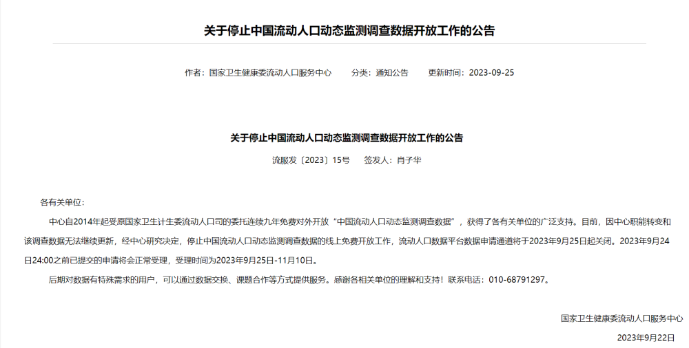

# 中国流动人口动态监测调查数据停止免费开放 工作人员：数据无法更新

近日，一则关于“中国流动人口动态监测调查数据停止开放”的消息在学界引发关注。

_流动人口数据平台网站 截图_

澎湃新闻（www.thepaper.cn）查询发现，9月25日，由国家卫健委流动人口服务中心主办的流动人口数据平台网站发布《关于停止中国流动人口动态监测调查数据开放工作的公告》称，“中心自2014年起受原国家卫生计生委流动人口司的委托连续九年免费对外开放‘中国流动人口动态监测调查数据’，获得了各有关单位的广泛支持。
**目前，因中心职能转变和该调查数据无法继续更新，经中心研究决定，停止中国流动人口动态监测调查数据的线上免费开放工作，流动人口数据平台数据申请通道将于2023年9月25日起关闭。**
2023年9月24日24:00之前已提交的申请将会正常受理，受理时间为2023年9月25日-11月10日。后期对数据有特殊需求的用户，可以通过数据交换、课题合作等方式提供服务。”

11月6日，国家卫健委流动人口服务中心调查评估服务处工作人员告诉澎湃新闻，以前这个平台（即中国流动人口动态监测调查数据）免费向科研人员开放部分数据，供大家使用，今年这种免费供应的模式受到了一些限制，就停止了。

该工作人员提到，前几年机构改革后，没有再组织全国性的大调查，这个数据就无法更新了。

此次停止线上免费开放的中国流动人口动态监测调查数据（China Migrants Dynamic
Survey）是国家卫生健康委自2009年起一年一度大规模全国性流动人口抽样调查数据，覆盖全国31个省（区、市）和新疆生产建设兵团中流动人口较为集中的流入地，每年样本量近20万户，内容涉及流动人口及家庭成员人口基本信息、流动范围和趋向、就业和社会保障、收支和居住、基本公共卫生服务、婚育和计划生育服务管理、子女流动和教育、心理文化等，还包括流动人口社会融合与心理健康专题调查、流出地卫生计生服务专题调查、流动老人医疗卫生服务专题调查等。

在2018年的党和国家机构改革中，国家卫健委流动人口计划生育服务管理司等内设机构被撤销。而中国流动人口动态监测调查数据也更新至2018年。

2023年1月，国家卫健委流动人口服务中心发布的《关于2022年度中国流动人口动态监测调查数据共享开放与开发利用情况的通报》显示，2022年度开放申请的数据系2009-2018年中国流动人口动态监测数据。

国家卫健委流动人口服务中心为2011年12月经中央编办批准成立的国家卫健委直属事业单位。2014年9月，由“国家人口健康委流动人口信息管理中心”更名为“国家卫生计生委流动人口服务中心”，2019年3月再次更名为“国家卫生健康委流动人口服务中心”，同时进一步明确和加强了“参与组织人口相关监测调查，承担数据管理工作”的职责。

据流动人口数据平台网站介绍，2014年以来，该平台通过整合发布全国流动人口相关数据资源和开发制作相关数据产品，已服务社会各界近8000位专业用户，向全国29个省市区政府、事业单位、高校研究机构、社会组织及企业等500多家科研机构共享数据2200余份，截至2019年底，各领域专家学者利用国家卫生健康委流动人口服务中心共享开放的数据实际产出学术专著及论文及其他形式的科研成果约9000余项。

