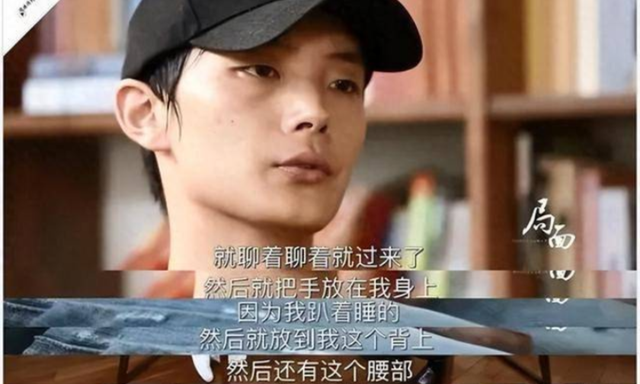

# 作家李枫时隔六年再发长文控诉郭敬明，称性骚扰属实，更多细节被曝光

北京时间11月6日，昨晚作家李枫再次发文控诉郭敬明，对发生在十多年前自己遭遇的事情定性为性骚扰，称2010年的事件是性骚扰。

据悉，2017年李枫发长文《关于郭敬明，致所有人》，透露自己曾经遭遇过郭敬明的骚扰，他2010年参加签售会时，他与郭敬明同住一个房间，郭敬明曾对他实施“性骚扰”。他一直和郭敬明关系比较好，还视对方为贵人，没想到对方却做出这样让自己痛苦的事情。

这次李枫补充了当年他自称遭遇郭敬明性骚扰的相关细节，包括对方说了哪些话，具体有哪些动作。不过这些话是李枫自称，没有任何证据证明这件事是真的，这张图片只是对之前他爆料事件的补充。

长文在当年发布后，郭敬明提起诉讼，指控李枫捏造事实，强烈否认自己曾经做过这样的事，并认为对方损害其名誉，已构成诽谤罪。还将对方告上了法庭，以李枫犯下诽谤罪一案。不过，郭敬明并没有实际的证据，只是气急攻心出于维护自身权益，因此，经审查认为，郭敬明指控李枫犯诽谤罪，缺乏罪证。

即使双方互相控告，但是法律全部判定无效，郭敬明不服气，于2018年8月提起上诉，但最终仍然无效，郭敬明和李枫也因为这件事两败俱伤，淡出了娱乐圈，尽管两个人已经不差钱，但是人生轨迹因此却被改变。

郭敬明出生于一个小县城，条件在小县城很够用，但是郭敬明自己读书考上上海大学，却因为来到上海，见识了上海巨大的阶层差距。郭敬明是有才华的，他从十几岁开始就写书，在大学就开始创业，而后又开始拍电影。虽然小时代备受诟病，可是却为他创造了几十亿的票房，最少的成本创造了最好的票房奇迹。

不过，郭敬明也因为身材矮小非常自卑，所以发誓要出人头地，让父母过上好的生活。可以说他，但是如果他的父母受到了侮辱，郭敬明一定会追究到底。至今为止，郭敬明没有结婚，大家也不知道他的感情生活，他几乎没有传过绯闻和陈学冬的关系，受人瞩目。

郭敬明现在在北京，上海有多套房产，连老朋友杨幂都感叹他的大豪宅像画一样，从商业来说，郭敬明是非常成功的，不管他的为人如何，他从一个没有背景的人到现在的亿万富豪着实是令人钦佩的。

如果不是这一次被爆出性骚扰事件，郭敬明恐怕还会继续拍摄电影，自从这件事之后，他变得非常低调，转型幕后主要当老板，但他已经不需要赚钱了，因为已经财富自由了，只是不知道他是否实现自己的电影梦。

