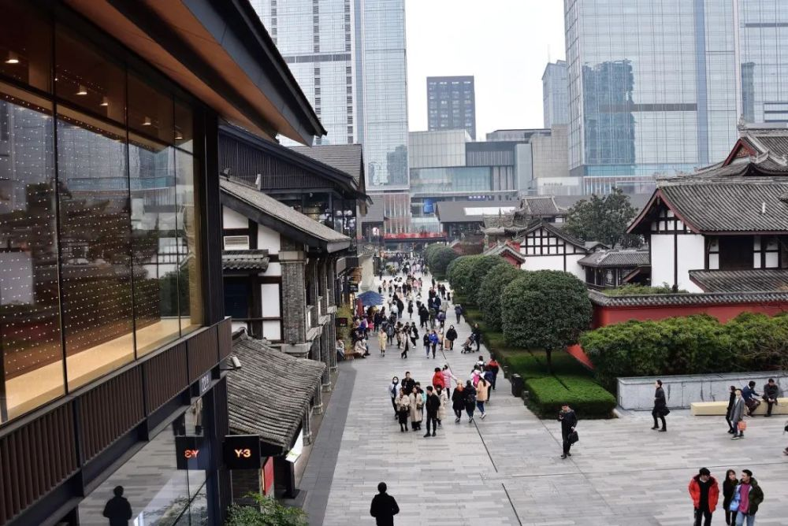
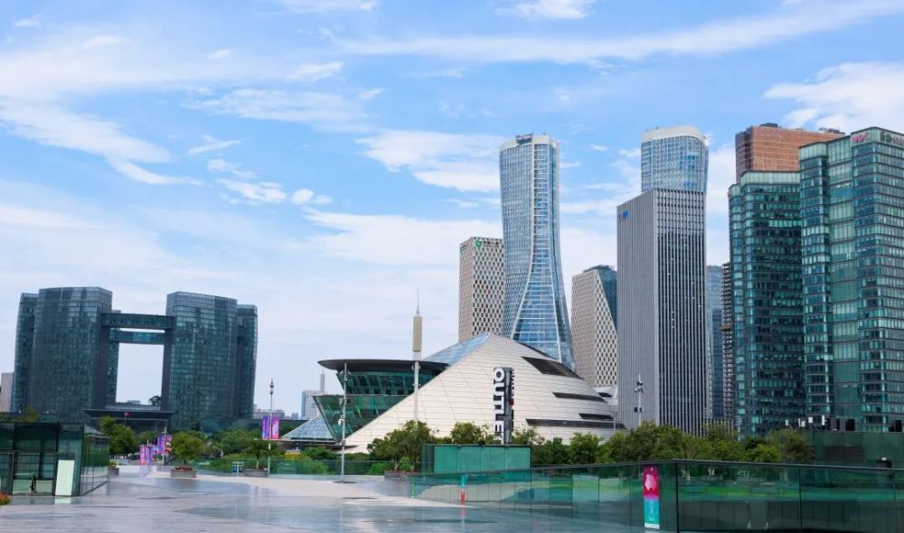
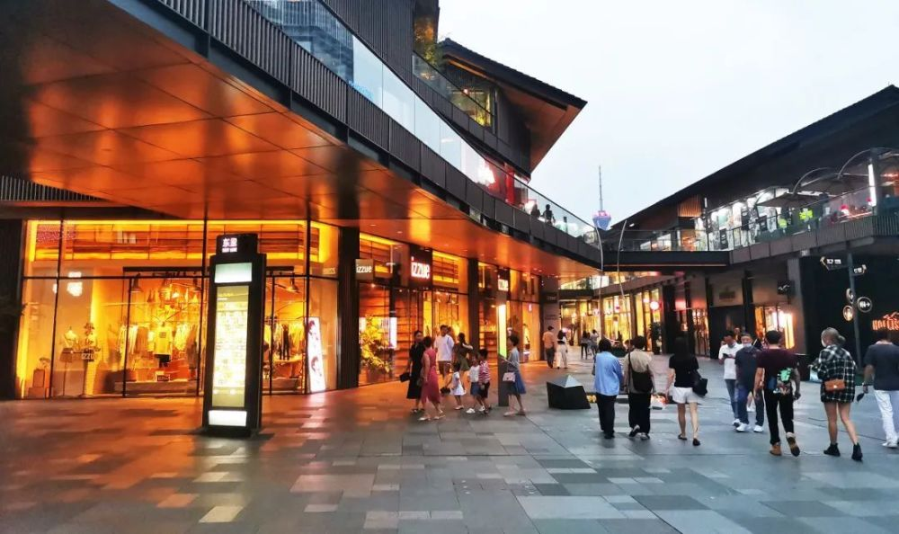

# 卷飞了的二线城市，满是打工人的哀怨

_一座城市的“成功学”，应该将重心放在留人，而不仅仅是抢人上。_

**撰文丨熊志**

那些逃离一线城市的年轻人，在二线城市（又或者叫“新一线城市”）过得还好吗？

如果你在社交媒体上抛出这个问题，估计会收到很多否定的答案。以前都说一线城市太难，要逃离北上广深， **现在二线城市似乎也跟着卷起来了，满是打工人的哀怨。**

就连以安逸著称的成都，也正在失去了它的从容。比如，有位作者这样写道：

一周工作六天，凌晨继续加班，早高峰要等三趟地铁……成了普通打工人眼里成都更真切的形象。

继一线城市之后，新一线城市也正在失去性价比吗？

01

一个简单的事实是，所有的卷，最直接的原因，往往是因为人多。

当考公考编的人多了，进体制这条路，就成了千军万马过独木桥。而当一座城市有源源不断的外来人口流入，流动人口和本地土著，外来毕业生和职场老人抢饭碗，这座城市想不卷都难。

**这两年，很多人吐槽二线城市也难待，这并不是一种矫情或者错觉。**
事实上，在一线城市开始功能疏解的背景下，二线城市已经成为吸纳新人的主战场，它们的人口流入速度，正在打败一线城市。

2022年，四大一线城市常住人口历史性地集体负增长，合计减少约27.5万人。而长沙、杭州、合肥等二线城市，都实现了17万左右的增长。2021年的人口增长前三是成都、杭州和南昌。而在发达的长三角，六普到七普十年间，人口增幅最多的是杭州、苏州、合肥，然后才是上海。

_▲杭州钱江世纪城（图/冰川）_

相较于抽象的数字，一线城漂的感受会更直观。没完没了的加班，遥不可及的房价，动辄掏空钱包的消费水平，它让大城市机会更多、更公平的优势，显得无比苍白。

为了寻求更舒适的活法，很多年轻人从一线逃到了二线。杭州官方人士曾透露，“杭州新引进的跨城流动人才中，有超过20%来自北京和上海”。

他们的降维生存想法，源于一种朴素的逻辑：有一线城市的能力和资源，去二线城市房价更低、节奏更慢，还怕生存不下去？

但现实似乎很扎心。 **一线到二线的流动，现在成为一种集体选择，这条降维生存路线，如今也变得拥挤不堪了。**

“出逃”的年轻人忽然发现，二线城市的房价虽然更低，但好的工作机会也一样不容易找。

以成都为例，你知道成都最火的就业岗位是什么吗？销售。一份被引用多次的机构调查数据提到，“2020年4月，成都销售类职位的企业招聘需求超过一线城市，跃居各重点城市之首”。

不是因为销售岗位工资高、吸引人，而是因为它的门槛很低，可以容纳更多找不到好工作的年轻人。

对一些“大厂”而言，将研发、运营等核心岗位放在一线城市，将销售、客服等劳动密集的岗位放在成都，低价招揽性价比的人才，可以节省更多成本。

于是，“在最贵的写字楼，打最猛的推销电话”，成了很多“蓉漂”的工作状态。

二线城市带来的内卷感受，还会因为滤镜被打破而放大。

大家去一线城市，通常会说是去打拼，但像成都、杭州、西安这样的城市，社交媒体上的美食、美景，总给人以惬意、休闲的感受。而当它给不了松弛的状态时，打工人的倦怠、内耗感，往往会因为理想和现实的巨大落差而加强。

02

那么，为什么还有那么多人扎堆往二线城市跑？这当然不仅是因为它们的滤镜太强大了。

**二线城市吸纳的流动人口，主要还是来自三四线中小城市。** 相较于中小城市，二线城市虽然也卷，但毕竟提供了更多的可能性，有更高的个人发展上限。

到2021年末，全国城市数量达691个，一二线城市数量不到零头。尽管一二线城市的能见度更高，但中国人口的基本盘还是在中小城市，在下沉市场，而非一二线城市或者五环内。

当很多人带着一线城市的资源，去二线城市降维谋发展时，更多的流动人口，是在背井离乡，从小城市跨越到大城市讨生活。

以成都为例，网上很多年轻人吐槽成都卷，城镇居民年人均可支配收入，甚至要低于佛山、东莞等地级市。三四千元的工作，一堆人投简历，研究生的学历，还得被企业HR一顿强势地PUA。

_▲成都太古里（图/图虫创意）_

但你想想，如果回到小城市，那些学历贬值的年轻人，又能够干些什么工作？

成都背后的四川，常住人口8000多万，2022年有超10个市州的GDP在2000亿元以下。

出身普通的小镇做题家，如果想外出闯荡，但又有离家就近就业的诉求，那么除了成都，几乎别无他选，省会城市已经是最后的退路了。

七普数据显示，成都的流动人口为845.96万人，其中跨省流入人口为149.36万人，而省内流动人口为696.60万人。

**一线城市虹吸全国，二线城市虹吸全省。**
这种现象在中西部地区相当突出，因为在强省会的格局下，基本上是一城独大，省会城市承接了海量低线城市就业者的致富梦。

所以在广大二线城市，才会出现一种矛盾的景观：在舒适、安逸的滤镜被打破后，一边是大量打工人喊难，一边是外来人口不断涌入，形成一种“围城”状态。

03

二线城市尽管保持着强大的人口吸引力，这种吸引力很大程度上，是选择单一的结果——既然一线城市待不下去，那么不去省会，还能去哪里呢？

在大城市扎根，当然不是所有人的宿命。事实上，哪怕二线城市比一线压力更小，绝大多数打工人，不过是将它当成挣钱的中转站罢了。
**面对高房价和子女教育问题，最终他们还是要回到家乡，回到小城市。**

或者，至少把买房这件最重要的事儿，放在小城市。

七普数据显示，杭州的人口平均年龄是38.77岁，而外地人占大半的东莞更夸张，平均年龄只有33.4岁，超过这个岁数就要拖后腿了。

为什么如此年轻化？出生人口下降的背景下，这些城市的平均年龄，还是被外来年轻人拉平均了，同时，还有很多打拼者最后回到了故乡。

源源不断的年轻人进来，可能会让一些城市管理者感到无比乐观。过去很长一段时间，人口流入的速度，抢人大战的成绩，是被当成政绩来宣传的。

**这种想法不算错，但很容易忽视人口流入的真实动因。**

就像前面说的，一个四川县城的人去成都打工，或者一个河南地市的人去郑州就业，往往是没有办法的办法。不一定是这座城市有多好，更可能是相对于困守在故乡，这座城市提供的机会至少不那么坏。

_图/冰川_

所以，认为人口增长速度领先，就意味着一座城市的成功，那可能是过于肤浅了。这背后，也反映了一城独大之下年轻人选择面的狭窄。它是一种抢人竞争优势，但也可能演变成一种发展局限。

如果卷成为常态，寄托着安逸和奋斗双重想象的二线城市，迟早会进入折叠状态，难免会有耗光打工人耐心的一天。

因此，我们可能要思考一个问题，当二线城市被贴上新一线城市的标签，当新一线城市的概念被反复炒作营销时， **它的“新”，到底应该体现在哪里？**

年轻人多当然是好事，但如果新一线城市营造的宜居形象，只是一种互联网式的想象，那么被戳破只是时间问题。

一座城市的“成功学”，应该将重心放在留人，而不仅仅是抢人上。而做好产业建设，提供更多的优质就业岗位，同时让房价更友好，让配套更完善，让营商和法治环境更健全，才是留人的关键。

