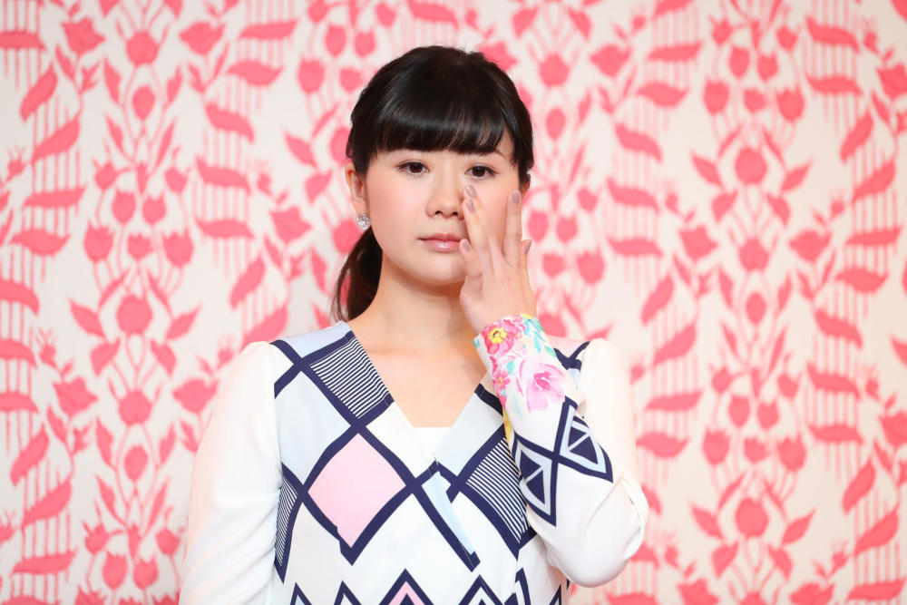

# 因争夺抚养权一事面临牢狱之灾？福原爱回应：已与律师沟通过，大概是没问题

“福原爱出事了！”日本媒体近日以此为题报道称，前日本女子乒乓球运动员福原爱遭前夫江宏杰提出刑事告发，或将面临牢狱之灾。据澎湃新闻等多家媒体报道，由于福原爱不理会日本法院判决结果，其前夫江宏杰向日本警视厅提出刑事控诉，目前警方进行受理，表示不排除逮捕福原爱，而她恐将面临2年以上，20年以下有期徒刑。

2020年东京家庭法院判决，福原爱与江宏杰的长子抚养权归男方，但福原爱拒不履行判决。不过，福原爱日前在接受媒体采访时回应此事表示：
**“我们收到了警视厅的询问，但我们已经与律师沟通过，大概是没有问题。”**

_2018年10月23日，福原爱在日本东京举行退役发布会 图据视觉中国_

在此案件中，福原爱与江宏杰离婚，并就抚养权进行争夺本身是民事关系，为何会转向刑事指控？对此，北京市京都律师事务所合伙人常莎以中国相关情况做对比：在中国，如果已有生效判决的情况下，如不履行判决，则涉嫌违反“拒不执行判决、裁定罪”。刑法第三百一十三条规定，对人民法院的判决、裁定有能力执行而拒不执行，情节严重的，处三年以下有期徒刑、拘役或者罚金；情节特别严重的，处三年以上七年以下有期徒刑，并处罚金。常莎表示，在日本也有类似的刑罚。

据报道，在今年7月江宏杰就孩子归属一事在东京召开记者会，会上与江宏杰一同出席记者会的律师称，如果福原爱拒绝自愿将孩子交给江宏杰，或将以犯有未成年诱拐罪为由将福原爱告上法庭。发布会过程中，江宏杰一度落泪。

 _2023年7月27日，江宏杰在日本召开发布会，控诉福原爱失联1年，自己无法探视孩子，发布会上他一度落泪。图据视觉中国_

福原爱也曾于今年7月在个人社交媒体上发表声明称，身为一位母亲，无论如何保护子女是自己的首要责任。“大人之间的事情，不应该摊在公众视线中，进而影响孩子的生活。我爱我的孩子，孩子是我最珍视的宝贝，不允许任何人伤害他们。”

 _福原爱于今年7月发布微博_

福原爱生于1988年，3岁开始打乒乓球，曾是日本队主力，参加过多届奥运会，江宏杰则是中国台北队的乒乓球选手。两人于2016年9月官宣结婚，2017年产下一女，2019年又生一男，2021年7月宣布离婚。

 _2017年1月1日，福原爱与江宏杰举行婚礼。图据IC photo_

编辑 包程立

