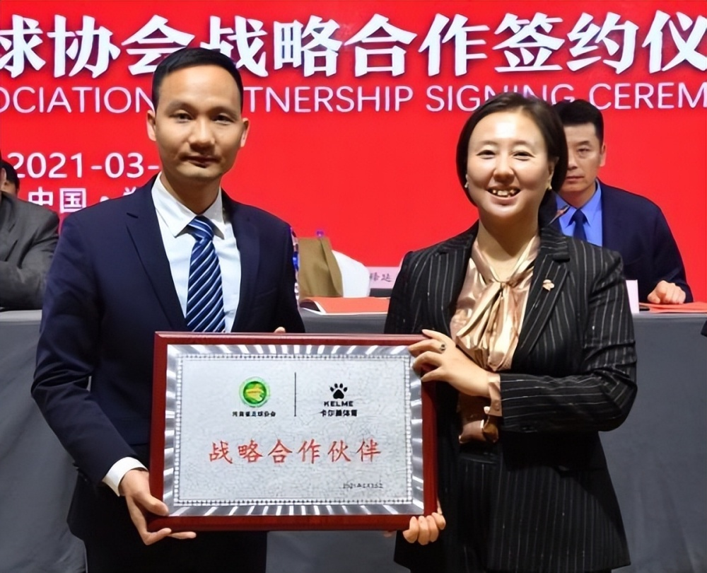

# 媒体称前河南足协主席杨楠被立案调查，26岁成为建业俱乐部“美女老总”

11月6日，据足球报，在近日举行的河南省足球协会全体执委会上，宣布了前河南省足球协会主席杨楠有重大犯罪嫌疑被立案调查，并免去其在河南足协的职务。 ​​

据正观新闻2021年报道，当年的3月20日，河南省足球协会第五届会员代表大会召开，当时46岁的杨楠当选河南省足协主席。从俱乐部高管到基金会主席，再到省足协主席，从“美女老总”到“美女主席”，杨楠被球迷称为河南足球的“功臣”。

_图片源自正观新闻_

1975年出生的杨楠也是中国足坛最早的美女老总，2001年，26岁的她出任建业俱乐部老总。

 _图片源自正观新闻_

任职期间，杨楠通过一系列开拓式运作逐渐改变了建业俱乐部的平民印象，增强了俱乐部在国内足坛的影响力。

从2005年10月开始，杨楠暂离足坛一年，任建业集团采购部经理。建业成功冲超后，杨楠再度出任建业俱乐部总经理。

在建业集团20年，杨楠在俱乐部老总的位置上，曾五上五下，除了总经理，她还担任过俱乐部的副董事长。2008年，杨楠受足协委托，作为中国足球俱乐部的代表，向日本俱乐部介绍经验。

_图片源自正观新闻_

2011年底，杨楠接任河南建业足球事业发展基金会理事长一职，全身心从事足球公益事业。2012年4月，更名为河南足球事业发展基金会。

_图片源自正观新闻_

2019年，杨楠当选中国足协执委。

 _图片源自正观新闻_

**【来源：九派新闻综合足球报、正观新闻】**

