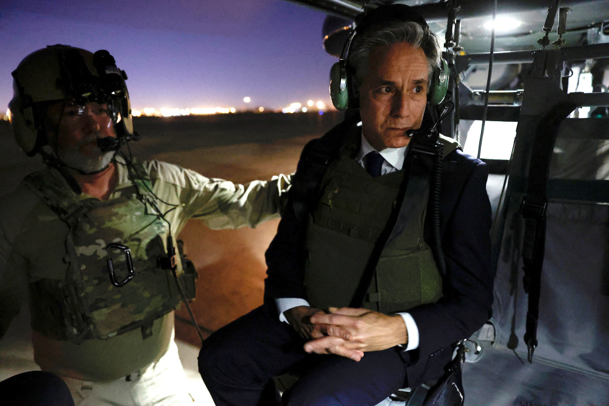
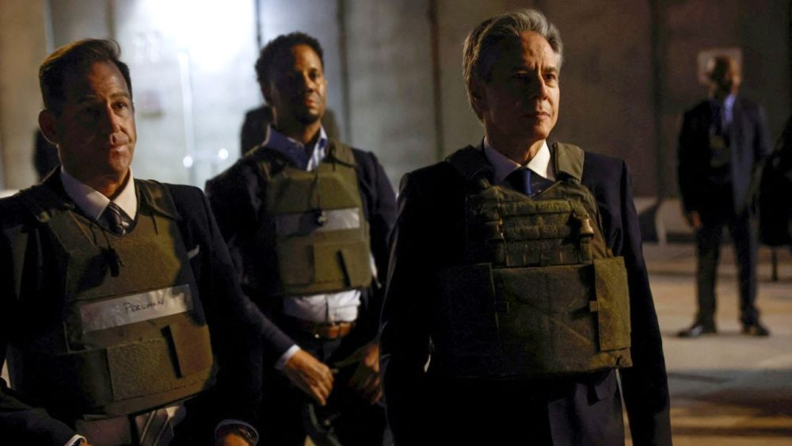

# 布林肯突访伊拉克：伊朗支持的民兵对美国人员的袭击“完全不可接受”

【文/观察者网
熊超然】巴以冲突局势加剧，美国总统布林肯对中东地区的访问也仍在继续。据美国有线电视新闻（CNN）当地时间11月5日报道，布林肯当天突访伊拉克，这一未经宣布的访问行程，是其此次中东之行的重要一站。

期间，布林肯在巴格达同伊拉克总理穆罕默德·希亚·苏达尼（Mohammed Shia al-
Sudani）会晤了一个多小时，还访问了美国驻伊拉克大使馆，听取了有关美国设施在当地面临威胁的安全简报。

据报道，巴以冲突升级之后，美国官员一再警告，其他各方不要卷入其中，并声称伊朗支持的代理组织扩大了针对驻伊拉克和叙利亚美军的袭击。对此，布林肯在伊拉克表示，伊朗支持的民兵对美国人员的袭击是“完全不可接受的”。

除了布林肯之外，CNN报道称，美国中央情报局（CIA）局长伯恩斯也正访问中东数个国家，在那里会见“多个情报部门的同行和国家领导人”。据悉，防止巴以冲突扩大化以及解救被扣押以色列人质的谈判工作，是他此行的重要议题。

 _当地时间11月5日，布林肯突访伊拉克 图自CNN_

“我们需要继续防止冲突升级，防止冲突蔓延到其他地区和其他战区。美国已经并将继续对伊朗代理人的袭击作出回应，以保护我们在该地区的人员，保护我们在伊拉克和叙利亚帮助防止“伊斯兰国”（ISIS）死灰复燃的人员”，布林肯当地时间11月3日在特拉维夫的一场新闻发布会上说，“我们将采取一切必要措施来阻止并回应任何袭击。”

而在11月5日同伊拉克总理会晤后，布林肯对记者说，此次讨论是“良好的”和“富有成效的”，并补充说，他明确表示，伊朗支持的民兵对美国人员的袭击是“完全不可接受的”。他透露，两人还讨论了确保当前巴以冲突不会蔓延至更广泛的地区。

关于加沙地带，布林肯说，有关人道主义停火的谈判有一个“过程”，但美国和以色列的团队会在11月5日会面，“研究这些停火的具体细节和实际性”。“以色列对人道主义停火如何发挥作用提出了重要问题，我们必须回答这些问题，我们正在努力做到这一点。”

CNN报道称，在突访伊拉克之前，布林肯已访问了以色列、约旦、约旦河西岸城市拉姆安拉和塞浦路斯，此后还将前往土耳其访问。

_当地时间11月5日，布林肯突访伊拉克 图自CNN_

11月3日，布林肯同以色列总理内塔尼亚举行会晤。当天，布林肯还在特拉维夫召开记者会，敦促以色列实施人道主义临时停火以便让救援物资进入加沙。但就在布林肯讲话后“不久”，内塔尼亚胡发表电视讲话拒绝了这一提议，坚称不接受“任何不涉及释放被扣押以色列人”的临时停火。

11月5日，布林肯抵达约旦河西岸城市达拉姆安拉，与巴勒斯坦总统阿巴斯举行会面。《以色列时报》称，这将是自本轮巴以冲突爆发以来，这位美国最高外交官首次访问约旦河西岸。

据半岛电视台消息，布林肯与阿巴斯的会面时间持续了不到一个小时。会议结束时双方均未发表任何声明。另据美联社报道，除了寒暄之外，两人在镜头前互相问候时都未说话，暂不清楚以上迹象“是否表明会面进行得很糟糕。”

美国官员称，布林肯在会面中重申了美国向加沙地带提供人道主义援助的承诺，并表示将致力于恢复加沙地带的基本服务。此外，布林肯表示，不得强迫巴勒斯坦人流离失所，而美国将帮助巴方实现建立独立的巴勒斯坦国的愿望。在会谈中，阿巴斯敦促停火，但布林肯依旧拒绝接受这一提议。

与此同时，CNN援引一名美国官员报道称，美国中央情报局局长伯恩斯正前往中东数个国家，在那里会见“多个情报部门的同行和国家领导人”。

报道称，伯恩斯此次访问是在巴以冲突加剧期间进行的，美国试图防止更广泛的冲突发生，而关于被扣押以色列人质的谈判仍在继续。

据报道，伯恩斯“将讨论双方共同关心的问题，包括加沙局势、对人质谈判的支持，以及美国对继续阻止国家和非国家行为体扩大巴以冲突的承诺。局长将加强我们对情报合作的承诺，特别是在反恐和安全等领域。”这位官员在一份声明中表示。

**本文系观察者网独家稿件，未经授权，不得转载。**

