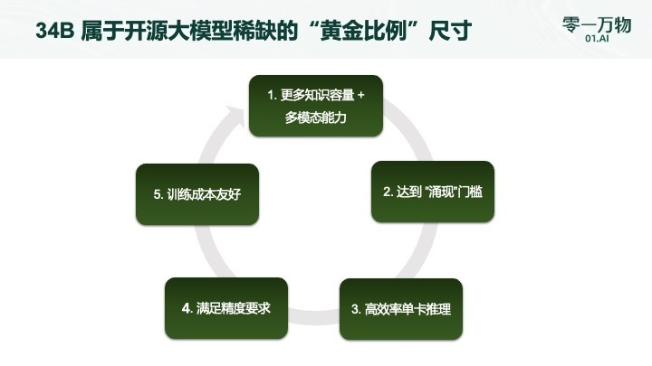

# 李开复创办的零一万物发布首款大模型，目标要做AI2.0时代的超级应用

**文/ 腾讯科技 郭晓静**

腾讯科技11月6日讯 李开复博士带队创办的AI
2.0公司零一万物，正式开源发布Yi系列模型，包含34B和6B两个版本。同时值得注意的是，此次开源的Yi-34B模型，将发布全球最长、可支持200K
超长上下文窗口（context window）版本，可以处理约40万汉字超长文本输入，并将超长上下文窗口在开源社区开放。

相比之下，OpenAI的GPT-4上下文窗口只有32K，文字处理量约2.5万字。今年三月，硅谷知名 AI 2.0
创业公司Anthropic的Claude2-100K 将上下文窗口扩展到了100K规模。

**一、34B满足开源社区刚性需求**

从三月份官宣成立，六月份开始第一行代码，零一万物用四个月的时间发布了两款开源大模型。此次开源的模型参数为34B和6B，不同于开源社区主流的7B和13B。李开复认为：“34B的模型尺寸在开源社区属于稀缺的“黄金比例”尺寸。相比目前开源社区主流的7B、13B等尺寸，34B模型具备更优越的知识容量、下游任务的容纳能力和多模态能力，也达到了大模型
‘涌现’的门槛。”

在精度上，不少开发者都表示7B、13B开源模型在很多场景下无法满足需求，追求更好的性能需要使用30B以上的模型，但一直没有合适的选择，Yi-34B主要是为了解决开源社区这一刚性需求。

另外，基于算力的考虑，34B是“单卡推理”可接受的模型尺寸的上限，训练成本对开发者更友好，经过量化的模型可以在一张消费级显卡（如4090）上进行高效率的推理。对于开源社区的开发者来讲，34B的模型，应该是平衡成本和效果的最佳选择。

在模型效果上，Hugging Face 英文测试公开榜单 Pretrained 预训练开源模型排名中，Yi-34B
在各项性能上以70.72的分数位列全球第一，超越 LLaMA2-70B和 Falcon-180B等众多大尺寸模型。

在中文能力测试上，C-Eval中文权威榜单排行榜上超越了全球所有开源模型。对比大模型标杆GPT-4，在CMMLU、E-Eval、Gaokao
三个主要的中文指标上，Yi-34B 也具有优势 **。**

但和 LLaMA2一样，Yi系列模型在GSM8k、MBPP
的数学和代码评测表现略逊GPT模型。零一万物对此解释道，他们的技术路线倾向于在预训练阶段尽可能保留模型的通用能力，因此没有加入过多的数学和代码数据。研究团队此前在《Mammoth:
Building math generalist models through hybrid instruction
tuning》等研究工作中针对数学方向进行过深度探索，在未来，零一万物的系列开源计划中将推出代码能力和数学能力专项的继续训练模型。

二、大模型必须告别“粗放炼丹”

百模大战已经持续接近一年，零一万物并没有赶上第一波白热化的战场，是不是已经“慢”了？对此，李开复表示“慢即是快”。与过往的“粗放炼丹”训练相比，Yi系列模型更看重“科学”，这就意味着实验结果更加稳定，未来在模型规模进一步扩大的时候，李开复用了一个形容词是“丝滑过渡”。

实现“丝滑过渡”主要是来自于：1、在数据处理管线上“不惜成本”。由前Google大数据和知识图谱专家领衔的数据团队，凭对数据的深度理解与认知，结合大量数据处理实验，建设高效、自动、可评价、可扩展的智能数据处理管线。2、自研一套“规模化训练实验平台”，用来指导模型的设计和优化。数据配比、超参搜索、模型结构实验都可以在小规模实验平台上进行，对34B模型每个节点的预测误差都可以控制在0.5%以内。

三、做AI时代的超级APP，坚定从C端突破

但是，目前无论大模型发布出再优秀的能力，市场也在以冷静的眼光去看待生成式AI的发展，最本质的原因之一就是国内目前并没有爆款应用出现，行业依然在探索较为容易变现和成本相对好控制的B端项目，但同时，因为B端项目多为个性化定制，想要实现规模化爆发难之又难。零一万物推出模型似乎已经“赶了晚集”，但是在未来的商业前景方向，思考却更有攻击力——李开复提出要做AI2.0时代的超级APP（对标移动互联网时代的微信和抖音）。

我们对未来的一个愿景就是，大模型时代，不仅是个人跨向AGI的重要一步，也是一个巨大的平台机会。相对应PC时代，移动互联网时代，现在我们是AI2.0时代，如果说PC时代赋予给开发者用户的机会，就是computer
on every desktop，移动互联网带来的可能是随时随地的计算。那么今天的AI2.0时代，带来的巨大机会就是把一个超级大脑对接在每一个应用上。

所以我们认为在这样的AI2.0时代，一定要开发最好的大模型、底座，但是最大的商机应该在Super
APP。什么是超级应用？就是大部分人需要花大部分时间，每天必须使用才能收获自己的价值体验、或者精神体验。

李开复强调，“AI 2.0时代，毫无疑问最大的商机也会是超级应用，所以这个方向是零一万物正在努力的目标。在移动互联网时代，抖音微信就是相当好的超级应用。”

基于超级应用，如何AI2.0时代的商业模式，李开复提到了三个重点：

首先，大模型时代的应用一定是AI原生的，如何判断是不是AI原生，就是说如果没有AI、没有大模型，这个产品就不成立。虽然微软的copilot是很好的产品，但是也不是AI原生。

第二，商业的可持续性非常重要。是否能够拿到可持续的、高价值的收入是关键。AI1.0时代，很多时候很多公司拿到一个项目一笔钱，后面就没有了。一亿收入需要500个人，两亿收入就需要1000个人，这本质是靠人力的商业模式，而不是技术的商业模式。

第三，坚持看重C端市场，中国做消费级的APP的经验是远远优于美国的，甚至以后可以扩展到全球市场。

至于如何看待B端市场，是否认为B端没有爆款应用的潜质？零一万物在发布会现场回复腾讯科技：在TOB领域会也开放探索，但是首先的判断还是趋势的改变会从TOC开始，这也是零一万物在策略上选择的路线。AI2.0未来生态发展的空间巨大，也不排除通过TOC渗透入TOB。

