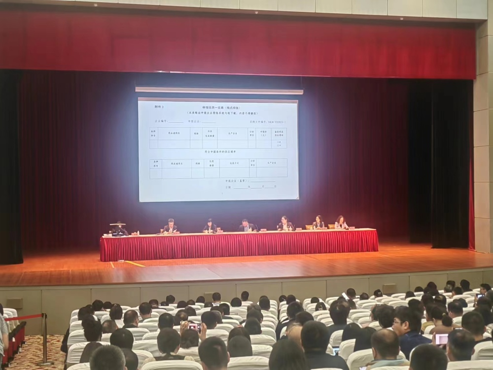
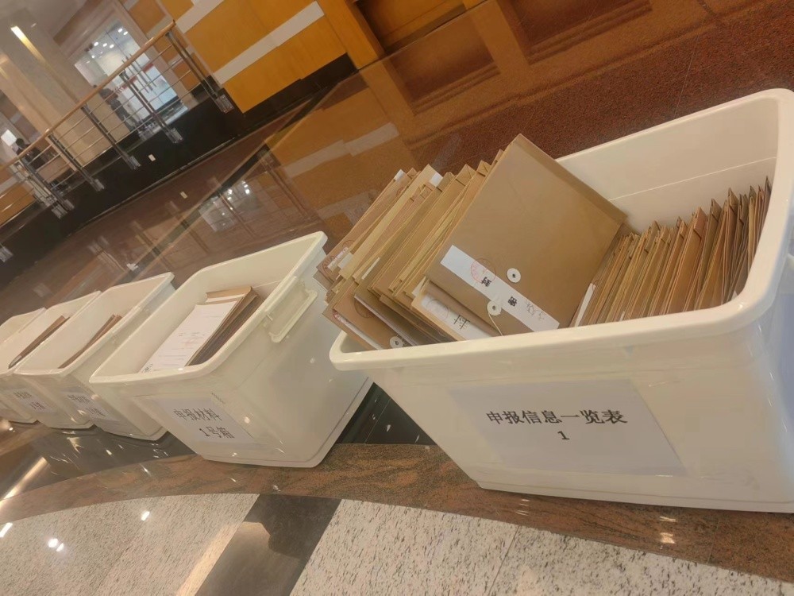
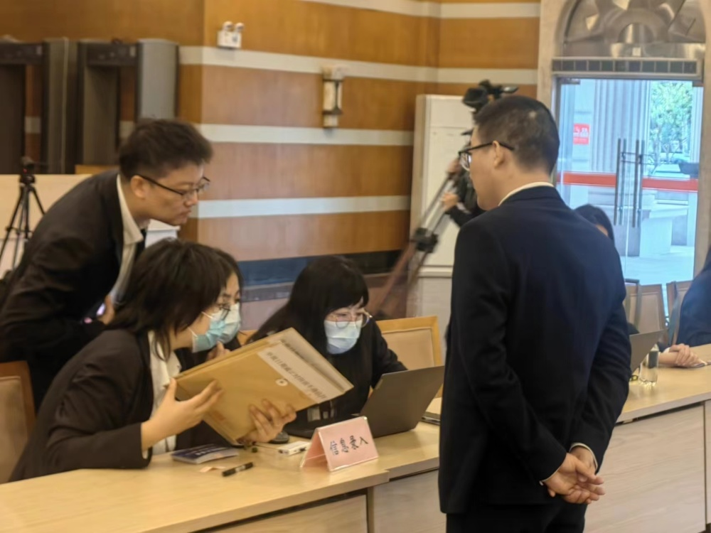
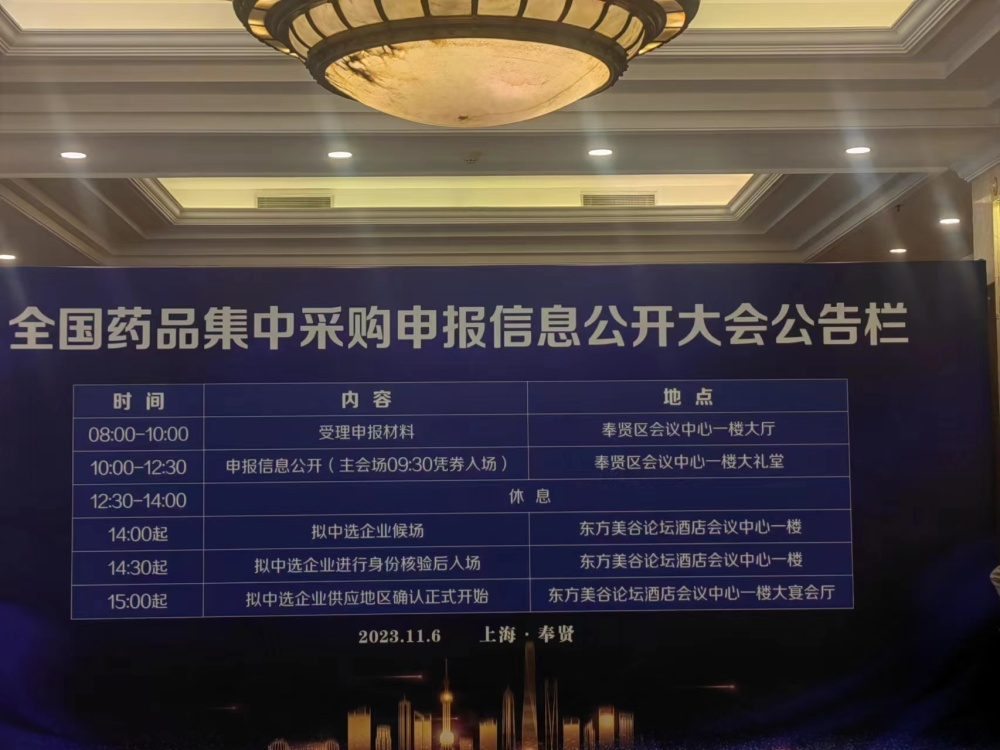

# 现场直击第九批国家集采，42个品种再迎“降价风暴”

6日上午，第九批国家组织药品集中采购在上海市奉贤区会议中心开标。本次集采品种42个，涉及100个多品规，覆盖高血压、糖尿病、抗肿瘤、胃肠道疾病等多个药理类别。

由于此次集采同一品种申报企业较多，大于10家企业申报的有12个品种，专家预测此批集采竞争激烈，中选药品将再次迎来“降价风暴”。

 _（第九批全国药品集中采购申报信息公开大会现场）_

按照开标现场“全国药品集中采购申报信息公开大会公报栏”的信息，6日上午8:00~10:00为受理材料时间，10:00~12:30进行申报信息公开的环节。

第一财经在开标现场看到，从早上8点开始，参与第九批国家组织药品集采的制药企业陆续到达现场递交集采材料，大部分企业在9点之后进入现场，到10点时5个申报材料箱已装满。

_（开标现场的申报材料箱）_

国家组织药品联合采购办公室10月13日发布的《全国药品集中采购文件（GY-
YD2023-2）》显示，本次集采规则进一步优化完善，覆盖药品的范围继续扩大，从采购金额来看，既有塞米松磷酸钠注射剂、缩宫素注射剂等超过10亿的大品种，也有金额不足100万的小品种。

中国药科大学国际医药商学院教授路云对第一财经记者表示，一个品种是否纳入集采与采购金额的大小没有关系，主要是看竞争格局，如果一个品种通过一致性评价已经有5家企业，就说明这个药品市场竞争比较成熟，它的生产能力、质量保证都比较高，就可以纳入集采的范围。

_（药企代表进行信息录入）_

第九批集采规则再次延长了采购周期，明确采购周期为中选结果执行之日至2027年12月31日，从落地之日算起，此批采购周期将超过3.5年。

路云表示，延长采购周期是为了保证“三稳定”即价格水平稳定，市场预期稳定，临床供应稳定，集采常态化之后，制度要更加偏重于保证中选企业的产品质量和临床供应，更偏向于患者福利水平的提高。

此外，本次集采延续了第八批集采对中选药品的挂网要求，在主供地区、备供地区按其中选价格直接挂网供应，在第二备供地区、非主供和非备供地区均须按不高于其中选价格的1.5倍或同品种最高中选价挂网供应，这将有效缩小中选药品在不同省份之间的价差，更好体现公平性。

记者在现场了解到，开标结果将于下午1：30公布，拟中选企业将在下午对供应地区进行正式确认。

_（开标现场的公告栏显示的第九次国家集采流程）_

