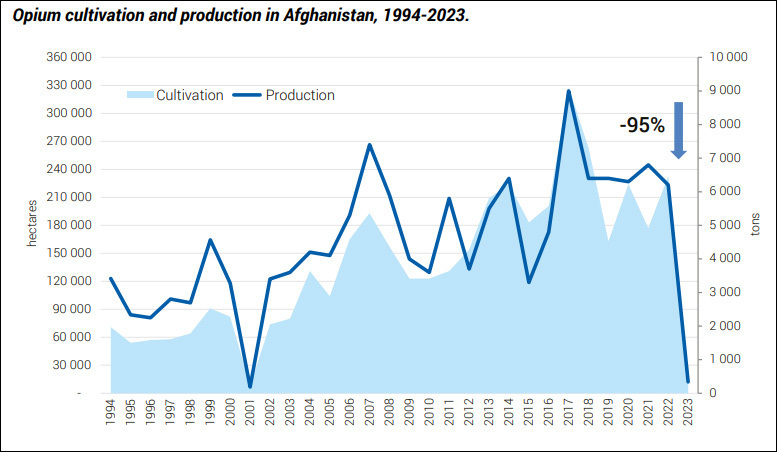
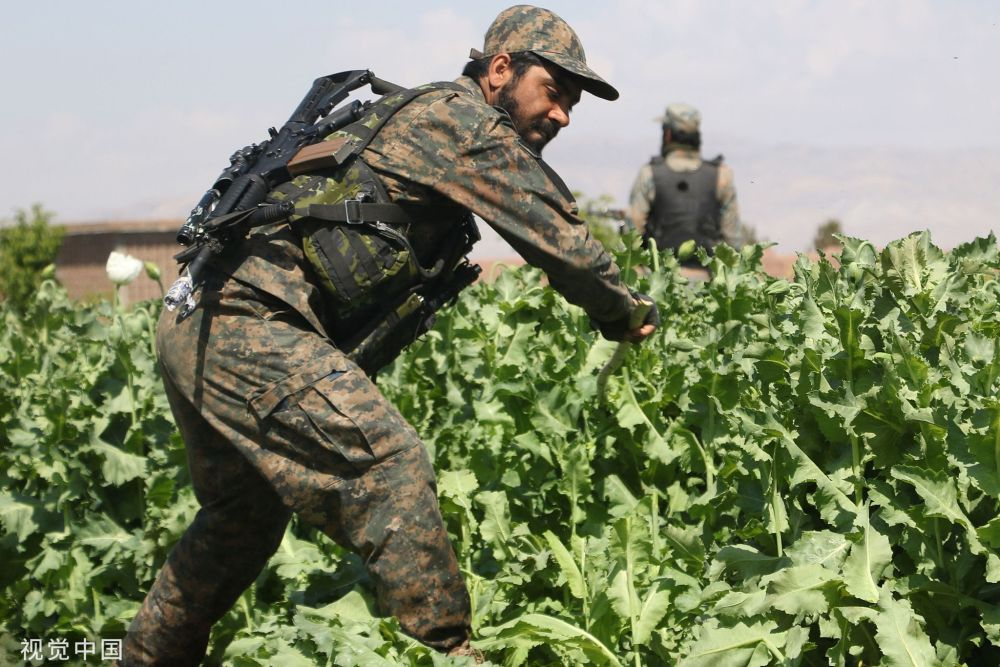
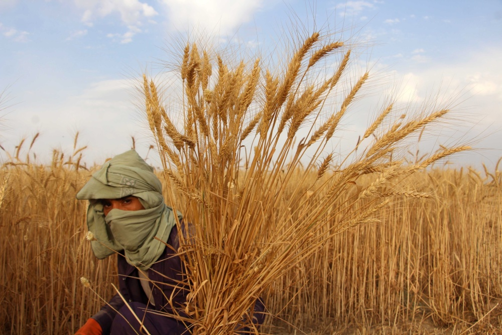

# 联合国报告：塔利班发布禁令后，阿富汗罂粟种植面积减少95%

（观察者网讯）阿富汗塔利班去年4月颁布了一项法令，严格禁止种植罂粟，禁止制造、使用和贩运各类毒品。11月5日，联合国毒品和犯罪问题办公室发布报告称，禁令生效一年半以来，阿富汗罂粟种植面积减少了95%，越来越多的阿富汗农民开始种植小麦等作物。

报告显示，阿富汗2023年的鸦片种植面积从上一年的23.3万公顷减少到1.08万公顷，鸦片供应量相应下降了95%，从2022年的6200吨减少到333吨。联合国毒品和犯罪问题办公室执行主任加达·瓦利表示，这将为打击非法鸦片市场提供一个取得长期成果的机会。

报告预计，阿富汗罂粟种植面积锐减可能会让全球海洛因市场失去主要货源，但也可能刺激芬太尼和其他合成阿片类药物等有害替代品的流通。

_1994年到2023年的阿富汗鸦片种植规模变化曲线 联合国报告截图_

由于阿富汗农业社区长期依赖罂粟种植带来的利润，阿富汗临时政府的禁毒令导致许多农民的收入大幅减少。报告称，2023年阿富汗农民通过出售鸦片获得的收入下降了92%，从2022年的13.6亿美元降至1.1亿美元。

报告认为，“鸦片经济”的全面萎缩将对阿富汗经济造成一定的负面影响。联合国开发计划署预测，阿富汗2023年实际国内生产总值（GDP）将增长1.3%，但因为人口增长，阿富汗人均GDP可能下降4%。脆弱的经济形势将加重阿富汗家庭面临的负担。

不过，报告强调，减少罂粟种植可以为阿富汗走上合法发展轨道打开大门，为阿富汗经济在农业、制造业和服务业的多元化发展铺平道路，增强阿富汗的经济稳定。

“目前阿富汗人民迫切需要紧急人道主义援助来满足他们最紧迫的需求，减少收入损失造成的冲击并拯救生命。”瓦利说，“未来几个月，阿富汗需要对可持续发展进行强有力的投资，为阿富汗农民提供一个远离罂粟种植的机会。”

_2023年3月，阿富汗赫拉特省，阿富汗安全部队成员正在摧毁罂粟种植园 图源：视觉中国_

越来越多的阿富汗农民正在寻找新的谋生途径，转而种植小麦等作物。统计显示，在阿富汗法拉省、赫尔曼德省、坎大哈省和楠格哈尔省，今年谷物种植面积增加了16万公顷，大约68%的罂粟田已经重新种上了小麦等谷类作物。

增加小麦产量有助于改善阿富汗的粮食安全问题。报告称，小麦是阿富汗最重要的合法作物，其产量却不足以满足阿富汗人的需求，迫使该国每年进口数百万吨小麦。2023年，阿富汗进口了340万吨小麦，比2022年减少了8%。

联合国阿富汗问题特别代表兼联合国阿富汗援助团团长萝扎·奥通巴耶娃表示，阿富汗近80%的人口依赖农业为生，但该国面临严重的水资源短缺问题，“可持续的替代发展努力，必须以抗旱农业活动和有效保护及利用资源为目标。”

_2023年5月，阿富汗坎大哈，一位农民正在收割小麦 图源：IC photo_

2022年4月，阿富汗塔利班最高领导人阿洪扎达颁布法令，在阿富汗全国范围内禁止种植罂粟，禁止制造、使用和贩运各类毒品。

据阿富汗巴赫塔尔通讯社报道，10月24日，阿富汗临时政府代理副总理哈纳菲与联合国阿富汗问题独立评估特别协调员瑟纳尔勒奥卢举行会谈。哈纳菲阐述了临时政府在禁止毒品种植、生产和贩运等方面取得的成果，强调不允许任何人利用阿富汗的土地危害他人安全。

瑟纳尔勒奥卢则表示，联合国希望与阿富汗临时政府保持良好关系，他称赞了临时政府在确保阿富汗安全与稳定方面取得的进展，称联合国正在努力解决国际社会与阿富汗之间的误解。瑟纳尔勒奥卢还强调，在当前充满挑战的局势下，需要向阿富汗提供技术和发展援助。

**本文系观察者网独家稿件，未经授权，不得转载。**

