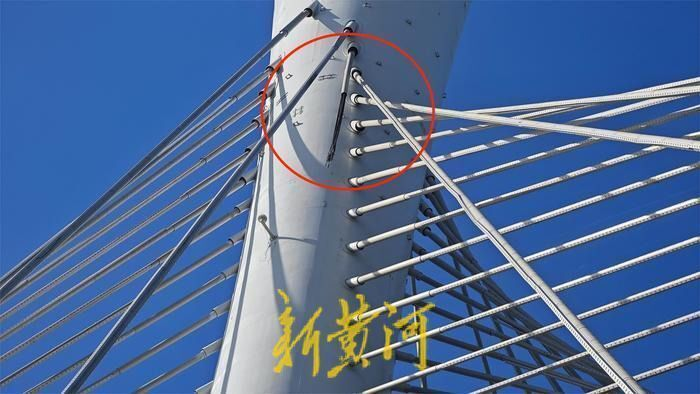
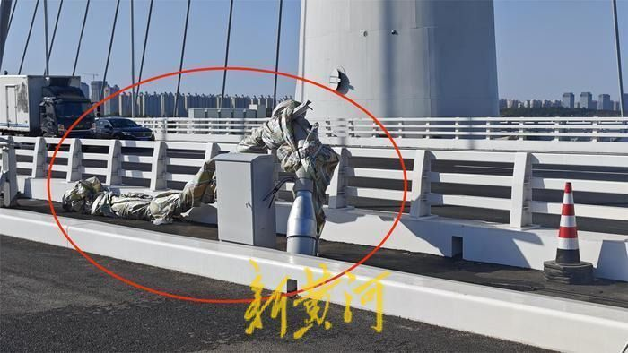

# 通车一个月，石家庄“网红桥”斜拉索断裂起火，建设单位：原因正调查

11月5日晚，多位网友发布视频称，位于河北省石家庄市的滹沱河特大桥一根悬吊钢索断裂，断裂钢索上的亮化灯带在落地后起火燃烧，现场交通一度受阻。6日上午，新黄河记者在事发现场看到，多位工人正在现场处置，涉事桥梁主塔仍可看到断裂的斜拉钢索，在桥梁路面上，工人已经用塑料布包裹了断裂的钢索。记者从负责桥梁建设的石家庄交投集团获悉，系桥梁斜拉索断裂，初步判断，断裂的斜拉索不会对桥梁主体结构安全产生影响，具体断裂原因正在调查中。

据了解，滹沱河特大桥为石家庄市地标性建筑，于2023年9月28日建成通车，通车后因为桥梁灯光璀璨，一度被市民誉为“网红桥”。该大桥位于石家庄市复兴大街正定段，起点位于河北大道南侧，终点位于南高营立交，沿复兴大街西侧南北向铺设，上跨滹沱河。

11月6日上午，新黄河记者在事发现场看到，滹沱河特大桥路面已经恢复通行，多位工人正在现场进行处置。观察发现，发生断裂的钢索位于桥梁东侧，桥梁主塔上方有约5米左右的钢索残留，在主塔下方，一段长约6米的钢索被临时放置在自行车道路旁，并且已经被人用塑料布进行包裹。现场一位身穿中国交建服装的工作人员告诉记者，事发时断裂的钢索未对路过的车辆人员造成损伤，关于具体断裂原因，还需进一步调查。

据悉，滹沱河特大桥为石家庄交投集团负责建设，针对上述情况，该集团工作人员回应新黄河记者称，发生断裂的钢索系桥梁斜拉索，事发后相关单位已经到场处置，初步判断，断裂的斜拉索不会对桥梁主体结构安全产生影响，斜拉索断裂原因正在调查中。

记者注意到，公开信息显示，滹沱河特大桥主桥采用双向10车道设计标准，引桥采用双向8车道设计标准，设计时速均为100公里。此外，该特大桥为国内首创的卷轴型空间索面独塔斜拉桥，采用超宽桥面-
卷轴形扭索面独塔斜拉桥结构，为国内外首例。

记者:白德彰 记者:张焱辉 编辑:俞丹 校对:杨荷放

最新通报

[石家庄交投集团通报大桥斜拉索断落：未造成人员伤亡车辆损毁，已恢复通行
](https://new.qq.com/rain/a/20231106A051DG00)

