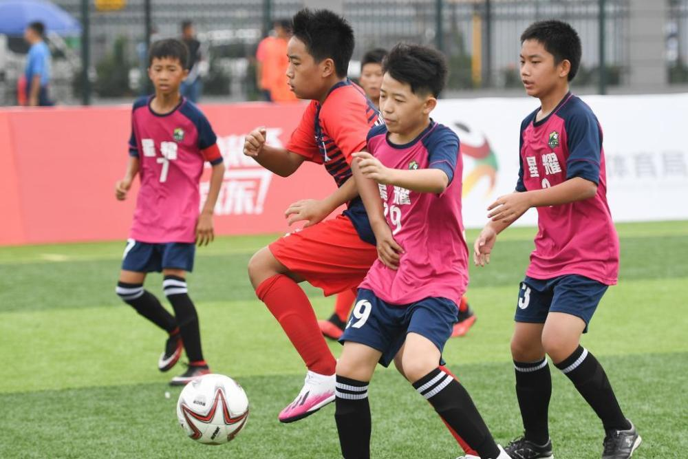
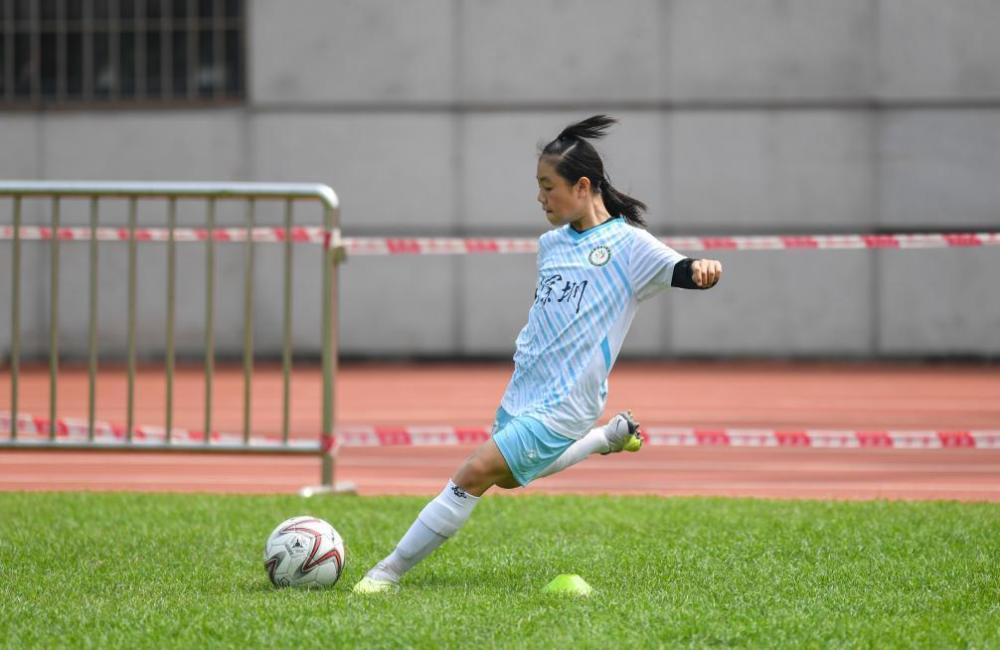
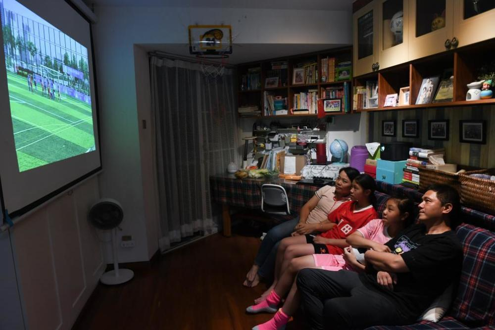
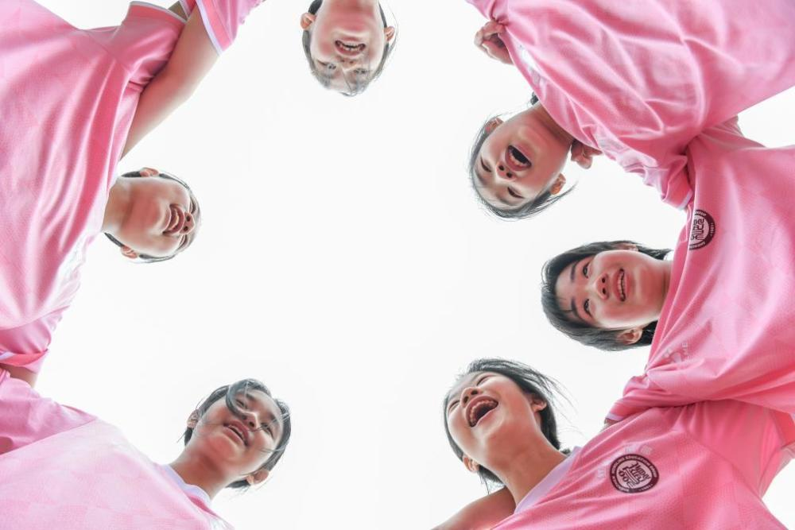
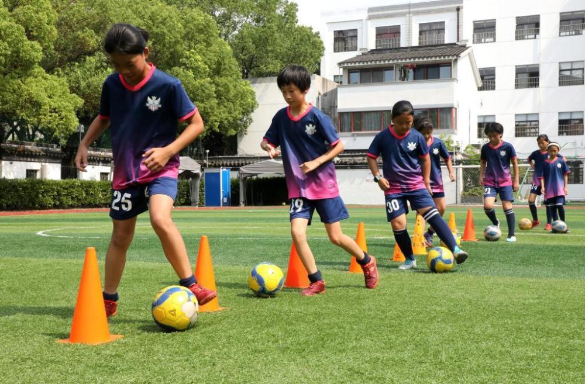

# 中国足球的“12岁退役”现象

新华社北京11月6日电（记者马邦杰）“12岁退役”现象，是百端待举的中国足球不得不痛苦面对、却又倍感无力的一个问题。

10月底在青岛举行的中国足协青少年足球锦标赛重点城市组（简称“重点城市组赛事”）U13比赛期间，赛事官员、教练、家长热议这一话题，急切寻求答案。一位来自北京的比赛监督对记者说，最近几年他在北京“百队杯”比赛中关注的一支少年队的变化，令他痛惜。

“那些10岁、11岁的孩子比我们小时候踢得都好，但到了12岁，一半孩子消失了；到了13岁不会踢了，原来那些会踢球的孩子都走了。我去问教练：‘人呢？’他说，他耗费了四年心血培养了那批孩子，刚有点型儿，上初中了，队伍解散了。”

“‘12岁退役’，是我们特有的现象。如果这个问题不解决，青训就被‘腰斩’了，难有成效。”他说。

_资料图：2020年8月15日，2020年百队杯足球赛U13男子组比赛进行中。新华社记者 鞠焕宗 摄_

自校园足球普遍开展以来，小学阶段踢球人数激增，但到初中阶段，即12岁之后，立刻出现断崖式下跌。早在2018年就出现了这个苗头，当时北京“百队杯”组织者公布了一组有关参赛队伍的数字：U8、U9小学年龄组参赛球队共有229支，而U13、U15中学年龄组参赛球队一共只有70支。

去年记者去西安调研，当地某区县足协青训负责人说，他们足协下属梯队中，U8梯队有50多名孩子；U10队伍有20多人；U12队伍只有10个左右孩子，无法单独组队。

一位地方青训教练说，家长的选择，决定了孩子是否踢球，也决定了青训成色。他说：“以前我们踢球，家长支持，每天踢球时间比学习时间长。现在正好反过来了，家长侧重点在学习。咱中国不缺有足球天赋的孩子，家长支持比什么都重要。中国足球的未来掌握在家长手里。”

**家长的忧虑**

深圳U13女足队长练昱彤每次外出比赛，父母必有一人陪同。这次陪她来青岛参加重点城市组赛事的是她爸爸练炼。他从深圳背了一个投影仪过来，不是为了播放比赛录像，而是用来给孩子上网课的。

“孩子出来比赛，只要条件允许，我和她妈妈一定有个人陪着她，主要是来给她补课的。”练炼说，“孩子才13岁，自律性没那么强，比赛期间必须得有人督促她学习。初中阶段学习压力实在太大了。”

_2023年4月15日，练昱彤在深圳宝安体育场练习射门。新华社记者 毛思倩 摄_

练炼说，练昱彤从小学一年级开始踢球，每周有大量时间训练和比赛。比如小学六年级时，每周至少保证四次训练和一次比赛。“小学阶段学习和踢球兼顾，完全没问题。”但到了初中，学业压力骤然增大。练昱彤初一一周还能训练三次，今年上初二后，就实在找不到时间了，只能全部把训练放在周末两天，一周两练，中间5天没法训练。

“孩子上初二后，平均每天也就睡6小时，时间太宝贵了。有时赶去训练，只能在车上吃饭。”练炼说，“初中阶段，如果想踢球，就会耽误学习；如果要学习，就踢不好球。两者不能兼顾。”

练炼说，练昱彤的学校中考升学率只有40%多，这意味着她必须要在班级排名中上游才有希望考上高中。今年练昱彤有两个月在外训练比赛，学习成绩出现下滑趋势。这让练炼忧心忡忡。

现在摆在他们父女面前的有两个选择：侧重学习或侧重踢球。

练炼说，侧重学习是个稳健选择，孩子将来可以考大学、找个稳定的工作。但练昱彤喜欢踢球，父母尊重她的爱好。“她是真爱足球，否则我们也就不用这么纠结。”但侧重踢球是在拿孩子的未来赌博，足球里不确定因素太多，成材率太低，所以学习也不能丢。如此，他们只能两者兼顾。

_5月11日，练昱彤（右二）和爸爸妈妈以及妹妹在深圳的家中一起回看比赛视频。新华社记者 毛思倩 摄_

但现实又不断提醒练炼：鱼与熊掌不可得兼。他陷入两难境地。“只能走一天看一天了。”他说。

练炼说，踢球孩子的家长经常凑到一起谈论该如何选择，大家都很焦虑，很多就选择让孩子放弃足球去学习了。

“练昱彤小学时参加的俱乐部每个年龄组都有好几支球队，最多的有A到E5支队伍，孩子下午放学就去踢球。但到了初中，平日没人踢球，周末要两个年龄段的孩子才能凑齐一支球队，多数孩子都不踢球了。”练炼说。

练昱彤还在坚持，但未来充满不确定性。练炼说，他现在需要一种确定性，来疏解内心对孩子未来的困惑、纠结和焦虑。

_5月11日，练昱彤（左上）在深圳市红岭中学石厦初中部参加校队训练赛时与队友互相加油鼓劲。新华社记者 毛思倩 摄_

**“苏州答案”**

重点城市组赛事中，苏州U13女足队伍是个一枝独秀的存在，每场比赛都稳操胜券，直到最后夺冠。主教练周盈说，她从队员上小学三四年级就一直带她们训练比赛。作为一支球队，她们没有遭遇“12岁退役”现象的烦恼。

这支球队在苏州体育运动学校接受训练。记者就此请教苏州足协副主席、苏州体育运动学校副校长王建军。他的书面回答如下：

“‘12岁退役’现象在我们苏州并没有发生，主要原因是我们在选拔优秀苗子时就和家长谈到了孩子未来出路的问题。我们会搭建良好的平台让家长选择：1、帮助每一位孩子都要上大学，训练、比赛、学习都要抓。如果走不到职业俱乐部，通过大学学习，在毕业后也能找到一份受人尊重的工作。2、帮助特别优秀的孩子进入国家队。3、进不了国家队但是能够入选省队，代表省队参加全运会并且取得前三名（江苏省有一个政策，全运会前三名能够安置工作），也解决了后顾之忧。4、对教练员的要求不仅仅是完成训练比赛任务，更重要的是要培养每一位孩子成为德智体全面发展的可塑性人才，让每一个家庭放心。5、到了高中阶段，如果孩子、家长有意愿出国踢球留学，我们也会帮助他们解决。”

“所以我认为只要孩子出路问题能够解决好，就不会存在‘12岁退役’现象。”他说。

_2022年7月15日，江苏省苏州市昇平实验小学校的女足队员在训练中。新华社发（杭兴微 摄）_

“12岁退役”现象是中国足球绕不开的问题。中国足协近两年开始采取措施改善青训环境，并于近期确立了“把青训当成头等大事来抓”的方针。这次重点城市组U13比赛青岛赛地专门组织了女足教练培训班。类似的教练培训，足球重点城市负责部门已经举办多期，目的在于全面提升基层教练的能力。另外，他们还希望各重点城市开通升学“直通车”，为足球人才升学创造条件。

重点城市组赛事U10至U15年龄组比赛，为适龄球员成长提供了一个关键的平台。如果没有这个平台，练昱彤可能至今没有机会参加高水平全国性比赛。“她到现在一共就踢了12场11人制的全国性比赛，全是今年重点城市组的比赛。”练炼说。

青岛U13女足主教练于铭磊在球队战胜武汉队后说：“孩子的成长需要这样的高水平比赛。这样的比赛要多举行。”

即使青训环境改善也不足以破除“12岁退役”现象。一位地方足球工作者无奈地说：“其实足协在这里办法不多，人家孩子去上学，你拦不住。”

一位教练说，家长需要孩子踢球未来有保障，“我们无法给他们保障，只能眼睁睁地看着一些很优秀的苗子离开了足球”。

“12岁退役”导致大量足球人才流失，这一现象也并不仅限于12岁，只是在这一年龄段更为突出，有些孩子更早或稍晚放弃了足球。这是足球青训领域学训矛盾的反映，需要学训双管齐下解决。此现象不破，中国足球难兴。

