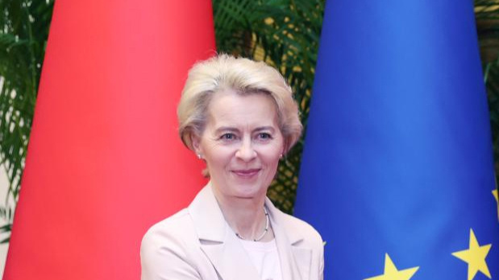

# 冯德莱恩：中欧领导人会晤将于几周内举行

当地时间6日，欧盟委员会主席冯德莱恩在欧盟大使会议上透露，新一届中国-
欧盟领导人会晤将在几周内举行。据悉，这将是中欧领导人会晤四年来首次在线下举行。此前，中欧已在战略、经贸等层面展开对话，为此次会晤打下基础。

时隔四年回归线下

冯德莱恩当天表示，去年底以来，欧盟与中国“进行了密集对话”，包括四次高级别对话，而新一届中欧领导人会晤将在几周内举行。

另有报道称，冯德莱恩和欧洲理事会主席米歇尔计划下月飞往中国，出席中欧领导人会晤。

中国-
欧盟领导人年度会晤机制建立于1998年。2022年4月，第二十三次会晤以视频方式举行。会晤期间，习近平主席以视频方式会见米歇尔、冯德莱恩，时任总理李克强以视频方式同米歇尔、冯德莱恩共同主持会晤。

而今年的一大特别之处在于，会晤有望时隔四年回归线下。上一次线下会晤是在2019年4月，时任总理李克强同时任欧洲理事会主席图斯克、欧盟委员会主席容克在布鲁塞尔举行第二十一次中国-
欧盟领导人会晤并发表联合声明。

中欧关系迎来契机

舆论注意到，中欧关系今年迎来两大契机。一是中国和欧盟今年迎来建立全面战略伙伴关系20周年。双方有望利用这一契机，推动中欧关系进一步向前发展。

另一个契机是自去年底以来，中欧在疫情后重启高层交往，双边关系发展势头向好。

在此背景下，先是中欧高层互访迎来“小暖春”。在去年11月的二十国集团（G20）巴厘岛峰会上，习近平主席与欧洲多国领导人会晤。

去年底以来，德国、法国、西班牙等国首脑、政要，以及欧洲理事会、欧盟委员会主席纷纷访华。中国总理李强今年也实现访欧。

与此同时，中欧在环境与气候、数字、经贸、战略领域的高层对话相继顺利举行，各领域磋商有序推进，为双边关系发展注入新动能。

尤其是欧盟外交与安全政策高级代表博雷利10月访华，中欧在此期间举行了第十二轮中欧高级别战略对话，向世界表明了双方继续维护好中欧关系积极势头、推动中欧关系健康稳定发展的愿望。

舆论认为，这一系列对话为中欧领导人今年底举行会晤打下基础。

欧盟如何看待中国

舆论同时注意到，中欧关系也面临一些挑战。据新华社此前报道，近年来，欧洲对华坚持“伙伴—竞争者—制度性对手”的三重定位，“既要在欧方有需求的领域合作，又要遏制中国发展”的目标悖论，加之近期“去风险”的错误导向，导致欧洲陷入认知偏差，干扰中欧合作顺利开展。

昨天，冯德莱恩还就欧盟如何看待中国，欧盟打算如何与中国打交道等议题做出最新表态。

在风云变幻的国际形势下，冯德莱恩将“乌克兰、中东和中国”列为欧盟目前面临的三个最具战略性、最重要的议题。

“我们与中国的关系是世界上最复杂和最重要的关系之一。我们如何管理这一关系将是我们未来经济繁荣和国家安全的决定性因素。在这个动荡的时代，我们亟须在应对中国的方式上保持战略稳定。”

冯德莱恩同时称，欧盟“必须正确看待中国”。“我们必须认识到，在我们的关系中存在着明显的竞争因素。”

“但是，这种竞争可以是建设性的，而不是敌对的。”冯德莱恩进一步说。这就是欧盟需要与中国进行有效沟通、开展高层外交的原因。

“这就是我所说的通过外交手段去风险。”冯德莱恩说。中欧在全球性问题上开展合作是可能的，而且正在成为现实。

例如，中欧在共同应对气候变化方面所开展的合作。冯德莱恩还提到，中东地区局势稳定符合中欧的共同利益。此外，中国一直是欧盟最重要的商品贸易伙伴。

冯德莱恩还说，在解决中欧共同面临的挑战方面，双方具有共同制定规则的空间。但她同时提到所谓“基于规则的体系”，并称中欧对于“全球安全架构”的看法并不一致。冯德莱恩还提及南海局势，称这关乎欧盟的全球利益。她还说，种种热点议题之间的联系日益紧密。

在这些背景下，冯德莱恩继续将“去风险，而非脱钩”概述为主要西方国家所采取的对华策略。

总体而言，当前中欧关系面临机遇和挑战。就欧盟在对华关系上的表态与做法，双方需要进一步沟通，以消除误解，增加互信，并推动问题解决。

而新一届中欧领导人会晤有望于下月登场，将有助于双方进行坦诚务实的沟通交流，以便双方共同应对全球性挑战，推动中欧全面战略伙伴关系迈上新台阶，并为变乱交织的国际局势注入更多的稳定性。

