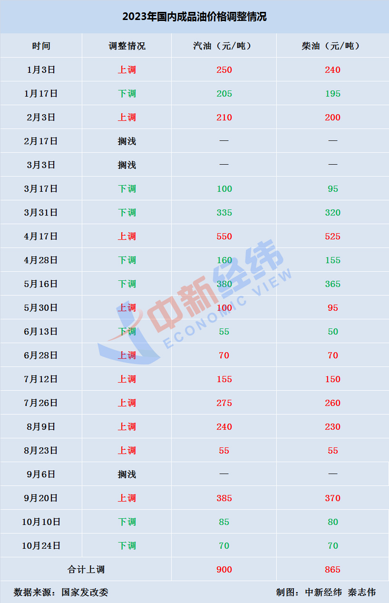

# 国内油价大概率“三连降”，加满一箱或少花5.6元

中新经纬11月7日电 (秦志伟)7日24时，国内成品油新一轮调价窗口将开启。综合机构观点来看，本轮零售价下调为大概率事件。

本轮计价周期以来，国际原油期价呈现宽幅震荡运行，整体走势继续下滑。截至北京时间6日中午12时，本轮计价周期内WTI原油期货及布伦特原油期货均累跌约3%。

对此，金联创分析称，在排除地缘局势因素下，国际市场缺乏利好提振，短期原油或随巴以冲突实时走向为主线维持区间震荡走势， **本轮零售价下调为大概率事件** 。

卓创资讯预测，欧美原油期货价格或呈现震荡走势，原油变化率或继续在负值范围内波动，本轮成品油零售限价下调概率较大。

隆众资讯给出预测数据，国内汽柴油下调幅度约为115元/吨，迎来2023年的第九次下调。若本次价格下调，以70升的油箱来计算的话，私家车主加满一箱油将少花5.6元。

值得注意的是，据路透社6日消息，石油出口国沙特阿拉伯和俄罗斯5日确认，由于对需求和经济增长的担忧继续打压原油市场，将继续额外自愿削减石油产量，直至年底。

但市场对此反应较为平淡，截至北京时间6日中午12时，WTI原油和布伦特原油期货涨幅均在1%以内。

中新经纬梳理发现，国内成品油在今年已历经二十一轮调整，呈现“十涨八跌三搁浅”的格局，汽油价格累计上涨900元/吨，柴油价格累计上涨865元/吨。

根据“十个工作日”原则，下一轮成品油零售限价调整时间为11月21日24时。

展望后市，隆众资讯认为，10月份汽柴油价格跌幅较大，后期继续大幅下跌的空间有限。供应量的逐步收紧一定程度上能缓解供应过剩的压力，利好国内油价。此外现阶段汽柴油社会库存均处于极低水平，库存集中在主营及地方炼厂环节，后期库存的转移也将成为支撑油价走高的利好因素。
**因此四季度汽柴油价格仍存在一定的下行空间，但亦存在较大的反弹可能** 。

金联创看法与之相似，其认为，消息面难寻有力支撑，基本面亦空好交织，国内油价或缺乏持续反弹动力，但受成本面因素，以及部分单位价格延后性等影响，
**国内油价或仍表现为小幅上涨后随原油走势趋于盘整运行** 。

具体来看，供应方面，金联创认为由于炼油利润欠佳以及进口原油配额紧张等因素制约地方炼厂及部分主营炼厂开工负荷或将维持低位运行，汽柴油资源供应仍存收紧预期，对市场行情或将起到一定托底效应。

需求方面，金联创预计本周国内大部分地区或将迎来降水降温天气，户外基建工程及运输行业需求量或有一定抑制，柴油需求或难以维持向好趋势，而汽油市场缺少假期的提振，民众出行率较低，整体需求量维持低位运行。(中新经纬APP)

**(文中观点仅供参考，不构成投资建议，投资有风险，入市需谨慎。)**

**中新经纬版权所有，未经书面授权，任何单位及个人不得转载、摘编或以其它方式使用。**

