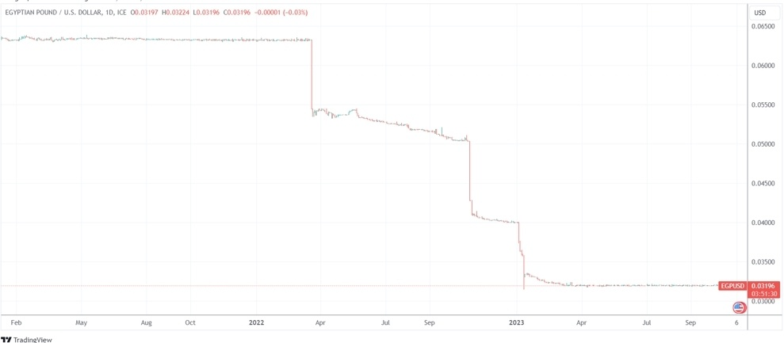

# 埃及的美元短缺到什么程度？肯尼亚称埃及提出展开“以物易物”贸易

**财联社11月7日讯（编辑 史正丞）** 临近年底，北非国家埃及的美元荒依然没有好转，最新消息显示 **该国已经开始提出“以物易物”的贸易形式**
，以规避美元短缺的影响。

这一进展，肯尼亚财政部长恩朱古纳·尼敦古（Njuguna
Ndung'u）周一在首都内罗毕出席公开活动时提到的。尼敦古透露，埃及驻肯尼亚大使在上周告知他们，现在埃及没有办法获得肯尼亚的茶叶，原因是该国手里没有美元，所以现在这些茶叶只能停在（肯尼亚）蒙巴萨的港口里。埃及方面提出，
**希望肯尼亚来看看需要哪些埃及能够生产的东西，以此来交换茶叶** 。

得益于当地的气候条件，肯尼亚不仅是全球主要的茶叶产区，也是全球最大的红茶出口国。近些年因为经济问题常常登上财经头条的巴基斯坦和埃及，正是肯尼亚茶叶的前两大买家。

根据肯尼亚茶叶管理委员会提供的数据， **今年前8个月，这两个国家购买茶叶的金额同比下降了23%和13%。**
国际宏观经济的状况，以及美联储的货币政策，都或多或少加剧了这种情况。

对于肯尼亚而言，茶叶和农产品出口是该国的最大外汇来源。最大买家的现状也会传导至肯尼亚的外汇储备和汇率状况。
**年初至今肯尼亚先令兑美元的汇率下跌了接近20%** 。

尼敦古介绍称，肯尼亚总统威廉·鲁托已经指派农业部长与巴基斯坦协商“以物易物”的贸易协议。尼敦古总结称：“
**我们仍然处于全球美元短缺的状态，这就是为什么像埃及和巴基斯坦这样的国家想要进行换货贸易** 。”

**埃及的外汇有多紧张？**

过去几个月里，埃及的商业银行系统一直处于“净外国资产为负”的状况。银行手里的各种外国资产总额，与外债的总额差距也在不断扩大中。分析师介绍称，导致净资产差额越来越大的原因之一，包括该国捍卫汇率的努力，和帮助经济吸收外部冲击的影响。

作为拿到IMF流动性支持的条件之一，埃及央行自2022年3月开始已经主动引导埃镑贬值过三回。埃镑兑美元的汇率在过去一年半里贬值了将近一半。

（EGPUSD日线图，来源：TradingView）

埃及央行在上周日的报告中提及， **该国截至10月的外汇储备稍稍提升至351亿美元**
，其中有81亿美元的黄金、266.3亿美元的外汇和3.71亿美元的特别提款权。

埃及央行表示，外汇储备的提升主要来源于近期发行了价值10亿美元的武士债券，以及价值接近5亿美元的熊猫债券，接下来还将进一步发行武士债券。另外埃及央行也与国家开发银行达成一笔价值70亿元人民币的贷款协议。

即便如此，埃及央行也表示仍在积极寻求额外资金，来弥补预计到2026年的170亿美元资金缺口，其中
**2023/2024财年可能需要填上6-80亿美元的资金缺口** 。该国总共有1653亿美元的外债，未来三年需要还本付息的金额为716亿美元。

（财联社 史正丞）

