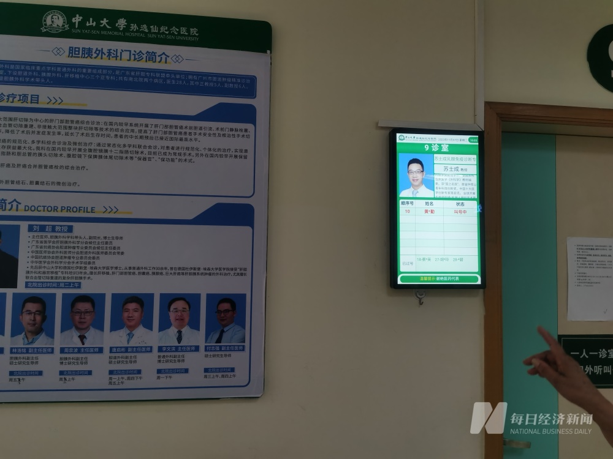
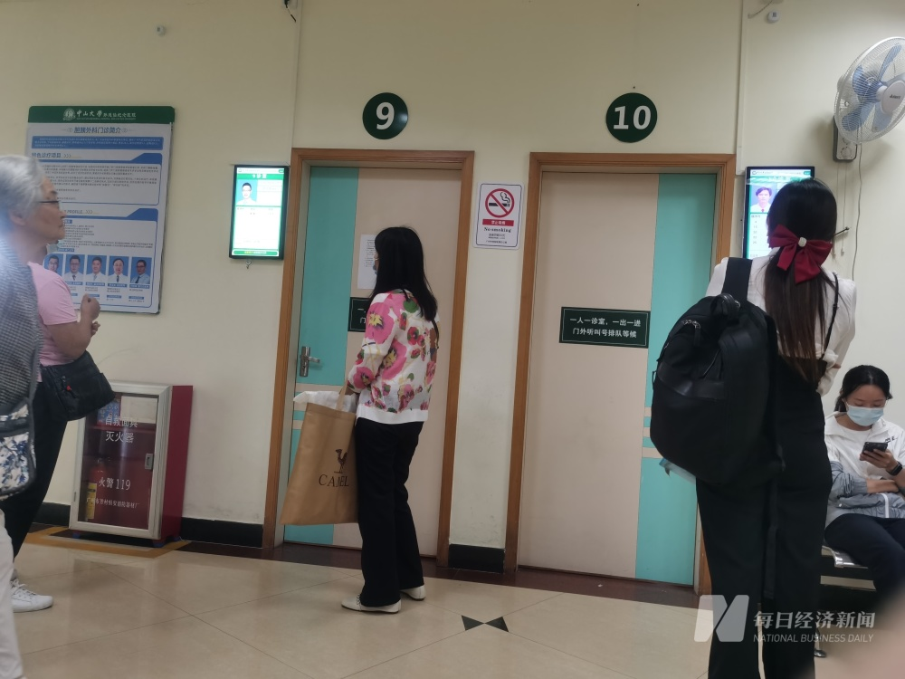

# 广州中山二院一导师的多名学生患癌？导师本人连说三遍“完全是造谣”

每经记者：吴泽鹏 陈星 每经编辑：文多

据媒体报道，有网友发文称，中山大学附属第二医院乳腺外科一位导师的多名学生患上罕见癌症。11月7日下午，《每日经济新闻》记者赶到了中山二院北院，上述网友发文提到的导师苏士成仍正常坐诊。

_图片来源：每经记者 吴泽鹏 摄_

记者注意到，门诊保安警惕性较高，一直在来回巡视。在苏士成看诊间隙，记者进入诊室就网传信息向其本人进行核实。

_图片来源：每经记者 吴泽鹏 摄_

苏士成以三个“完全是造谣”进行了回复，“（网传信息）完全是造谣，完全是造谣，完全是造谣。我们医院稍后会有公告”。因其正在坐诊，记者随后离开了诊室。

医院负责宣传工作的人士表示：“我们今天也关注到这个信息，现在也在（想）怎么处理，也在调查。然后这个‘新闻’肯定是假的，等一下我们会发声明。很快，现在正在终审中。”

