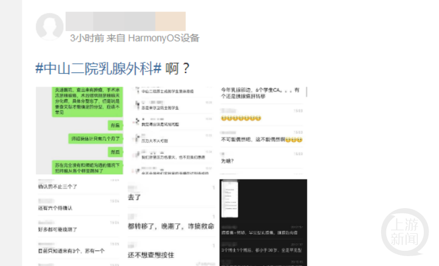
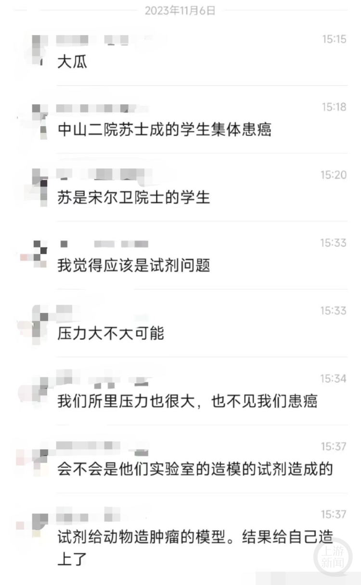
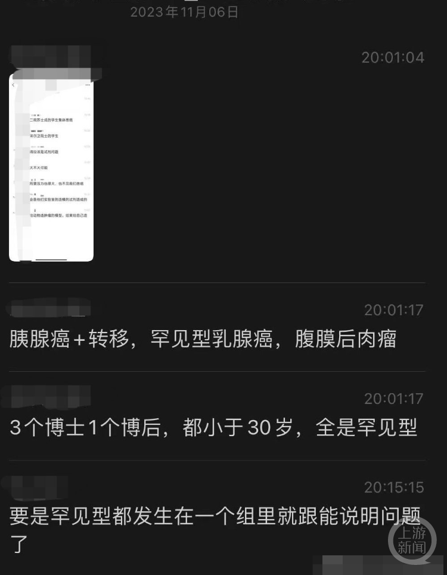

# 广州中山二院一教授的学生集体患癌？院方回应：不实，正调查处理

7日，广东广州，有人发布消息称，中山二院（中山大学孙逸仙纪念医院）一专家教授的学生集体患癌，引发关注。

_爆料内容。网络截图_

爆料图片显示，有人发布信息称，中山二院苏士成的学生集体患癌。还有消息称：“今年乳癌那边，6个学生患癌，有个还是胰腺癌肝转移。”另有消息称，3个博士1个博士后，都小于30岁，全是罕见性。

 _爆料内容。网络截图_

记者在该院网站查询发现，苏士成为教授、主任医师、研究员，7日当天，还有其专家团队门诊。

 _爆料内容。网络截图_

7日，记者联系上广东中山大学孙逸仙纪念医院党委办公室。工作人员回复称，他们已经关注到此事，经核实，相关信息不实。关于此事，正在进一步调查处理，后续将公开发布。

随后，记者还联系上广州市卫健委。工作人员回复称，该医院不归他们管，具体可询问中山大学。记者联系上中山大学党委办公室，工作人员回复称，媒体采访需要请示。截至记者发稿时，暂未收到其回复。

上游新闻记者 朱婷

