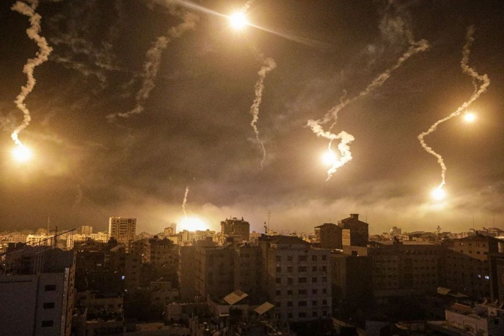
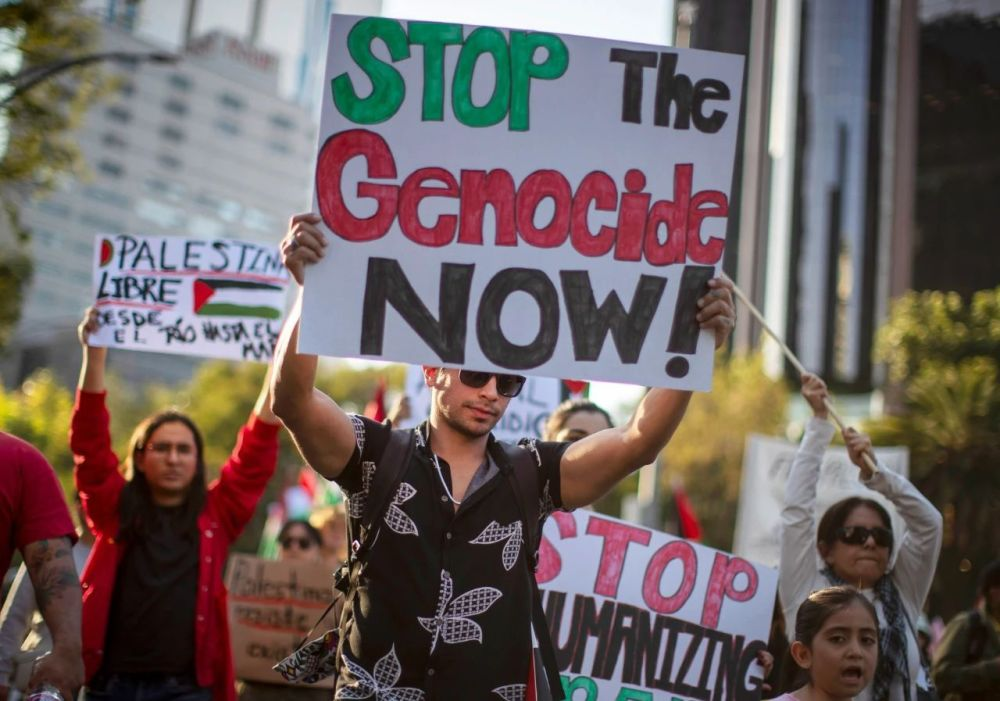

# 新一轮巴以冲突持续一月，美以两国越发陷入孤立

截至当地时间11月7日，新一轮巴以冲突已持续一个月。

加沙地带卫生部门的最新数据显示，以色列对加沙地带的军事行动迄今已造成超过1万名巴勒斯坦平民死亡，其中包括超过4000名儿童，另外还有至少24000人受伤。以色列卫生部的数据显示，超过1400名以色列人在冲突中丧生。

中国现代国际关系研究院中东所所长牛新春在接受新京报记者采访时表示，和以往的巴以冲突相比，这一轮巴以冲突的伤亡尤为惨重。同时，国际社会对于停火休战的呼声越来越高，以色列和美国在国际社会越发陷入孤立。

**冲突规模和烈度预计将进一步增加**

**新京报：** 这一轮巴以冲突最突出的特征是什么？

**牛新春：**
和以往的巴以冲突相比，这一轮巴以冲突的伤亡尤为惨重。到现在为止，这一轮巴以冲突已经是20年来死伤最严重的一轮巴以冲突。巴勒斯坦死亡人数超过1万人，以色列死亡人数超过1400人。冲突双方都受到了特别沉重的打击。这一轮冲突大概率会彻底改变加沙地带的局势、以色列的内政外交方向以及巴以关系。

**新京报：** 以军部队已经包围加沙城，接下来的冲突可能更加激烈吗？

**牛新春：**
预计接下来的冲突会更加激烈。到目前为止，冲突双方没有爆发真正的大规模地面冲突。以军从10月27日开始地面进攻以来，基本上还没有和哈马斯武装力量正面交锋。现在，哈马斯的主要力量可能还在加沙城内，也可能到了加沙南部。未来如果冲突双方正面交锋，无论战争的规模还是烈度，肯定会进一步增加。

_当地时间2023年11月6日，加沙地带北部，以色列军队发动攻击。图/IC photo_

**新京报：** 人质问题可能如何影响此轮巴以冲突的发展？

**牛新春：** 人质问题是这一轮巴以冲突很重要的特点，目前据估计哈马斯扣押了240多名人质，此前释放了4人。在以往的冲突中，哈马斯没有扣押过这么多人质。

人质问题影响了此轮巴以冲突的进程，以色列部队到目前为止打得比较谨慎，一直没有展开大规模地面进攻，其中一个重要的因素就是人质。

围绕人质问题的谈判会伴随此轮冲突的始终，对哈马斯来说，“这张牌”是一定会打下去的。以色列希望哈马斯一次性把人质都放了，但这种可能性很小。未来很大概率是通过谈判释放一些人质，再谈判，再释放部分人质。

**新京报：** 这一轮巴以冲突可能还将持续多久？

**牛新春：** 以色列的战争目标是要彻底消灭哈马斯，一个月以来，以色列方面的目标没有变。但到底以色列能在多大程度上消灭哈马斯，现在是个未知数。

如果以色列要彻底实现自己的战争目标，那意味着在加沙地带进行逐门逐户的战斗，再加上加沙地带有着错综复杂的地道网络，那么战争的时间肯定会比较长，至少是几个月。但是，以色列有没有能力进行这样的战争，以及是否愿意把战争拖这么长，这些都存在不确定性。

**仍然存在冲突外溢的可能性**

**新京报：** 这一轮巴以冲突对中东和平进程有何影响？

**牛新春：**
中东地区阿拉伯国家和以色列的和平进程暂时中断了，沙特与以色列的关系正常化谈判已经暂停。只要加沙地带还在打仗，沙特是不可能和以色列谈判建交的。同时，巴以问题又回到了中东政治舞台的中心。

这反映了以色列方面此前的几个判断错误，一是以色列方面认为，把巴勒斯坦问题搁在一边，不谈巴勒斯坦建国问题，不谈以色列占领巴勒斯坦领土问题，以色列也可以推动和平进程，这个判断现在被证明是错误的。

另外，以色列方面还认为，不解决巴以问题，以色列也可以和区域阿拉伯国家建交或缓和关系，但现在证明这一判断也存在问题。

_当地时间2023年11月5日，墨西哥首都墨西哥城，数千人游行要求巴以停火。图/IC photo_

**新京报：** 国际社会对于加沙地带人道主义停火的呼声强烈，目前来看，以色列是否有可能在国际压力下停火？

**牛新春：**
对于停火，现在有好几层含义。国际社会要求的停火，是持久、全面的停火。但是，从以色列方面的表态来看，以方很难答应这样的停火，以军正在围攻加沙城。另一种含义的停火是为了解救人质或者开展人道主义救援的短暂、局部停火。这种短暂停火是有可能的。比如在输送人道主义救援物资的拉法口岸短暂停火，让物资进入加沙，以方有可能答应。

**新京报：** 这一轮巴以冲突对整个国际社会产生了什么样的影响？

**牛新春：** 此轮巴以冲突爆发以来，加沙地带人道主义灾难严重，国际社会要求停火的呼声越来越强烈。

以色列和美国在国际社会越来越陷入孤立。在此前的联合国紧急特别会议上，120个国家投票赞成立即实施人道主义休战的决议，只有美国、以色列等14个国家投票反对。同时，欧洲和美国内部要求停火的呼声也很高。

过去两周，先是多个拉美国家从以色列召回大使或与以色列断交，近日，土耳其、约旦、巴林也从以色列召回大使。若未来加沙地带人道主义危机进一步恶化，更多国家可能从以色列召回大使。

**新京报：** 在这一轮巴以冲突初期，外界就担心冲突可能外溢。目前如何评判冲突外溢风险和战事扩大的可能性？

**牛新春：** 目前，此轮巴以冲突还没有出现明显的外溢迹象，但冲突外溢的可能性是真实存在的。

黎巴嫩真主党和以色列国防军交火，也门胡塞武装向以色列发射导弹，伊拉克和叙利亚民兵组织袭击美军基地，这些事件基本在过往的“游戏规则”框架之内。目前，还没有看到任何一方有意突破规则，把战争扩大的迹象。

但是，外溢风险是存在的。周边力量和以军、美军的冲突尽管规模较小，但是每天都在发生，有失控和扩大的可能性。

新京报记者 陈奕凯

编辑 张磊 校对 刘越

