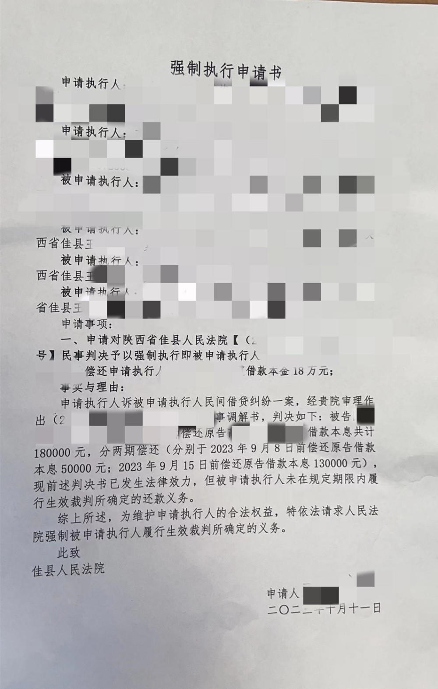

# 法院删除含2名未成年人的“限高”名单！母亲：孩子在读书，丈夫生前欠债未还

据澎湃新闻报道，11月6日，陕西省榆林市佳县法院公布2023年第八批限制高消费名单，共纳入22名被执行人。其中，两名未成年人的“限高”信息被一同公布，年龄分别是14岁和16岁。6日22时30分左右，佳县法院微信公众号已将该名单删除。

11月7日，上述两名孩子的母亲陈某某告诉红星新闻，其丈夫生前因看病、修房等，欠下亲戚18万元借款未还。丈夫去世后，母子4人被亲戚告上法庭，法院判决后他们被纳入限制高消费名单。对于法院公布两个未成年孩子“限高”信息的做法，陈某某和债主方均认为不妥。

11月7日，红星新闻从佳县法院了解到，两名未成年人因继承债务人遗产被限制高消费。目前法院已将包含上述未成年人的“限高”名单删除，待进一步核实后，会对外公布调查结果。

**两名未成年人母亲：孩子还在上学，丈夫生前欠有债务**

11月7日，红星新闻从孩子母亲陈某某处获悉，她和3个孩子（其中一人成年）数月前面临过一场债务纠纷起诉。多年前，陈某某丈夫因看病、修房等原因，向亲戚共借款18万元未还。丈夫死后，亲戚将未明确放弃继承遗产的母子4人告上法庭要求还钱。法院判决生效后，母子4人因未还清债务，被法院纳入限制高消费名单并公布。

陈某某称，两个未成年孩子一个正在上初中，一个正在上高中。法院发布信息后，左邻右舍都知道孩子的信息被发到网上了。“我不认可法院把他们照片等信息公布出来，孩子们还小，什么都不懂，他们（佳县法院）这是违法。”陈某某在接受红星新闻采访时，表示暂未有法院工作人员向他们赔礼道歉。

债主方代理人陈某告诉红星新闻，他们的确有亲属关系。在本案执行前，办案法官给陈某一方打过电话，询问需不需要将陈某某和她的孩子纳入失信被执行人名单，陈某一方考虑到陈某某丧夫，3个孩子中两个孩子未成年，回答说只是想参与分配遗产，不要求把对方纳入失信被执行人名单。

陈某也认为，法院将在读高中和初中的两个孩子的个人信息对外公布，此行为不妥。

**法院回复：“限高”名单已取消发布**

11月7日上午，红星新闻从佳县法院政治部了解到，两名未成年人涉及到一起债务案件，该案件涉及被继承人死亡后遗产问题，两名未成年人均为案件的被告。案件判决后进入执行程序中，案件中的被告均被限制高消费。佳县法院在发布限制高消费名单后，发现这两名未成年人信息被公开，由于未成年人信息不能在网上公开发布，法院已取消发布。

_▲两名未成年人涉及案件的强制执行申请书_

11月7日17时许，佳县法院政治部一名工作人员告诉红星新闻，其所在部门正就此事开会讨论，并已将此事调查情况向上级部门汇报，待上级法院对佳县法院进行进一步核实后，会对外公布调查结果。

**律师说法：人民法院对未成年人采取限制高消费措施应谨慎**

北京乾成律师事务所何智娟律师告诉红星新闻，2013年之后，最高人民法院先后出台《关于公布失信被执行人名单信息的若干规定》《关于限制被执行人高消费及有关消费的若干规定》等司法解释，建立了失信被执行人名单制度，推动对失信被执行人进行联合惩戒，通过信用惩戒、限制高消费等措施，让失信被执行人“一处失信、处处受限”。

最高人民法院《关于公布失信被执行人名单信息的若干规定》第4条明确规定：“被执行人为未成年人的，人民法院不得将其纳入失信被执行人名单。”但是最高人民法院《关于限制被执行人高消费及有关消费的若干规定》并未明确规定不得限制未成年人高消费。

最高人民法院《关于在执行工作中进一步强化善意文明执行理念的意见》第16条规定：“全日制在校生因‘校园贷’纠纷成为被执行人的，一般不得对其采取纳入失信名单或限制消费措施。”根据此条规定的精神并结合我国法律保护未成年人的立法原则，人民法院对未成年人采取限制高消费措施应采取谨慎的态度。

不过，限制高消费与失信名单存在不同，失信被执行人一定会被限制高消费，失信名单是一种惩戒，而“限高”的立意近于：已经还不起债了，就不要过奢侈的生活了。如果未成年被执行人，在有能力偿还的情况下依旧不偿还，相反却进行高昂的消费，例如购买奢侈品、头等舱机票，对债权人来说是不合理的，此时对未成年被执行人限制高消费是合理的，但是这种情况极为罕见。

何智娟律师认为，在决策时可以参考广东省高级人民法院《关于限制消费及纳入失信被执行人名单工作若干问题的解答》，其规定的例如保护未成年人的姓名、住所、照片、图像，非常值得纳入考虑。

陕西恒达律师事务所高级合伙人、知名公益律师赵良善介绍，《最高人民法院关于公布失信被执行人名单信息的若干规定》第4条规定：“被执行人为未成年人的，人民法院不得将其纳入失信被执行人名单。”但是该规定对未成年人能不能采取限制高消费措施未明确规定。《关于限制被执行人高消费及有关消费的若干规定》亦未对成年人和未成年人加以区分。

但《关于限制被执行人高消费及有关消费的若干规定》第2条明确规定，法院决定采取限制消费措施时，应当考虑被执行人是否有消极履行、规避执行或者抗拒执行的行为以及被执行人的履行能力等因素。此外，《最高人民法院关于在执行工作中进一步强化善意文明执行理念的意见》第16条规定：“……全日制在校生因‘校园贷’纠纷成为被执行人的，一般不得对其采取纳入失信名单或限制消费措施。”从上述法律规定可知，法院对未成年人发出限制高消费令不符合相关立法精神和善意文明执行理念，未将保障未成年人健康成长放在最优先的位置。因此，佳县法院对未成年人发出限高令的做法不妥。

赵良善解释，依据《民法典》第一千一百二十七条规定，遗产按照下列顺序继承：（一）第一顺序：配偶、子女、父母；（二）第二顺序：兄弟姐妹、祖父母、外祖父母。继承开始后，由第一顺序继承人继承，第二顺序继承人不继承；没有第一顺序继承人继承的，由第二顺序继承人继承。本案中，未成年人可以作为法定继承人有权继承遗产。但是，如果被继承人有债务的，且继承人（未成年人）未放弃继承的，则依据《民法典》第一千一百六十一条规定：“继承人以所得遗产实际价值为限清偿被继承人依法应当缴纳的税款和债务。超过遗产实际价值部分，继承人自愿偿还的不在此限。”继承人（未成年人）有义务在继承遗产份额内承担被继承人的债务，因此本案中，法院判决继承人（未成年人）承担债务是恰当的，但是法院在强制执行未成年人时，完全可以处置未成年人继承的遗产，而没必要对未成年人采取“限高”措施。

红星新闻记者 陈卿媛 王语琤 朱必胜 实习生 孟冉雨 张宇轩

编辑 彭疆 责编 官莉

