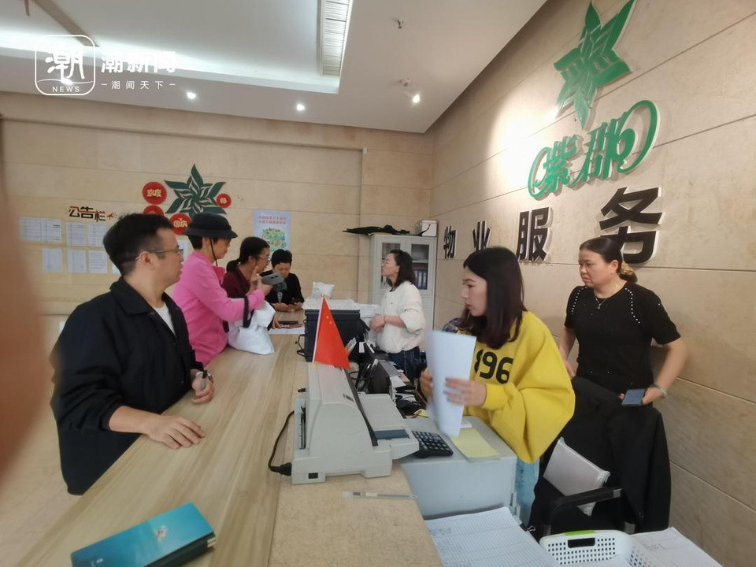
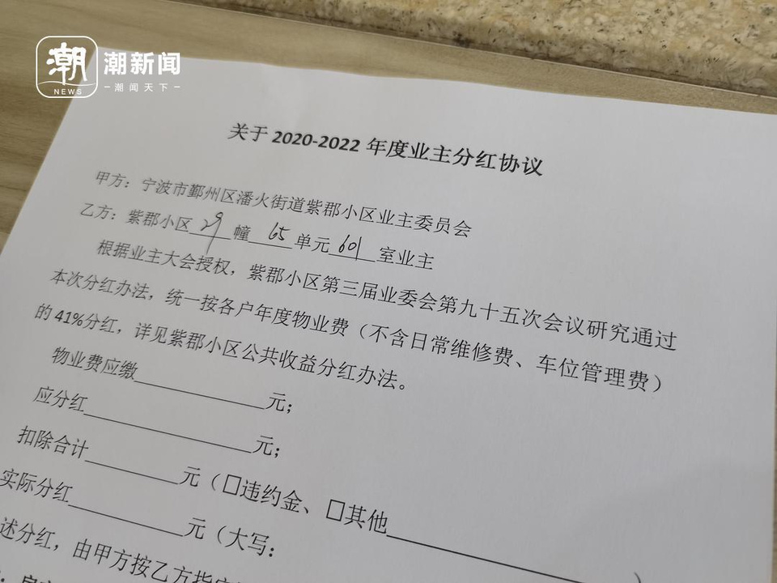
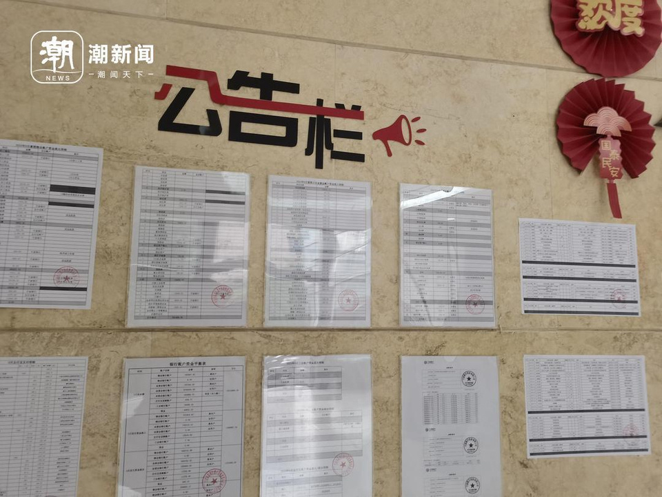

# 浙江宁波一小区采用业主自治方式，3年分红200万，有人领到后直接捐了

潮新闻客户端 记者 唐旭锋

“在这里住了十几年，第一次拿到分红，太开心啦！”这几天，浙江宁波鄞州区街道紫郡小区的业主们以及交了物业费的商铺经营户，很多都领到了小区公共收益分红。

这件事很快上了热搜，不仅周边小区居民艳羡不已，全国各地的网友们也眼红了。

紫郡小区为什么给业主们分红？

记者了解到，紫郡小区自2020年起通过业主自治的方式开展物业管理服务，这一次的2008100元分红金额是小区自治三年（2020-2022）来的公共收益余额（除去开支）的一部分。

紫郡小区的自治是怎么来的？这三年小区有哪些变化？

潮新闻记者于11月6日来到小区。

**2000多户能领分红**

**有人直接捐给了小区的公共账户**

紫郡物业办公的地方，进门还能看到“紫郡小区业主分享三年物业自治红利200万”的横幅。物业前台，几位业主带着身份证、房产证和银行卡来领分红，工作人员逐一登记后会依次打卡入账。

紫郡物业负责人欧颖告诉记者，此次分红涉及小区2415户住宅及88户商铺（不包括2023年1月1日以后搬入小区的业主），按单年度缴纳物业服务费计算分红金额，户主们可分到226元至1996元不等的红包。

“领现金是小部分，大多数还是直接入卡的。”欧颖说，也有人不来领红包，表示愿意抵扣明年的物业费，还有业主干脆把这笔钱捐到公共账户，用作小区的建设。

紫郡小区是2008年前后交付的，有连体别墅、花园洋房、多层、小高层、高层等61幢，在当地算比较高档的小区之一，环境和绿化都蛮好，小区里秩序井然。

_樊先生正在物业前台领取分红。他填写了一张《关于2020-2022年度业主分红协议》_

“好像有七八百块吧！”樊先生说，其实这点钱也不在乎，关键是一种心情，一种归属感。

50多岁的夏师傅听说记者来采访，特意从家里赶到物业办公室。“我这个分红暂时不拿了，抵扣明年的物业费。”夏师傅是2019年买的房子，他用了“美人胚子”四个字形容小区：“什么意思呢？就是当时小区的基础很好，但没有规整好，乱糟糟的。但我2021年住进来以后，发现小区完全变样了，损坏的公用设施修好了，原来坑坑洼洼的路面也做了硬化，门禁和人脸识别也搞起来了。”夏师傅说，小区自治以后，人心齐了：“有什么事情，群里一喊，大家主动参与，我就当过防疫和扫楼的志愿者。”

**小区自治是怎么来的**

**自治后哪些变化在发生**

杨善福是小区第三届业委会副主任。

他告诉记者，第三届业委会是2018年底成立的。2019年底，原来的物业公司合同到期，业委会不再续聘，2020年起决定开始小区物业自治，三位业委会委员作为股东发起成立宁波鄞州紫郡物业有限公司，业委会主任挂名法人代表。紫郡物业不以盈利为目的，为全体业主负责提供物业管理和服务，但作为公司法人的紫郡物业在工资待遇方面依法保障员工的利益。

据杨善福介绍，小区第三届业委会委员有律师、教师、公务员、记者等专业身份和知识背景。2019年，业委会代表全体业主与物业公司有过“斗争”，“我们发现物业公司在财务收支方面存在一些猫腻，有关遗留问题还通过诉讼途径上了法庭。”

小区第四届业委会委员张泽峰是一名律师。他告诉记者，之物业公司对于资金的使用，比如哪些支出用物业费，哪些支出用到维修金，哪些支出用到公共收益，都是依据相关物业条例以及双方的合约来的。“根据规定，我们业委会与原来聘请的物业公司有一个共管账户，小区公共收益的钱都要打进去的，但在合约存续期间，账户里面的资金从来没有超过一万元。”多位业委会委员表示。

紫郡小区自交付以来先后有两家物业入驻。第二家物业公司自2014年进驻以后，因管理和服务不到位导致小区乱象丛生，物业费收缴率也一度跌到了40%左右。

这也是为什么小区决定开始自治。

在紫郡物业前台的墙上，业主们一进来就能看到醒目的公示栏，上面贴了每个月的资金明细。记者看到，除了公布当月的资金池余额，物业各部门的支出明细也一一公开，小到买一个拖把、一双雨鞋……
付款单位也具名了。

目前，由小区业主自治成立的紫郡物业工作人员有80余人，其中客服部、工程部以及前台就有部分工作人员是小区业主。

负责客服部的罗经理年龄50岁左右，本闲赋在家，自从在家门口上班后，她的心情和以前大不同。“为自己小区居民服务，幸福感满满，可以说这里收入5万相当于外面的10万。”罗经理拿出她刚刚去小区检查巡逻拍摄的照片给记者看，哪里的绿植在改种，哪里的外墙和过道在粉刷，哪里有车子违停，她会在相应楼道的群里打招呼，提醒大家该注意的注意，该处理的处理。

之前物业公司中也有保安、保洁和工程师傅留下来。陈师傅是电工，原来的月工资4800，现在涨到5000多。“还提供免费的中餐晚餐。”陈师傅说。

老家东北的保安李大叔，61岁了，也是从原来的物业留下来的。

“我工资也涨了1000多。作为一名保安，能明显感觉到小区里的氛围不一样了，以前业主和物业人员经常吵架的，现在大家都像一家人，这就是小区自治的好处。”李大叔说。

而小区自治三年来的变化，大家都有目共睹。

“自治三年来，我们每年的公共收益不菲，收益来源主要包括商铺租金、电梯广告、公共区域摊位出租以及公共停车费。”杨善福说，这次200万的分红相当于全年物业费的41%。

“有一些业主不支持发钱，他们说小区建设还需要资金。”杨善福说，但是这一届业委会要谢幕了：“之前给大家描绘了美好愿景，要给业主们有一个交代。而发钱这种方式是真正能让全体业主感受到红利的，同时也能激发更多业主参与小区公共事务的热情。”

正是在这样的背景之下，今年8月（业委会换届之前），小区经过业主大会表决同意进行分红。

小区自治这样的模式可以推广吗？对这事你怎么看？欢迎评论区留下你的看法。

“转载请注明出处”

