# 腾讯首席科学家张正友内部分享：对具身智能、大模型及AGI的一些思考

编辑/ 腾讯科技 郭晓静

人类与一个有灵魂的机器人发生故事，这个机器人“生活”在人类世界，艰难地体会着人类的喜怒哀乐……机器人的故事，是科幻剧最喜欢展现的一个题材，然而在真实世界中，我们却很难看到一个真正意义上能与人类交互的机器人。

我们在现实生活中，见到的大多还是在生产线上进行重复劳动的机器人，或者是迈着笨拙步伐，差点被绊倒的双足机器人，还有一些仅能做展示性任务（比如跳舞的机器狗）的机器人。

  * _1_ 为什么让一个机器人不被绊倒有这么难？
  * _2_ 大语言模型的爆发是否能给机器人一个足够强大的大脑，让人类所期待的具身超级智能成为现实？
  * _3_ 人类语言的产生晚于世界的诞生，大语言模型，真的能建立一个真正的世界模型吗？

近日在【2023年腾讯技术周】AIGC大咖面对面活动中，腾讯首席科学家、腾讯AI Lab及腾讯Robotics
X实验室主任张正友博士做了主题为《迈向具身智能以及对大模型和AGI的一些思考》的分享。

在这次分享中，张正友博士提到，机器人要从自动化进阶到智能化，需要实现
**反应式自主和有意识自主去应对变化的、不确定的环境，需要一个新的控制范式，类似于人类的认知模式。**
他借鉴了心理学领域的理念，将人的思考分为两个系统，即：自动的、快速的、直觉的第一系统，以及需要专注思考的推理、复杂计算等费脑力行为的第二系统。由此，他提出，完善的机器人系统也需要由不同层级来处理不同级别的决策，或理解不同层级的感知信息。

受到这一理论的启发，他认为， **AI和人未来将会是多模态的交互方式，而且AI是主动的，它能够感知周围的环境。**
目前的大语言模型还不能称之为完整的世界模型，多模态大模型肯定是通往AGI的必经之路，但有很多工作要做，而且很可能不是现在的多模态大模型。

**以下为演讲原文：**

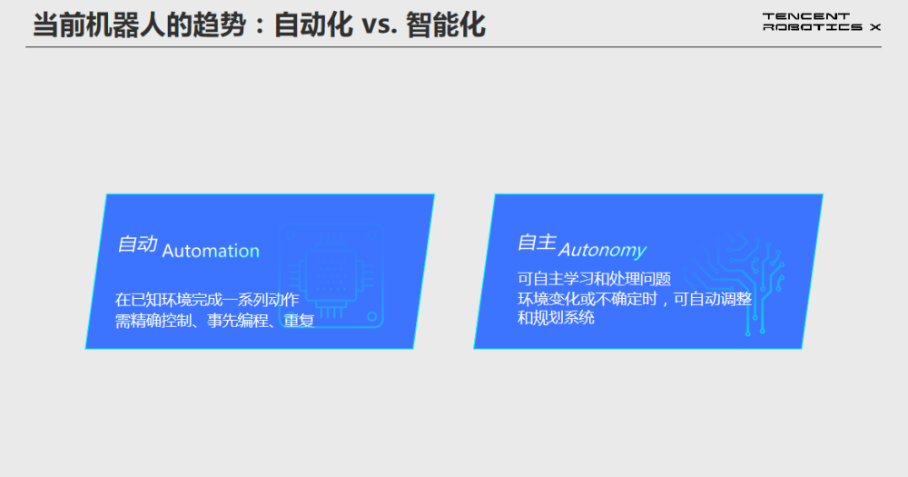

机器人的趋势，要从自动化变成智能化。很多生产线上的机器人都是重复性地做一些预编程好的动作，而且做得非常精准。我们今天讨论的是智能机器人，要实现自主，能够在环境不确定时自动调整规划它自己的系统，来应对没有预测到的情况。

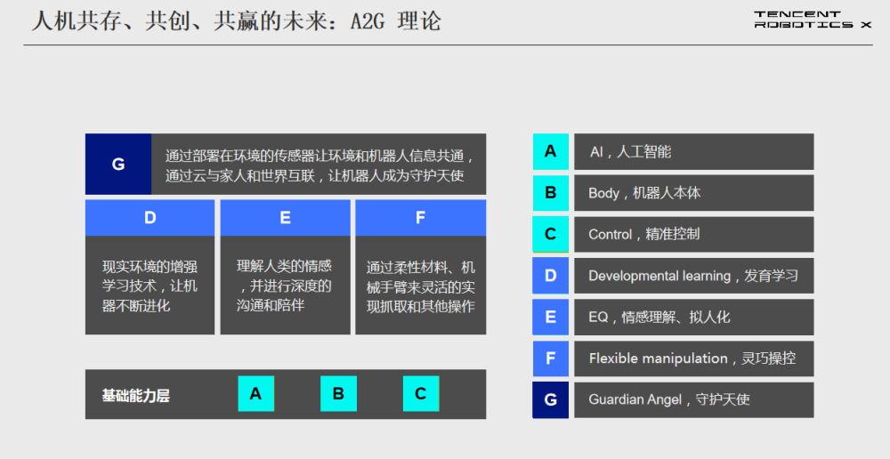

腾讯的机器人实验室是2018年成立的，出发点是AI一定要跟人协作，这是最主要的目的。所以我们做这个机器人是为了人机共存、共创、共赢的未来。实验室成立时我们提出了A2G理论，是这七个方向，ABCDEFG刚好对应英语前面的字母，A是AI，机器人必须能看、能说、能听、能思考。B是机器人本体，要探索什么样的本体最适合人的环境，最简单的想法是人形机器人，但我认为还可能有更好的形态，所以我们要探索这个本体B，Body。C是Control，精准控制。ABC属于最基础的能力，上面一层是D，Developmental
learning，发育学习。因为机器人要在环境中不断地跟人和环境交互，在交互中可能是成功的，可能失败的，成功就要做得更好，失败就要从失败中学习，不断地演进，就像一个小孩能不断发育成长。E，EQ，因为是机器人在人机环境里跟人交互，必须要理解人的情感，同时要把它自己理解的东西呈现给人，人才能知道到底机器人有没有理解，所以这是双向的情感理解，拟人化。F是Flexible
manipulation，灵巧操控，要掌握包括使用工具，为人类完成物理任务，否则这个机器人只是一个聊天的机器人。G是Guardian
Angel守护天使。这个机器人不光只是单独的一个本体，还需要跟部署在环境里的智能传感器和其他机器人、通过云跟家人和世界互联，使得机器人成为人类的保护天使。

这是我们Robotics X实验室一开始成立定的几个方向，今天主要讲C到D。

**一、完善的机器人系统需要借鉴人类的思维模式：分层级进行“快与慢”的理解与决策**

讲到自主，有两类：一是反应式的自主。比如走路时绊了一跤，可以很快恢复平衡，不会绊倒。有意识的自主，比如各位要去开个门或者我要从上面下来，都要有一些规划。

为了实现这样的自主，传统范式是通过感知，感知环境后做一个计划，计划后面的行动，行动再到感知。传统范式有很大的致命性问题，因为它不可能解决反应式的自主，因为不可能那么快。你说我绊倒后还要在脑子里思考怎么样恢复平衡，我没时间思考。

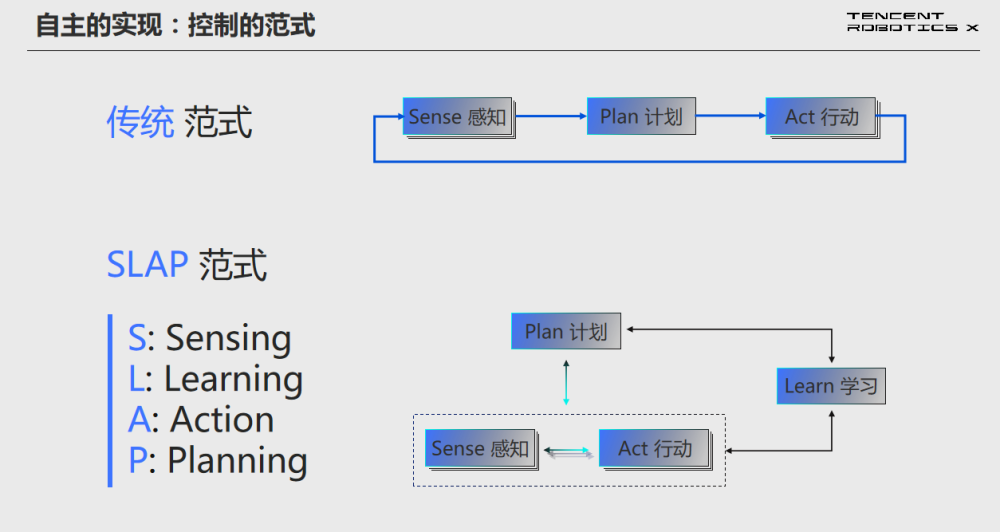

为此，我提出了一个新的范式叫SLAP范式。这个名字S是感知、L是学习、A是Action、P是Planning。很重要的一部分是学习，学习渗透到感知、行动、和计划。还有一个重要的部分是感知和行动紧密的连在一起。只有这样才能感知到突发事件，比如绊了一下马上就能够行动来保持平衡，同时对常规行动不需要进入上一层的规划或计划。

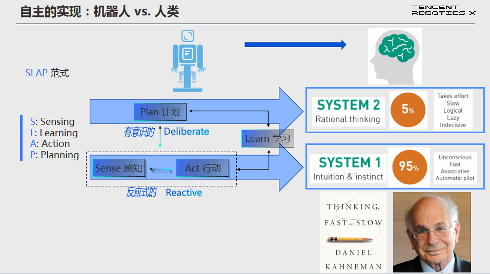

这个东西就可以跟人的认知相比较，这是系统1和系统2，诺贝尔奖获得者卡尼曼在《思考，快与慢》这本书总结出来的，这本书提到心理学领域将人的思考分为两类：system
1，自动的、快速的、直觉的；system
2，需要专注思考的推理、复杂计算等费脑力的活动。他说人的大脑95%的时间都是在系统1里运作的。这非常快，是凭直觉、不需要很多思考的。当你需要或碰到难题时，才会上升到系统2，这个花的时间大概只有5%，就是更理性地思考、推理。我们讲的反应式自主，对应了系统1。上面的Plan，也就是有意识的自主就对应了系统2。

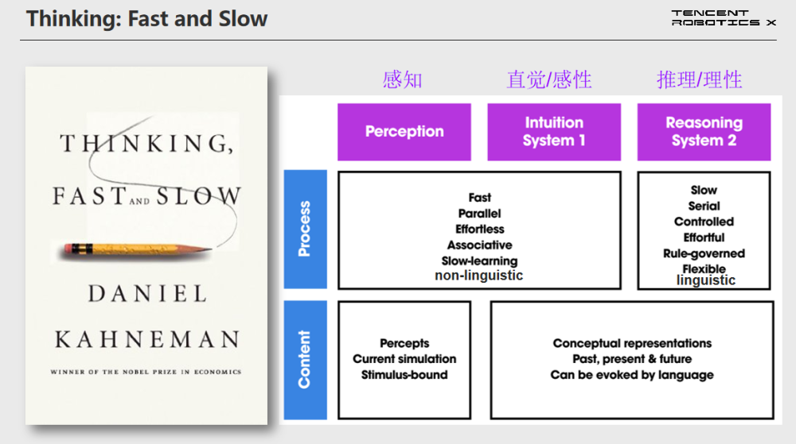

系统1、系统2前面还有一个就是感知，因为没有感知不可能做系统1、系统2。针对系统1，就是刚才提到的，快的、并行的、不需要花力气的、大部分可能不是语言方面的东西。系统2是比较慢的思考，而且是需要花精力的，是很灵活的，有时候可能是一个规则来负责的，它负责内容、感知。有一个想象，如果完成的和你预测的一样，那很快就可以实现了，这是系统1的工作。当你预测和真正实现的东西有差别，才会上升到系统2。

我觉得现在Language model还没有做到最好，因为Language
model到目前为止还是用系统1的方式做系统2，因为它是靠预测，不管你的问题难还是容易，几乎是同样的时间给你回答。但事实上真正解决问题不是这样的，容易的问题很快就可以答。复杂的问题要上升到一定高度，现在大家也有些在研究，比如反思。这都是针对目前Language
model有些问题采取新的研究方式。

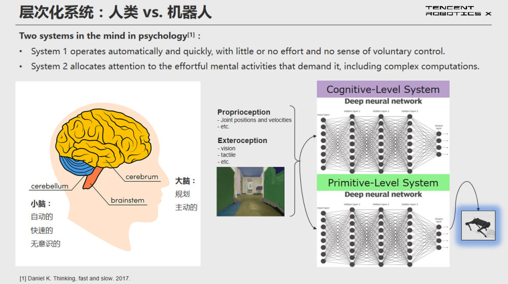

一个完善的机器人系统，同样需要借鉴人这种认知模式，由不同层级来处理不同级别的决策，或理解不同层级的感知信息；而每一层级的理解和决策，都将由一个深度神经网络来完成。就像人有小脑和大脑，小脑能自动或者快速地维持身体平衡、调节肌张力、控制步态和身体姿势、协调随意运动，而大脑既控制我们的运动和感觉也进行逻辑思维、语言、识别和理解等高级认知活动。

**二、腾讯通过三层架构实现真正自主的机器人决策控制**

回到今天我要讲的机器人部分。刚才讲的为什么是反应式自主，有些是有意识的自主，因为人在发育过程中最早是一个动物，动物尽管没有语言，还是需要处理目前这个世界的。小脑几乎是所有动物都有的，小脑是非常自动快速的几乎没意识的部分，可以实现帮助动物活下来，包括人类活下来，只是需要决策时才会上升到大脑部分。

在这个情况下，我们机器人控制里也分层，第一层是本体的感知控制，我们也有神经网络到后面去实现。第二个，对环境的感知，还有一层就是策略的决策。分层后实现了机器人智能控制。

再具体一点，目前的机器人控制分三层：

1、第一层是PLC，行为控制系统，接受本体的感知包括关节的角度，上层控制指令，比如往前、往后、往左、往右，输出的是机器人控制的力矩。

2、第二层是ELC，环境交互的控制系统，接受环境的感知信息。比如我们要下楼梯或者上楼梯、开门，环境给我信息后我要去规划，去实现和环境相关的一些任务。

3、最上面是SLC,策略控制系统。比如一只狗一定要把另外一只狗追上，这样的策略怎么样控制，它可以把任务信息、外部环境感知信息和本体感知信息都整合起来，输出到控制指令。

这个好处是我们已经把认知到行为三层能力进行分解，分解后每一个层都可以独立去训练，到最后可以端到端稍微微调一下，但通过分层的训练，效率、稳定性都非常高。

**三、生成式模型在机器人控制领域的应用**

在Primitive-Level Control层面，展现出人类和动物的行为时，我们不会用规则、hard
coding的方法，我们用了目前比较流行的生成式模型，生成式模型用在这个控制里非常合适，因为前面一堆Token或者其他东西预测下面的东西，下面的东西就是一个运动控制指令，这是非常合适的模型。

我们机器人用的生成式模型跟现在自然语言用的生成式模型的差别在哪里？我们从一开始就是多模态的，Language
model是用文字预测文字，我们这里面输入的是内部关节角度各方面的东西，到最后是要变成一个电机力矩去控制机器狗。我们采集了真狗在跑步机上不断跑的数据，上面贴了很多点，一个MoCap动捕系统看它的轨迹运动方向，当然我们不知道狗到底用了多少力，所以力矩没有，只是表面的运动信息。

有了表面运动信息后，可以把这些信息retarget到机器人的骨骼上，因为机器人跟真狗差别非常大。然后构造了基于MLP的Encoder来压缩数据特征。我们使用了高质量的离散编码来表达真狗的运动形态。接下来是Decoder，解码隐变量，输出电机控制。整个过程用强化学习去训练，使得机器人到最后学到的动作和真的动作形态很接近。最后部署时，去掉encoder就可以部署上去了。虽然我们是在虚拟环境中训练的，但能zero-
shot部署到真机。

这里比较了一些其他方法，比如单脚离地时间、站立时间，迈步的长度、高度之类的，每一个都是不同的标准，比如第一列是单脚离地的时间。大家看到每列图有五个不同方法的比较，第一个是统计出来的真狗数据，第二个是我们自己方法学到的数据，剩下的四个是其它方法。经过我们的方法，和真实的数据几乎是一样的分布变化，其他的差别就比较大。另外，尽管我们允许的力矩是从正15到负15牛米(Nm)，但最后学到的策略输出的力矩均值只需要5Nm上下。

大家看到机器狗Max从自动学到的模型里采样，然后它自动在跑，也不知道它往哪个方向，到最后拉不住了就放掉，它在里面不同的动作，都是自动学习得到的。

刚才真狗的数据只是在跑步机上走，后面要让它爬楼梯、跳栏，各种各样的环境它怎么去处理。这里面没有采集真狗的数据，我们在虚拟世界里加各种各样的台阶或者障碍物，让它去继续学习。这里面包括环境层面的控制ELC。现在已经训练好第一层的PLC，就不需要再学，只需要学从强化学习怎么样成功地避过障碍物或者爬楼梯，学的效率非常高。

我们可以在这里面学各种各样的环境，学到各种各样的ELC的网络，学到不同环境的ELC后，可以通过蒸馏的方法把它变成一个大的ELC来应对所有的环境。从右下图的对比实验可以看到，相比不经过预训练从头学习，我们通过预训练PLC，就能很快速的学习到应对不同环境的能力。

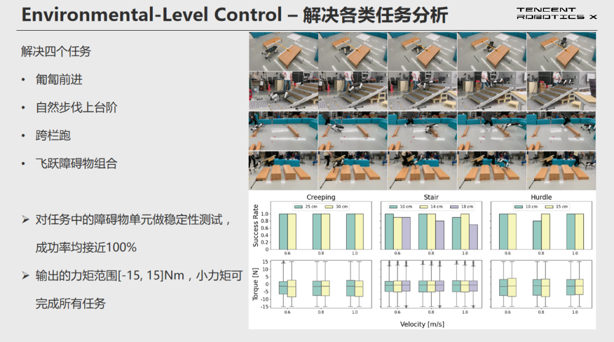

我们解决了匍匐前进、自然步伐上台阶、跨栏、飞跃障碍物组合，成功率接近100%。

这个视频展示了Max通过ELC学习后应对不同环境的能力。

当你学会单个狗的智能控制和运动后，就能适配不同的环境。下一步，如果针对不同的任务，比如一只狗追逐另一只狗，它能不能学会。这里面相对来讲就比较简单了，因为我们做学习的团队原来做《星际争霸2》AI的，他们训练出的AI
bot打败了国服和美服的宗师级选手，这个对他们来讲是小Case。通过学习，只需要输出方向和速度，有了方向和速度自动驱动下面两层ELC和PLC。

高质量的PLC和ELC可以大幅度加速策略层面的学习。这里面设置了游戏、任务，里面有两个机器狗，有一个Flag，最初是一个Chaser，一个Evader，Evader接触Flag后角色转变，Flag重新出现一个随机位置，Chaser追到Evader游戏结束。

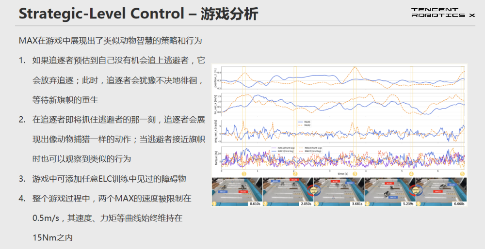

在没有真狗数据的情况下，完全靠它自己学习的，比如追逐者估计自己没有机会追上逃避的人了，就会放弃追，在那里等，等看到新的出来就可以去抓。追的时候快要抓到逃避的狗了，就能够跳起来抓另外一条狗。这里面还可以任意添加障碍物，尽管在策略训练过程中没有障碍物的。因为PLC里已经学过了。

我们现在看看狗追狗游戏的效果。视频里为了安全，狗的速度故意被限制得比较慢，场地只有4.5m * 4.5m大小，但事实上真的狗可以走得更快一点。

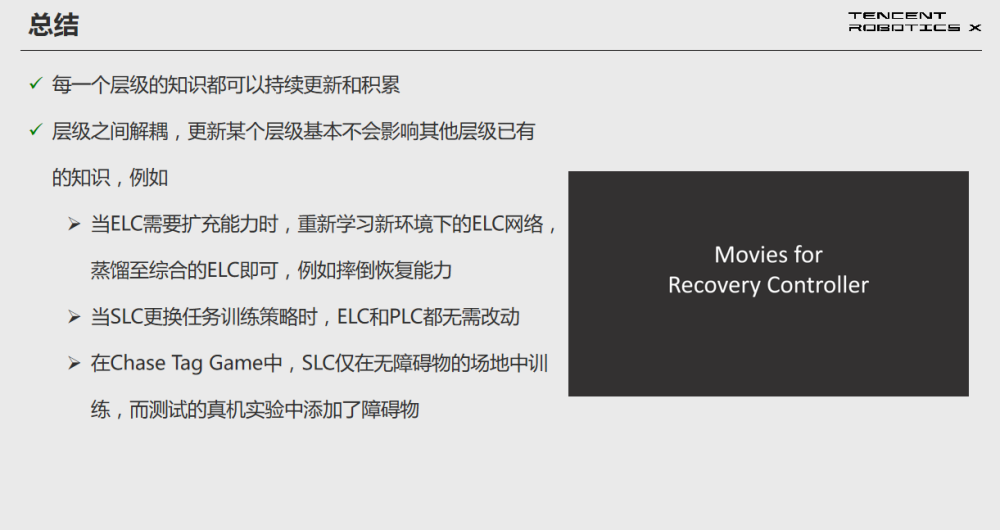

总结一下，我们分层的控制是能够持续积累更新的，无论是最底层的控制知识还是对环境的感知知识还是策略的知识。层级之间有一定的解耦，这样更新每一个层级基本上不会影响到其他层级已有的知识。比如刚才讲的环境需要补充，只要重新学一个新的环境里的ELC网络，就把它蒸馏到一个大的综合的ELC里就够了。

这里也展示机器狗摔倒恢复的能力，也是他自动学会的，一般很难把狗推倒，而且推倒后它马上就站起来了。这个就是反应式自主，这是靠规划很难规划出来的。当SLC更换任务训练策略时，ELC和PLC都不需要改动。

同样的方法也可以用到人和人拳击，训练数据只是一个人的拳击动作，但两个人对打，它是自动学会的，看起来还是比较真实。所以我们的从认知到行为的分层架构有很强的拓展性。

**四、对文本大模型、AGI的思考。**

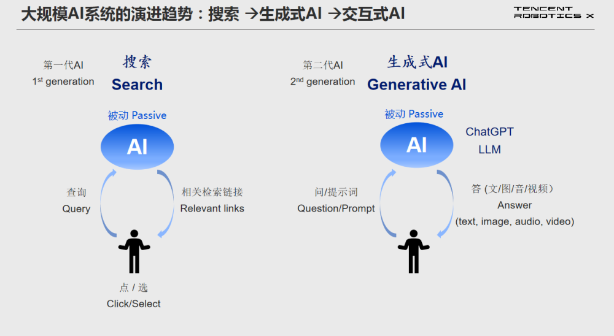

第一代大规模的AI系统应该是搜索引擎，就是我们人提一些查询（query），AI系统会检索一些相关的链接，人自己要去决定到底看哪个链接，如果这些链接不行，需要退出来，再去选另外一个链接，所以人在这里面起到非常重要的作用，AI还是一个非常被动的形态。

第二代就是最近生成式AI，同样的场景下，我们人问一个问题，就不需要去看链接了，系统会直接给你一个回答，回答可以是文，也可以是图，也可以是视频，这个就是我们讲的大语言模型LLM比如ChatGPT，但这里面AI还是被动的，需要人去问问题，才给回答，这还是一个被动的形态。

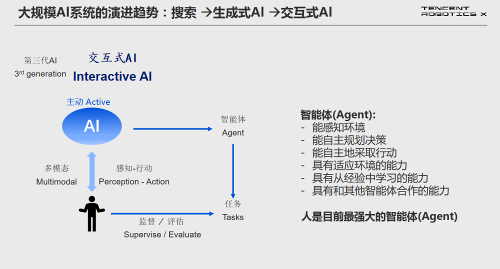

接下来的研究方向，应该是进入到第三代的我们可以称之为交互式AI，也就是，AI和人是一个多模态的交互方式，不光是文本，还有语音、图像和视频，而且它是主动的，能够感知周围的环境，可以主动提问题，这样，AI
就变成一个能够行动的实体了，就会变成一个主动式的AI，是一个智能体了，是能够帮助我们完成任务，我们人类只需要去监督和评估任务，最后可以给AI做一些反馈。

所以，智能体要做什么呢？首先要能感知环境，要能够自主地规划和决策，要能自主地采取行动，要具有适应能力，而且要具有从经验中、交互中学习的能力，还要具有和其他智能体合作的能力。在AGI没出现之前，人类是目前最强大的智能体。

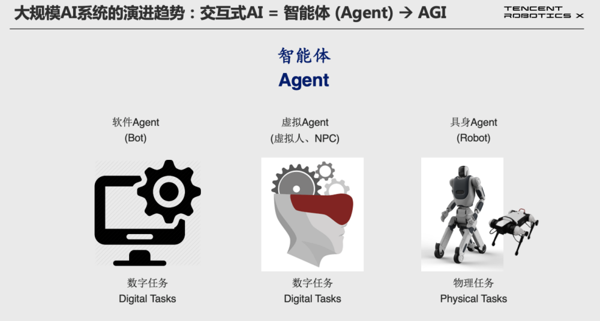

智能体有三种形态，第一种是软件的Agent，它是没有固定形态的，虽然也能完成各类任务，第二个是虚拟的形态，像虚拟人、NPC，它这里面也可以完成各种各样的任务。

第三个是有具身的形态，具身Agent（智能体）那就是机器人，它的优势是因为是具身的，能够完成很多物理的任务，包括老年陪伴、护理，帮我们提东西，搀扶老人各种各样的物理任务，这个是AI发展的趋势，到最后智能体要成为AGI。

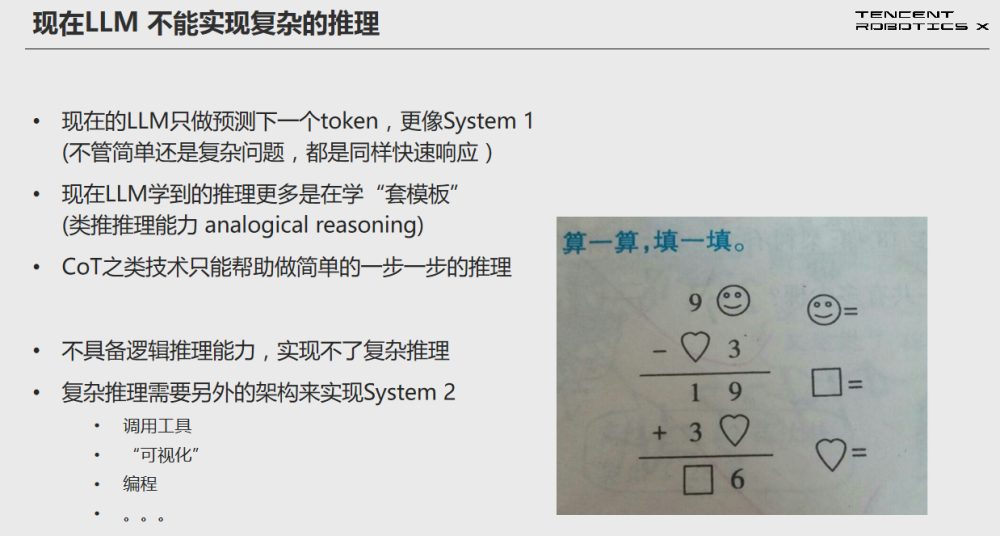

大语言模型（LLM）的出现，让我们都非常激动，认为是AGI的星星之火，有人说LLM是一个世界物理模型，能够表示时间和空间，我有一些不同的看法，跟大家商讨。我觉得LLM从目前来看还是不能实现复杂的推理，所以这个推理是很难的问题。因为现在LLM是用Autoregressive和Transformer的方式，它是预测下一Token，所以我认为它更像System
1。因为不管问题复杂还是简单，扔进去以后，差不多同样速度给你回答了，没有上升到另外一个层次去思考，这是它缺乏的。

当然很多人都认为它有推理能力，但是我认为它的推理能力更多是在套模板，就像我们学很多东西是类推的推理能力，Analogical
Reasoning。即使像Chain of Thought (CoT)
思维链这样子一个技术，也只是帮助把一个稍微复杂的问题分解来做简单的一步步推理，所以它这个逻辑推理不太行的，实现不了复杂推理，我认为下一步从研究的角度来讲真正要提高的话，要去思考怎么样去设计另外一个架构来实现System
2，包括调用工具、内生编程、想象力、可视化各方面的东西。

另外，因为AGI如果没有一个世界模型是不可能实现的，AGI肯定要有一个世界模型，所以很多人就在讨论，基于文本的LLM是不是一个世界模型？我认为它至少不是一个完整的世界模型。

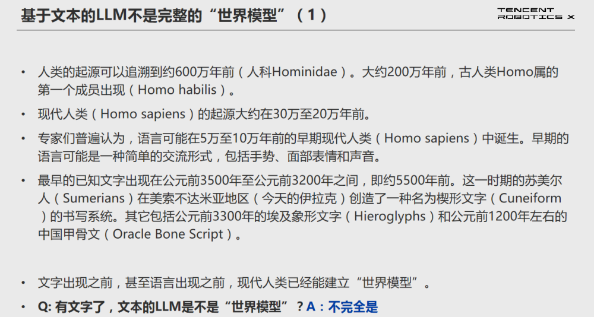

人类起源于600万年前，现代人类也是二三十万年前出现的，语言只是五万年前出现的，文字才5000年前出现，人类在文字出现之前，或者至少在语音出现之前，没有世界模型吗？肯定都有世界模型的，所以，即使没有文本，没有语言，也是可以建立世界模型的。

LLM能不能把世界全部都描述出来？它肯定是有部分的世界模型，因为很多文字是用来描述世界环境的，但是我觉得它不完全是，只能说是部分的世界模型。

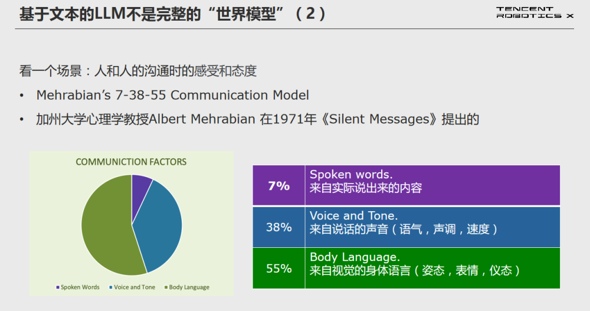

我们看一个人和人沟通的场景。7-38-55沟通模型是一个加州大学心理学教授Mehrabian在1971年写了一本书叫《Silent
Messages》里提出来的，人和人之间的交互，传递的信息，靠文字或者是Word传递信息只占7%。其他部分，声音占38%，然后人的肢体语言、人的表情，人的视线，也就是Body
Language占55%，所以完全靠文本，从另一个角度讲要想实现AGI是不够的。

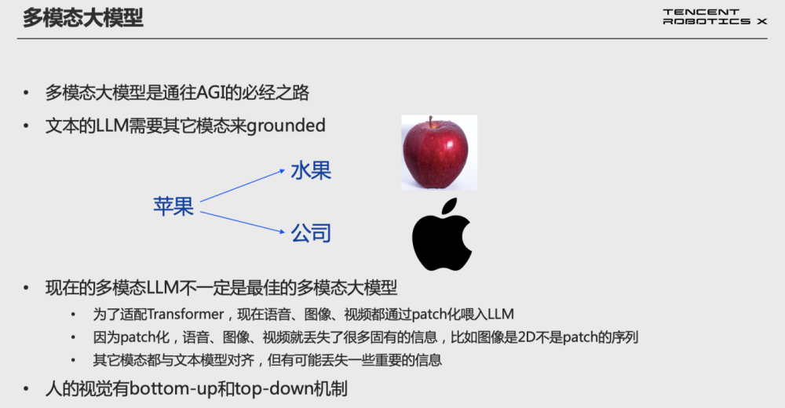

当然我们讲的要多模态大模型，肯定是要通往AGI的必经之路。文本当然大家都很清楚，文本里面有不grounded问题，比方说我这里举一个例子，苹果利用文本去描述这个苹果是非常复杂的，到底是水果，还是公司？水果你要描述它来非常复杂，假如加上图像，就比较容易了，如果加上这种味觉的传感器，那就更容易来描述这个苹果了。

这个多模态大模型肯定很重要，下面一个现在大家做多模态的是怎么做的？这是我的观察，因为LLM，就是基于文本Transformer非常成功，所以现在做图像的很多都是去套这个Transformer，然后图像就Patch化，变成分块。但是你Patch化以后，尽管你可以用Transformer套进去，但是很多信息就丢掉了。图像不是靠Patch罗列出来的，对我们人类来讲，是一个2D，假如双目的话是3D的，它里面是有很多信息，包括Bottom—Up、Top—Down这种机制在里面，使得我们对世界的理解非常鲁棒，非常快速有效。

现在基本上把其它模态和文本模型对齐，会丢失一些信息。所以这个多模态大模型还有很多可以研究、探讨的地方，值得大家去做。

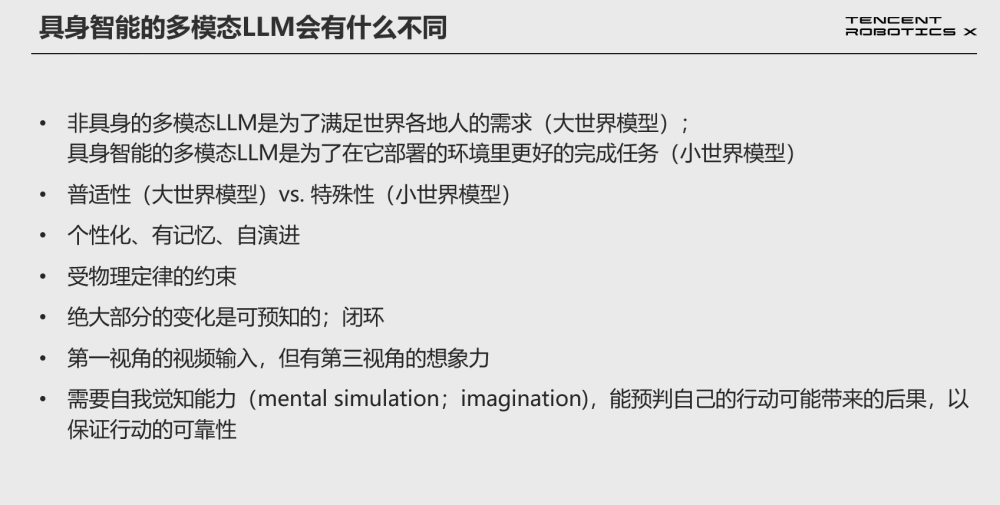

具身智能的多模态大模型还是有很多不同的，因为像不是具身的多模态大模型，是为了满足世界各个地方人的需求，所以它从某种角度来讲它必须要一个很大的世界模型。但是对具身智能来讲，当把一个机器人部署到一个环境里面，它的环境还是很有限的，所以我们希望它是部署到这个环境里面能够做得好，我们需要的不是一个非常大的世界模型，是一个小的世界模型。

这里面普适性的大世界模型和特殊性的小世界模型之间是什么样的关系？假如完全从底层做出小世界模型，这是以前的做法，比较难，做的效果不好。怎么样从一个大的模型，到最后部署的时候又把它变成小的模型，而且效果越来越好，这里面个性化、记忆、自演进这些都是要去思考的一些东西。

还有一个点，具身智能是物理定义约束的，不是随便想象的，重力各方面，机械，这些都是要去思考的。

具身智能里，绝大部分的变化是可以预知的，因为受物理定律的影响，是可以预知的，虽然有不定性，而且这是一个闭环的系统。然后视觉部分是一个第一人称的视角，就是具身智能，不是第三人称。在网站上各种各样的多模态图像、视频是第三人称视角，如何把这些内容有效的应用于具身智能是一个值得研究的课题。

还有一点，具身智能必须有自我觉知的能力，像人能够想象，在还没有做这个任务之前，做这个行动之前，能够想象我这个行为能够带来什么样的结果，在执行之前思考，这样才能尽可能保证行动的可靠性，所以这里面具身智能有很多值得思考的地方。

最后想要讲的，就是说大模型的出现让我们很激动， 但通向AGI的道路是曲折的，前途是光明的，谢谢大家！

