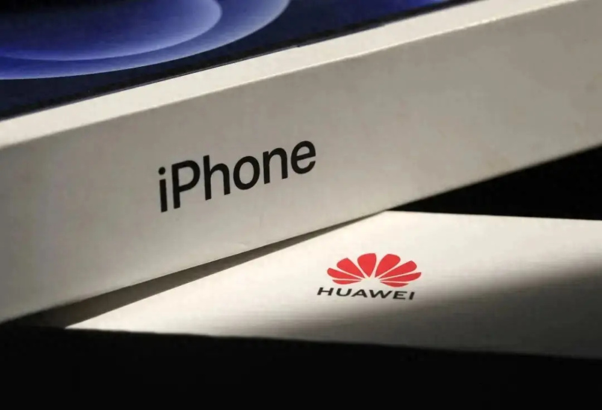
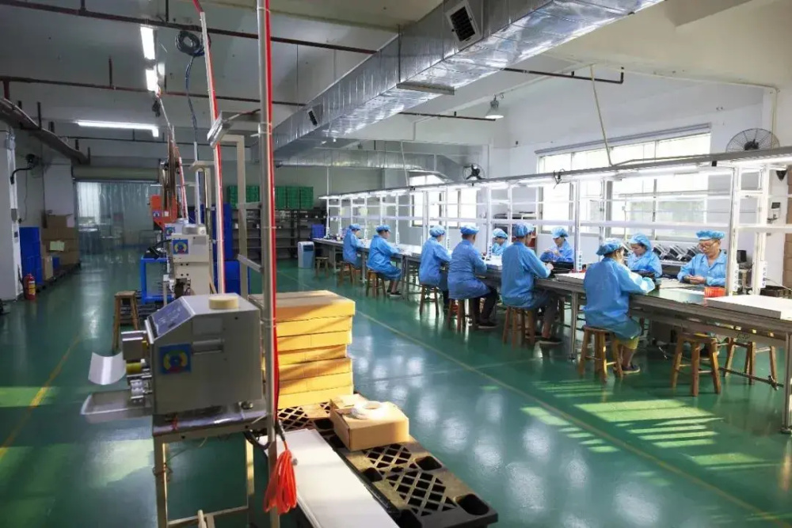
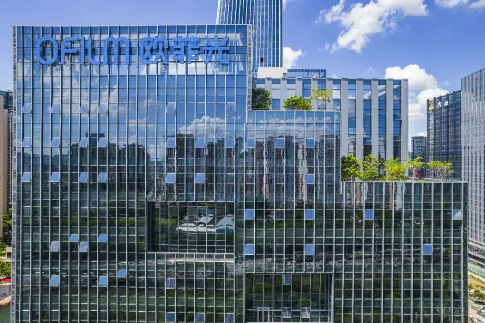
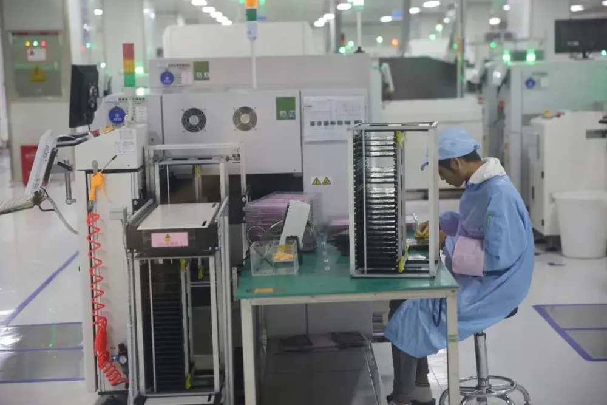
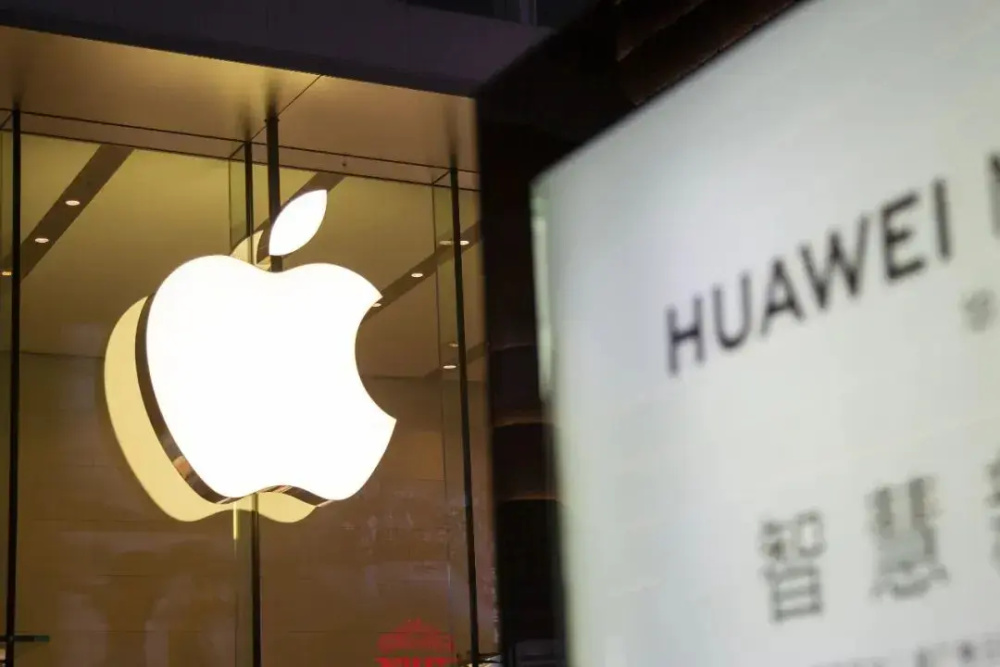
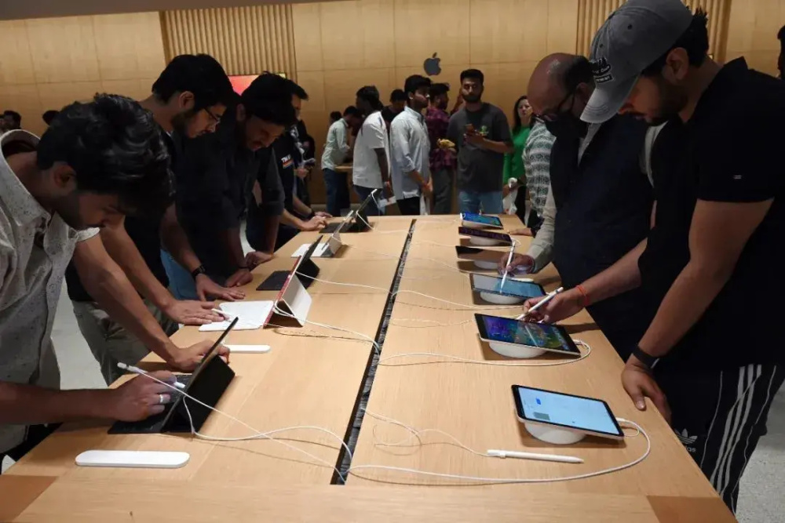
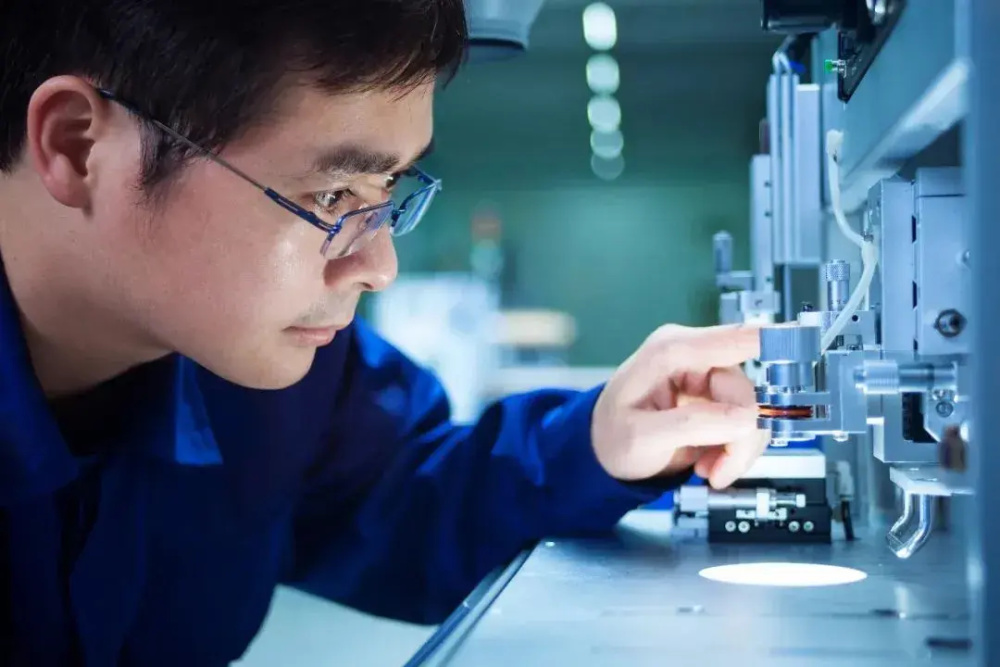
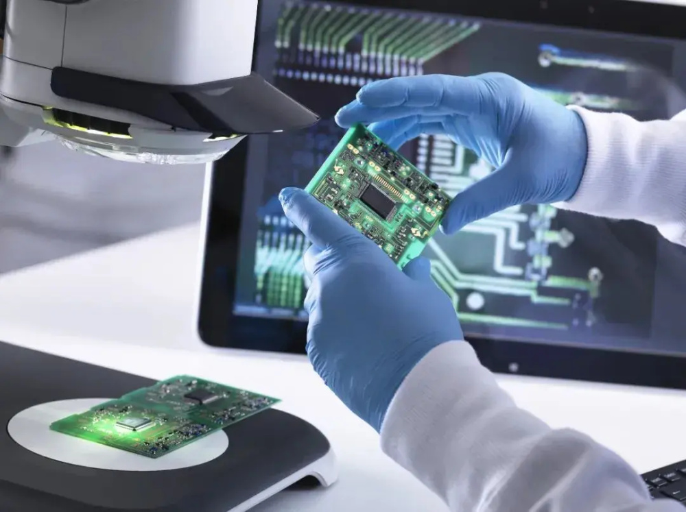

# 被苹果抛弃后，国产果链供应商借华为戏剧性翻身

手机行业曾经有一句调侃：“苹果的上游叫产业链，国产手机的上游只能叫概念股。”苹果产业链公司能切切实实拿到苹果的订单，实现营收和市值的大幅增长，而国产手机概念股只能蹭一蹭新机发布的热度，即便一时股价飞涨，很快就被打回原形。

曾经的欧菲光，因切入果链而崛起，苹果给钱、给人、给技术，用天量的订单砸出一个全球最大的摄像头模组厂商，但被踢出果链后，欧菲光从云端跌落，营收、股价一蹶不振。如今靠着华为重新支棱起来，欧菲光成了一个“出果链、入华链”的成功典型。

但在其他果链企业那里，华为始终无法取代苹果的优先级，对他们来说，多个客户多条路，但要发财致富，还是得跟着苹果走。真正有望抓住华为机遇的，不是欧菲光，而是华为扶持的，渴求解决卡脖子问题的国产供应商们。

**文 |** 卢枕

**编辑 |** 赵磊

**运营 |** 橙子

**冷清的富士康，热闹的欧菲光**

11月伊始，坐落在全国各地的富士康工厂，变得比以前安静许多。阿城是烟台富士康流水线上的一名普工，他久违地拥有了一个完整的周末，突然的闲暇让他有点不适，一整天都躺在宿舍里刷抖音，心里却始终有些烦躁。他盘算着工时，这个月如果都不加班，工资就没法看了。

往常，阿城每个月能赚5000多元，但如果不加班，底薪只有2700元。他听说，以后富士康都要变成“5天8小时”工作制，“所有的厂子都要落实”，像他这样的普通工人，赚钱彻底无望了。但他在短视频里看到，郑州富士康好像没受影响，他猜测，是因为那边在生产苹果新手机，订单量大，不像他所在的烟台富士康，“活儿比较少，人也不怎么招”。

阿城不知道，连郑州富士康都在慢下来。在富士康旗下部分企业税务和用地情况被调查之前，河南的部分富士康厂区就已经冷清了不少。在郑州富士康厂区，一度流传起富士康工厂要搬走的谣言。

_▲图 /视觉中国_

李力在周口的富士康上班，为苹果手机生产一些零部件，他明显感觉到，今年没以前那么热闹，加班变少了，工资也低了，很多人过来不久就离开，“不需要那么多人”。他在网上看到苹果CEO库克去了立讯精密工厂的新闻，下意识觉得，这对富士康来说，是个不好的兆头。

在距离郑州富士康800多公里的南昌欧菲光园区，则是另一番景象。这里还在持续招募小时工，给出了25元的时薪，比郑州富士康还高一块钱。在劳务中介的宣传中，这是南昌最高的工价，包吃包住，一个月综合薪资最高能到7000元。不少人慕名前来应聘，挤满了等候面试的房间，没有座位的人贴墙站成一排，一直排到了门外。

劳务中介小娟说，今年南昌的电子厂活儿不多，欧菲光是少有的逆势招工的厂子，工价又高，“真的是缺人”，现在南昌的劳务中介们几乎都在帮欧菲光招工，“这大概是今年最后一次赚钱的机会了”。

欧菲光厂区加班加点的喧哗和富士康厂区做五休二的静谧，正如华为Mate 60系列和iPhone
15系列在市场上的反差，前者一机难求，后者销量冷清。而苹果和华为各自的供应商，也随着链条龙头的境况起落。

作为苹果最大的供应商，富士康的繁荣程度，与iPhone的销量紧紧绑定在一起。据市场研究机构的数据，iPhone15系列在中国市场上市的前17天，销量较去年同期推出的iPhone14系列下降了4.5%。双11前夕，iPhone15全系的价格都跌破了发行价，降价幅度高达1000元左右。

天风国际分析师郭明錤推测，iPhone 15和iPhone 15
Pro销售均低于预期，这两款机型可能会被砍单。富士康是这两款机型的主力代工厂，本来苹果就把今年的组装订单分给了立讯精密以及和硕一部分，如果再遭遇砍单，富士康的冬天会更加寒冷。

**反观欧菲光，这家曾经被苹果无情抛弃的光学巨头，短短三年内一蹶不振，却又因华为Mate 60系列戏剧性翻身。**

 _▲深圳欧菲光总部研发中心。/视觉中国_

据媒体报道，欧菲光占据了华为Mate
60系列后置摄像头、前置摄像头以及指纹模组订单的绝大部分份额，单台手机摄像头模组的价值在500至600元之间。如果Mate
60系列的出货量能到2000万台，可能会给欧菲光带来超百亿元的收入。

虽然欧菲光一直没有正式承认给华为供货，但市场已经默认这是事实。在Mate
60的舆论热潮里，跟华为沾边的A股公司普遍迎来上涨，欧菲光成了最大的赢家，连续6个交易日收获涨停板，股价翻了一倍。

手机行业曾经有一句调侃：“苹果的上游叫产业链，国产手机的上游只能叫概念股。”苹果产业链公司能切切实实拿到苹果的订单，实现营收和市值的大幅增长，而国产手机概念股只能蹭一蹭新机发布的热度，即便一时股价飞涨，很快就被打回原形。

曾经的欧菲光，因切入果链而崛起，苹果给钱、给人、给技术，用天量的订单砸出一个全球最大的摄像头模组厂商，但被踢出果链后，欧菲光从云端跌落，营收、股价一蹶不振。如今靠着华为重新支棱起来，欧菲光成了一个“出果链、入华链”的成功典型。

但是，华为能像苹果一样，承载起众多供应链公司的未来吗？主动拥抱华为，能壮大果链企业的话语权吗？

**左手苹果，右手华为**

进入苹果供应链，曾是所有手机上游供应商的夙愿。

2016年，欧菲光花2.34亿美元大手笔买下了索尼在广州的模组工厂，这个工厂的最大价值是拥有苹果手机采用的Filp
Chip镜头模组封装技术，这是只有苹果用得起的昂贵技术，但这张门票也让欧菲光顺利进入苹果供应链，与LG、夏普并列，成了iPhone镜头模组核心供应商。

在苹果大订单的催动下，欧菲光快速扩张，营收节节攀升，一年一个百亿台阶，2019年超过了500亿元。2018年，欧菲光又拉来了华为，成为了华为手机镜头主要供应商，2019年，欧菲光前三大客户分别是华为、苹果以及小米，这三家公司名列当年全球手机销量排行榜的前四名。

左手苹果，右手华为，成了行业龙头欧菲光最大的倚仗。但辉煌之下，欧菲光的地位并不稳固。

拆开一部手机，最值钱的零部件分别是Soc芯片、屏幕和摄像头，欧菲光虽然生产摄像头模组，但里面最值钱的CMOS传感器来自日本的索尼，其次值钱的镜头来自台湾的大立光，连音圈马达都是国外厂商的，欧菲光只是把买来的零件拼装成模组，赚的还是附加值最低的辛苦钱。

大立光生产的镜头元件，毛利率高达70%以上，但欧菲光买来组装成镜头模组卖给苹果，毛利率只有10%左右。组装环节的供应商，没有核心技术，很容易被同行取代，对于苹果这样的大客户来说，说换就可以换掉。

2020年，欧菲光南昌子公司以莫须有的“罪名”上了美国的实体清单，进出口受限，苹果出于合规考量，果断抛弃了欧菲光。另一边，原本作为欧菲光大客户的华为也因制裁芯片断供，手机出货量大幅下降。没了苹果和华为，小米OV都无法支撑起欧菲光的产量。

三年下来，欧菲光的收入从巅峰时的520亿元，接连下滑，2020年484亿元，2021年228亿元，到了2022年，仅为148亿元。欧菲光为苹果定制生产的产线无法被安卓阵营承接，只能变卖，算上其他产线的资产减值，欧菲光三年半时间巨亏101亿元。

_▲江西鹰潭欧菲光华为供应链通信组模生产线。图 /视觉中国_

制造业是一个规模效应极其显著的行业，摊薄成本、获取利润的关键在于提升出货量。在华为消声、苹果独大的那几年，抱紧苹果的大腿，即便利润微薄，依然是供应商们最好的选择。

**但欧菲光的遭遇，也给果链上的中国企业们上了一课：高度依赖苹果，隐藏着巨大的风险，尤其在地缘政治和贸易摩擦加剧的背景下，更需要万般小心，不能光埋头研究技术和生产，也要时刻关注合规、信披、公关等方面的风险。除了努力避免被苹果抛弃，也要尽早为自己准备一个Plan
B。**

实际上，为苹果提供核心零部件的供应商都是比较稳定的，苹果虽然会不断引入其他供应商，分散订单，互相制衡，但很少会踢人出局。欧菲光是个罕见的特例，并不是因为产品没跟上苹果的要求被淘汰。大部分被踢出苹果供应链的供应商，要么是产品偏门被苹果完全弃用，要么是没有技术门槛，可替代性太强，比如金属结构件、包装材料等。

**真正“出果链、入华链”的供应商屈指可数，除了欧菲光，在华为Mate 60系列的供应商名单里，曾是苹果供应商，后被踢出果链的还有金龙机电和天马微电子。**

金龙机电曾是苹果线性马达的供应商，但从2017年开始，就跟不上苹果的要求，没能进入苹果新产品供应链。2021年，金龙机电对苹果老产品的马达供应正式结束，被彻底踢出苹果供应名单。而此次进入Mate
60供应链，也是通过结构件业务，在整部手机中的价值占比非常低，只能蹭一下华为的热度，很难带来业绩的大幅提升。

天马微电子主营的则是显示屏和显示模组，是中国第二大智能手机柔性OLED面板厂商。天马微电子旗下的深天马A原本为苹果MacBook Pro的Touch
Bar独家供应AMOLED面板，Touch Bar被取消后，天马微电子随之退出苹果供应链。

金龙机电和天马微电子，对苹果的依赖性都不强，进入华为供应链后也没有欧菲光那么戏剧性的反转。但对苹果的核心供应商来说，同时向华为供货，确实可以分摊风险，还能提高利润。

在中国，有15家公司，同时出现在华为Mate
60和苹果的供应商名单中，包括立讯精密、歌尔股份、蓝思科技、京东方、瑞声科技、伯恩光学、比亚迪、水晶光电、欣旺达、领益智造、舜宇光学、德赛电池、闻泰科技、长盈精密、信维通信。

这些公司在各自的领域已经积累起雄厚的实力，也代表了中国电子产业最成熟的一些环节，比如歌尔股份和瑞声科技的声学组件、京东方的OLED屏幕、蓝思科技和伯恩光学的玻璃面板、欣旺达和德赛电池的电池模组，以及各类外观件、功能件、结构件和组装代工。

即便是这些实力雄厚的核心供应商，苹果的优先级，也要比华为更高。在全球消费电子市场寒冬中，苹果就是销量的保障，华为的出货量始终比苹果差一个量级，先赚苹果的钱，和华为保持好关系，不把鸡蛋放在同一个篮子里，才能获得最大的利润。

所以，欧菲光“从苹果转投华为”，本身就是一个伪命题。不存在什么“转投”，只是形势逼人下的无奈，欧菲光此前的窘迫，背后既有苹果的抛弃，也有华为的衰退，今日虽然因华为重新振作，但只要苹果招揽，欧菲光依然会毫不犹豫地重投苹果的怀抱，正如当年被德赛电池取代后又受邀重回果链的欣旺达。

对果链上的供应商们来说，首要的问题不是如何加入华为供应链分担风险，他们最关心的还是，如何才能继续留在果链里，避免重蹈欧菲光的命运。

 _▲图 /视觉中国_

**苹果要走，果链们跟不跟？**

苹果CEO库克，今年已经来了两次中国。

10月18日，库克在立讯精密董事长王来春的陪同下，参观了位于浙江的一家工厂，这里昼夜不停地为苹果生产组装Apple
Watch。在生产车间里，库克和一位女工聊了聊，兴奋地夸赞了工厂的自动化能力，展现出苹果对供应链生产效率的重视。

效率的另一面是成本。在参观立讯精密时，库克再一次强调了对中国供应链伙伴的信任，“苹果95%的产品仍然在中国生产、制造组装，我们致力于与供应链企业合作共赢”。

但是，中国的果链企业之间，一股股暗流涌动，苹果与立讯如此亲密，背后是富士康的暗自伤神，面对供应商，苹果向来是采取制衡分化的策略，让供应商们互相竞争，然后拿走利润，转嫁风险。

在11月2日公布的苹果2023财年第四季度财报里，苹果销售额连续四个季度下滑，但利润仍同比增长了11%。反观A股的果链企业，超过6成利润同比下降，他们为苹果承担了库存，生存状况越来越难了。

同时，苹果将供应链向越南和印度转移的努力仍在继续，对于苹果供应链中大大小小数千家中国公司来说，本就不充裕的订单，还要被越南、印度分走更多。摆在他们面前的问题是，要不要紧跟苹果，向越南和印度转移。

苹果的前期策略是，先在越南和印度培养一些小型的组装厂，俗称“打包店”，生产一些中低端产品，再从组装向上游零部件延伸，慢慢提高中国大陆以外零部件供应商的供货比重，同时“逼迫”中国大陆的零部件供应商到越南和印度办厂，谁在海外有厂，就把订单给谁。

供应链转移，对任何一家公司都是伤筋动骨，去国外建厂成本极高且回本周期长，稍有不慎，就会拖累公司业绩。在转移的过程中，“果链”企业会加速分化，尤其中小供应商，面临的将是一次大洗牌——来得早了，成本太高，亏损严重；来得晚了，订单早就没了，依然是被踢出果链的下场。

面对订单的转移，果链的一级供应商们都已经开始行动。上文提到的15家华为、苹果共同供应商中，有8家已经跟随苹果在印度和越南建厂。他们的到来，也会让二级和三级供应商跟着过来，谁不来，谁就失去了苹果这棵摇钱树。

_▲当地时间2023年4月20日，印度新德里，顾客们在印度新德里新开业的苹果直营店中挑选商品。图 /视觉中国_

在越南首都河内的郊外，富士康、立讯精密、歌尔声学、蓝思科技、领益智造、裕同包装……苹果供应链企业的园区聚集在一起，先占住位置，等时机一到，产线、设备、工人陆续入场，机器开动，就能继续在果链里安稳地赚钱。

可以说，中国的果链企业，大部分都没有选择，必须跟随苹果的步伐。在苹果这个冷峻的帝王面前，中国的供应链企业是最没有议价权的，归根结底，中国的果链企业没能参与到技术难度大、附加值高的芯片、电子元器件和精密元件中。

比如苹果的芯片基本由美国本土企业如高通、英特尔、博通等供应，存储和面板等大宗元器件，以前牢牢掌握在三星、SK海力士、LG手里，京东方近两年才开始切入面板，而像光学镜头、MLCC等精密元件，一直是日本厂商等更为擅长，中国的技术水平无法稳定的产出。苹果曾经想用引入二供、培育三供的方式制衡高通、三星和索尼，但效果都很有限，他们在技术上卡了苹果的脖子。

中国的果链公司，则基本聚集在技术门槛低的模组和各种结构件中，前者如欧菲光的镜头模组和指纹模组，后者如蓝思科技的玻璃盖板、长盈精密的金属机身等，要么被手脚麻利成本更低的组装厂取代，要么在苹果的更新换代中被直接舍弃。

技术突破艰巨而漫长，风险极大，几乎是一场赌博。为了不被苹果踢开，大多数的中国果链公司只能不断拓展业务范畴，把手伸到苹果供应链的其他环节，争取承接苹果更多类型的订单，这也导致了原本在不同细分赛道上的供应链公司有了更多业务竞争，陷入更严重的内卷，毛利率被进一步压低。

再就是拓展更多的客户，把产品卖到新能源汽车或其他消费电子领域，降低对苹果的依赖。

但最难的那条路，才是最正确的，就是不断投入技术研发，解决卡脖子问题，真正获得不可替代性，才能提高自己的话语权。比如京东方的屏幕、舜宇光学的镜头，都已经在技术上逼近日韩，只有这样的果链企业，才能在果链里活得更好。

_▲图 /视觉中国_

**华为供应链，国产替代的自证之路**

在消费电子产业，有一条恒定的规律，终端链主是技术进步和产业升级的源动力，一个供应商的技术和产品再厉害，如果没有终端公司愿意使用，技术就只能停留在设计图上，无法在量产中实现价值。

因此，紧跟链主，是产业链公司想要成功的唯一途径。在中国，苹果为供应商们提供先进的生产设备，派驻资深工程师手把手教技术，帮忙解决生产问题，协助规范生产流程，改进生产工艺，提高生产效率。苹果给的订单，虽然利润不高，但需求稳定，回款迅速，让企业迅速做大，在资本市场上成为明星。

拆开一部iPhone手机，中国供应商的零部件价值仅占2%，但苹果带动的消费电子产业链，为国产手机、新能源汽车、先进装备制造等各行各业带来了技术进步和产业升级的机遇，能让中国企业在规模壮大后通过技术并购的方式快速进步，最终反哺到国产终端品牌的崛起。

现在摆在中国供应商面前的难题是，如何从模组、电池、结构件等低价值环节，进一步向上游高价值的芯片、元器件、精密件领域延伸，在这条路上，始终有上游厂商设置的重重阻碍，更关键的是，苹果不会采用，良率的爬坡、成本的控制就无从谈起。

这时，华为产业链就成为了机会。在被制裁之前，华为基于原有的全球供应链，手机零部件国产化率也非常低，仅有百分之十几，被制裁后，华为意识到供应链安全的重要性，一心要解决供应商的国产替代问题。

在制裁的缓冲期，华为启动了一项名为“南泥湾”的零部件国产替代计划，把所有的产品、零部件、方案都做了备份，随着制裁的到来，国产的“备胎”们一夜之间转正了不少。后来制裁加码，华为手机的国产化率也不断提升，到了Mate
60，除了少部分芯片，90%以上的零部件都实现了国产替代，尤其是价值最高的Soc、屏幕、摄像头、软件等，几乎都由国产厂商供应。

美国制裁华为的初衷，是华为在芯片领域的突破威胁到了美国最有价值的半导体产业，华为比肩苹果的出货量，也会带动中国电子消费产业各领域的全面进步。

但制裁带来的结果，反而加速了行业的技术升级。在寻找国产替代的路上，华为对供应商放宽了认证条件，优先选择国产供应商，给了他们更多的包容和耐心，也像苹果那样给技术、给资金、给订单，支持国产供应商的发展。

在Mate
60的供应商名单中，出现了很多芯片、电子元器件领域的新面孔，这些公司大多入不了苹果的法眼，无法满足苹果的严苛要求。但在华为的带动下，这些新兴厂商不断改进工艺、降低成本、提升良率，一点一点追赶国外厂商。

寻找国产替代，更多时候是一种无奈。技术差距摆在那里，追赶的路过于漫长，对华为来说，国产零部件技术差、良率低、成本高，需要牺牲利润支持国产供应链的发展。在消费电子市场持续的疲软中，性价比偏低的华为手机能不能保持很高的出货量，还是一个未知数。

不管在果链还是在华链，所有的国产供应商，想爬到产业链上游，不靠别人赏饭吃，只能耐得住寂寞，慢慢积累技术，在产业升级的路上继续一步一步往前挪动。

_▲图 /视觉中国_

