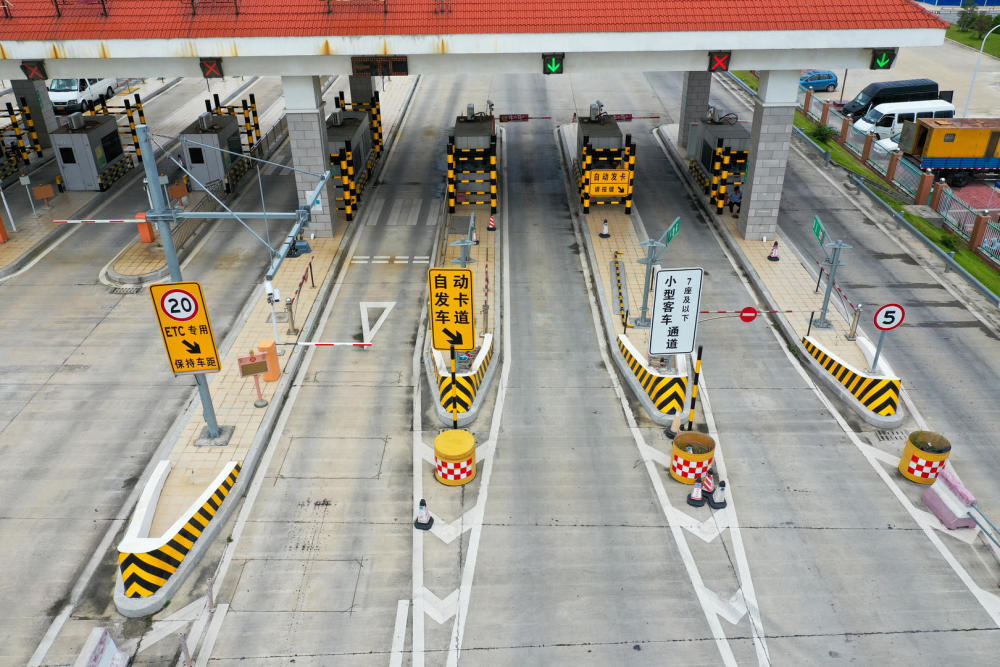
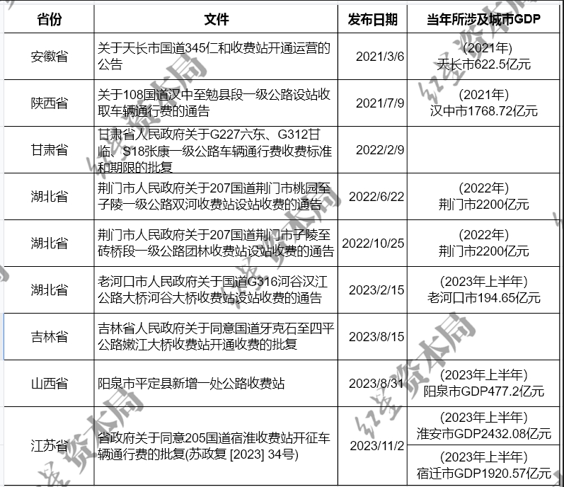

# 调查|205国道江苏宿淮站获批收费，两年多全国至少新增10座国道收费站

10月20日，江苏省人民政府官网发布消息，同意205国道宿淮收费站建成并符合通车条件后开征车辆通行费。

近年来，非高速公路取消收费站为人们所熟悉，随着205国道宿淮收费站开征车辆通行费，国道收费话题再次引发热议。

红星资本局检索发现，江苏205国道并非近年第一个收费的国道。据红星资本局不完全统计，从2021年至今，安徽、甘肃、湖北、吉林、山西、江苏均先后发布过国道收费站开通收费的公告。两年来全国至少新增10座国道收费站。

交通运输部公路局相关工作人员在接受红星资本局采访时表示，能不能收费看当地人民政府有没有给审批，如果当地人民政府批准就可以。包括收费期限和收费标准，都是政府审批。相关权利在地方政府，收费不需要交通部来批准。一般的流程是当地交通主管部门先提出，报当地政府，后者审批即可。而按照现行条例，还没有说一二级公路不能收费。

 _资料配图 图据视觉中国_

**205国道宿淮收费站获批收费**

**开征消息引发关注**

10月20日，江苏省人民政府在官网发布了《省政府关于同意205国道宿淮收费站开征车辆通行费的批复》（苏政复〔2023〕34号）。其中提到，同意205国道宿淮收费站建成并符合通车条件后开征车辆通行费。

国道又要开始收费了？

红星资本局注意到，上述消息最近两天在网络上传播引发较多关注：多年前国道不是取消收费了吗？

205国道宿淮收费站设立在205国道宿淮段宿迁市沭阳县钱集镇新桥村。上述批复表示，按照政府还贷公路管理，由宿迁、淮安两市进行联合收费，收费期限从开征车辆通行费之日起计算，在收费站运行两年后再进行评估核定。

具体收费标准执行《省交通运输厅省发展和改革委员会省财政厅关于印发江苏省收费公路车辆通行费收费标准调整方案的通知》（苏交财〔2019〕124号）中普通公路收费站收费标准：“一至四类客车每车次10元、12元、15元、15元；一至六类货车每车次10元、15元、30元、35元、40元、50元。各项优惠减免政策按国家和省有关规定执行。”

值得一提的是，早在2018年12月，江苏省发改委就发布了“关于205国道宿淮收费站工程可行性研究报告的批复”。其中提到：“为提升国道服务水平，缓解政府还款压力，根据《省政府关于同意迁移宁杭高速公路苏浙省界收费站等事项的批复》（苏政复〔2014〕81号）要求，同意建设205国道宿淮收费站工程”，“本项目总投资估算6865万元，全部由沭阳县人民政府财政资金解决，项目法人单位为沭阳县交通运输局。”

11月6日，红星资本局致电沭阳县交通运输局，对方工作人员表示，具体情况需要询问205国道宿淮收费站工程负责人。截至发稿，宿淮收费站相关负责人电话暂未接通。

**“你是不是刚刚出生啊？”**

**货车司机：都知道国道没有收费的**

近年来，非高速公路取消或者没有收费站为公众所熟知，红星资本局采访多位跑长途的货车司机，也印证了这一点。

11月6日，在珠三角经营货车的钟师傅告诉红星资本局，他从2012年就开始跑货车了，平时走高速公路偏多，偶尔也会走国道。在他走过的路线中，广东和浙江地区，还没有遇到国道收费的情况。

一位浙江的长途货车师傅在接受红星资本局采访时，针对是否清楚国道也要收费的提问，反问道：“你是不是刚刚出生啊？现在超过18岁的都知道国道没有收费的。”

不过，从2009年就开始跑货车的吕师傅告诉红星资本局，他常跑新疆、云南、贵州以及四川等地，走高速较多，走国道较少，在他的印象中，新疆的部分国道是要收费的。有一条位于新疆的国道收费大约600元，但算下来还是比高速收费便宜。

货车司机王师傅（化名）也告诉红星资本局，他常跑217、312国道，后者的收费路段要多一点，基本跑一次来回，在国道上花费的过路费有几百元。

在采访中，上述货车司机都提到过路费是跑车成本的重要部分。吕师傅表示，过路费占到总运费的30%左右，基本都是高速费用，一年的过路费大约在30万元。钟师傅则提到，过路费占运费的五分之一，一台7米6的厢式货车过路费算下来，每公里1元，油费则是每公里1.7元左右。

**2021年3月至今，多省均有公告新开通收费站**

红星资本局注意到，江苏205国道并不是近年第一个收费的国道。据红星资本局不完全统计，从2021年至今，安徽、甘肃、湖北、吉林、山西、江苏均有发布国道收费站开通收费的公告。

如2023年8月，山西省发布《关于同意国道307、207线阳泉市绕城改线工程设置收费公路收费站的批复》，同意在国道307、207线阳泉市绕城改线工程（一级公路）K23+730处设置冠山收费站，收费期限为30年，该公路按照经营性公路管理，收取车辆通行费使用省税务局统一监制的车辆通行费发票。

2022年6月，湖北省荆门市人民政府发布关于207国道荆门市桃园至子陵一级公路双河收费站设站收费的通告。自2022年6月27日零时起，对通行207国道荆门市桃园至子陵一级公路的机动车辆收取通行费。

红星资本局在检索公告时发现，涉及湖北省的新开收费站较多，其中，荆门市涉及两处收费站通告。

根据2022年荆门市收费公路统计公报显示，2022年末，荆门市已设站收费的收费公路里程200.59公里。其中，一级公路收费里程200.59公里，占比100％。收费公路里程比上年增加，主要是增加一条收费公路137.63公里。

2022年荆门市收费公路共有主线收费站3个，比上年末增加2个。其中，一级公路收费站3个，分别是沈集收费站、双河收费站、团林收费站。收支方面，2022年度，收费公路通行费收入11093.36万元，比上年5866.84万元增加5226.52万元，增加89.09％。增加的主要原因是新增双河收费站、团林收费站。

**交通运输部公路局：按现行条例，还没说一二级公路不能收费**

红星资本局注意到，除了新设的，也有取消的。

交通运输部发布的《2021年全国收费公路统计公报》提到，2021年末，一级公路收费站由300个增加至308个，净增加8个，增长2.7%；二级公路收费站由122个减少至115个，净减7个，下降5.7%；独立桥梁及隧道收费站由59个增加至61个，净增2个，增长3.4%。这里面一级公路和二级公路的收费站，主要是位于国道和省道上。

比如，去年底，浙江省人民政府办公厅印发《关于取消320国道嘉兴段收费项目及收费站有关事宜的复函》，同意取消320国道嘉兴段收费项目，并撤销320国道七星、洪合收费站。按照省政府核定，320国道七星收费站、洪合收费站自2002年开始收费，原定收费期限到2032年。相当于提前取消收费。

交通运输部公路局相关工作人员对红星资本局表示，能不能收费看当地人民政府有没有给审批，如果当地人民政府批准就可以。包括收费期限和收费标准，都是政府审批。相关权利在地方政府，收费不需要交通部来批准。一般的流程是当地交通主管部门先提出，报当地政府，后者审批即可。

交通运输部公路局相关工作人员还表示，按照现行条例，还没有说一二级公路不能收费。红星资本局注意到，现行《收费公路管理条例》于2004年制定，其中第14条规定，政府还贷公路的收费期限，最长不超过15年。国家确定的中西部省、自治区、直辖市的政府还贷公路收费期限最长不得超过20年。

业内专家在接受红星资本局采访时说，国道收费标准主要由交通运输主管部门根据法律法规和政策来规定。国道是否应该收费以及收费标准的决定权由国家交通运输主管部门拥有。不同地方的交通运输主管部门会根据各地交通状况、经济实力等因素，可能会有一定决策权。

另一位专家则告诉红星资本局，对于江苏205国道宿淮收费站开征车辆通行费，是否合理要根据实际情况来评估，包括道路维护成本、交通流量、收费用途等因素。近年来，撤销国道收费站和再建的情况可能是根据交通需求和政策变化进行调整，以提高交通效率和降低通行成本。

“近年来，一些国道收费站被撤销是因为改革和优化交通收费体制的需要。再建国道收费站可能是为了改善道路设施、维护道路运营、提高服务质量等目的。”IPG中国首席经济学家柏文喜对红星资本局表示。

**修订《收费公路管理条例》曾三次面向社会公开征求意见**

据媒体报道，2011年6月，五部委联合发布《关于开展收费公路专项清理工作的通知》。2012年，18个省市取消了政府还贷二级公路收费，撤销收费站1892个，涉及9.4万公里。

2018年12月20日，《收费公路管理条例（修订草案）》在交通运输部网站公布。据央广网报道，这是该条例继2013年修正案和2015年修订稿后第三次向社会公开征求意见。当时，交通运输部有关负责人表示，2004年制定的《收费公路管理条例》对于规范和促进收费公路发展起到了重要作用，但现行制度设计已不适应保障公路可持续发展的需要，亟须全面修订。

红星资本局注意到，该《条例》拟提高收费公路设置门槛。“今后新建收费公路必须达到高速公路技术标准，新建一二级公路和独立桥梁、隧道不得收费。”交通运输部新闻发言人吴春耕在当时举行的新闻发布会上说。

2022年11月，交通运输部发布了《2021年全国收费公路统计公报》（以下简称《公报》）显示，2021年末，全国收费公路里程18.76万公里，占公路总里程528.07万公里的3.55%。其中，高速公路16.12万公里，一级公路1.76万公里，二级公路0.75万公里，独立桥梁及隧道1329公里。也就是说，除了高速公路，还有14.1%的一级公路、二级公路等在收费。

《公报》显示，2021年度，全国收费公路车辆通行费总收入6630.5亿元。其中，高速公路6232.0亿元，一级公路101.1亿元，二级公路26.8亿元，独立桥梁及隧道270.5亿元。

红星新闻记者 强亚铣 王田

编辑 杨程

