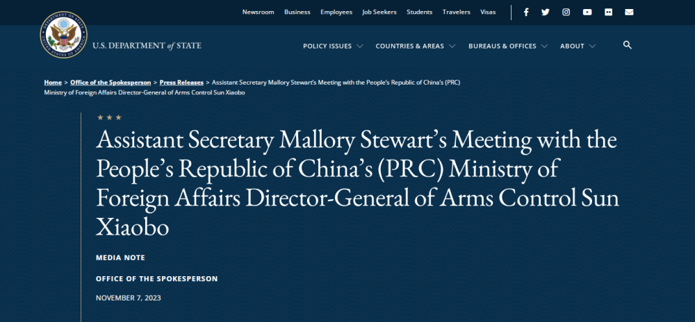
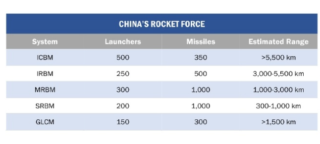

# 中美罕见举行军控会议 美国呼吁避免不受约束的军备竞赛

【文/观察者网 王世纯】美国国务院11月7日发布声明称，中美两国6日在美国华盛顿罕见举行了军控会议，这是自2019年7月以来的中美首次举行此类会谈。

美国方面负责军控事务的助理国务卿马洛里·斯图尔特（Mallory
Stewart）和中国外交部军控司司长孙晓波参加了此次会议。美方代表团成员还包括国务院、国防部和能源部以及国家安全委员会的高级官员。

美国国务院在声明中说，此次会议涵盖了与军备控制和防扩散有关的问题，是“坦率和深入的”，并补充说，这是保持开放沟通渠道和负责任地管理双边关系的持续努力的一部分。声明补充说，美国强调有必要促进稳定，帮助避免不受约束的军备竞赛，并管理竞争，以免陷入冲突。

对于双方谈判的结果，南华早报11月8日在报道中援引美国智库的话称，双方似乎讨论了广泛的问题，但没有像预期的那样取得突破或取得实质性成果。不过，周一的会谈让人们对中国目前的核储备有了新的了解机会（Insight）。

_声明截图_

 _2023年美军发表的《中国军力报告》中，美军对于我军导弹数量的评估_

据外交部发言人汪文斌介绍，在中共中央政治局委员、外交部长王毅访美期间，双方商定近日举行包括军控和防扩散磋商在内的一系列磋商。

美国国务院发言人韦登·帕特尔（Vedant
Patel）周一表示：“我们一直呼吁中国在军备控制问题上进行实质性接触，减少战略风险，这种接触将继续努力负责任地管理两国关系，确保竞争不会演变为冲突。”

美国方面近年来不断炒作我国快速扩核。对于中国现有的核规模，在2023年美军发表的《中国军力报告》中，美国宣称中国的的洲际导弹发射架数量为500件，现有洲际弹道导弹备弹350枚。具体到弹头数量上，报告宣称，截至2023年5月，中国拥有核弹头的规模为500枚，而到了2030年，这一数字可能被扩充为1000枚。

今年1月份，美国战略司令部司令安东尼·科顿上将致信美国国会称，截至2022年10月，中国的陆基洲际导弹发射器数量超过了美国。在《新战略武器削减条约》（New
StartIII）的控制下，美国陆基洲际弹道导弹数量总共拥有406枚“民兵3”型导弹，由美国空军全球打击司令部掌管。

长期在我国核武力规模问题上指手画脚的卡内基国际和平基金会研究员赵通表示，双方似乎讨论了广泛的问题，但没有像预期的那样取得突破或取得实质性成果。赵说，尽管美国对限制未来核扩张的潜在协议非常感兴趣，但美国政府理解中方对正式的军备控制谈判缺乏兴趣。

他说：“美国政府希望从更容易和更小的步骤开始，包括透明度和建立信任的措施，这可能有助于缓解军备竞赛和维持稳定的更广泛目标。”

政治风险咨询公司欧亚集团的一项评估显示，人们对周一会谈前取得进展的预期很低。它说，北京和华盛顿在核扩散和军备控制方面存在很大分歧。不过咨询公司补充称，周一的会谈还提供了一个难得的机会，让人们对中国目前的核储备有了新的了解机会（Insight）。

不过《南华早报》表示，由于主要参与者都是两国文职官员，会谈并不意味着在军事层面取得进展。

对于美国方面炒作的我国扩核问题，外交部发言人毛宁表示，首先，美方的这份报告和此前类似报告一样，罔顾事实，充满偏见，散布“中国威胁论”，目的不过是为了自己维持军事霸权找借口。中方对此坚决反对。

中国坚定奉行自卫防御的核战略，我们始终把核力量维持在国家安全需要的最低水平，无意同任何国家搞核军备竞赛。中国的核政策在核武器国家中是独一无二的，而且保持着高度的稳定性、延续性和可预测性。任何国家只要不对中国使用或者威胁使用核武器，就不会受到中国核武器的威胁。

**本文系观察者网独家稿件，未经授权，不得转载。**

