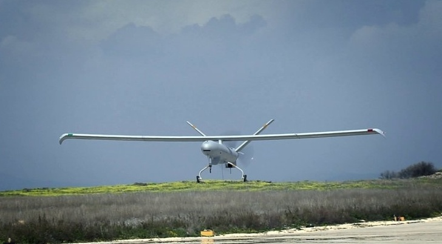

# 以色列民间高科技企业正在加入战争吗？

【环球时报特约记者 高智源 环球时报记者
陈子帅】“以色列的高科技公司正在加入战争。”以色列新闻网站“Walla”近日对此进行了报道。11月7日，新一轮巴以冲突已持续一个月。冲突爆发后，以色列国防军紧急征召了36万名预备役人员，其中约1/3都来自该国的初创企业和科技公司。在这个拥有“创业国度”称号和高科技产业优势的国家，很多民间高科技企业的创始人都是从军队退役后继续干起老本行。这些公司不仅为该国新式武器研发提供支持，在网络攻防、人质救援等领域也能看到他们的身影。

_2023年11月7日，新一轮巴以冲突已持续一个月（视觉中国）_

**“8200部队”是以色列高科技初创企业的“传送带”**

据《以色列时报》2日报道，以色列经济对科技行业的依赖在过去10年中显著增长，目前科技产业占其GDP的18%，相比之下美国占不到10%，欧盟约为6%。此外，以色列大约14%的就业人口均从事科技行业或其他行业的科技相关工作。

德勤网站发文介绍称，以色列是一个创业强国，被誉为“创业国度”。该国有着6000多家活跃的初创企业，以及近100家民营高科技独角兽企业。以色列同时也是开创性技术和高投资回报率的温床，因此，很多世界领先的跨国公司都纷纷选择在以色列投资，如微软、谷歌、苹果、脸书、英特尔等。

除少数例外，18周岁以上的以色列人都必须在以色列国防军（IDF）服兵役，男性至少服役32个月，女性至少两年。以色列国防军，尤其是其中负责网络安全和情报任务的“8200部队”，是培养高科技人才的重要部门。科技社区网站“Interesting
Engineering”报道称，“8200部队”对以色列高科技初创企业起着“传送带”的作用，是该国科技创新的重要驱动力。

如果查看以色列民间高科技企业的创始人、领导者或技术骨干的履历，会发现他们大都与以色列国防军有着紧密联系。比如纳坦·巴拉克，于2013年以上校身份从国防军退役后便创立了以色列软件公司mPrest，该公司是以色列“铁穹”拦截系统中控制核心部件的开发者；再如乌兹·罗臻，现任以色列科技公司Roboteam董事长，他曾在国防军服役31年，退役后还担任过以色列国防部长助理；Check
Point软件技术公司是世界上最早开发出防火墙的网络安全公司，其创始人吉尔·舍伍德和一些技术骨干均出自“8200部队”。

“世界以色列新闻”网站报道称，如果“8200部队”是“以色列的耳朵”，那么以国防军“9900部队”就是“以色列的眼睛”。该部队负责计算机图像处理，成员多为女性，善于观察卫星、无人机图像变化。报道称，“9900部队”前成员有望催生下一轮创业浪潮。

**“投掷机器人”、无人机、智能头盔，武器研发的重要力量**

在新一轮巴以冲突中，除了以色列国有军工企业，如以色列拉斐尔先进防御系统公司（Rafael Advanced Defense Systems
Ltd）、以色列军事工业（IMI）、以色列航空工业公司（IAI）等，很多以色列民间高科技企业也正在为该国提供支持，深入参与到新型武器研发当中，使以色列获得战场上的优势。

据“欧洲国防工业”网站报道，以色列空军第161中队作为在加沙地区打击巴勒斯坦伊斯兰抵抗运动（即“哈马斯”）的主要力量，其操作的“赫尔墨斯”450型无人机在对哈马斯目标进行打击中起着重要作用。这款无人机由以色列技术公司埃尔比特系统（Elbit
Systems）研发，续航时间达17个小时，它收集到的准确信息让第161中队可实现实时“从传感器到射手”的行动。报道称，新一轮巴以冲突预计将增加无人机在以色列空军总飞行小时数中的份额。

_“赫尔墨斯”450型无人机（埃尔比特系统公司）_

与此同时，以色列的地面行动也在不断扩大。“巴拉克”坦克是以色列国防军“梅卡瓦”系列主战坦克的第五代版本，此系列坦克是以色列在加沙地面进攻的主要武器。为了快速瞄准、先敌发起打击，IDF为该型坦克的坦克手配备了IronVision智能头盔，这款头盔也是由埃尔比特系统公司研发，可让坦克手在车舱内实时接收坦克外部环境的图像，使坦克手能够“透视装甲”。

军事专家宋忠平对《环球时报》记者表示，以色列有不少人工智能企业和生产半导体芯片的企业都在帮助国防军建立现代化的指挥控制体系和战场感知系统，这些战场感知系统是为了区分敌我目标，同时也是为了将哈马斯在加沙地带的地道找出来。

哈马斯的地道被称为“加沙地铁”，哈马斯声称该地道在地下绵延500公里。四川外国语大学以色列研究中心主任陈广猛告诉《环球时报》记者，以色列的计算机图像技术全球领先，但哈马斯一般不公开使用手机，并且多在地道中活动，这让以色列的技术很多时候难以发挥。为确定地道位置，Roboteam公司研发了一款被称为“投掷机器人”的IRIS小型可投掷无人地面车，它能够在地道中行驶、探测物体和人员，并将图片传回给操作员，还可以在遇到敌方人员时远程引爆。此外，Roboteam公司还为以色列开发了能爬楼梯并通过狭窄洞穴的微型战术地面机器人。

**参与网络攻防、救援行动和加密货币战**

在网络攻防方面，受地缘政治和国际局势的影响，早在此轮巴以冲突爆发之前，以色列政府部门和民间科技公司就在国家网络建设方面发力。以色列去年6月推出“网络穹顶”计划，以提升国家网络安全，减少大规模网络攻击的危害。自巴以冲突爆发以来，由以色列国防军退伍军人组建的HUB网络安全有限公司向国家提供了一套先进的基于零信任的机密计算解决方案，用于保护敏感数据和关键基础设施。Check
Point软件技术公司则推出了安全自动化和协作平台“Horizon Playblocks”，该平台能够自动遏制攻击并防止其扩散。

目前，也有一些高科技企业在救援行动等方面为以色列提供支持。冲突爆发后，以色列国家网络安全指导委员会前负责人，同时也是安全初创公司Code Blue
Cyber的创始人弗朗哥，与以色列网络危机管理公司Gitam
BBDO合作，成立了“平民作战室”，通过使用面部识别技术将社交媒体平台上的人员图像与以色列官方数据库及失踪者家属提供的照片进行比对，该项目在两周内确认了约60名失踪人员的身份。据彭博社报道，以色列还引入间谍软件公司。以色列国防军声称，为“减少平民伤亡”，他们获取了约100万部巴勒斯坦人手机的数据，监视加沙人口活动。尽管以色列网络情报公司NSO
Group和Candiru均被美国列入黑名单，但以方已向它们提出要求，快速升级间谍软件功能。

在战场之外，巴以双方的加密货币战也在持续进行。一方面，以色列Fireblocks、MarketAcross、Blockchain
B7等多家区块链企业共同设立了“加密货币援助以色列”项目，捐款额现已超过24万美元。而另一方面，自冲突爆发以来，以色列国防机构努力阻止加密资金流向哈马斯。以色列初创公司Lionsgate
Network正在努力定位和拦截哈马斯的加密钱包，目前已冻结约100个账户。

**谷歌关闭地图软件服务，为了不泄露以军动向？**

复旦大学中东研究中心副研究员王晓宇告诉《环球时报》记者，战争本质是双方综合实力的较量，拥有科技优势的一方会毫不犹豫地将其运用于战争中，影响战争胜负的天平。而以美国为主的西方国家高科技企业通过提供高科技产品及相关服务介入战争由来已久。在俄乌冲突中，西方科技巨头帮助乌克兰保持网络平稳运行、搜集情报、打信息战等。有分析称，俄乌冲突是“科技地缘政治”历史上第一个关键时刻，而现在西方科技公司仍在延续这种做法。

据彭博社报道，10月底，谷歌、苹果等公司暂时关闭了其地图软件和Waze应用程序在以色列和加沙地带的部分服务，包括查看实时交通数据等。谷歌公司发言人表示，这样做是“为了应对该地区不断变化的局势，出于对当地安全的考虑”。但一位知情人士表示，谷歌此举是应以方的要求，因为这些信息“可能泄露以色列军队的动向”，去年该公司在乌克兰境内也采取了类似行动。

此外，在加沙地带遭遇通信中断后，美国太空探索技术公司（SpaceX）首席执行官马斯克10月28日宣布，将把卫星通信系统“星链”提供给在加沙的国际认证援助组织使用，引起以方强烈反对。事实上，“星链”项目在俄乌冲突爆发后不久就被部署在了乌克兰，成为乌方关键的“战场工具”。

信息战和舆论战是此次冲突中的又一战场。据美国“连线”网站报道，加利福尼亚大学伯克利分校信息学院教授法里德认为，用生成式人工智能制作深度伪造信息在此次冲突中的运用比俄乌冲突爆发初期多得多。彭博社报道称，目前巴以双方都在社交媒体平台上部署了深度伪造图像和视频。专门追踪网络虚假信息的以色列科技公司Cyabra一直通过使用人工智能技术分析和监测虚假账户。而与此同时，地缘政治的分裂让社交媒体平台不再中立。冲突爆发后，X（原推特）、脸书、Instagram等西方社交媒体平台均出台措施，限制发布任何“赞扬”哈马斯的“有害和潜在有害”内容，几天内删除了数千条帖子。不过，哈马斯在总部位于迪拜的跨国社交媒体平台“电报”上拥有自己的频道并快速积攒了大量关注者。一位巴勒斯坦独立记者表示，在官方信息闭塞的情况下，想了解哈马斯进入以色列的动态，“唯一的办法就是上‘电报’”。但据半岛电视台11月3日报道，“电报”现已限制访问哈马斯频道，并未公开解释原因。

**现代战争形态正在改变**

宋忠平告诉《环球时报》记者，战场就是商场，许多高科技公司都在俄乌冲突和巴以冲突中不断寻找商机。人工智能技术、无人机以及马斯克的“星链”系统等毫无疑问是军民两用的，大量民用技术也在不断强化自身作战能力。民用技术的军事化能够提高其附加值，这也是诸多高科技公司为此布局的原因。另一方面，战场是检验产品性能的重要场景，高科技公司都希望借助严苛的战场行为来确保自己的产品服务能够更加符合商场需要。通过巴以冲突，我们看到军民两用技术或军民融合技术正在大行其道，以色列军方能够让这些厂家赚得盆满钵满。

复旦大学中东研究中心研究员邹志强对《环球时报》记者表示，更多的高科技应用到战争中，的确正在改变现在的战争形态，比如军事无人机、网络战等。而现代高科技的军民两用性质，以及民间高科技企业介入军事行动，最大的影响是进一步模糊了战争的边界，加剧了全球范围内日益上升的泛安全化观念与政策。

