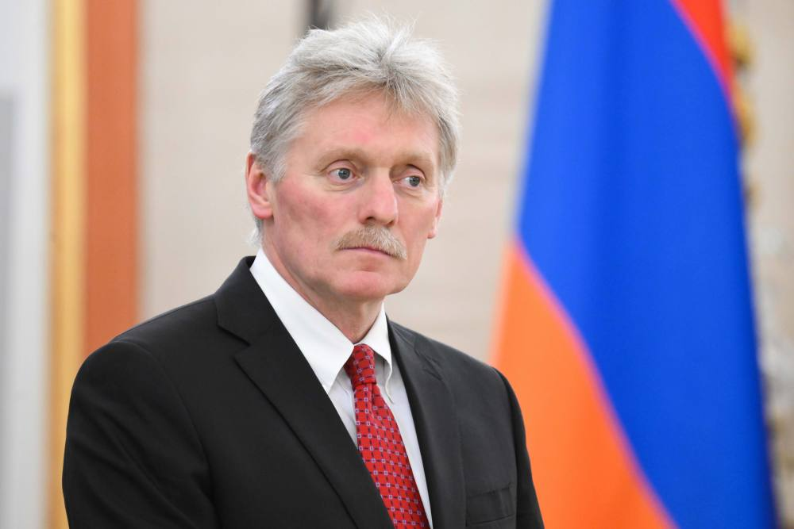

# 俄总统新闻秘书：俄方愿就核武器问题与美方对话，但不接受“说教”

（观察者网讯）据路透社报道，当被问及与美国和西方国家就核武器问题进行战略对话的前景时，俄罗斯总统新闻秘书佩斯科夫8日表示，与美国就核武器问题进行战略对话“绝对有必要”，但此类谈判不可能在美国对俄罗斯“说教”的方式下进行。

_俄罗斯总统新闻秘书佩斯科夫（资料图）/ IC photo_

“此类对话当然是必要的。但是我们不能接受对话在一国对另一国说教的情况下进行，”佩斯科夫补充道，“我们认为对话是必要的，并且我们已经准备好开始对话。但截至目前为止，情况没有发生任何改变。”

此外，佩斯科夫指出，废止《欧洲常规武装力量条约》不会改变与美国的关系。

据此前报道，11月7日零时，俄罗斯完成了退出《欧洲常规武装力量条约》（CFE）的全部程序。

与此同时，与《欧洲常规武装力量条约》有关的另外两个具有法律约束力的协定也失去了效力，即1990年11月3日关于《华沙条约》缔约国常规武器和装备拥有程度最高水平的《布达佩斯协定》，以及1996年5月31日的《首届〈欧洲常规武装力量〉及〈关于人员力量谈判的最后草案〉的评估会议的最后文件》（简称《侧翼文件》）。

俄罗斯外交部发布的声明指出，这份早在2007年就已经失去意义的文件，终于成为了历史，俄罗斯认为目前不可能与北约国家签署军备控制协议。

《欧洲常规武装力量条约》是在冷战末期由北约和华约两大军事集团共同制定的一项旨在削减双方在欧洲地区常规武装力量的条约。该条约由北约组织（16国）和华约组织（6国）的22国首脑于1990年11月19日在巴黎签署，1992年生效，无限期有效。

俄新社称，《欧洲常规武装力量条约》是为建立一个体系，来限制常规武器的数量，包括：坦克、装甲战车、火炮、战斗机和攻击直升机等。

**本文系观察者网独家稿件，未经授权，不得转载。**

