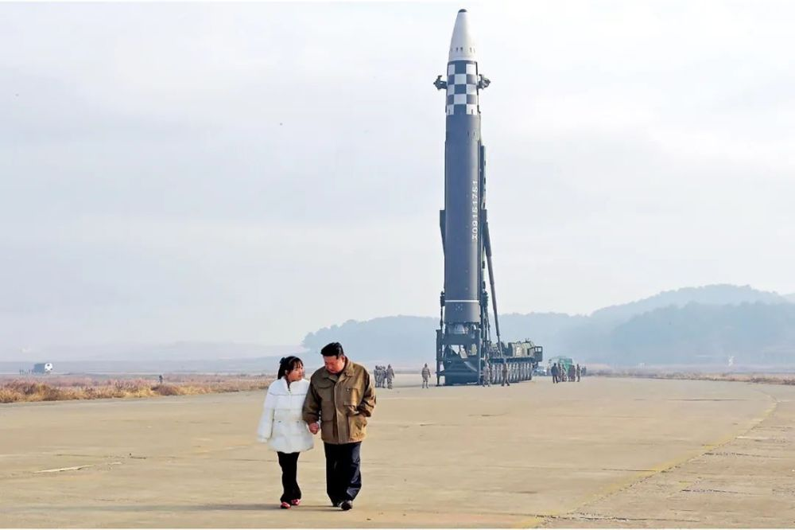

# 朝鲜首个导弹工业节，适逢金正恩女儿首次亮相周年

据朝中社11月5日消息，在朝鲜最高领导人金正恩携女儿现场指导“火星炮-17”型洲际弹道导弹试射一周年来临之际，朝鲜最高人民会议常任委员会常务会议近日表决通过法令，将11月18日定为朝鲜“导弹工业节”。

朝中社报道称，设置该节日是为了将这个“值得大书特书的大事变的历史之日永远载入史册”。2022年11月18日，金正恩“携心爱的女儿和女士亲临”试射场，见证了朝鲜“最强洲际弹道导弹”试射成功。这也是朝鲜方面首次就金正恩女儿公开露面进行报道。

韩国联合参谋本部称，正密切注意朝鲜利用新节日契机“挑衅”。韩联社则猜测，朝鲜或利用该时机进行军事侦察卫星试射。

今年5月、8月，朝鲜两次在西海卫星发射场试射军事侦察卫星失败。金正恩访问俄罗斯谈论“航天合作”后，朝鲜于10月再次发布试射预告，但并未发射。进入11月，韩美军方称西海卫星发射场的卫星图像显示“万事俱备”。

_2022年11月18日，朝鲜平壤，朝鲜领导人金正恩携女儿在“火星炮-17”洲际弹道导弹试射现场。图/视觉中国_

不过，从过往历史看，朝鲜设置纪念节日并非新鲜事。2021年，朝鲜发行的部分官方日历将11月29日标注为“火箭工业节”，以纪念2017年的“火星炮-15”洲际弹道导弹试射。但也有一些官方日历未标注该节日。后来，朝鲜并未举行特殊纪念活动，2022年日历也未再出现该节日。值得注意的是，早在2012年，11月29日就被确定为“航空节”。

每逢“航空节”和“海军节”，朝鲜空军、海军都会举行相应纪念活动，但庆祝规模远不如建军节、先军节、战胜节等重大纪念日，金正恩也并非年年出席。不过，随着朝鲜半岛紧张局势自2022年中以来不断升级，金正恩亲自出席了去年的航空节和今年的海军节纪念活动。

同样是在半岛局势紧张的背景下，今年2月，朝鲜将原本隶属于军需工业部的火箭工业部门独立设置为“导弹总局”，由国防科学院原院长张昌河出任局长，并授予军旗，提升到和各军兵种相当的独立地位。金正恩不仅多次携妻子、女儿、妹妹视察指导导弹总局发射工作，携女儿和发射连官兵合影，还授予“火星炮-17”发射车“共和国英雄”称号。有这些“前情提要”，朝鲜立法设置“导弹工业节”也在情理之中。

不过，考虑到军事侦察卫星发射属于原宇宙开发局的业务，且该机构今年9月刚刚升级为航空航天技术总局，与导弹总局平级，朝鲜特意为“导弹工业节”试射军事侦察卫星的概率并不大。

更值得注意的是“导弹工业节”的宣示意义。2021年1月，在朝鲜部分官方日历印上“火箭工业节”时，金正恩在劳动党第八次代表大会上重新将“完成国家核力量建设大业”作为未来五年建设“必须首先攻占的战略性制高点”。此后，八大提出的一系列国防建设任务不断被具体化。作为朝鲜最重要的核载具，洲际弹道导弹的打击范围、机动性和生存能力都是金正恩关注的重点。

到2023年，八大的“五年计划”进程过半。今年以来，金正恩在公开讲话中多次总结三年来国防科研工作的成败得失。其中，“核武库倍增”计划实现，“火星炮-17”洲际弹道导弹被韩美军方研判为“确有战斗力”，有助于提高洲际导弹生存能力的液体燃料研发、发射车研发等工作均取得成功，成为朝鲜对外宣示“有核国家”地位的“底气”。

因此，朝中社在报道中强调，设置“导弹工业节”就是“向全世界显示世界核强国、最强洲际弹道导弹拥有国的威仪”。分析认为，随着核武库建设工作宣告“成功”，未来一段时间朝鲜可能将更多力量集中于金正恩近期强调的、尚未完成的八大军工任务，如军事侦察卫星改进和试射，常规武器研发，水下武器平台改造等。不过，这是否意味着朝鲜的核武器研发周期已“告一段落”，还有待观察。

杂志标题：朝鲜新设“导弹工业节”

作者：曹然

