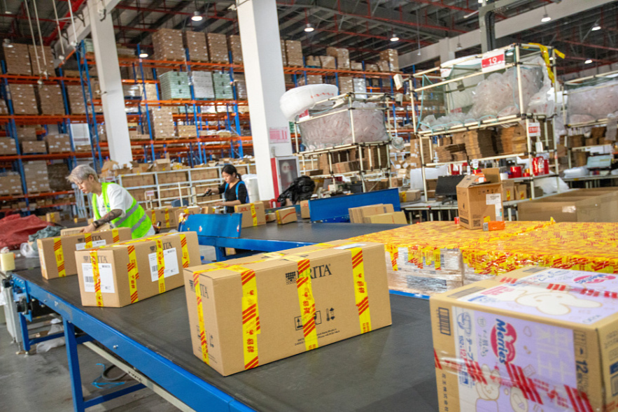

# 电商四小龙出海大战：小商家躺着赚钱的时代过去了

 _来源：视觉中国_

作者|张睿

编辑|康晓

出品|深网.小满工作室

“做跨境电商最重要的是供应链、仓储物流、运营管理。虽然现在小商家在平台上没有主动竞价权和推广的权利，只要不踩平台的红线和雷区，利润率不会比传统电商低。因为物流、推广营销都不需要商家操心，只要专注地做好供货、选品就够了。”一位多年从事跨境电商业务的商家对《深网》表示。

去年9月，拼多多推出跨境电商平台Temu，与亚马逊、速卖通等跨境电商平台上商家自主经营的模式不同，Temu采用全托管模式，即商家只需将货发到Temu的国内中转仓，剩下物流、推广、投流等由Temu平台全负责。

据《深网》获悉，目前，速卖通、SHEIN、TikTok
Shop等国内四大跨境电商平台都相继推出了全托管模式。这意味着，发展了20多年的跨境电商又一次冲破原有的旧秩序，回到同一竞争原点。

纵观“电商出海四小龙”的发展历程，一部中国外贸变迁的叙事被一层层揭开。

“富二代”速卖通为跨境电商打了个样

很长一段时间，阿里的海外业务板块各自为营，直至蒋凡的“加入”。

在跨境电商领域，从阿里巴巴内部孵化出来的速卖通是一位名副其实的“富二代”，既有阿里巴巴资源的加持，又赶上了跨境电商行业早期的红利。

将时间拨回2010年，速卖通的成立既是当时商业环境使然，也有昔日竞争对手ebay的刺激。

2008年席卷全球的金融危机导致海外买家的订单大幅下降。彼时，在中国败给淘宝的ebay看到跨境电商的机会。这也让时刻关注ebay动向的阿里巴巴萌生了推出跨境电商平台的想法。

2009年，阿里巴巴从谷歌挖来Google
Checkout（现在的谷歌钱包）团队的技术经理龚义涛成为跨境产品技术负责人。一年后，速卖通（AliExpress）正式上线，主要以小额批发白牌商品为主。

纵观2022年之前速卖通的发展路径，“海外淘宝版”的样子逐渐显现。

从2013年开始，速卖通从小额批发全面转向To C模式，这一阶段，卖家只需身份证即可注册开店。为了拓展商品SKU，速卖通还开通了淘代销，与淘宝卖家后台打通。

同时期，速卖通大量招募中国品牌，并在一些重点国家如俄罗斯等做本地化的投入。据公开资料显示，2014年7月速卖通就已成为最受俄罗斯用户欢迎的十大网站之一，并在巴西市场占有一定份额。

不过速卖通的快速发展在2015年被按下暂停键。随着C2C模式的快速发展，速卖通不得不面对平台上日益增多的假冒伪劣产品和消费者投诉。当年7月，速卖通就停止了淘代销服务，随后开始向B2C平台转型。

2016年4月初，速卖通要求所有商家必须以企业身份入驻、不再允许个体商家入驻；而到2016下半年，速卖通要求企业身份的商家入驻必须有品牌。自此，速卖通彻底从C2C平台转型为B2C平台。

在向B2C平台转型的同时，阿里巴巴于2016年4月首次注资Lazada，以10亿美元收购该公司51%股份，迈出向东南亚发展的关键一步。自此，主攻C端业务的速卖通和Lazada及专注B端业务的国际站共同构成了阿里的海外业务版图。

2021年年底，此前负责淘天的蒋凡被派往海外数字商业板块。上任后的蒋凡开始梳理海外业务的多个板块。据《晚点
LatePost》报道，蒋凡上任后将跨境业务相关的所有团队统一到速卖通，交由原淘宝行业负责人张凯夫统一管理。由Lazada统一主导全球各市场的本地化电商运营，比如速卖通在欧洲的本地化团队就有一部分划归到了Lazada。

2022年12月，阿里巴巴推出专注于欧洲市场本地化运营的电商平台Miravia，该团队由原速卖通的欧洲团队部分员工和Lazada本地化运营、技术和产品团队融合而成。自此，阿里巴巴出海的C端业务又补上了Miravia这一平台。

与Lazada和Miravia专注本地化运营不同，速卖通专注跨境业务。

去年年底，速卖通推出全托管服务。与Temu主推爆品模式不同，速卖通的全托管模式仍采取了店铺形式。

在亚马逊夹缝里成长起来的独立站 SHEIN

就在阿里巴巴筹备创办速卖通的同时，主要经营女性快时尚服装的许仰天也开始了跨境电商B2C创业，并创立了独立站SHEIN。

独立站是相对于亚马逊、速卖通等第三方跨境电商平台型公司而言。在独立站模式下，商家可以直接面向消费者，自主制定规则，不受第三方平台管辖。但缺点是缺乏流量，在创办早期，需要为独立站引流和推广，这需要大量资金的支撑和投入。

与ZARA创始人阿曼西奥·奥尔特加·高纳类似，SHEIN的创始人许仰天极其低调，对于其早期创业经历，行业众说纷纭。

打开SHEIN的官网可以发现，SHEIN所有资料以英文显示，仅看官网很难看出这是一家由中国人创办的公司。对于公司介绍，SHEIN官网只有寥寥几句介绍：“SHEIN创办于2012年，由电子商务专家Chris
Xu创办，是一家 B2C 快时尚电子零售商”。

从商品价格上看，TEMU和SHEIN都主打极致性价比。除SHEIN这一主品牌外，目前SHEIN已经布局了近10多个其他品牌，例如定位高端性价比的MOTF，彩妆品牌
SHEGLAM，宠物品牌PETSIN等。

与兰亭集势等最早一批跨境电商公司“年少成名”不同，SHEIN真正进入普罗大众的视野源于2022年上半年。

有媒体报道，2022年4月，跨境电商SHEIN正在筹集最新一轮至少10亿美元的融资，而该轮融资后，SHEIN的估值可能高达1000亿美元。当时，在待上市的中国互联网公司中，只有蚂蚁金服、字节跳动这两家公司的估值在一千亿以上。

当然，SHEIN的成长和亚马逊近几年以违规为由大幅清退中国的商家不无关系。

纵观SHEIN的发展历史，SHEIN吃到了国外网红及谷歌、Facebook、Instagram等早期流量红利，是一家在亚马逊这一“流量集中营”眼皮底下，成长出来的带有品牌特性的独立站。

据《晚点LatePost》报道，2010 年与SHEIN合作的一位网红当时只需 30 美元，到了 2016 年则要价 5 万美元。

获取流量仅是SHEIN等独立站崛起的第一步，利用强大的供应链管理能力打造极致性价比，实现了其在美国、中东、印度、拉美等市场销量的爆发，才是SHEIN快速崛起的关键因素。

但SHEIN的发展不会止步于独立站。从去年开始，SHEIN通过ODM模式、OEM模式、OBM模式引入更多的商家，逐步从独立站向平台升级。

今年4月份，SHENI在巴西试水平台化模式，随后在美国市场及全球市场推出。5月4日，SHEIN在官网宣布将在全球市场推进平台模式 SHEIN
Marketplace，允许三方商家入驻，在平台上经营自己的店铺和品牌。这意味着，SHEIN将从此前的独立站模式走向亚马逊模式，也将和亚马逊、速卖通、Temu等电商巨头直接竞争。

有知情人士透露，前期SHEIN的招商经理主要从亚马逊、沃尔玛、独立站等平台邀请有经营经验的商家入驻。

“SHEIN对第三方商家上架商品的版权问题审核严格。”有商家对《深网》透露。

推出平台化模式后，SHEIN随后也推出全托管模式吸引全球卖家入驻。不过与SHEIN模式变化相比，市场更关注SHEIN的上市进程。

最近半年，资本市场多次传出SHEIN将赴美IPO，虽然SHEIN官方一再否认，但这并没有妨碍“跨境电商最大规模IPO”传言的轮番流出。

只有政策可以“抵挡”的TikTok Shop

就在市场还在猜测SHEIN何时赴美IPO时，跨境电商平台TikTok Shop却因一纸政令放缓了其在东南亚市场的步伐。

印度尼西亚是TikTok电商全球征战的起点，也一度是其在东南亚的最大市场。据公开资料显示，2022年，TikTok跨境电商在东南亚市场月均复合增长90%，而亚马逊同期增速仅9%。

据公开报道，9月底，印尼总统佐科·维多多在内阁会议上正式禁止“像TikTok这样的”社媒平台进行直接销售交易，并称该法规将纳入修订后的印尼贸易部第50/2020号条例。截至目前，印尼TikTok
Shop（TikTok小店）已正式关停。

一纸政令再次将聚光灯打在TikTok上。2017年年底，TikTok正式出海，2年后TikTok便覆盖了150个国家和地区，多次登顶App
Store下载量首位。

2021年2月，TikTok
Shop正式上线，截至目前TikTok小店已经陆续开通了印尼、英国、马来西亚、泰国、菲律宾、越南、新加坡、美国8个国家市场。除印度尼西亚和美国仅支持本土注册外，其他国家均支持本土+跨境两种注册方式。

一位出海创业者曾对《晚点LatePost》阐述，他认为在中国的出海公司中，TikTok 就是无冕之王，只有政策可以纠正他。

对于关闭TikTok
Shop，印尼合作社和中小企业创意经济赋权部特别工作人员曾表示，“随着TikTok平台进入印尼，我们需要保护我们本地的中小微企业和本地平台提供商。”

问题是TikTok在印尼一直是本土运营模式，其也在多个场合反复声明：TikTok从未、也不会在印尼推出跨境电商业务。

在印尼和美国之外的海外市场，TikTok
Shop已在沙特和英国推出全托管模式，鼓励OBM（代工厂经营自有品牌）、商家发挥供应链和货品优势，实现货品出海，品类涵盖服饰、家居、户外、美妆、家电等。

赶上工贸一体化红利的Temu

速卖通、SHENI、TikTokShop纷纷开启全托管模式，一是因为Temu确实靠这一模式快速跻身“电商出海四小龙”
之列，更重要的是，传统的商家自营模式已经无法满足工厂发展的需求，工贸一体化正好解决了工厂寻找新商业模式的需要。

全托管模式极大的减低了商家入门跨境电商的门槛，再叠加Temu在海外重金投放广告及购买流量，成立仅一年多的Temu就迅速展露头角，与速卖通、SHEIN、TikTok
Shop共同跻身“电商出海四小龙” 之列。

据公开资料显示，从去年9月正式上线至今，Temu已在全球 47 个国家上线， APP被下载 2 亿次。而据《 晚点LatePost》报道，2023
年初，Temu 曾规划了全球全年 160 亿美元的 GMV 目标，这一数字与 SHEIN 2022 年在美国市场完成的 GMV 相当。

传统外贸的流程大致可以分为工厂——外贸商——海外采购商——分销——海外零售商——消费者等各个环节。受三年疫情影响，部分行业例如户外庭院类产品的海外市场有所萎缩，工厂要维持生存，需要向C端转向，直接和用户对接。

由于专注TOB渠道和TOC渠道完全是两种路径，部分没有线上运营经验的工厂主很难直接往亚马逊等B2C平台转向，而全托管模式恰好解决了部分工厂主的这一痛点。

“TOC渠道专注客户的体验问题，TOB更专注专业和国际认证等。我们B端的生意也没有停止，但为了增加利润，专门开辟了一个工厂的流水线给Temu供货。”在深圳拥有多个电子工厂的慕先生对《深网》透露。

慕先生主要做监控、摄像头等产品，2014年创办了自己的工厂。最近两年，由于外贸订单一直缩水，慕先生家人曾入驻某国际B2C平台，只做零售。但由于没有线上运营经验，亏了好几十万。

“在某传统的B2C平台，我们要承担头程运费、尾程运费、仓储费、投流费等。更重要的是，如果海外仓的商品有质量问题，我们大多会选择放弃这个商品，因为退回来的关税太高了。”慕先生解释。

在利润率方面，多位做工贸一体的商家都对《深网》表示，Temu等全托管平台会给工厂留有一定毛利率，不同行业的毛利率有所不同。

“传统外贸主要跑量，有8%的净利润，亚马逊能达到30%，TEMU走量净利润能达到15%—20%。”做假睫毛生意的王先生对《深网》透露。

全托管模式也不是“万金油”

Temu、SHEIN、TikTok
Shop等高速成长都离不开背后庞大供应商群体的支持。但从定价、清退、售后等多个环节来看，跨境电商“四小龙”要做到持续低价，需要和供应商建立双赢的合作关系，保证源头工厂及中小商家有利可图。

在平台全托管的跨境电商链条里，商家的备货量决定了平台SKU的丰富度，而平台的定价权影响了平台的交易量和未来的利润率。

由于在全托管模式中，上游供应商群体没有定价权，部分中小商家的获利空间被严重压缩，想躺着赚钱也并非易事。“前期我们上全托管模式是为了清库存，但这仅是我们基本需求，如果账面长期打不平甚至亏钱，慢慢就没了加入全托管模式的热情了。”有商家对《深网》表示。

此外，还有供应商反馈，在同质化严重的品类，全托管模式的平台会持续把成本压到极致。比如，Temu的买手在看到爆款后会寻找并引入成本更低的供货商。在这个趋势下，没有自主研发能力及工厂的中小商家会被逐步淘汰。

“想在Temu等全托管模式的跨境电商平台立足，需要研究海外用户的需求和市场的流行元素，跟工厂配合，自主研发和升级产品，最终目的是做成品牌。”在湖南在做美妆工具、且没有工厂的戴女士对《深网》透露。

据戴女士透露，入驻Temu后，她和团队一直处于测品、试错、更新产品的状态。“不少商品品类都是通货，或许一个商品的质量就有十个等级，如果一个贸易商在工厂里以低价拿货，高价卖出，肯定会被平台淘汰。”

国内强大的产业带和供应链优势是支撑跨境电商快速发展的基础。从长远来看，能否和供应链合作共赢、帮助工厂和商家赚取利润，是决战全托管模式的根本。

为了保证上游供应链的利润率，速卖通已经推出了“半托管”模式，即商家自主定价、自主销售，平台提供物流仓配、专属营销活动、逆向退货等运营解决方案。

无论是全托管模式还是半托管模式，跨境电商竞争的下半场已经到来。

