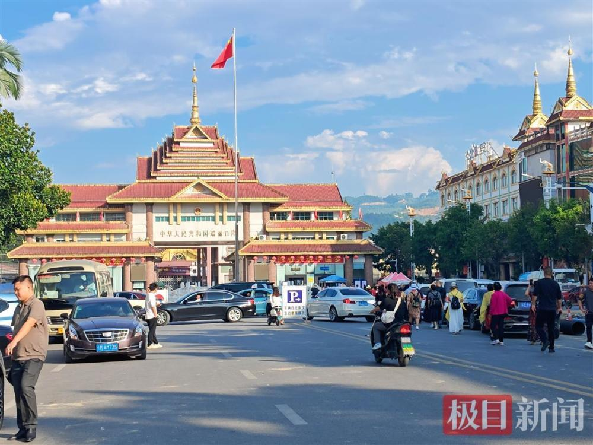
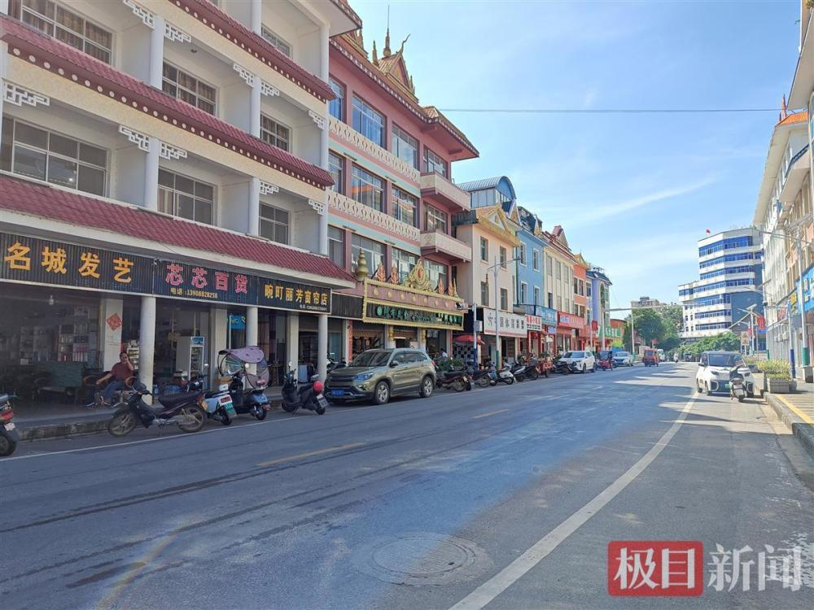
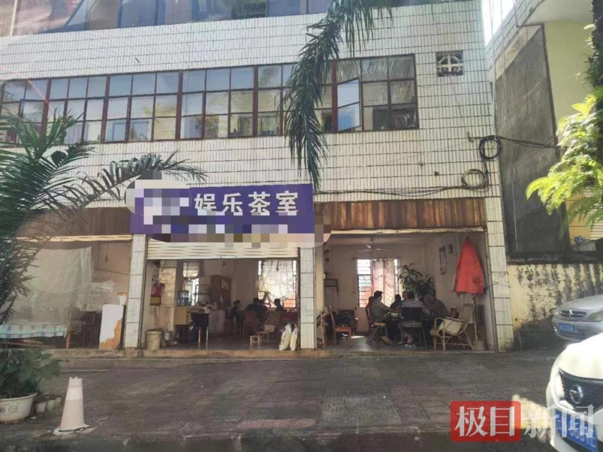
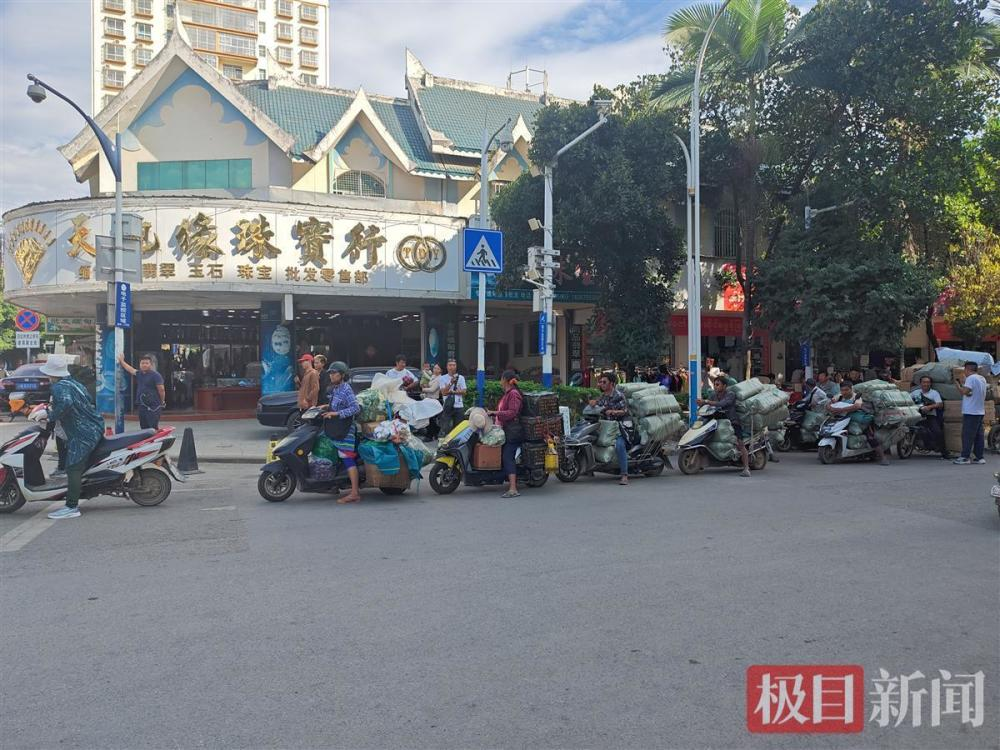
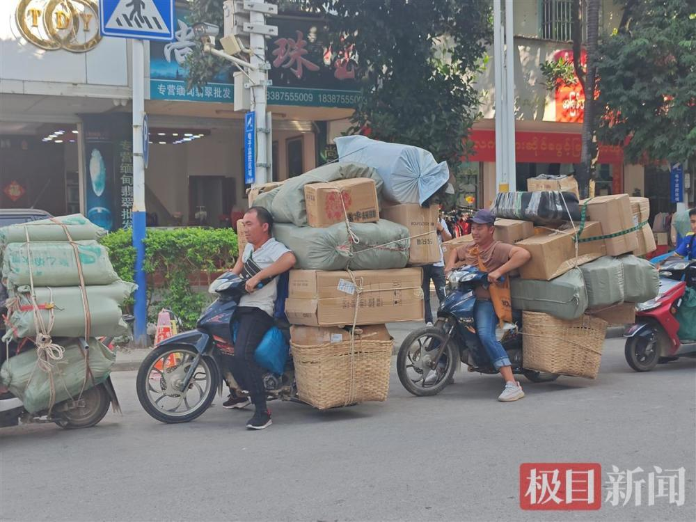
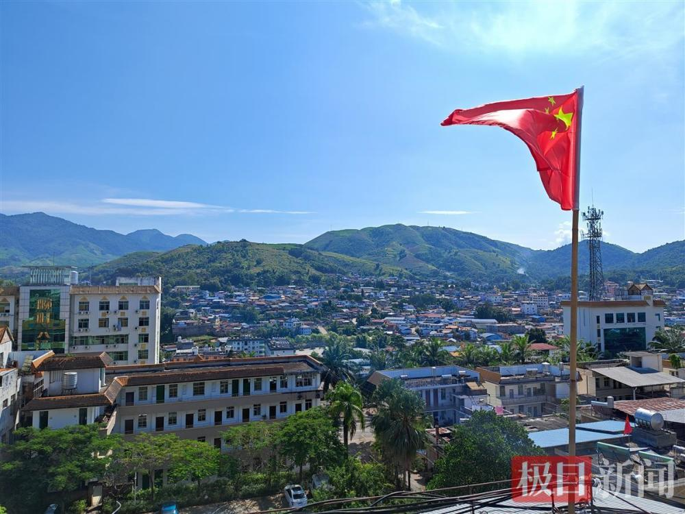

# 缅北战事下的中缅边境：商户陆续返回畹町开门营业，瑞丽口岸旅游火热

极目新闻记者 丁伟 李贤诚

10月27日起，缅甸北部激战不断，位于中缅边境的云南瑞丽市畹町镇受到波及，镇上学校停课、商铺停业，不少民众选择暂时离开。

一周多后，离开畹町的商户和民众渐渐返回，镇上的店铺也陆续开业，大家说已多日未闻枪炮声，生活正慢慢地恢复平常。

_瑞丽口岸_

而距畹町约30公里外的瑞丽口岸，自始至终几乎未受此轮缅北战火影响，中缅两地边民往来如初。每到傍晚，口岸外排起满载货物的摩托车商队，这些缅甸边民忙着将从中国采购的商品运回国内。

**商户陆续返回畹町开门营业**

中国西南边陲小镇畹町，隶属于云南省德宏傣族景颇族自治州瑞丽市，与缅甸北部的棒赛（九谷）镇区仅一河之隔。

10月27日，缅北腊戌、贵慨等多地的缅军军事据点遭武装袭击并爆发交火，战事激烈，此次袭击由缅甸民族民主同盟军主导。冲突持续数日，有三个政府控制区失守。受缅北战事影响，10月28日起，畹町三所学校停课，街上商铺歇业，部分居民选择主动离开。

一个多星期之后，11月7日，畹町镇暂未恢复往日的喧闹，部分商户虽陆续返回开门营业，但主街上的一些营业场所和机构仍张贴着停业的公告，大门紧闭。镇上的几家加油站也处于关闭状态，加油机四周围起了厚厚的沙袋。

_畹町镇街头_

畹町很小，面积仅有103平方公里，曾是全国最小的边境城市。1999年1月1日，国务院批准撤销畹町市，将其行政区域并入瑞丽市。

整个畹町镇大致有三条主街，民主街、建设路、畹江路。在民主街上，路口停着几辆载客的三轮车，暖阳下，车主们打着盹等着拉活儿。商户们阔别多日，相互攀谈着近几日的见闻，但话题始终离不开缅北的战事，有人说，“已经有四五日未曾听到枪炮声，终于能睡个安稳觉。”

民主街南侧，一路上常能见到矗立着有四五米高的深灰色铁门，上方拉着铁丝网。从铁门另一侧越过一条小河，便是缅甸境内。近段时间，不少缅甸居民沿着河边“安营扎寨”，躲避战火，他们认为挨近中国国境更为安全。

建设路上挺立着两排高大的棕榈树，两侧大多是居民小区。街边，一家老年人棋牌娱乐室已经开业，里面凑齐了两三桌老牌友，相谈甚欢。

_畹町街头一家茶娱室_

多年来，年近六旬的老赵一直在建设路北侧的一条小巷里开着早点摊，近日因边境战事，小摊暂时歇业，平日里忙碌的老赵这段时间也赋闲在家。老赵祖籍在云南保山市龙陵县，从他爷爷那辈起便来到畹町谋生，他打小在这座边境小镇长大，缅北的炮火声对他来说不算陌生。从战事开始至今，他们一家人始终未离开畹町到别处躲避。在老赵印象中，这次缅北战事算是规模较大的一次。

“枪炮声和过年放鞭炮差不多，听习惯就不害怕了。这段时间，家里人都很少出门，更不敢跑到楼顶观看对岸的战火，毕竟子弹不长眼。”老赵说，现在镇上的商户渐渐地回来了，但还有很多单位尚未上班，人流量比不得过去，他准备过段时间再营业。

**瑞丽口岸边民往来频繁旅游火热**

不同于畹町的安静，瑞丽口岸附近则颇为热闹，似乎不受战事任何影响。

瑞丽口岸是中国对缅甸贸易最大的陆地口岸，经过这里，缅甸人可来中国打工、购物，中国人可到缅甸旅游、经商。据统计，自2023年1月8日正式恢复客运通关以来，瑞丽口岸日均流量达13300余人。

_瑞丽中缅街排队出关的边民_

11月6日下午，极目新闻记者来到瑞丽口岸，只见这里一片繁忙景象，对面等待办理手续进关的缅甸民众排起了长队，不时有人通关来到中国。马路上出租车一辆接着一辆排着长队，司机师傅热情地招呼顾客，国门广场上不断有来自全国各地的游客打卡、拍照。

一位瑞丽当地居民告诉极目新闻记者，自中缅双方正式恢复客运通关以来，瑞丽口岸几乎每天都是如此，对面缅甸民众排长队等待入关，“他们有的是来中国打工的，有的是来购物进货的。”记者在现场看到，在国门广场一侧还有招工摊位，正等待通关的缅甸人前来应聘。

瑞丽口岸是两边人民往来的重要关口，也是很多游客必到的打卡地，多辆旅游大巴停在国门广场外，导游举着彩旗带着游客走到国门前，大家站位摆造型合影留念。来自浙江的游客朱女士告诉极目新闻记者，她是第一次来瑞丽，也是第一次到国门，“在手机上看到有新闻说，对面缅甸发生军事冲突，但你看这里游客这么多，还有不少缅甸人，没感觉有什么战火味。”朱女士说，按照行程她会在云南停留几天，接下来要去瑞丽的特色景点“一寨两国”，还会去芒市的勐焕大金塔。

国门广场附近有一条中缅街，今年1月口岸全面恢复通关之后，不少缅甸商人又回到这里做生意。市场里，来自缅甸、泰国等周边国家的零食与日用品琳琅满目，商户的吆喝声、讨价还价声不绝。

_等待出关的缅甸边民_

黄英（化名）是一位缅甸商贩，她正骑着摩托车等待出关回缅甸，摩托车上载满了各种蔬菜，有生菜、西红柿、茄子、香菜等等。黄英说，她家就在口岸另一侧的缅甸木姐，骑行几公里即可到达，每天早上她都会空车排队从缅甸进入中国，下午会载着一车货物从中国回到缅甸，几乎天天如此。“我们那里受战事影响很小，打仗的地方主要是畹町对面的棒赛。”黄英夸赞中国这边的蔬菜种类多，新鲜，“还好看。”

**中缅边民盼缅北早日止战恢复和平**

据中国驻缅甸大使馆11月6日发布的消息，中国外交部部长助理农融3日至5日访问缅甸期间，会见了缅甸副总理兼外长丹穗，并同缅甸副外长伦乌举行外交磋商。

农融强调，作为友好邻邦，中方真诚希望缅甸尽快恢复稳定和发展，支持缅各方在宪法和法律框架下妥处分歧，通过对话实现和解。要求缅方同中方配合维护中缅边境稳定、切实保障中方边民人身和财产安全，采取有效措施强化中国在缅人员、机构和项目安保。中方愿同缅方合作持续打击网赌电诈等跨境犯罪。

早日停火，实现真正的和平，是众多缅甸民众的期盼。彭蕙（化名）的老家在缅甸腊戌，她从6岁开始便随父母在瑞丽生活，目前在瑞丽的一家酒店当服务员。彭蕙对记者表示，她虽然一直生活在中国，但缅甸还有她的家人、亲戚和朋友，她的户口也还在缅甸。以前从瑞丽出发，只需四五个小时便可到达老家，但现在因为战事，她的归途遥遥无期。

“那边打仗很厉害的，一座大桥被炸塌了，公路也被挖断了，有的地方还堆起了土堆。”彭蕙说，自疫情以来，她已3年多没有回过缅甸老家，原本计划近期回去一趟，但当地发生战事，她的回乡探亲计划只能无限期搁置，“我也不敢回去，怕回去了回不来。”

“3年多，快4年了，我也想家。”彭蕙说，她不知道战事因何而起，也不知道战事何时才能结束，作为一个普通老百姓，唯一能做的就只有期盼和等待，希望战事早点结束，家乡恢复和平，等待有朝一日能回缅甸和家人团聚。

_不远处便是缅甸_

如今，位于中缅边境的畹町，炮火声已渐渐淡去。

在一处背街小巷里，孙荣（化名）正在打理自家的花草，她家的院里种满了花，院外路边的空地上也种上了朝天椒和桑树。孙荣的老家在云南大理，多年前随当兵的父亲来到畹町。她说她受不了大理冬天的寒冷和那里的大风，她更喜欢德宏南部的气候。

谈起近期的缅北战事，孙荣说，她家所在的位置距边境线不到百米的距离，有时也会听到对岸的枪炮声。“但我不怕，有什么好怕的，以前也发生过这样的情况，没听说伤到过中国人。”孙荣表示，几天前有邻居暂避到了芒市或瑞丽，现在也正陆陆续续地回到畹町，她相信战争终会结束。

（图片由极目新闻记者丁伟 李贤诚摄）

（来源：极目新闻）

