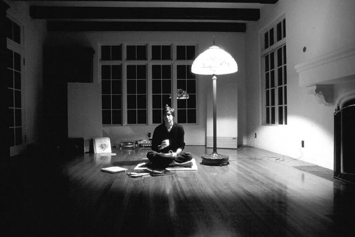

# 释永信到访Meta、苹果和谷歌，禅宗已成硅谷新咖啡因？｜昙视点

作者/徐昙

11月初，少林寺方丈释永信造访旧金山Meta（前身为Facebook）总部，还发表了演讲《禅宗遇到 AI》。引发不小的关注。

为什么青灯古佛的少林寺和硅谷高科技会产生关联呢？

可以从释永信的演讲中感受一下：

1、禅宗是强调修禅者通过自身的精进和努力，逐渐提升觉悟的境界。

2、释永信还讲了少林寺在数字化转型方面的尝试。

少林寺一直以来都积极拥抱科技，利用数字化技术来传承和推广佛教文化。他们开发了一款名为“少林云”的应用程序，通过 VR
技术，让全球的信徒和爱好者可以身临其境地体验少林寺的文化和历史。

释永信事实上讲了两个重点：禅宗在管理上的重要性，寺庙也在拥抱高科技。

看到这，你还能把少林寺看作一个位于河南登封的封闭的寺庙吗。

东方禅宗引入西方的管理

事实上，释永信是受邀到访硅谷顶尖公司最多的人物了。2014年3月20日，释永信就曾到访谷歌和苹果，留下一句评价“谷歌如功夫，苹果如禅意。”

释永信在不同风格的公司精准地施以不同的交流活动。

在“到处充满了快乐和生活气息”的谷歌，六名身着灰色袈裟的少林武僧在台上表演了精彩的少林Kongfu，音乐却是电影《加勒比海盗》中的配乐《他是一个海盗》，这种中外文化的混搭既有喜感又容易被接纳。

在苹果，释永信和苹果CEO库克面对面交流。释永信评价，苹果公司满眼是简单和纯粹，无一余物，一尘不染，犹如禅境。

Google、苹果、Meta之所以邀请释永信，是因为少林寺是中国古老禅宗的发源地之一。

而Google是设有禅修中心最多的企业，一共有9个禅修中心。Google每一位员工都可以到禅修中心去修行。公司鼓励每一位员工在这个世界浮躁的环境中，通过正念的禅修获得心灵的平静。

禅修是修行，也是管理。

学习型组织之父彼得·圣吉有一个著名的理念：“三流管理者学习管理知识，二流管理者学习管理技巧，一流管理者修炼管理心智”。

就像初创公司一般靠产品抢夺市场，公司成长到一定阶段靠机制、组织能力，规模再大靠的是企业文化，本质是对心的管理。禅既是心。

很多企业家把禅修当作人生的哲学和企业治理的哲学，典型的有松下幸之助、稻盛和夫，乔布斯等。

苹果也有禅修室，包括早年乔布斯的办公室。电影《史蒂夫·乔布斯》里曾还原了乔布斯的办公室——几乎没有办公设备，只有一个立式台灯，和一只坐垫。据说库克也每天至少进行15分钟的禅修。

_图说：电影《史蒂夫·乔布斯》里乔布斯在办公室冥想的情景。_

乔布斯早年去印度修行影响了他的一生，被认为把握了“从天堂洞察人间”无上的商业智慧，从而创造了苹果。据说乔布斯每天坐禅结束时，会对镜自问：“如今天是我的最后日子，原计划今天的事我还愿意做吗？”从而审视每天所作所为对人生的意义。

Meta（前身为Facebook）的创始人扎克伯格也受到过乔布斯的影响。在早年Facebook前途不明的时期，乔布斯曾建议他拜访印度的一座寺庙，“以重新认识公司的使命”。
扎克伯格还因此效仿乔布斯在印度游历了一段时间。

禅修在硅谷的盛行，与其说“禅修是硅谷新的咖啡因”，不如说是硅谷把东方的智慧和哲学引入到了西方的管理中。

“经营之神”松下幸之助曾说“像我这样才能的人在这个世界上比比皆是，我之所以能成功，其中关键一点就是对禅的领悟。”

稻盛和夫也承认曾受到过松下幸之助的影响，稻盛和夫许多经营理念被评为大道至简。

许多公司的老板号称信孚稻盛和夫，但在经营上注重术，不注重道，取经都希望要攻略，没拿到操作性的东西就觉得没学到真本事。是否真的领悟了稻盛和夫的管理哲学让人怀疑。

少林寺堪比麦当劳

释永信这次到访Meta，让人惊讶的是其意识的超前性。他在演讲中谈到，“当古老的东方禅宗思想遇到21世纪尖端技术的人工智能，人文与科技的交汇势必会给当今世界的人们带来新的启示。”

“当禅宗遇到人工智能时会发生什么？技术进步能否取代道德伦理进步？人工智能具有强大的数据处理和分析能力，并且经由程序和算法可能会表现出类似于人类的感知，但是人工智能并不能具备我们禅宗所讲的觉悟的心性。”

这位1987年成为少林寺住持，1999年成为少林寺方丈的出家人，一直处于巨大的争议中。归根结底，释永信陷入舆论的漩涡，深层原因在于从来没有一位方丈要摸索传统寺庙生存与现代商业模式相融合的道路。

释永信谈高科技并不意外，要知道早在1996年，少林寺就申请了网站域名（shaolin.org.cn），而中国互联网先驱BAT在1998年后才创建（腾讯1998年创建，阿里巴巴1999年创建，百度2000年创建）。少林寺的超前意识可见一斑。

如果中国有一家机构像麦当劳一样真正的走向了全世界，那就是少林寺了。少林寺在澳洲、美国、英国、德国等全球建立了海外中心，业务涉及出版、教育、文化，就像一个跨国公司。“CEO”释永信矢志不渝地以商业化手段经营少林寺。

许多中国企业谈论可持续发展却鲜少成为百年老店，少林寺始建于北魏太和十九年(495年)，迄今已1500多年历史。释永信认为“消极避世从来都不是佛教真正的传统。为了少林寺的下一个1500年，我只能向前走”。非常坚定的入市思想。

如果释永信有雄心的话，或许可以像元代少林寺鼎盛时期的福裕方丈一样名满天下。

按理说，商业化的根本目的是商业收益，但是释永信账面上的月薪是700元，这就很难解释释永信的行为。

释永信说“我只是以商业的手段阻止少林寺被商业化”。少林寺是登封市赖以生存的财政命脉，以少林寺为龙头的旅游业收入占了登封市财政收入的1/3。多年前，面对少林寺上市的抉择时，释永信投了反对票。因为一旦上市，少林寺也就丧失了主导权。寺庙的追求和商业主体的追求是不一样的。

而所有行为的正义性取决于它的目的，商业化本身是为了商业目的，还是为了更好地弘扬佛法而进行商业化。

_《昙视点》是腾讯新闻出品，“媒体人+作家”徐昙主理的一档产经观察专栏——在众声喧哗中看到更专业和有趣的解读。_

