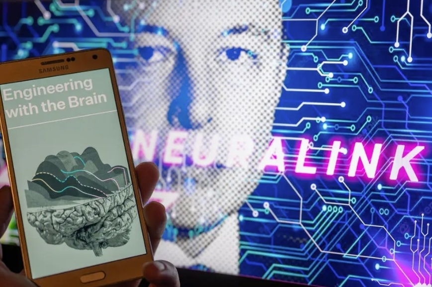
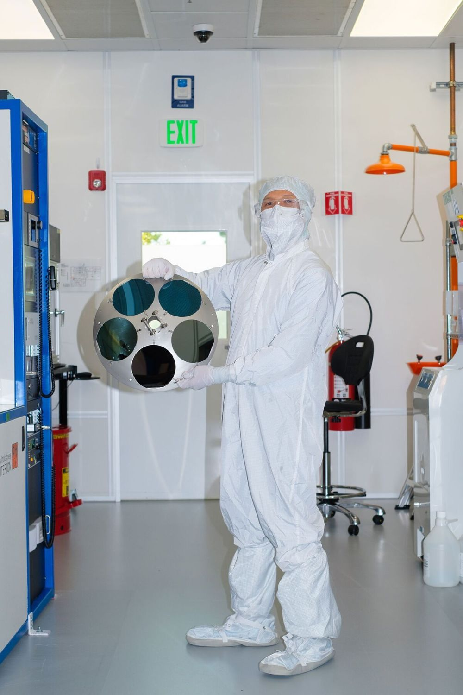

# 马斯克征召志愿者：需同意切除一块头骨，让芯片植入大脑

**划重点：**

  * _1_ 传记作家万斯透露，目前有数千人正排队等候植入马斯克脑机接口公司的大脑芯片。
  * _2_ 在过去两年间，Neuralink的机器人已经在动物身上完成了400多次植入试验。
  * _3_ 该公司预计，明年将进行11次人体植入手术，到2030年则进行超过2.2万次手术。
  * _4_ 马斯克希望能通过这种方式，实现人类与人工智能的共生。

腾讯科技讯 埃隆·马斯克（Elon Musk）的传记作者阿什利·万斯（Ashlee
Vance）周二撰文，宣称有数千人正在排队等待植入脑机接口创企Neuralink的大脑芯片。据悉，Neuralink已经在包括猪和猴子在内的各种动物实验对象上进行了400多次植入手术，但尚未将其设备植入人体。不过，马斯克希望加快进度，计划明年为11人进行手术，到2030年将为超过2.2万人进行植入手术。

不能像特斯拉和SpaceX那样搞砸人体试验

Neuralink正在为其首次人体临床试验寻找志愿者，这意味着该公司正在寻找愿意让外科医生切除他们一块头骨的人，这样大型机器人就可以将一系列电极和超细电线插入他们的大脑中。当机器人完成手术后，切掉的头骨碎片将被硬币大小的计算机取代。这台机器的工作将是阅读和分析人的大脑活动，然后将信息通过无线方式转发到附近的笔记本电脑或平板电脑上。

就此次人体试验而言，理想的候选人是四肢瘫痪的40岁以下成年人。这样的患者可能会将Neuralink的植入物插入到他们大脑的运动前皮质手旋钮区域，该区域控制着手、手腕和前臂。Neuralink的目标是证明该设备可以安全地从患者大脑的这一部位收集有用的数据，这是Neuralink努力将人的思维转换为计算机可以理解的指令的关键一步。

按照Neuralink的设想，任何人都将可以接受15分钟的机器人手术，然后称为人机混合体。这些半机械人将能够像基努·里维斯（Keanu
Reeves）在《黑客帝国》中所做的那样下载知识，或者将他们的思维上传到存储器中，甚至上传到其他人的大脑中。马斯克在2019年的第一次演示中表示：“这听起来会很奇怪，但最终我们将实现与人工智能的共生。”

Neuralink的试验令人兴奋不已。如果该公司产品如预期的那样发挥作用，以后的迭代可以帮助改善数百万患有瘫痪、中风以及听力和视力丧失患者的生活。与此同时，Neuralink的高调已经吸引投资者开始寻找下一个Neuralink。马斯克再一次重塑了整个行业，而这一次可能是最具变革性的。

在过去的三年里，Neuralink在硅谷和奥斯汀的设施及业务不断增长。但随着他们为人体试验做准备，成功的压力是连马斯克以前都没有见过的。毕竟，特斯拉花了很多年才实现汽车的批量生产，而SpaceX的最初三枚火箭也发生了爆炸。Neuralink特别项目主管希冯·齐利斯（Shivon
Zilis）表示，说到大脑，“我们不能搞砸前三个。在这个领域，我们没有这样的权力！”

长期目标是让数十亿人使用脑机接口技术释放人类潜力

2016年，马斯克与七名科学家利用1亿美元资金共同创立了Neuralink，这个项目引来了风险资本家的密切关注。自那以后，Neuralink已经筹集了超过5亿美元资金，其中今年筹资2.8亿美元。这种关注也帮助吸引了投资者对其他脑机接口努力的关注，包括长期存在的大学项目以及较新的初创公司。研究公司PitchBook的数据显示，去年有37家类似公司共筹集了超过5.6亿美元的资金。

这些企业中的大多数都有相同的首要目标，即制造一种可以离开实验室的大脑扫描设备。理想的植入物应该有足够的计算能力来记录和输入大量数据，并通过强大的无线信号传输数据。这一切都必须在使用尽可能少的电池电量的情况下完成，并且不能让设备运行过热，否则可能会刺激或伤害患者。除了硬件，脑机接口公司还需要机器学习软件技能支持，以执行成千上万的测试。

Neuralink的植入物隐于头皮之下，与头骨齐平。它配备了足够的计算能力，不仅仅可以处理思维和点击等任务。在不久的将来，这个想法将使高速打字和无缝使用光标成为可能。Neuralink还在研究一种辅助脊柱植入物，旨在恢复瘫痪患者的运动和感觉。Neuralink的联合创始人兼工程副总裁DJ
Seo说：“公司的短期目标是建立通用的大脑接口，帮助那些患有严重神经疾病和未得到医疗需求的人的自主能力。而长期目标是让数十亿人可以使用这项技术，并释放人类的潜力，超越我们的生物能力。”

软硬件被打造到完美，真正植入只需25分钟

尽管有些竞争对手在人体试验中领先于Neuralink，但该公司的原始技术最接近于大脑中的通用计算机。该植入物有1000多个电极来收集大脑数据，而竞争对手的设备只有16个左右。Neuralink硬件集成了处理、通信和充电系统，包括电池和信号放大系统。而竞争对手仍然必须通过电线将植入物连接笨重的电池和放大器单元，这些组件通常通过手术植入患者的胸部。Neuralink的电池可以持续使用几个小时，并可通过定制的棒球帽在几个小时内完成无线充电。

马斯克另一个深受欢迎的举措是将关键部件生产引入内部，这虽然大大增加了财务风险，但却节省了时间。Neuralink甚至自己生产半导体芯片，这在医疗设备行业极其罕见。它专门为其低功耗、低热量的需求量身定做芯片。在奥斯汀，它把一个老酒吧改造成植入物生产线和测试中心。除了普通的磨床、车床和激光切割机，这里还包括更奇特的设备，比如冰箱大小的柜子，里面装满了一种合成脑液，它可以加热、冷却和推挤植入物，以模拟多年的磨损。

手术期间的首要任务是，避免在患者的大脑中产生任何出血或疤痕组织。为此，Neuralink还制造了自己的手术机器人。当人类外科医生在病人的头骨上切出一个洞时，机器人就会执行一项极其精细的任务，将电极绑扎的电线插入大脑。每根线粗约5微米，大约是人类头发直径的1/14，因此任何人类都不被允许尝试这种方法。

Neuralink的十几个机器人2021年在羊、猪和猴子身上进行了155次植入手术，去年完成了294年次手术。对于人类受试者，手术准备和开颅手术预计需要几个小时，然后大约25分钟才是真正的植入时间。

Neuralink已经收到了数千名潜在患者的申请，FDA最近批准它在2024年进行额外的植入试验，而不需要一年的评估期。该公司估计，每一次植入物手术的费用约为10500美元，其中包括检查、部件和人工费用，并向保险公司收取约4万美元。该公司预计，五年内年收入将高达1亿美元。Neuralink还表示，计划在2024年进行11次手术，2025年进行27次，2026年进行79次。然后，从2027年的499次猛增到到2030年的22204次。

与之前以学术为主的渐进式研究相比，Neuralink获得了更多的关注，尽管并非总是赞扬。有些神经学家表示，Neuralink正在炒作这项技术。动物权利组织指责它虐待猴子、猪和其他哺乳动物。关键在于马斯克，他日益狂躁和反动的网络形象表明，他可能不是大规模生产精神控制设备的理想人选。（文/金鹿）

