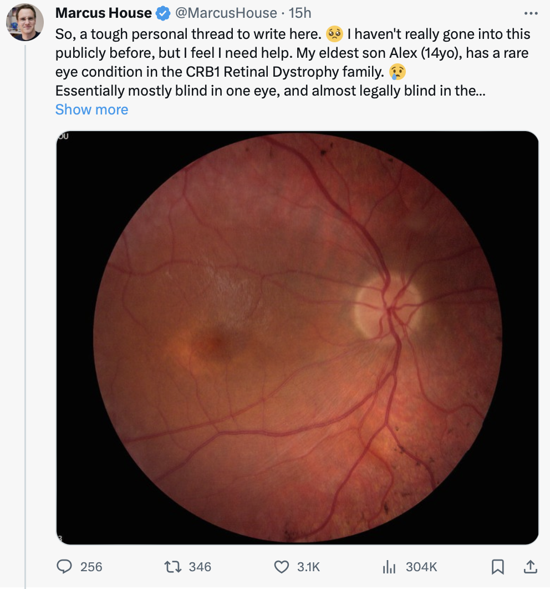
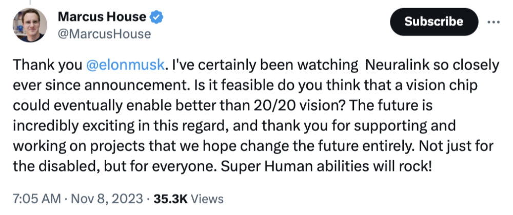
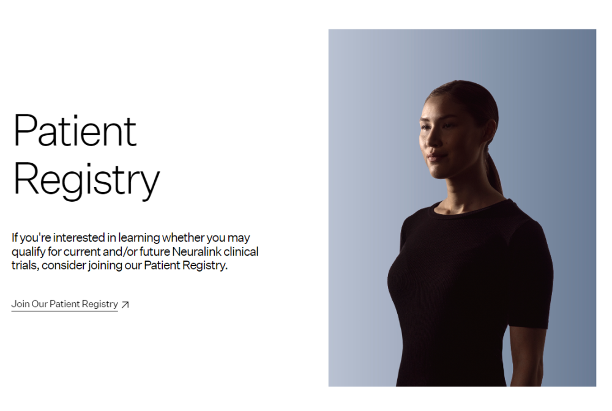

# 马斯克：Neuralink正开发视觉芯片，有望帮助失明人士恢复光明

IT之家 11 月 8 日消息，埃隆・马斯克（Elon Musk）今日发文暗示，旗下脑机接口公司 Neuralink
正在开发一款视觉芯片，这款视觉芯片将在“几年内准备就绪”，有望让失明人士恢复光明。

据悉，X 平台用户 Marcus House 日前发布贴文，声称自己的 14 岁长子 Alex 患有罕见的“CRB1
视网膜营养不良”眼部疾病，一只眼睛几乎失明，另一只眼睛在“法律上几乎失明”，因此 MarcusHouse 希望能够借助平台力量，从而帮助 Alex
面对来自生活的挑战。

_▲ 图源 Marcus House 发布的贴文_

而马斯克回复称，Neuralink 正在开发一种视觉芯片，该芯片将在几年内准备就绪，目前公司正在等待相关监管部门批准。

_▲ 图源 马斯克发布的贴文_

MarcusHouse 继续回复询问马斯克相关视觉芯片是否“最终可以实现比 20/20 更好的效果（IT之家注：20/20
是视力学方面的术语，即受测人需要站在 20 英尺 / 6
米开外的地方，接受视力测试，如果能看清视力测试图案，就证明视力正常）”，不过截至IT之家发稿，马斯克还未作出回应。

 _▲ 图源 Marcus House 发布的贴文_

此外，IT之家今日还曾报道，传记作家阿什利・万斯（Ashlee Vance）日前发文透露，数千人正排队等候植入 Neuralink 的大脑植入物。

今年早些时候，美国食品和药物管理局（FDA）批准了 Neuralink 对其设备进行人体试验，马斯克将其描述为“头骨上的 Fitbit”。今年 9
月，该公司开始为其首次人体试验招募志愿者。

Neuralink 计划明年进行 11 例人体手术，2025 年 27 次，2026 年 79 次。此后，手术数量将从 2027 年的 499 例猛增到
2030 年的 22204 例。该公司预计五年内年收入将高达 1 亿美元（IT之家备注：当前约 7.28 亿元人民币）。

