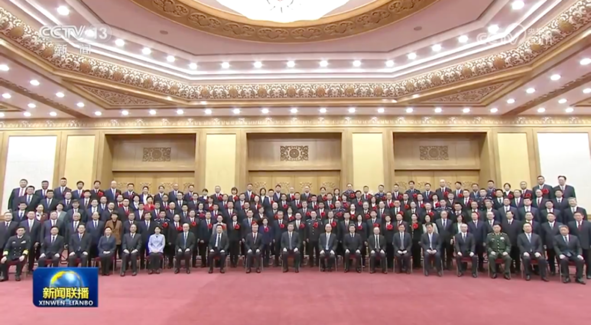
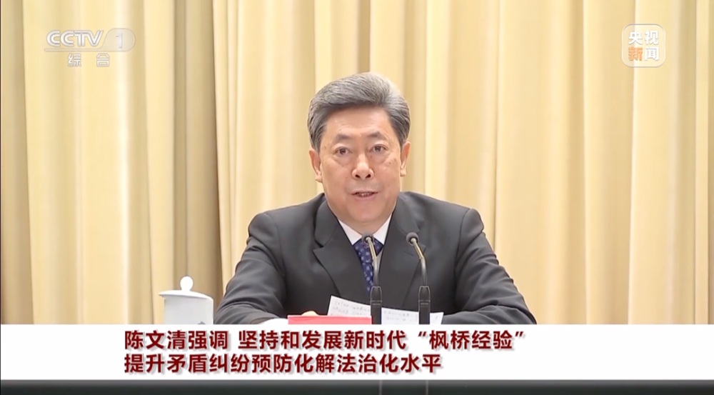
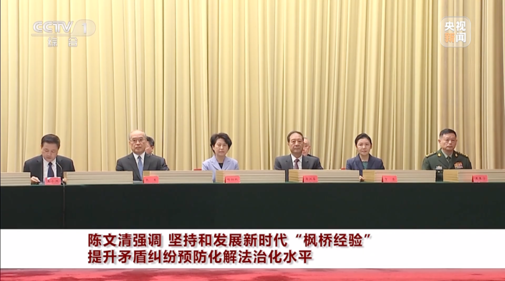
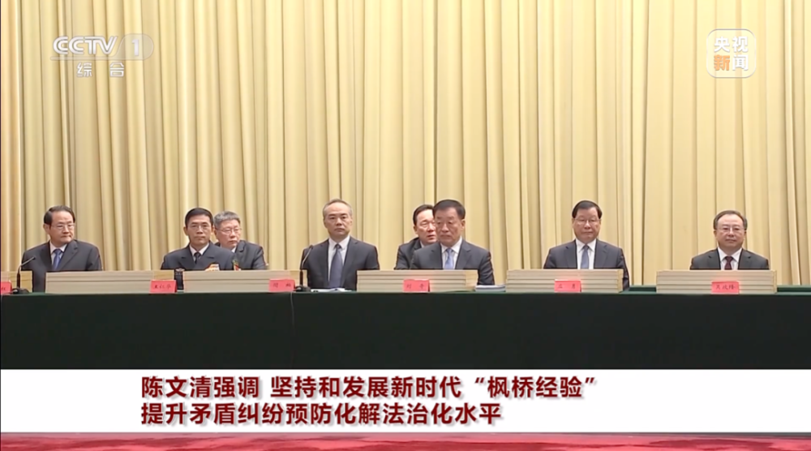
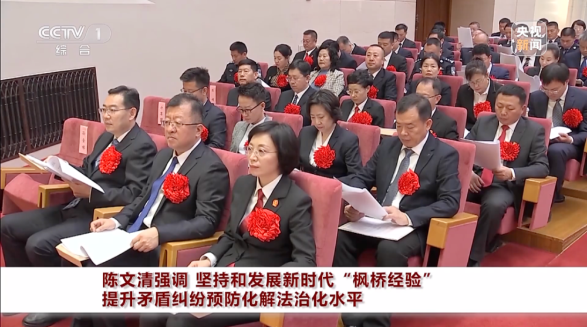

# 高层多次提要求！陈文清、王小洪等出席的重要会议，再度释放这一信号

**撰文 | 余晖**

11月6日，纪念毛泽东同志批示学习推广“枫桥经验”60周年暨习近平总书记指示坚持发展“枫桥经验”20周年大会在北京召开。

中共中央政治局委员、中央政法委书记陈文清在会上提到，要实现“小事不出村、大事不出镇、矛盾不上交”。

他还提到，要 **抓紧推进信访工作法治化** ，职能部门要对信访事项依照法律规定和程序按时处理到位，监督部门对滥用职权、玩忽职守的公职人员坚决问责到位。

2022年4月，中共中央、国务院印发的《信访工作条例》明确提到， **将信访纳入法治化轨道** ，依法维护群众权益、规范信访秩序。

**基层治理的一面旗帜**

2023年是毛泽东同志批示学习推广“枫桥经验” **60周年** 暨习近平总书记指示坚持和发展“枫桥经验” **20周年** 。

什么是“枫桥经验”？

上世纪60年代初，浙江诸暨枫桥干部群众创造了 **“发动和依靠群众，坚持矛盾不上交，就地解决”** 的“枫桥经验”。

**1963年11月，毛泽东同志亲笔批示“要各地仿效，经过试点，推广去做”。**

2003年11月，时任浙江省委书记习近平同志指出， **要充分珍惜“枫桥经验”，大力推广“枫桥经验”，不断创新“枫桥经验”。**

新时代“枫桥经验”已经成为基层社会治理的一面旗帜和中国之治的一张名片。

11月7日的《新闻联播》，还介绍了“枫桥经验”：

在浙江省诸暨市枫桥镇枫源村，枫溪水系联通工程正式竣工，不仅灌溉、防洪得到保证，新修的游览步道还成为了村民的休闲地。

**但在这项工程启动之初，沿线的几家村民觉得自家地被淹吃了亏，就补偿等问题提出不同意见。**

村里迅速启动村级重大事项的民主议事决策机制，通过广泛征求意见、村民代表无记名投票表决、实施方案公开等民主程序，最终矛盾得以化解。

**依靠群众就地解决矛盾，作为“枫桥经验”发源地之一的枫桥镇枫源村，已连续18年实现“群众零上访”。**

今年9月，中共中央总书记、国家主席、中央军委主席习近平赴浙江考察，期间，习近平到了“枫桥经验”发源地诸暨市枫桥镇。

习近平指出，要 **坚持好、发展好新时代“枫桥经验”，坚持党的群众路线，正确处理人民内部矛盾，紧紧依靠人民群众，把问题解决在基层、化解在萌芽状态。**

日前，中央政法委在全国范围内评选出104个“枫桥式工作法”单位。

11月6日上午，习近平在北京人民大会堂亲切会见了全国“枫桥式工作法”入选单位代表。

当日，纪念毛泽东同志批示学习推广“枫桥经验”60周年暨习近平总书记指示坚持发展“枫桥经验”20周年大会在京召开。

**陈文清讲话，王小洪、吴政隆等出席**

据央视报道，中共中央政治局委员、中央政法委书记陈文清出席大会并讲话，中共中央书记处书记、中央政法委副书记王小洪主持大会。

央视画面显示，参加此次会议的还有：

国务委员、国务院秘书长吴政隆

最高人民法院院长张军

最高人民检察院检察长应勇

中央纪委副书记、国家监委副主任喻红秋

全国人大常委会秘书长刘奇

中央社会工作部部长吴汉圣

中央政法委秘书长訚柏

司法部部长贺荣

中央军委政法委书记王仁华

武警部队司令员王春宁

其中，中央社会工作部是今年成立的新部门。

2023年3月，中共中央、国务院印发了《党和国家机构改革方案》。方案中提到， **组建中央社会工作部，作为党中央职能部门** 。

中央社会工作部职责包括负责 **统筹指导人民信访工作** ，指导人民建议征集工作，统筹推进党建引领 **基层治理** 和基层政权建设等。

政知君注意到，浙江省委书记易炼红、省长王浩也到了北京，参加了上述会议。

易炼红在大会上提到，浙江将“着力提升矛盾纠纷预防化解法治化水平，努力为推进基层治理现代化作出浙江新贡献，推动新时代‘枫桥经验’更加熠熠生辉、绽放夺目光彩”。

**重申信访工作法治化**

在11月6日的会议上，陈文清强调，要依靠基层组织和广大群众，立足于预防、调解、法治、基层，做到预防在前、调解优先、运用法治、就地解决，实现
**“小事不出村、大事不出镇、矛盾不上交”** 。

另据澎湃新闻报道，在上述会议上，陈文清还提到，新时代“枫桥经验”的最大创新发展，就是把各种矛盾纠纷化解方式纳入法治轨道。

“行政复议机关、法院、检察院、仲裁机构、相关行政机关、群团组织、信访事项受理办理单位， **要优先鼓励当事人通过自愿和解、依法调解方式化解矛盾纠纷**
；调解不成的，根据矛盾纠纷性质，依法引导当事人通过仲裁、行政裁决、行政复议等途径解决；对处理结果不服的再引导当事人依法提起诉讼。”

“要规范各类解纷手段的衔接方式，完善有关解纷手段的司法确认程序，增强矛盾纠纷化解整体效果。”

陈文清还强调， **下阶段要抓紧推进信访工作法治化。**

2022年4月，中共中央、国务院印发的《信访工作条例》明确了信访工作应遵循的原则，其中提到“坚持依法按政策解决问题。 **将信访纳入法治化轨道**
，依法维护群众权益、规范信访秩序”。

今年5月，陈文清到浙江杭州、宁波、绍兴调研，走访诸暨市“枫桥经验”陈列馆、枫源村等地。

当时，他提到，要研究完善矛盾纠纷化解“路线图”和平台机制建设、信息系统建设， **推进矛盾纠纷化解和信访工作法治化** 。

今年7月，陈文清在省部级干部信访工作专题研讨班上强调，要制定信访工作路线图， **全面提升信访工作法治化水平** 。

“推进监督追责法治化，对滥用职权、玩忽职守的公职人员坚决问责到位。推进维护秩序法治化，对扰乱社会秩序的违法犯罪行为及时依法处理到位。”

在11月6日的大会上，他再度强调，要做到“五化”、“四到位”—— **推进预防法治化、受理法治化、办理法治化、监督追责法治化、维护秩序法治化** 。

“
**职能部门对信访事项依照法律规定和程序按时处理到位，监督部门对滥用职权、玩忽职守的公职人员坚决问责到位，政法机关对扰乱社会秩序的违法犯罪行为及时依法处理到位**
”。

**资料｜ 央视 新华社 澎湃新闻 浙江日报等**

**【版权声明】本文著作权归政知新媒体独家所有，未经授权，不得转载。**

