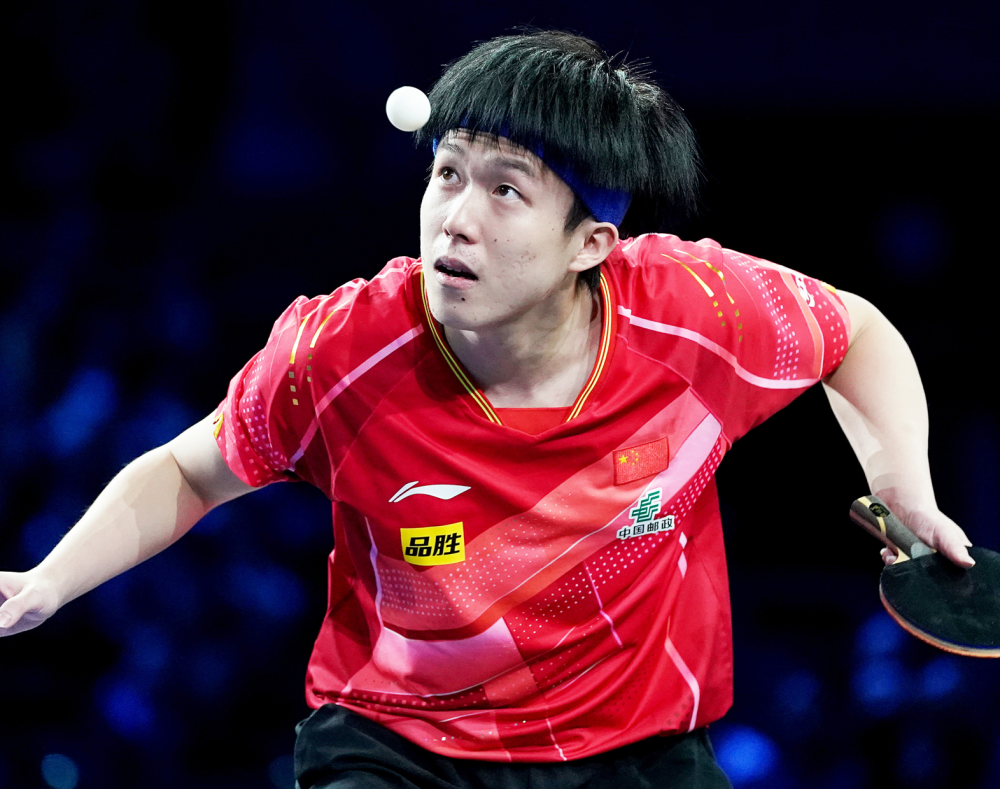
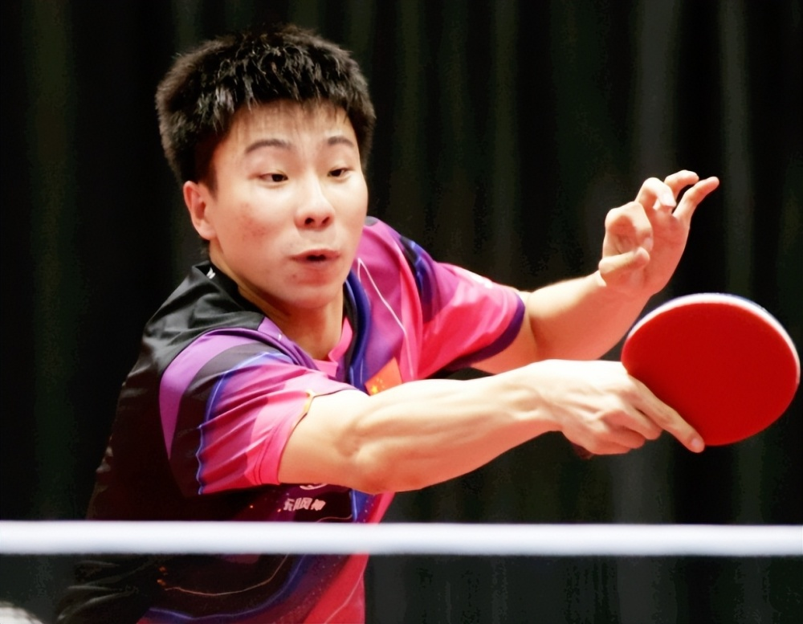
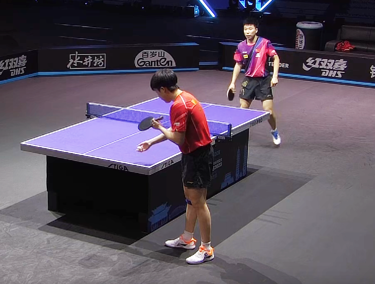
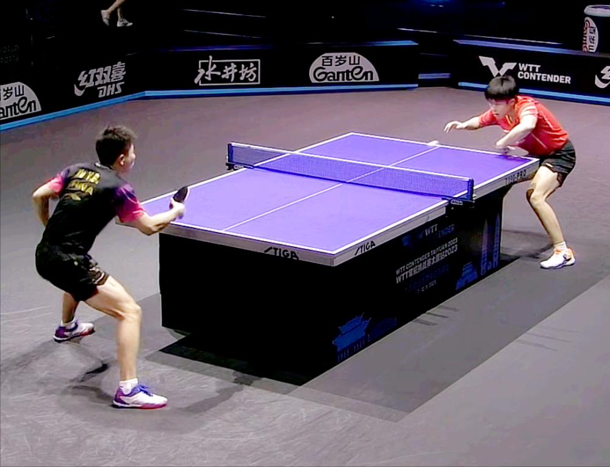

# 2-3！王楚钦爆冷出局，男单一轮游被淘汰，22岁新星制造大冷门

乒乓球WTT太原赛正火热进行，北京时间11月9日上午，国乒世界冠军王楚钦迎来首秀，迎战曾多次突破主力的新星徐瑛彬，结果不久前才在WTT法兰克福赛上输林昀儒的王楚钦再次败北，一轮游被队友淘汰，而过程更是0-2落后追到2-2、但依旧2-3被淘汰，的确非常可惜。

看来王楚钦的状态还是没有恢复，也有许多球迷认为最近国乒参赛的次数实在太多，主力休息不足、出现输球也很正常，何况王楚钦经常身兼多项，太不容易！详细战况请看下文。

2001年出生的徐瑛彬是国乒的一位另类高手，论成绩的话他实在也乏善可陈，但论战绩的话，他却将近十年的国乒主力都赢了个遍，其中就包括王楚钦，所以即便王楚钦在乒坛的段位远高于徐瑛彬，但在面对这位队友时也丝毫不敢大意。

如前所说，就在太原赛开打不久前的法兰克福赛上，王楚钦刚遭遇了外战败绩，男单不敌中国台北选手林昀儒，状态不是很理想，所以这次与徐瑛彬之战也存在悬念。

果然，比赛开始后王楚钦就被打得节节败退，首局没多久就1-8落后，在场上显得没有什么精气神，反观徐瑛彬则是虎虎生威，完全是在拼主力，所以出手也更加凶狠果断，虽然后半段王楚钦追到只差1分，但最终还是以9-11先丢一城。

第二局王楚钦依旧是不断落后，但又在后半段追到了9-9平。关键时刻王楚钦又一次被师弟掀翻，再次以9-11落败，大比分0-2被逼入了绝境，距离输球只差一步之遥了。

第三局胜利在望的徐瑛彬也出现了一些心态上的波动，结果这次轮到他上来就连丢5分，而这次王楚钦抓住了机会，继续压制队友，很快便轰出了9-1的悬殊分差，随即以11-2轻松扳回一城，随后又以11-3速战速决拿下第四局，这回轮到徐瑛彬压力巨大了。

决胜局大战，王楚钦依旧开局不利，随后一直处于追分位置，最终以8-11输光整场比赛，止步男单32强，成为了第一位被淘汰的世界冠军，真是爆出了一个大冷门。

恭喜徐瑛彬晋级！也期待王楚钦能尽快走出低迷，打好接下来的双打项目：加油，二位！

