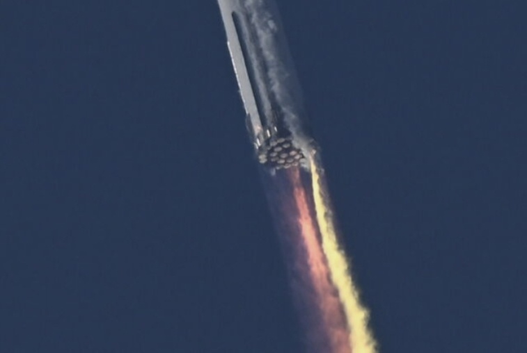
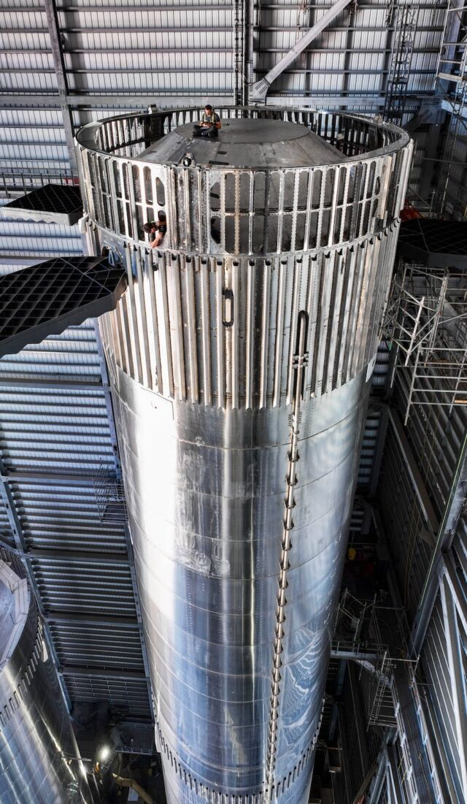

# 一文读懂SpaceX星舰二次试射：只要完成前三分钟飞行就算成功

**划重点**

  * _1_ SpaceX最早可能于下周对星舰进行第二次试飞，将对上千项调整、改进以及升级措施进行验证。
  * _2_ 马斯克表示，只要完成前三分钟飞行，这次试飞就算取得了成功。
  * _3_ 如果试飞成功，星舰将能够进入太空，全程飞行90分钟，绕地球一圈，最后溅落在夏威夷西北的太平洋中。
  * _4_ 试飞成功可能帮助开启星舰项目的下一段旅程，包括测试轨道加油技术、发射星链卫星等。

埃隆·马斯克（Elon
Musk）旗下火箭公司SpaceX即将对其星舰系统进行第二次试飞，但在此之前他们需要找到多个紧迫问题的答案，比如得克萨斯州升级后的发射台能否承受住火箭发射的强大推力？火箭上的猛禽发动机是否比4月份星舰首次试飞时更可靠？超重型助推器是否能与上级星舰安全分离？

这些问题的答案将表明，SpaceX在星舰升级过程中的进展有多快。星舰主要由两部分构成，分别是同名飞船以及超重型运载火箭。如果二次试射成功，星舰接下来的任务包括发射星链互联网卫星，这将加快网络与消费者手机直接连接的能力。SpaceX还需要为美国宇航局（NASA）测试星舰飞往月球的在轨加油能力。工程师们希望回收星舰系统的巨大助推器和飞船，这是使星舰完全可重复使用的必要步骤。

_图1：SpaceX第二艘星舰比第一代更高_

但首先，星舰需要能够进入太空。在4月20日星舰的首次试飞中，这种情况并没有发生，但SpaceX从那次任务中学到了很多东西。工程师们了解到，他们需要加强发射底座，因为超重型助推器猛禽发动机产生的1500万磅推力让其受到重创。这是SpaceX这次想要避免的事情。

另外，在4月份的试飞中，超重型助推器上33个猛禽发动机中有6个在升空前或飞行中发生故障。助推器发动机舱的推进剂泄漏和起火最终迫使SpaceX切断了与火箭主要飞行计算机的连接，火箭在飞行两分钟多后失去了控制。在二次试飞中，SpaceX也针对这些问题进行了改进。

**SpaceX需要证明什么？**

星舰的二次试飞最早可能在下周进行，地点是得克萨斯州布朗斯维尔附近的SpaceX发射基地。阻碍发射的最后一件事是联邦航空管理局（FAA）和美国鱼类和野生动物管理局（USFWS）的环境审查。

一旦审查完成（可能在本周进行），SpaceX将获得FAA的发射许可证。技术人员将在星舰上安装飞行终止系统，这是在星舰偏离轨道时的自毁机制。

然后，SpaceX将把星舰的飞船部分堆叠在超重型助推器的顶部，以组装高度超过120米的完整星舰，这是迄今为止人类建造的最大火箭系统。在发射当天早上，SpaceX团队将向这枚两级火箭罐装超过1000万磅的甲烷和液氧。

然后是发射时间。如果一切正常，计算机将发出命令，点燃聚集在助推器底部的33台猛禽发动机。在最后一次检查后，自动倒计时程序将发出允许发射的绿灯。

_图：在4月20日的星舰首次试飞中，超重型助推器猛禽发动机下方可以看到变色的尾气羽流，这可能是发动机舱内推进剂泄漏或起火的迹象_

SpaceX创始人兼首席执行官埃隆·马斯克（Elon
Musk）在4月20日发射前表示，成功试飞意味着火箭不会在发射台爆炸。这次，SpaceX希望能走得更远一点。理想情况下，这次星舰将进入太空，全程飞行90分钟，绕地球一圈，最后溅落在夏威夷西北的太平洋中。

**前三分钟飞行最关键**

若试飞成功，SpaceX可能着手实现马斯克预设的目标，即在明年年底前用星舰发射星链卫星。SpaceX也可能开始展示在轨道上为星舰加油，这是NASA阿尔忒弥斯重返月球计划的一个重要里程碑，该计划将依靠星舰将宇航员送上月球表面。

今年6月，马斯克预测，星舰在第二次试飞中达到接近轨道速度的可能性约为60%。星舰的速度无法达到稳定绕地轨道飞行所需的速度，所以如果它真能飞那么远，将在发射后90分钟左右重新进入大气层。

但是，如果星舰在离开发射台之前发生爆炸，这可能会使SpaceX的火箭计划推迟至少6个月。在4月20日试飞之后，SpaceX花了差不多半年时间才修复了发射台的大面积损坏。这甚至可能引发监管机构的更多审查，给SpaceX的计划带来更多障碍。

有鉴于此，完成前三分钟的飞行就足以证明星舰走上了正确的道路。如果试飞成功，将意味着SpaceX解决了4月份试飞中导致发动机舱燃油泄漏和起火的问题。这可能还意味着，SpaceX已经提高了猛禽发动机的可靠性，而且该火箭的新型电动推力矢量控制装置工作得非常出色，该装置可用于让猛禽发动机保持平衡或旋转，以便在飞行中转向。

**热分离技术**

从得克萨斯州墨西哥湾海岸向东飞行，超重型助推器将把星舰加速到几倍音速的高速。发射后约2分39秒，助推器将开始准备与星舰上级分离。在这次试射中，SpaceX将测试所谓的“热分离”技术。

SpaceX公布的时间表显示，在即将到来的试飞中，超重型助推器的33个发动机中，大多数将在发射后2分39秒关闭。两秒钟后，随着星舰上级发动机点火和超重型助推器同时被抛离，热分离开始。

热分离技术存在风险，但SpaceX的工程师认为他们已经减少了风险。马斯克说：“显然，这会导致助推器爆炸，所以你必须保护助推器的顶部不被上级发动机烧毁。设计上的改变将使星舰火箭的有效载荷能力提高大约10%，目前在近地轨道上的有效载荷已经超过100吨。”

工程师们在不锈钢助推器的顶部增加了防护罩，使其免受发动机爆炸的影响。一旦星舰完全投入使用，SpaceX希望多次回收和重复使用助推器，因此减少级间分离造成的损害非常重要。SpaceX在超重型助推器和星舰飞船的上层之间增加了金属排气环，这是新的元件，可以让上层发动机的过热废气从两级之间的封闭空间中逸出。

_图3：安装在超重型助推器顶部的“热分离环”_

马斯克说，热分离是自4月试飞以来对其星舰系统进行的1000多次调整、升级和改进之一。星舰二次试飞将使用猛禽2发动机，它们类似于4月份飞行的发动机。SpaceX正致力于升级猛禽3发动机的设计，以解决可靠性问题。

SpaceX加强了助推器上33个猛禽发动机周围的防护，以保护它们免受附近发动机爆炸的影响。此举旨在减少风险，以免在进入太空的过程中一个引擎故障导致其他引擎失灵。未来的猛禽发动机将采用改进的燃料歧管设计，减少泄漏路径，但在星舰二次飞行中，技术人员试图通过拧紧歧管上的螺栓来解决这个问题。

执行星舰二次试飞任务的超重型助推器被称为Booster 9，它拥有扩展的灭火系统，可以减少发动机舱着火的风险。

马斯克称热分离是星舰第二次发射中最危险的部分。上个月，他在国际宇航大会上说：“如果发动机点火，飞船在分离阶段不会自爆，那么我认为我们就有相当大的机会进入轨道。”

**开启下一段旅程**

星舰上级部署有六个猛禽发动机，其中三个具有更大的喷嘴，用于在太空真空中点火，另外三个标准的猛禽发动机适合在大气层中飞行。SpaceX此前从未在太空中启动过猛禽发动机，因此高管们迫切希望看到星舰上级的表现。如果一切顺利，星舰将在飞越墨西哥湾、驶向佛罗里达海峡的过程中点燃其上级发动机，持续近6分钟。

与此同时，超重型助推器将尝试在得克萨斯州海岸附近的海洋中进行受控软溅落，以验证SpaceX在未来星舰飞行中将助推器降落在发射台上的技术。

与4月份相比，人们对星舰二次试飞的期望更高。NASA拥有超过40亿美元的星舰登月合同，该机构将密切关注星舰的测试。负责阿尔忒弥斯登月计划的NASA官员吉姆·弗里（Jim
Free）称：“我希望每个人都在为星舰试飞欢呼，因为我们需要它成功，才能让我们在这条路上走得更远！”

对于NASA来说，星舰试飞成功可能意味着，SpaceX将在未来一两年的某个时候进入星舰测试的下个阶段，即轨道加油。这将使星舰在2030年之前载着宇航员登陆月球表面成为可能。

SpaceX拥有大量硬件，而且该公司的员工行动迅速。在南得克萨斯州有许多火箭处于不同的制造阶段。因此，即使第二艘星舰不能进入轨道，还有更多的飞船在等待飞行。

但在星舰开始部署星链卫星或为NASA执行飞往月球任务之前，还有许多障碍要跨越，这是该火箭最重要的两个近期目标。本月晚些时候，只要扫清其中的几个障碍，SpaceX就有理由大肆庆祝。（文/金鹿）

延展阅读：

[马斯克下一个帝国轮廓已现：星链实现现金流平衡 或成SpaceX营收支柱
](https://new.qq.com/rain/a/20231107A03JHJ00)

[马斯克：SpaceX明年将每两天发射一次 ](https://new.qq.com/rain/a/20231108A05DMI00)

