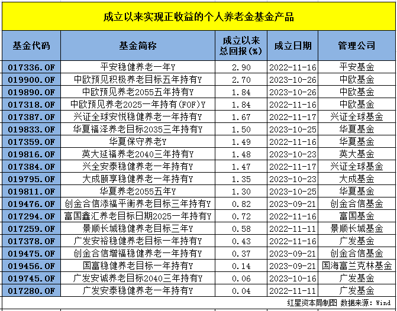
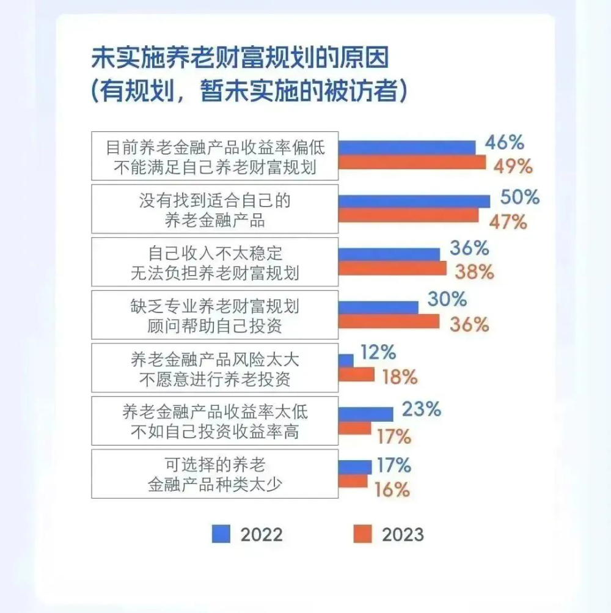

# 个人养老金基金“周年考”：近九成产品亏损，多数规模不满1亿元

红星资本局11月9日消息，自去年11月证监会发布《个人养老金投资公开募集证券投资基金业务管理暂行规定》以来，多家公募积极推进个人养老金业务，相继成立个人养老金基金Y份额产品。

在市场行情较为低迷的背景下，超160只个人养老金基金迎来“周年考”。wind数据显示，截至11月8日，近九成产品自成立以来收益告负，回报超过1%的只有11只。此外，尽管在公募基金持续发力下，个人养老金产品不断扩容，但投资者的参与热情似乎并不高，多数基金规模不到1亿元。

业内人士指出，相较于传统公募产品，个人养老金基金是市场新兴事物，考虑到目前权益市场所处的低位和长期具备的价值，绝大部分产品未来有望修复亏损。同时，专业投资机构应针对客户需求持续创新养老金投资产品，进一步提高投资者的持有体验和收益。

**近九成养老Y份额亏损**

**投资业绩不及预期**

资料显示，个人养老金基金目前均采用养老FOF形式运作，FOF基金主要通过购买子基金来间接投资资本市场，即通过筛选符合投资目标及投资策略的基金产品，实现了风险的双重分散。但自去年公募陆续成立养老金基金Y份额以来，投资业绩与预期存在差距。

Wind数据显示，截至2023年11月8日，包括今年新成立的产品在内，169只个人养老金基金Y份额中，仅19只成立以来实现正收益，占比11.24%。其中收益最高的是平安稳健养老一年Y，总回报为2.90%，回报超过1%的产品共11只。

与此同时，成立以来实现负收益的产品接近九成，其中有56只亏损超5%，8只亏损超10%，亏损最多的是中欧预见养老2050五年Y，该基金成立于2022年11月16日，目前已亏损13.33%。

博时基金多元资产管理部总经理兼基金经理麦静向红星资本局表示，Y份额是专门为了个人养老金而设立的，因此多设立于近一年内（大部分成立于去年11月），而过去一年权益市场震荡下跌，以偏股基金指数为例过去一年跌幅超过12%，养老产品Y份额或多或少持有权益资产（且持有期越长对应的权益资产中枢和下限越高），因此短期确实存在亏损情况。

“但考虑到目前权益市场所处的低位和长期具备的价值，拉长时间来看，绝大部分的Y份额有望修复亏损，最终为投资者带来正向回报。”麦静说。

华夏基金则用数据指出，以2013-2022这十年的数据测算，任意时点买入Wind偏股混合型基金指数，持有1个月，盈利的概率不到60%；持有5年以上，盈利的概率达到99.4%。具体到产品层面，以养老目标基金为例，虽然受到资本市场波动影响，Y份额整体亏损面较大，但拉长时间看，长期收益仍比较可观。

**民众参与意愿有待提高**

**规模困局何解？**

自去年11月个人养老金制度正式实施运作以来，参加人数不断增加。人社部数据显示，截至今年6月底，全国36个先行城市（地区）开立个人养老金账户人数达4030万人，较2022年底参加人数（1954万人）数量翻倍。

但截至今年3月底，仅有900万名开户者完成了资金缴存，约占同期开户人数的30%。也就是说，存在大量空账户并未缴费，居民参与热情并不高。

从个人养老金基金的规模情况也能看出这一点。wind数据显示，截至三季度末，基金资产净值超过1亿元的产品仅有13只，占比不到一成，而且均成立于去年11月。其中超过5亿元的只有2只，分别是兴全安泰积极养老目标五年Y和华夏养老2040三年Y，各为5.67亿元和5.11亿元。

据中信银行联合华夏基金、富达基金发布的《中国居民养老财富管理发展报告（2023）》（下称“《报告》”），随着个人养老金制度的推出，人们的养老意识有所提高，但实际行动落后于意识。阻力方面，不同年龄段的原因各不相同，“Z世代”（低于35岁）有78%的被访者表示“还年轻，不着急”。

《报告》调研数据显示，在“有规划但暂未实施”的被访者中，接近半数给出的原因是“目前养老金融产品收益率偏低，不能满足自己的养老财富规划”“没有找到适合自己的养老金融产品”。

截图自《中国居民养老财富管理发展报告（2023）》

对此，博时基金多元资产管理部基金经理于文婷向红星资本局表示，因双重分散原因，养老目标基金在长周期的投资过程中体现出明显的分散优势，提供给投资者比较稳健的回报和平滑的净值曲线，但在短周期内业绩表现并不一定亮眼；养老目标基金虽已出现较长时间，但是对于普通投资者而言仍是新基金品类，更难理解其投资框架和投资优势。

“一方面，要持续养老金相关知识的普及，突出养老金基金与投资者养老需求的适配性，推荐投资者从长周期角度评价基金，从自己的风险偏好水平出发选择适合的基金。另一方面，作为专业的投资机构，需要针对客户需求，持续创新养老金投资产品，包括设立新型的养老投资产品，同时拓展养老基金的可投范围，纳入更多资产以对冲风险，充分发挥养老基金长期稳健的优势，进一步提高基金投资者的持有体验和收益。”于文婷说道。

**公募多举措加速“吸金”**

**长期投资价值仍存**

于文婷表示，我国的第三支柱养老金发展仍处于初级阶段，与其他国家的发展存在明显的差异，而现阶段投资者对于个人养老的认知并不充分，所以，养老金投资规划业务必不可少，其需要承担投资者教育、引流、产品匹配等多方面的职能，推动投资者对金融产品的认知，满足投资者多样化的投资需求，并关注产品和个人投资者需求匹配的合适度等。

据了解，博时基金一方面加大目标日期和目标风险基金的布局，丰富期限和不同风险水平的分布；另一方面针对养老特性，加大支付、中低风险等创新养老产品的创新力度，同时做好养老投资的教育和陪伴。

南方基金也向红星资本局表示，作为新兴产品，着眼于长期仍是必须。基金公司作为管理人，应当做好产品业绩和客户服务工作，特别在面对市场波动时进行相关投教工作，做好客户的心理疏导。

南方基金表示，在投资方面，一是要坚持正确的投资理念。养老目标基金投资期限相对较长，在进行大类资产配置时，需要注重资产内在价值的分析，拉长投资视角，降低短期交易性操作的频率。二是严守投资纪律，有效降低投资风险。在子基金选择时，建立有效的跟踪机制和约束机制，重点关注子基金基金经理的投资风格稳定性。固定收益类产品投资时，密切关注对信用风险的控制，从而有效降低组合最大回撤幅度。三是提升大类资产配置能力。2018年首批养老FOF成立以来，内外部宏观经济形势比较复杂且多变，权益资产在此过程中波动较大，要通过不断的资产配置比例调整优化组合结构。

华夏基金建议，未来可从以下方面着手，推进制度提质扩面，进一步促进缴费和购买产品。一是针对不同收入群体分类施策，有效发挥各类制度的激励作用。二是促进二、三支柱融通，提升账户的便携性。三是不断丰富产品供给，适配个人养老金多样化配置。四是持续优化客户服务与陪伴，引导形成科学养老理财观念。五是增强特殊情形下提取的灵活性。

红星新闻记者 蒋紫雯

编辑 杨程

