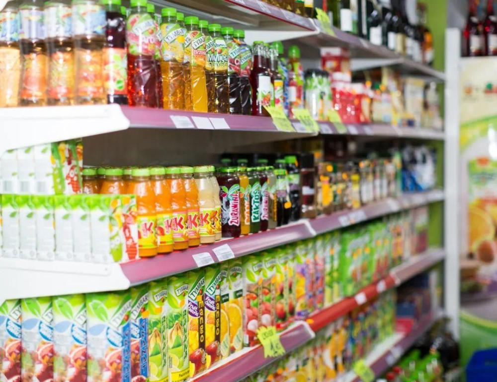

# 天价校园小卖部背后，临期食品加价5倍卖？

近日，广西玉林北流市明瑞高级中学因校内小卖部租赁权拍卖引发广泛关注。

据拍卖现场视频显示，该小卖部年租金110万元起，第一轮出价，参拍者就出价200万元，经过多轮举牌加价后，竞拍价格一路涨到了320万元，截至视频结束，竞拍仍未结束。

在北流市政府官网上，可以查看到这则拍卖公告。该公告显示，受委托，定于2023年10月31日10时在北流市公共资源交易中心拍卖厅举行拍卖会，公开拍卖北流市实验中学校内位育楼一楼约200平方米小卖部租赁权和北流市明瑞高级中学校内友谊楼负一楼约150平方米小卖部租赁权，参考价分别为160万元/年和110万元/年。

_北流市实验中学和北流市明瑞高级中学校小卖部租赁权拍卖公告截图。图片来源于北流人民政府官网截图_

公开资料显示，北流市实验中学与明瑞高级中学均为公办全日制中学，有走读和寄宿两种住宿方式。

负责此次拍卖的玉林市铜州拍卖行一位负责人告诉中国新闻周刊，他们按照法定程序做了拍卖，“依法依规，是正常的商业活动”。

关于当日参与拍卖人数，该负责人表示不方便透露。至于拍卖价格，他表示两所学校小卖部的最终成交价都超过了300万元。

北流市教育局一位工作人员告诉中国新闻周刊，此事需要联系北流市委宣传部，由宣传部作统一回复。

对此，北流市委宣传部告诉中国新闻周刊，相关部门已在跟进此事，关于最终拍卖金额等相关问题，一切结果等公告出来才知道。“因为我们不是主管部门，得等公告出来。”当被问及是哪个部门负责时，对方直接挂断了电话。

**“独此一家”**

近年来，关于“天价”小卖部新闻屡见不鲜，而校园小卖部招标的日益公开透明化又引发了广泛关注。

以广西南宁市第五中学校园小卖部公开招租项目为例，该校小卖部今年9月挂牌招投标，挂牌价为90万元/年，经网络竞价后，最终成交价为200万元/年。据悉，该校现有学生人数约1800人，教职工约180人，学校日常实行全封闭式管理。

同样在广西，百色市田东县田东中学小卖部在今年10月招租，该小卖部面积为50.41平方米，挂牌底价为190万元/15个月，经网络竞拍后，最终成交价为416.2万元/15个月，平均下来每月的租金高达27万元。

事实上，以竞价方式招租的小卖部经营权拍卖竞争通常非常激烈。

今年8月份，广东省肇庆市怀集县怀集中学小卖部，曾因5年租金达943万元登上热搜。在怀集县国资委组织竞投小卖部承包商中，共有34人（含公司）交了保证金参与竞投，经过2274轮竞价，最终成交价为5年租金总额9430560元。

业内人士分析称，此类“天价”小卖部有几个共同点，一是在学校师生人数较多，如怀集中学有学生8300多人，教职工632人；二是此类学校实行封闭或半封闭式管理，都依仗于比较明显的垄断经营，且校园内的小卖部也往往是“独此一家”；三是此类竞价方式不设底价，只要有人愿意出更高的价格，就能不断刷新成交纪录。

不少家长担忧“羊毛出在羊身上”，认为小卖部投入的成本这么大，必然会从学生的身上寻找“回报”，商品的价格和质量都令人担心，而且部分学校采取封闭式管理，无形间让家长和学生沟通产生了壁垒。

_小卖部货架上的饮品。图/图虫创意_

在人民网“领导留言板”上，不少网友反映学校小卖部和食堂的价格高于市场，一位网友留言称，“一瓶可乐5元，桶装泡面6.5元起步，很多品牌在市面上并不常见。”

还有一位网民给四川省自贡市富顺县委书记留言，称该县冬瓜山市场附近的富顺新一中小卖部价格不合理。如一瓶雪碧市面上只需3元，但在学校小卖部要卖5元，而一罐旺仔牛奶为7.5元，也远高于市场价。他提到，该校只有这一家小卖部。

与此同时，在关于北流市明瑞高级中学天价小卖部视频下面，有一位网友留言称，自己曾向学校提供过商品，表示市场上各大品牌的临期货都会流入学校进行消化；另一位网友则称，其在商贸公司工作时，发现公司将临期饮料全部卖给学校，他们公司以1元一瓶的价格卖给小卖部，而小卖部却以5元一瓶卖给学生。

中国教育科学研究院研究员储朝晖对中国新闻周刊表示，天价校园小卖部反映的不仅仅是学校的问题，也与当地市场环境有关。他认为，应进一步规范相关主体的行为，通过建立法治的市场体系和规则来解决问题。

**“存在较大的空间”**

2019年12月30日，国家市场监管总局办公厅、教育部办公厅、国家卫生健康委办公厅、公安部办公厅发布《关于落实主体责任强化校园食品安全管理的指导意见》，指出具备条件的中小学、幼儿园食堂原则上采用自营方式供餐，不再签订新的承包或者委托经营合同。非寄宿制中小学、幼儿园原则上不得在校内设置食品小卖部、超市，已经设置的，要逐步退出。寄宿制中小学确需设置食品小卖部、超市的，应依法取得许可，原则上只售卖纯净水、矿泉水、预包装面包、牛奶等食品。

今年2月，国家市场监管总局、教育部等四部门发文部署2023年春季学期学校食品安全监管工作，明确中小学校、幼儿园原则上不在校内设置小卖部、超市，并强调，确需设置的，不宜售卖高盐、高糖及高脂食品。

据了解，已有一些地方对校园小卖部采取了积极行动。如厦门市教育局就曾发布通知要求规范直属学校食堂、小卖部交易行为，明确非寄宿式学校不得在校内设立小卖部、超市等食品经营场所。同时，严格核定和管理食堂饭菜价格和菜品质量，明确不得以任何形式从学校食堂和小卖部经营中盈利，且食堂、小卖部配置期限原则上不得超过3年。

为了加强监督管理，厦门市教育局还要求学校加强对食堂、小卖部经营单位的监督管理，研究制定负面清单，配置期内采取“扣分制”的方式每年进行量化考核，考核不合格的应终止合同，重新按程序进行配置交易活动。

广东一中学校长告诉中国新闻周刊，他认为学校不应设立小卖部。“学校小卖部利益空间太大，招投标之后，价高者得，但羊毛出在羊身上，不应该把学生当成赚钱对象。”他说。

该校长透露，在教育部明确禁止学校设立小卖部之前，很长一段时间学校小卖部的管理相对混乱。对于租金收取各学校存在不同做法，有些学校不收租金，有的只是象征性收取一部分，而有些学校则有一定的收费标准。他指出，各学校对小卖部的管理方式没有统一的共性，“存在较大的空间”。

据他了解，在东南沿海城市，大多数学校已经不再设立小卖部。他认为，学校可以考虑安装直饮机来解决学生饮水问题，如个别学生需要加餐，可以让家长提前准备一些点心。他表示，大部分学生去小卖部不是为了解决饥饿问题，而是出于娱乐目的。

北京德和衡（上海）律师事务所律师秦辉告诉中国新闻周刊，根据《拍卖法》第三条规定，学校有权通过拍卖方式将财产权利转让给最高应价者。然而，根据2019年12月底发布的《关于落实主体责任强化校园食品安全管理的指导意见》，将小卖部的租赁权以拍卖方式卖给校外企业或个人实际上违背了上述指导意见。

秦辉还指出，按照《消费者权益保护法》第十条，公平交易权是消费者极其重要的一项权利，作为消费者的学生，在购买商品时有权享有保质保量、合理价格和正确计量等公平交易条件。

然而，由于中小学校园内通常只有一个小卖部，缺乏更多竞争者，这在客观上使得学校区域内学生用品的销售缺乏充分竞争，有可能使得这个小卖部在学校区域内“待价而沽”。他认为，如果缺乏监管，这唯一的小卖部将形成《反垄断法》所称的具有市场支配地位的经营者，垄断经营行为随之产生。

他表示，以上情况叠加经营者支付较高租赁费等因素，有可能导致小卖部销售商品价格明显高于附近区域的经营者，而在校学生出入校园多有不便，基本没有更好选择，消费者公平交易权恐将落空。

秦辉说，租赁权的拍卖价格高企，可能导致参加拍卖的买受人将高额的租赁成本转移到学生用品上，有违《中华人民共和国未成年人保护法》，不利于促进未成年人的全面发展和身心健康，也不利于保障未成年人合法权益。

作者：陈淑莲

编辑：孙晓波

