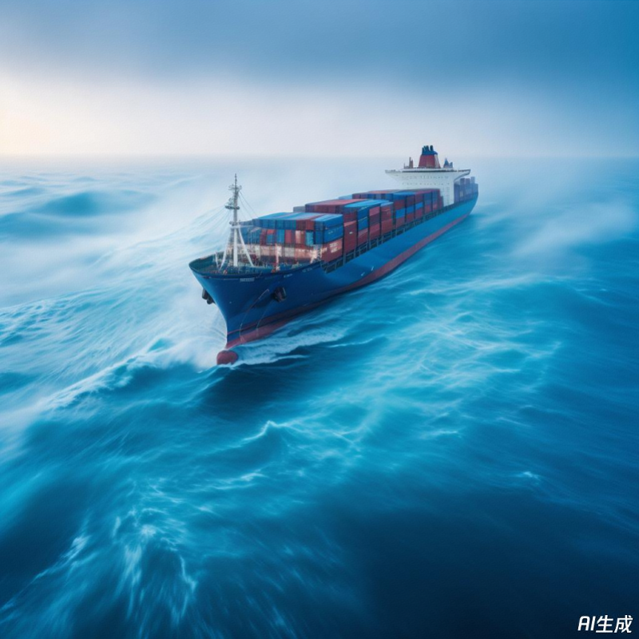

# 扛不住了，国际航运巨头计划裁员超万人！全球货运业或遭寒冬

全球贸易的风向标，航运业巨头马士基近期宣布计划裁员超过1万人，并预计利润将处于此前指引的低端。这让不少分析人士认为，全球货运业或遭遇寒冬。消息公布后，马士基的股价大跌了15%以上，近期股价持续低迷，至三年来最低水平。

据了解，马士基掌握着全球约17%的集装箱贸易，今年以来，集装箱运价下跌和需求减弱打击了全球航运业，分析预计这种情况可能会持续到2026年。

裁员的不止马士基一家。美国供应链初创公司Flexport宣布作为削减成本计划的一部分，计划在全球裁员约20%。

自去年开始，国际物流巨头采取裁员手段进行降本已经屡见不鲜。今年开始，破产、卖身更是频频在国际物流巨头身上上演。它们有的是全球排名前几的巨无霸，有的是经营百年的物流名企，有的是曾经备受资本追捧的新晋翘楚。

在这一“充满挑战的时期”，部分国际物流企业的日子并不好过，“活下来”已经需要用尽全力。

一艘货运轮船在海中航行。制图由腾讯混元大模型生成

需求低迷

航运行业巨头将进一步裁员

马士基表示背后的主要原因是需求低迷以及货运费用的回落。

海运业务是马士基的核心业务之一，占总营收比重超过七成。第三季度，马士基的海运业务营收从去年同期的180.18亿美元下降至78.97亿美元。此外，马士基物流与服务业务营收也从去年同期的41.82亿美元减少至35.17亿美元，码头业务营收较去年减少约1.18亿美元至9.99亿美元。马士基方面表示，这主要是受亚洲至欧洲、北美和拉丁美洲航线运价大幅下跌压力的影响。

在海运市场，第三季度通常是行业旺季，货运量和运费都会在这一阶段上涨，但今年的旺季没有形成。马士基首席执行官柯文胜（Vincent
Clerc）对此分析称：“需求低迷、运价重回历史水平以及成本面临通胀压力已成为我们行业的新常态。自夏季以来，我们发现全球大多数航线出现运力过剩问题，导致运价下跌。”据马士基三季度报，第三季度马士基的平均运费下降了58%至2095美元/FFE（40英尺集装箱），环比也下降了14%。

马士基首席运营官文森特·克莱克表示，整个行业正面临着需求低迷、价格回归历史水平，以及应对通胀压力的新常态。自从今年夏天开始，大多数地区都因为供给过剩触发了价格下跌，不过公司的船舶闲置率并没有明显上升。鉴于接下来还有充满挑战的时期，公司加速了多项成本和现金控制措施，来确保公司的财务表现。

马士基在财报中表示，2023年实施了严格的成本控制措施，包括将员工人数从2023年初的11万人减少至目前的约10.35万人。

“鉴于海运市场前景不断恶化，马士基计划进一步减员3500人，其中2500名员工将在年底前受到影响，其余延续到2024年。该措施会把公司整体人数减少至10万人以下。因此，预计重组费用总额将从2月份宣布的1.5亿美元升至3.5亿美元。”马士基称。

马士基表示，人员调整是对全年成本控制的补充，其累积效应可以使马士基2024年的销售、日常和管理费用成本减少6亿美元。

受此影响，11月3日晚间，马士基欧股股价一度暴跌超18%，截至收盘，跌幅仍超16%，股价创下三年来的最低点。其他航运企业股价也集体大跌，其中赫伯罗特大跌10%，DSV跌超2%。

大繁荣后

海运行业商业环境剧变

疫情期间，集装箱运输迎来了一次大繁荣，在三年内赚的钱比前六十年还要多，而如今该行业商业环境发生了根本性变化。

在过去两年，海运行业的运费一度冲顶，加上运力受阻等原因，船舶的装载率也保持在高位。但随着2022年运费逐渐下滑，行业景气度急转直下。一方面收入下降，另一方面成本也在上涨。目前燃油价格、船员薪资、管理成本等整体看涨，船公司的业绩压力在不断增大。

据介绍，全球第四大航运公司中远海控第三季度也面临同样糟糕的市场行情。报告期内，中远海控营收为427.14亿元人民币，同比下降59.61%，归属于上市公司股东的净利润为55.1亿元人民币，同比下降83.07%。

全球第六大航运公司ONE上季度的业绩也出现了大幅下滑的情况。2023财年第二季度（2023年7-9月），其营收同比下降62%至35.49亿美元，息税折旧及摊销前利润同比下降92%至4.96亿美元。

作为全球最大的集装箱运输公司之一，马士基为沃尔玛、耐克和联合利华等大多数零售商和消费品公司运输货物，通常被视为全球贸易的领头羊，也被称为“全球贸易晴雨表”。

马士基的最新动作，无疑向市场传递了重大信号。业内人士表示，目前全球航运市场供需严重失衡，全球经济依旧受高通膨、高利率、地缘冲突的影响，加上去库存化进程缓慢，航运市场仍将面临较大挑战。

寒冬持续

陆路运输业也面临相同挑战

不仅在航运行业，陆路运输业也面临相同的挑战，并且“寒冬”可能会持续一段时间。

这一点通过卡车货运费用的预测值可以看出。根据CNBC对美国物流高管们的调查，超过51%的高管预计明年上半年，整车货运的费率会出现下降，下降幅度在5%到15%。此外，17%的高管认为，价格会保持不变。高管们表示，由于运力超过需求，运费的定价只能持续疲软。

当下，在美国马上将迎来假期购物季，但是不少货运公司表示缺乏来自零售商们的大订单，消费者需求出现降温。此外，有67%的物流公司表示，这个假期，运输的商品更多是促销性、成本较低的产品，而那些大件商品，例如电器、家具、奢侈品的数量则明显下降。

为7500家零售商提供服务的物流企业C.H.
Robinson告诉CNBC，现在零售商们普遍持谨慎态度，通货膨胀仍是一大问题。有分析指出，在宏观经济的冲击下，货运行业可能会陷入较长的衰退期。

美国银行分析师 肯·霍克斯特表示，货运行业会陷入较长时间的衰退期，通胀、高利率都在影响消费者，导致货运量需求没有那么强劲 。

根据调查，高管们认为明年上半年货运量仍不乐观，不过调查显示，大家普遍预计明年下半年美国货运行业可能会迎来转机。其中50%的人认为货运量会增加5%，33%的人认为货运量会增加10%，17%的人认为货运量会增加15%。当下，全球物流运输行业面临包括消费者需求疲软、利率攀升、燃油成本上涨等多重挑战。

行业裁员

美国科技物流独角兽Convoy

核心业务已被关闭，上千员工将集体被裁

近日，美国科技物流独角兽Convoy宣布核心业务已被关闭，上千员工将集体被裁。

2015年，Dan Lewis、Grant
Goodale成立了Convoy。Convoy以数字方式将托运人和承运人连接到Convoy平台，通过应用机器学习模型将承运人与货物订单进行匹配。

即便是货运艰难时期的2022年，Convoy也曾获得2.6亿美元的融资，此外还在J.P.Morgan（摩根大通）获得了1.5亿美元的信贷额度。这次融资后Convoy的估值高达38亿美元。

Dan
Lewis在发给员工的备忘录中表示，“我们正处于一场大规模的货运衰退和资本市场收缩之中。这两者的结合最终使我们的进展受到了严重打击，同时也给我们的潜在战略收购方带来了巨大压力。这可以说是一场完美的风暴。”

美国物流服务企业SELSCS

成本上升，宣布逐步关闭停运

10月下旬，同样与货运相关的美国供应链解决方案公司SELSCS宣布逐步关闭停运。SELSCS是一家为美国和墨西哥各地的冷藏车、干货车和平板车货运提供第三方物流服务的企业。

其创始人Martin表示，在这个行业里，每一年都面临挑战，但毫无疑问，今年是面临的最具挑战性的一年。

停运前夕，SELSCS经历了双重承销欺诈、货物盗窃、承运商身份盗用、保险费上涨、成本上升等问题。相较2022年，业务营收损失达40%。

美国货运巨头Yellow Corp

因财务问题计划申请破产，将解雇3万名员工

今年7月，在距离诞生一百周年还有一年的美国货运巨头Yellow
Corp宣布因财务问题陷入停运危机，并计划申请破产，同时将解雇3万名员工。这成为有史以来规模最大的美国货运公司破产案。

该企业主要提供零担运输的货物运输和供应链解决方案，用于运送工业、商业和零售商品等。沃尔玛、家得宝、Uber
Freight等均是其客户。按体积排名，Yellow Corp是第五大LTL运输商（零担运输）。

全球经济下行压力加大，美国货运市场运输需求下降，刺激激烈的低价竞争，以及Yellow
Corp内部巨大的债务压力、运营改革激发与司机群体的矛盾，综合作用之下造成这个货运巨头止步于100岁生日前夕。

英国老牌物流公司

8月宣布关闭业务，无法支付司机报酬被集体诉讼

今年6月，英国国内和国际物流市场上颇具竞争力的运输企业之一Tuffnells Parcels
Express陷入破产清算。该企业主要提供包裹投递服务、重型和超重货物的运输服务、仓储和配送解决方案等。

它破产的原因同样是经受不住市场高度竞争性与固定成本通胀导致的巨大现金流压力，最终到下。该企业是一家有着40年历史的老牌物流公司，8月宣布关闭业务。关闭之前，其因为无法支付司机报酬而被集体诉讼。

5月至今

部分关停的知名物流企业已有16家

今年可能是货运历史上最为黑暗的一年。行业巨头纷纷到下，小微企业战战兢兢。美国卡车协会首席经济学家鲍勃-
卡斯特罗表示，现在每周都有拥有上百辆卡车规模的运输公司倒闭，“我认为更多规模小的卡车公司将面临破产的境地”。

公路运输或许只是整个物流环境急剧变化的一个侧影。

据钛媒体APP不完全统计，自5月截至目前，部分关停的颇具规模的知名物流企业已经涉及16家，以平均每个月2.6家的速度进行，仅仅十月一个月的时间就发生了近8起关闭停运事件，涉及集装箱租赁、货代货运等多个领域。

整合：黄亚岚

来源：央视新闻、中国经营报、每日经济新闻、证券时报、界面新闻、钛媒体

