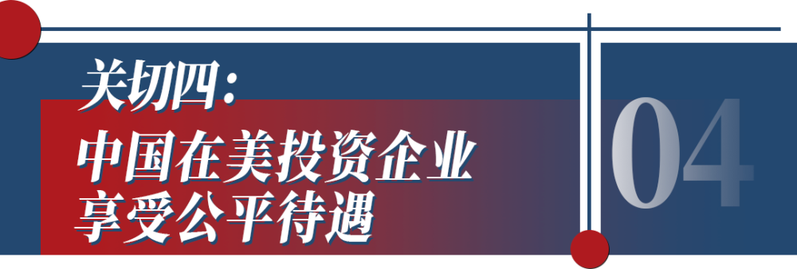

# 新一轮中美经贸对话开启

应美国财政部部长耶伦邀请，11月8日，中共中央政治局委员、国务院副总理、中美经贸中方牵头人何立峰启程前往旧金山，对美国进行访问。

此行，是在落实中美两国元首巴厘岛会晤的共识——巴厘岛会晤中，两国元首同意两国财金团队就宏观经济政策、经贸等问题开展对话协调。

今年9月，为落实中美两国元首巴厘岛会晤重要共识，中美双方商定，成立经济领域工作组，包括“经济工作组”和“金融工作组”。半个月前，中美经济工作组和中美金融工作组相继举行第一次会议。

此次访美，有利于加强中美两国在经济领域的合作。

**玉渊谭天了解到，此行赴美，中方要求美方必须重视中方关切，这是此次交流的前提。**

这些关切，需要美方高度重视，并拿出实际行动作出回应。

**关切一：**

**美国对华经济政策**

在中美双方都官宣此次访问行程的同一天，《华盛顿邮报》发表了一篇美国财长耶伦自己写的文章，她在文章中透露了部分在7月访华时的表态：

我在北京之行期间向中国解释，美国的经济政策，是基于直接的国家安全考虑，而不是为了让美国获得相对于其他国家的优势或是打压其他国家。

作为财长，耶伦负责制定与经济、财政等有关的政策并提出建议，这其中也包括对华经济政策。

相同的话，耶伦在4月就说过。当时，她在约翰斯·霍普金斯大学演讲时提到，美国无意损害中国经济发展，美国对中国采取的有针对性的行动，纯粹是为了保护美国的国家安全。

这场演讲的主题是“美中经济关系”，它也被美媒称为“拜登政府就对华立场最全面的阐述之一”，被视为拜登政府最新的对华经济政策。而它的实际主旨，直白一点地说，就是安全第一、经济第二。

事实上，拜登政府上任以来，对华经济政策的术语一直在变化，从“脱钩”到“再挂钩”再到“竞争”，从“小院高墙”到“去风险”再到“友岸外包”，背后不变的，是其所谓的“安全”叙事。

对于美方的表态，中方的态度也很明确。7月，国务院副总理、中美经贸中方牵头人何立峰在北京会见耶伦时就提到：

**泛化国家安全不利于正常经贸往来。**

7月在北京，中方就已经点明了美方的小心思。

在中美经济交往中，美国长期泛化、滥用“国家安全”，其背后，是美国的霸权思维还在作祟。

中国无意挑战和取代美国，美国却一直将中国视为威胁自身地位的“战略竞争对手”。美国的世界观、中国观、中美关系观都出现了严重偏差，这也导致美国对华政策，包括对华经济政策出现了偏差。

值得一提的是，耶伦在这次的文章中特别做了反思，称“我们不应该沉溺于与中国的竞争，以至于被竞争所定义”。

中国人民大学重阳金融研究院研究员刘英长期关注拜登政府对华经济政策，据她观察，
**拜登政府的确在反思对华政策，尤其是经贸领域对华政策的错误，这在实践中也有所体现。但美国对华的遏制打压，以及这背后根本性的对华竞争思维并没有彻底扭转。现在只能说，有一些向好的迹象。**

**关切二：**

**供应链**

无论是“脱钩”还是“去风险”还是“友岸外包”，其实质都是一个词，“脱钩断链”。

“供应链”也是美方最关注的话题之一。今年以来，在外媒的报道中，平均每个月都会有90多篇关于耶伦谈论“中国”与“供应链”。

如此煞费苦心，成效几何？

今年8月，《经济学人》发表了一篇名为《拜登的中国战略不起作用》的报道，其中提到，尽管美国采取了一系列“脱钩断链”的措施，以减少所谓的对中国的依赖，但实际上，美国对中国的依赖“依然完好无损”。

这篇报道中提到这样一组数据：

2018年，美国从“低成本”亚洲国家进口的商品中，有66%左右来自中国，到2022年，这一数据变成了刚过50%，美国将其中的订单转移到了印度、东南亚国家等。

从数据来看，美国的政策取得了“效果”。但报道也提到，数据变化背后的真相是，美国将这些订单从中国转给其他国家的同时，接受美国订单的国家又在将生产转给中国。

《经济学人》提到这样一个案例：

美国商务部就发现，4家位于东南亚的太阳能供应商，只是将从中国进口的产品做了微小的改动，然后就出口到美国。这样，可以规避美国对中国商品征收的关税。

这种情形还发生在其他领域——墨西哥是在美国“脱钩断链”政策中“受益”的国家，大量的汽车制造工厂迁往墨西哥，以享受美国减免关税的待遇。

但《经济学人》报道中的数据显示，过去5年，中国对墨西哥的汽车零部件出口翻了一番。

美国实施“脱钩断链”政策的“初衷”，是将中国排除在全球产业链供应链体系之外，进而迟滞甚至中断中国的发展进程，但它的实际结果，是加深了中国同其他国家的经济联系。

美国政策适得其反的原因很简单：

市场机制是一个良性机制，它能为消费方找到成本最优的供应商，这是市场规律，美国无法强行改变中国在全球供应链中的影响与地位。

美国需要明白，搞“脱钩断链”，阻挡不了中国的发展进程。

**关切三：**

**半导体政策**

过去半年的中美经贸高层交流中，中方还频繁提及一个关切，那就是美国的半导体政策。

上个月，美国发布对华半导体出口管制最终规则，在去年的基础上，又进一步加强了对人工智能相关芯片、半导体制造设备的对华出口限制，并又将多家中国实体列入出口管制“实体清单”。

要理解这些政策，可以参考美国商务部长雷蒙多说的一句话：随着技术的进步，美国会不断更新半导体出口管制的规则，限制中国获得先进的半导体。

而问题就在于，需要管制的“新技术”包含哪些，什么是“先进半导体”，美国并没有给出一个明确的认定标准，这就留出了随意追加、随意限制的空间。

所以，出现了一个滑稽的迹象是，美国在半导体领域围追的对象，其实反而变成了美国公司：

此前，为了绕过美国的对华出口禁令，英伟达在A100、H100两款芯片的基础上只做了简单的调整，推出特供中国市场的A800和H800芯片。

随后，美国更新出口管制的规则，将矛头对准美国公司的这类应对方法。

不久前，美国政府在一封信中告诉英伟达，对包括中国在内的国家销售高端芯片的新出口限制立即生效。这远远早于原定于11月中旬生效的出口管制新规，英伟达50亿美元对华人工智能芯片订单或被迫取消。

但这并没有阻止美国芯片企业加大与中国的联系。最近几天，在上海举行的进博会上，美国芯片企业美光首次出席，表示美光未来将继续扎根中国，投资中国，回馈中国社会。美光还表示，已经签约参加下一届进博会，期待2024再次相会。

美国半导体行业协会总裁曾多次公开表示，美国半导体行业需要中国。

一意孤行的美国政府，还要无视美国企业的利益到什么时候？

**关切四：**

**中国在美投资企业享受公平待遇**

在对耶伦的社交媒体及相关报道进行分析后，谭主发现，“公平”也是耶伦在谈论中国相关话题时频繁提及的一个词。

公平，要对中国商品一视同仁。过去几个月，中美经贸高层的交流中，中方也多次提出对301关税问题的严正关切。

同样遭受不公平待遇的，是中国在美投资企业。

前不久，美国阿肯色州通过一项法律，禁止某些外国公司收购或持有该州的土地。根据这一法律，阿肯色州要求该州一家中资企业出售其拥有的土地和资产。

这家企业被中国公司收购前，已经在当地深耕数十年。

根据美国农业部的数据，到2021年底，在外国投资人持有的土地中，中国占不到1%。

除了这种“1%的针对”以外，美国还以不透明、不公正的行政手段对中国企业在美融资、运营施加全方位限制。

美方迄今将1300多家中国企业列入各种制裁清单。

想要同中方合作，美国也需要给这份清单“瘦瘦身”。

**关切五：**

**抹黑中国营商环境**

今年8月底，也就是美国商务部长雷蒙多访华期间，美媒突然释放消息称，雷蒙多表示中国已经变得“无法投资”。

报道里说的是，有美国企业向雷蒙多反映了这一情况，而雷蒙多将这番话转述给了美国媒体。说这话时，雷蒙多正在北京去往上海的高铁上，抵达上海后，她参加了上海美国商会的一场活动。

于是，在看到这一报道后，谭主第一时间找到了上海美国商会的负责人。上海美国商会有3000多个会员，是亚太地区规模最大的美国商会，对方表示，没有听到有美企说中国“无法投资”的声音。

“无法投资”还是持续看好，实际行动是最好的证明。

前不久，中国贸促会发布《2023年第三季度中国外资营商环境调研报告》，700家左右受访外资企业对中国营商环境满意度总体较高，八成以上对中国营商环境评价在“满意”以上。

现实面前，美国仍没有放弃抹黑中国营商环境的意图。

不久前，美国国会下属的美中经济与安全审议委员会（USCC）发布分析师报告，称中国存在数据风险等问题。

但这份所谓的报告中，使用的都是“或许”“可能”“似乎”等不确定表达，援引的都是不具权威性的声明。这样毫无根据的指责，无法改变中国依然是全球投资“热土”的事实。

营商环境不断优化的中国，吸引力有多大，一个数据足以说明：

今年1至9月，我国新设外商投资企业37814家，同比增长32.4%。

**中国坚持对外开放的基本国策，而一个更加开放的中国，会释放更多的发展红利。**

是分享红利还是凭空捏造、错失机遇，美国需要好好考虑。

**关切六：**

**共同应对全球挑战**

中美经贸领域的高层会晤，也多次提及合作应对全球共同挑战。

当前全球宏观经济金融稳定、气候变化、债务问题等全球性挑战日益严峻。共同应对全球挑战，符合中美两国的共同利益，也有利于增进世界人民的福祉。

共同应对的前提，是中美双方承担好各自的责任。

当前，世界面临债务危机的风险。研究表明，60%的低收入国家和至少25%的中等收入国家面临较高的债务困境风险。

发展中国家债务问题成因复杂，相关各方应各尽其责、齐心协力，共同应对。

中方全面落实二十国集团缓债倡议，缓债总额在二十国集团成员中最大。美国约翰斯·霍普金斯大学中非研究所的研究成果显示，中国在二十国集团缓债倡议中贡献的缓债额度高达63%。

而以美国为首的西方国家，还没有放弃营造中国给发展中国家制造“债务陷阱”的叙事。

美国，需要拿出行动与担当，中美才能携手共同应对挑战。

**只有这样，中美才能稳定市场预期，为投资活动营造良好氛围，向外界传递积极信号。**

