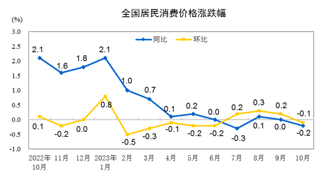
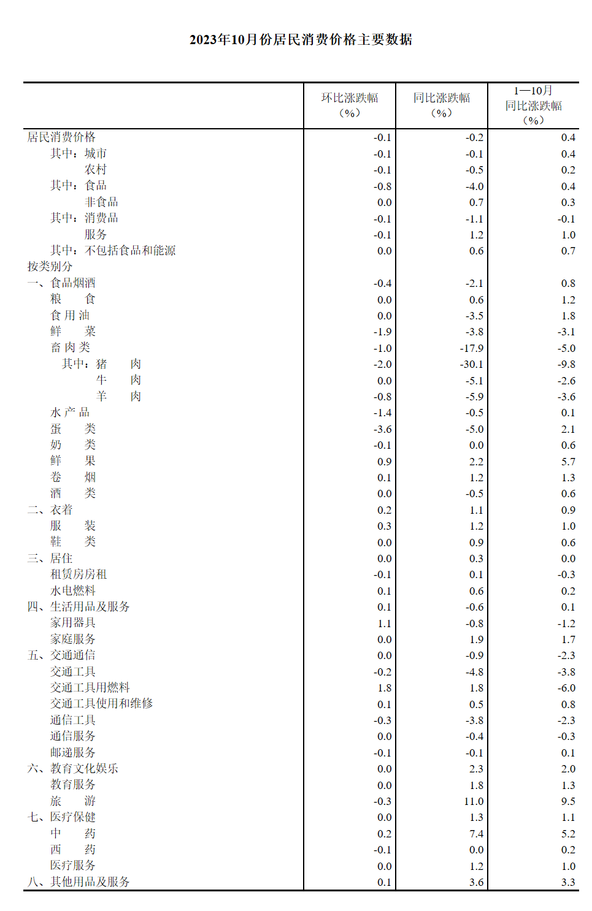

# 时隔两个月再度转负，10月CPI同比下降0.2%，猪肉价格下降30.1%

2023年10月份，全国居民消费价格同比下降0.2%。其中，城市下降0.1%，农村下降0.5%；食品价格下降4.0%，非食品价格上涨0.7%；消费品价格下降1.1%，服务价格上涨1.2%。

1­­—10月平均，全国居民消费价格比上年同期上涨0.4%。

10月份，全国居民消费价格环比下降0.1%。其中，城市下降0.1%，农村下降0.1%；食品价格下降0.8%，非食品价格持平；消费品价格下降0.1%，服务价格下降0.1%。

**一、各类商品及服务价格同比变动情况**

10月份，食品烟酒类价格同比下降2.1%，影响CPI（居民消费价格指数）下降约0.61个百分点。

食品中，畜肉类价格下降17.9%，影响CPI下降约0.66个百分点，其中猪肉价格下降30.1%，影响CPI下降约0.55个百分点；蛋类价格下降5.0%，影响CPI下降约0.04个百分点；鲜菜价格下降3.8%，影响CPI下降约0.08个百分点；水产品价格下降0.5%，影响CPI下降约0.01个百分点；鲜果价格上涨2.2%，影响CPI上涨约0.04个百分点；粮食价格上涨0.6%，影响CPI上涨约0.01个百分点。

其他七大类价格同比五涨两降。其中，其他用品及服务、教育文化娱乐、医疗保健价格分别上涨3.6%、2.3%和1.3%，衣着、居住价格分别上涨1.1%和0.3%；交通通信、生活用品及服务价格分别下降0.9%和0.6%。

**二、各类商品及服务价格环比变动情况**

10月份，食品烟酒类价格环比下降0.4%，影响CPI下降约0.12个百分点。食品中，蛋类价格下降3.6%，影响CPI下降约0.03个百分点；鲜菜价格下降1.9%，影响CPI下降约0.04个百分点；水产品价格下降1.4%，影响CPI下降约0.03个百分点；畜肉类价格下降1.0%，影响CPI下降约0.03个百分点，其中猪肉价格下降2.0%，影响CPI下降约0.03个百分点；鲜果价格上涨0.9%，影响CPI上涨约0.02个百分点。

其他七大类价格环比三涨四平。其中，衣着、生活用品及服务、其他用品及服务价格分别上涨0.2%、0.1%和0.1%；居住、交通通信、教育文化娱乐、医疗保健价格均持平。

**2023年10月份CPI略有下降 PPI环比持平**

**——国家统计局城市司首席统计师董莉娟解读2023年10月份CPI和PPI数据**

国家统计局今天发布了2023年10月份全国CPI（居民消费价格指数）和PPI（工业生产者出厂价格指数）数据。对此，国家统计局城市司首席统计师董莉娟进行了解读。

**一、CPI略有下降**

10月份，受天气晴好农产品供应充足、节后消费需求回落等因素影响，CPI略有下降。

从环比看，CPI下降0.1%。其中，食品价格由上月上涨0.3%转为下降0.8%，影响CPI下降约0.14个百分点，是带动CPI环比由涨转降的主要原因。

食品中，10月份全国大部分地区天气晴好，农产品供应总体充足，加之节后消费需求有所回落，鲜活食品价格大多下降，其中鸡蛋、猪肉、鲜菜和水产品价格分别下降4.3%、2.0%、1.9%和1.4%，均呈季节性回落，合计影响CPI下降约0.13个百分点。非食品价格由上月上涨0.2%转为持平。

非食品中，受国际油价波动影响，国内汽油价格上涨1.8%；节后出行需求回落，飞机票和旅游价格分别下降7.7%和0.3%。

从同比看，CPI下降0.2%，主要是因为食品价格降幅扩大。食品价格下降4.0%，降幅比上月扩大0.8个百分点，影响CPI下降约0.75个百分点。

食品中，猪肉价格下降30.1%，降幅扩大8.1个百分点，影响CPI下降约0.55个百分点；鸡蛋、牛羊肉、鲜菜和食用油价格也下降较多，降幅在3.5%—6.4%；鲜果价格由上月下降0.3%转为上涨2.2%。

非食品价格上涨0.7%，涨幅与上月相同，影响CPI上涨约0.57个百分点。非食品中，工业消费品价格下降0.1%，降幅收窄0.2个百分点，其中汽油价格由上月下降1.2%转为上涨1.8%；服务价格上涨1.2%，涨幅回落0.1个百分点，其中旅游和飞机票价格分别上涨11.0%和5.1%，涨幅均有回落。

据测算，在10月份0.2%的CPI同比降幅中，翘尾影响约为-0.2个百分点，与上月相同；今年价格变动的新影响约为0，比上月回落0.2个百分点。扣除食品和能源价格的核心CPI同比上涨0.6%，涨幅略有回落。

**二、PPI环比由涨转平，同比降幅略有扩大**

10月份，工业生产经营活动保持扩张，受国际原油、有色金属价格波动及上年同期对比基数走高等因素影响，全国PPI环比由涨转平，同比降幅略有扩大。

从环比看，PPI由上月上涨0.4%转为持平。其中，生产资料价格上涨0.1%，涨幅比上月回落0.4个百分点；生活资料价格由上月上涨0.1%转为下降0.1%。受国际原油和有色金属价格波动影响，石油和天然气开采业、石油煤炭及其他燃料加工业价格分别上涨2.8%、2.5%，涨幅分别回落1.3、0.6个百分点；有色金属冶炼和压延加工业价格由上月上涨1.2%转为下降0.2%。

煤炭需求增加、供给偏紧，煤炭开采和洗选业价格上涨3.4%，涨幅扩大2.3个百分点。钢材、水泥供应相对充足，黑色金属冶炼和压延加工业价格下降0.6%，水泥制造价格下降0.1%。装备制造业中，新能源乘用车价格上涨0.1%；计算机通信和其他电子设备制造业价格下降0.3%。另外，电力热力生产和供应业价格下降0.7%，农副食品加工业价格下降0.4%。

从同比看，PPI下降2.6%，降幅比上月扩大0.1个百分点。同比降幅扩大，主要是受上年同期对比基数走高影响。其中，生产资料价格下降3.0%，降幅与上月相同；生活资料价格下降0.9%，降幅扩大0.6个百分点。主要行业中，价格降幅扩大的有：非金属矿物制品业下降7.6%，扩大0.6个百分点；黑色金属冶炼和压延加工业下降5.2%，扩大0.2个百分点。

价格降幅收窄的有：煤炭开采和洗选业下降15.4%，收窄0.2个百分点；化学原料和化学制品制造业下降6.9%，收窄0.2个百分点；石油煤炭及其他燃料加工业下降3.8%，收窄2.9个百分点。有色金属冶炼和压延加工业价格上涨2.6%，涨幅回落0.1个百分点；石油和天然气开采业价格由上月下降3.3%转为上涨1.7%。另外，新能源乘用车价格下降4.6%，计算机通信和其他电子设备制造业价格下降2.9%。

据测算，在10月份2.6%的PPI同比降幅中，翘尾影响约为-0.4个百分点，上月为-0.2个百分点；今年价格变动的新影响约为-2.2个百分点，上月为-2.3个百分点。

**附注**

1.指标解释

居民消费价格指数（Consumer Price
Index，简称CPI）是度量居民生活消费品和服务价格水平随着时间变动的相对数，综合反映居民购买的生活消费品和服务价格水平的变动情况。

2.统计范围

居民消费价格统计调查涵盖全国城乡居民生活消费的食品烟酒、衣着、居住、生活用品及服务、交通通信、教育文化娱乐、医疗保健、其他用品及服务等8大类、268个基本分类的商品与服务价格。

3.调查方法

采用抽样调查方法抽选确定调查网点，按照“定人、定点、定时”的原则，直接派人到调查网点或从互联网采集原始价格。数据来源于全国31个省（区、市）约500个市县、近10万家价格调查点，包括商场（店）、超市、农贸市场、服务网点和互联网电商等。

4.数据说明

由于“四舍五入”原因，有时会出现合计数据与分类数据高值或低值相同的情况。

