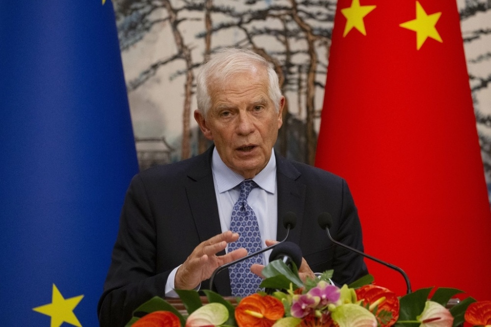
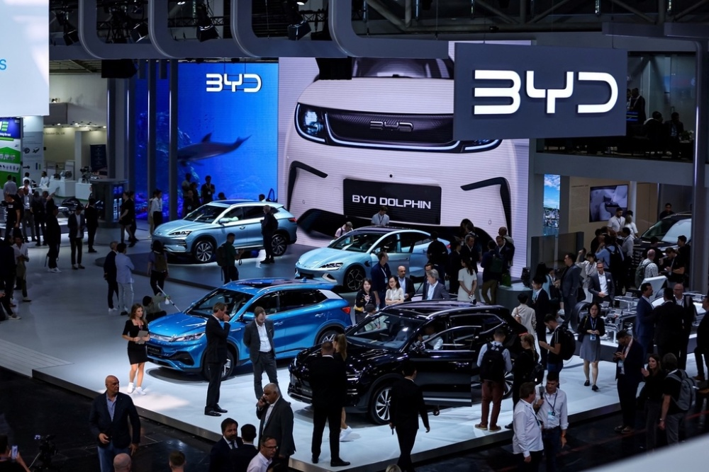

# 欧盟外长竟就中欧经贸发出威胁：若中国不开放市场，欧盟将关闭市场

【文/观察者网
熊超然】当地时间11月6日，欧盟委员会主席冯德莱恩抢先中方“自我放风”称，未来几周内将访华并参加中欧领导人会晤。不过在此之前，她却又频繁在讲话中“点名”中国，试图在欧中关系、经贸合作，以及巴以冲突等地区问题和全球问题上向中方施压。

据香港《南华早报》11月8日报道，特别是在经贸问题上，以冯德莱恩为首的欧盟高级官员不断炒作渲染欧洲商界的所谓“不安情绪”，给中方扣上“破坏公平贸易”的帽子。欧盟外交与安全政策高级代表兼欧盟委员会副主席何塞普·博雷利（Josep
Borrel）甚至还威胁般地声称：“若中国不开放市场，欧州市场将不得不关闭。”

讲话中，博雷利自诩欧盟“不是贸易保护主义者”，然而欧盟在电动汽车领域对华发起反补贴调查，以及试图在医疗设备和风电等领域“故技重施”，却是赤裸裸的“贸易保护主义”。这一点，就连德国总理朔尔茨也不讳言。

_资料图：10月13日，欧盟外交与安全政策高级代表博雷利在北京参加第十二轮中欧高级别战略对话。图自IC Photo_

当地时间11月6日，欧盟委员会主席冯德莱恩在比利时布鲁塞尔举行的2023年欧盟驻外使节年会上表示，中欧领导人会晤将在几周内举行。另据美国“政治新闻网”欧洲版报道，除了她，欧洲理事会主席米歇尔也将来华参加中欧领导人会晤。这有望成为4年来首次举行的线下中欧领导人会晤。截至目前，中方尚未宣布会谈的日期和地点。

《南华早报》称，在本周的多次讲话中，欧盟领导人都在暗示，如果中国不向欧洲公司开放市场，并停止其所谓的“经济欺凌”，欧盟可能会采取更具对抗性的贸易政策。报道认为，欧盟官员“目的性明显”，是想刻意在中欧领导人会晤之前，给欧中关系中描绘出一种“悲凉景象”。

“我们必须正确对待中国。我们必须认识到，在我们（欧中）关系中存在着明显的竞争因素，但这种竞争可以是建设性的，而非对立的。”冯德莱恩在6日的讲话中说，这就是为什么欧盟需要有效的沟通渠道和高层外交，“这就是我所说的通过外交‘去风险’”。

冯德莱恩提到，中国一直是欧盟最重要的商品贸易伙伴，但她声称，“‘去风险，而非脱钩’是现在所有主要西方伙伴都接受的对华战略”。她还称赞欧盟近期对中国电动汽车进行反补贴调查等举措，再次强调了对中国“去风险”的必要性。

_欧盟委员会主席冯德莱恩 图自欧盟委员会网站_

据报道，同样是在2023年欧盟驻外使节年会上，欧盟外交与安全政策高级代表博雷利甚至谈及与中国爆发贸易战的可能性。他扬言，“在欧洲企业发现在华开展业务越来越困难之际，中国将难以保持进入欧洲市场的机会”。

“如果中国继续否认这种不平衡的现实和后果，就有可能看到欧洲对更多保护的需求不断上升。我们不是贸易保护主义者，但也许我们必须保护自己。如果中国不开放（市场），也许我们将不得不关闭（市场）。”

《南华早报》举例称，欧盟已宣布对中国电动汽车发起反补贴调查，布鲁塞尔方面的一些人士还希望进一步在医疗设备和风电等领域对华发起调查。事实上，对于博雷利所谓的“我们不是贸易保护主义者”一说，中方此前就已拆穿其谎言——欧方拟进行的反补贴调查是贸易保护主义行为，将影响中欧绿色合作和全球汽车产业链供应链稳定。

而在欧盟内部，德国等多个成员国也反对欧盟委员会对华发起反补贴调查。德国总理朔尔茨在德媒《经济周刊》当地时间9月28日刊发的采访报道中，就“对中国电动汽车加征关税的必要性”话题表态，他称对此“不是很确信”（not
convinced）。朔尔茨还认为，欧盟此举完全是一种“保护主义做法”，而欧洲的经济模式不应当依赖或以“保护主义”为基础，而是应当想法设法提升产品的吸引力。

_今年9月，比亚迪等中国车企在慕尼黑车展亮相。图自IC Photo_

值得注意的是，今年是中国和欧盟建立全面战略伙伴关系20周年，近期中欧互动频繁。

10月12日至14日，欧盟外交与安全政策高级代表兼欧盟委员会副主席博雷利访华并举行第十二轮中欧高级别战略对话。希腊总理米佐塔基斯、爱尔兰副总理兼外交与国防部长马丁也先后访华。

此外，中欧领导人会晤是中欧双方最高级别的政治对话机制和定期会晤机制，始于1998年，历次会晤涉及的议题涵盖政治、经济、文化、社会等各个领域。一般来说，中国国务院总理代表中方与会，欧盟方面则由欧洲理事会和欧盟委员会负责人作为代表与会。

谈及即将举行的中欧领导人会晤，冯德莱恩表示，去年底以来，欧盟与中国“进行了密集对话”，包括四次高级别对话，而新一届中欧领导人会晤将在几周内举行。她称，与中国在全球问题上的合作是可能的，而且正在发生。中欧有空间共同制定共同的规则与解决方案，以应对共同面临的挑战。

11月5日，第六届中国国际进口博览会在上海开幕。在世界经济面临诸多挑战的背景下，这一在新冠疫情后首次全面恢复线下举办的全球经贸盛会，再次向世界释放出中国持续推进高水平对外开放、与各国共享发展机遇的强烈讯息。

当天，国务院总理李强在上海出席第六届中国国际进口博览会暨虹桥国际经济论坛开幕式，并发表主旨演讲时强调，中国将持续推进“市场机遇更大”的开放、“规则对接更好”的开放、“创新动能更足”的开放和“包容共享更强”的开放。

李强指出，经济全球化是历史大势、人心所向，开放合作、互利共赢是最明智也是最自然的选择。中国真诚希望与各国一道，在开放的大舞台上相向而行、相互成就，推动经济全球化朝着更加开放、包容、普惠、平衡、共赢的方向发展，为世界经济复苏和全球发展繁荣作出更大贡献。

**本文系观察者网独家稿件，未经授权，不得转载。**

