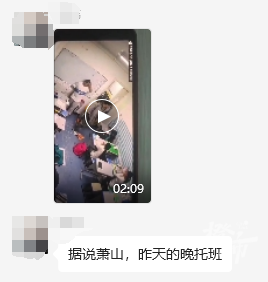
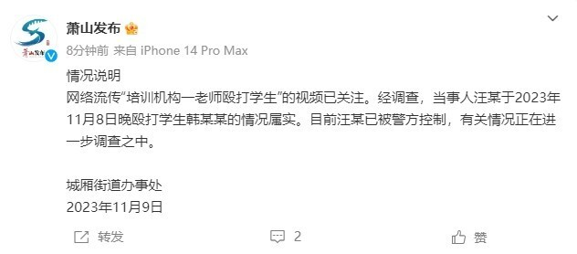

# 浙江萧山一培训机构老师殴打学生？官方：属实，该老师已被警方控制

今天傍晚，一则“萧山某培训机构老师殴打学生”的视频在网上流传。

视频画面显示，一教室内，坐在讲台边的男老师，先是拿书猛砸一位坐在第一排的男生，之后走上前敲打该男生的头部，脚踹其腹部，最后甚至将男生抱摔在地……

今天傍晚，橙柿互动记者联系上杭州市公安局萧山分局城厢派出所，对方表示，已受理该案件。

今晚7点38分，@萧山发布 发布情况说明：

**情况说明**

网络流传“培训机构一老师殴打学生”的视频已关注。经调查，当事人汪某于2023年11月8日晚殴打学生韩某某的情况属实。目前汪某已被警方控制，有关情况正在进一步调查之中。

城厢街道办事处

2023年11月9日

