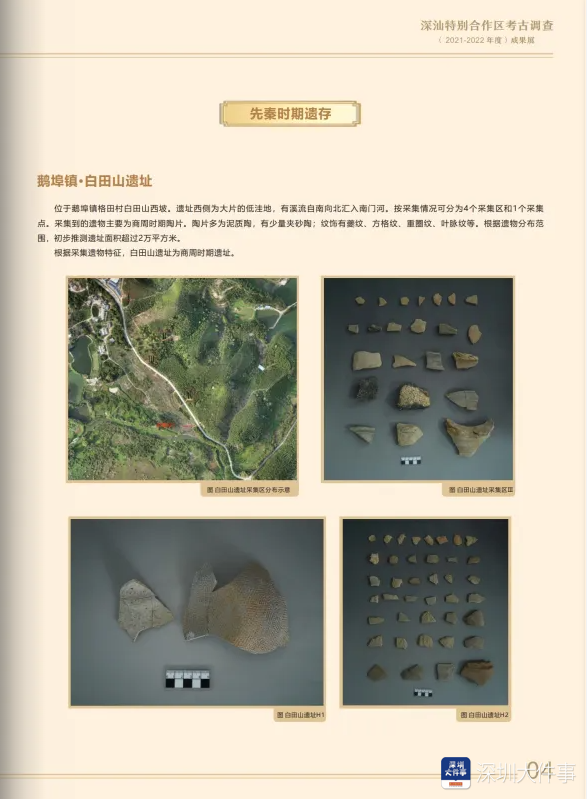

# 深汕一工地挖出疑似商周时期遗址 至今有2000多年

**南都讯 记者曾海城** 近日，网上多个视频流传，深汕特别合作区一工地施工时，疑似挖出商周时期遗址，目前正在进行保护性考古挖掘。

_现场图片。陈文东拍摄_

南都记者了解到，该工地位于深汕特别合作区格田村附近，网上航拍视频显示，工地上有身穿“深圳考古”字样衣服的人员在进行挖掘工作，视频中显示，现场还有一些展板，展板上写着“白田山遗址，与化工园一期用地重叠面积约为159172平方米，包括1-3
号岗整体、4-6号岗东坡部分区域”。

在2022年深圳市“文化和自然遗产日”系列活动中，线上+线下联动展出了“深汕特别合作区考古调查（2001-2022年度）成果展”。南都记者查找发现，“深汕特别合作区考古调查（2001-2022年度）成果展”有关于白田山遗址的描述。白田山遗址位于鹅埠镇格田村白田山西坡，遗址西侧为大片的低洼地，有溪流自南向北汇入南门河，按采集情况可分为4个采集区和1个采集点。采集到的遗物主要为商周时期陶片，陶片多为记质陶，有少量夹砂陶，纹饰有夔纹、方格纹、重圈纹、叶脉等。根据遗物分布范围，初步推测遗址面积超过2万平方米。根据采集遗物特征，白田山遗址为商周时期遗址。

据了解，商周考古是中国考古学的一个重要阶段，商周时期约为公元前1600年到公元前256年，也就是说，两三千年前已有较大规模的人类群体在深汕特别合作区这片土地上生产生活。

_深汕特别合作区考古调查（2001-2022年度）成果展页面截图。_

南都记者查阅公开报道发现，深圳市文化遗产保护中心于2021年底启动了深汕特别合作区考古调查工作（2021－2022年度），组织专业队伍对合作区进行了全面踏查，同时开展了窑址专项调查。经过近3个月的田野调查，工作队在合作区新发现、探明或测绘：先秦遗址4处、遗物点28处、古建筑9处、古墓葬279处、明清窑址5处（含三普登记点1处）、近现代史迹、革命文物2处、古村寨8处、古驿道4段、碑刻13通。第三次全国不可移动文物普查时，合作区范围内共登记不可移动文物15处，包括东周遗址1处、明清窑址3处、明代古驿道1处、明清古寨3处。

公开报道中还提到，考古调查工作人员首次在合作区发现了早至新石器时代晚期的遗存，这将合作区范围内人类活动的年代上限提早至新石器时代晚期。新发现了白田山、新厝、秋塘等商周时期遗址，这些重要遗址的发现意味着商周时期已经有较大规模的人类群体在这里生产生活。

