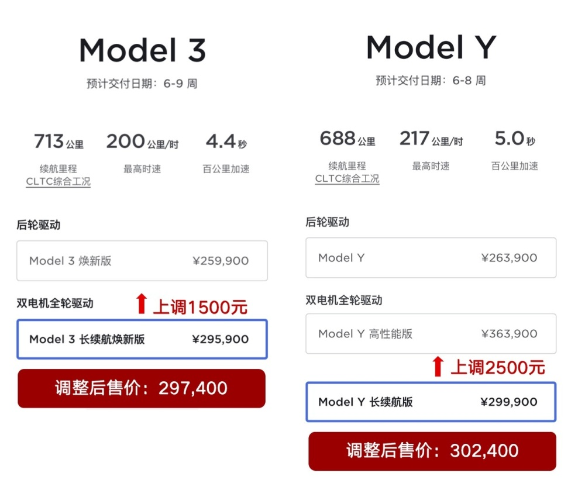

# 特斯拉Model 3、Model Y长续航版涨价！两款车型分别上涨1500和2500元

腾讯汽车讯 11月9日消息，据特斯拉中国官网，Model Y全轮驱动长续航版售价调整为30.24万元，上涨2500元。Model
3长续航焕新版售价调整为29.74万元，上调1500元。

此前，特斯拉Model Y长续航版售29.99万元，高性能版本售价36.39万元。特斯拉Model 3长续航焕新版售价为29.59万元。

10月27日，特斯拉就已经对Model Y高性能版进行了涨价，售价上调了1.4万元，售36.39万元起。

