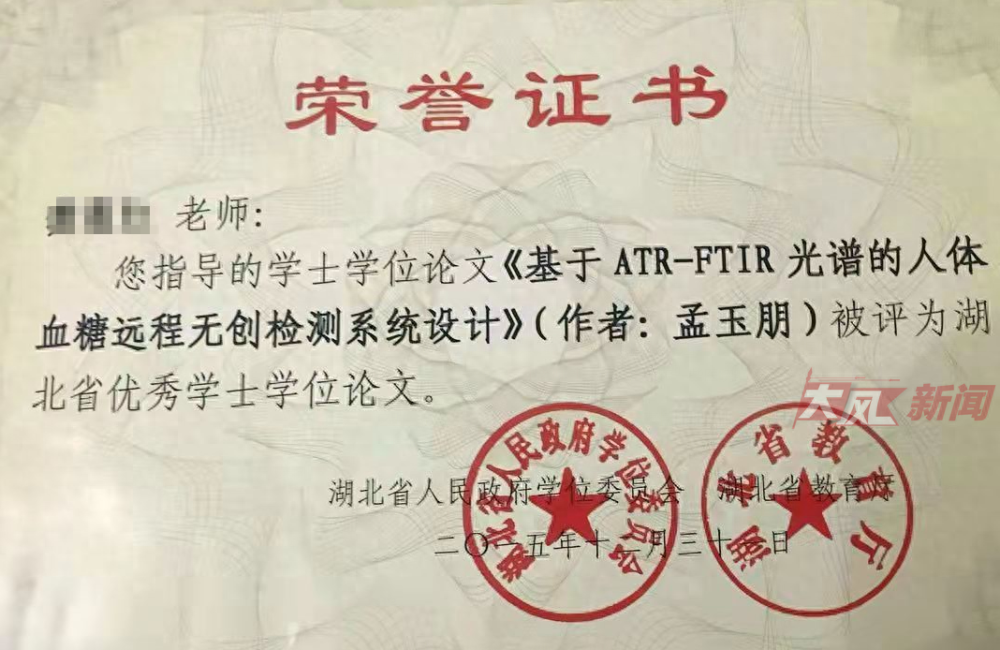

# 男子举报论文遭母校教师剽窃：错别字都一样，署名的有对方侄女和外甥

他毕业6年后，发现当初的毕业论文遭母校老师剽窃去申请国家专利，遂愤而拿起法律武器维权。

**起因：**

**开公司后申请专利，**

**检索发现6年前毕业论文遭母校老师剽窃，**

**“连错别字都一样”**

这名男子叫孟玉朋，今年30岁，湖北省黄冈市蕲春县人。

他对记者介绍说，2011年高考时，他以520多分的成绩考入位于湖北省咸宁市的湖北科技学院生物医学工程专业学习，大四上学期根据学校安排来到广东珠海一家医院实习，同时开始做毕业论文的准备工作。

实习期间，他抽空查文献、做课题、写程序，2015年5月完成毕业论文《基于ATR-
FTIR光谱的人体血糖远程无创检测系统设计》和毕业设计作品，顺利通过了本科毕业论文答辩。

毕业后，他只身来到珠海一家公司从事产品研发工作。

2016年5月，孟玉朋与2名志同道合的大学同学在武汉市洪山区成立了一家与医疗器械有关的公司，主要从事医疗器械的研发、维护和销售等。

他对华商报大风新闻记者回忆称，2021年10月，他们公司想申请成为高新技术企业，打算做一些高精尖产品，他想将读大学时的研究成果申请国家专利，于是在网上检索相关资料。

检索结果令他大吃一惊，他发现有人利用他毕业论文里的研究成果已申请了3项国家专利，“我进一步查询国家知识产权局专利检索及分析官网发现，那些专利的申请时间是2017年9月6日。”

更令他感到吃惊的是，申请（专利权）人系他母校湖北科技学院，发明人署名为叶某和郑某等4人，叶某和郑某是他母校老师，前者当时系湖北科技学院医学部生物医学工程与医学影像学院副教授，郑某则是该学院院长，“这两人根本没给我上过课，不是我的老师。”

孟玉朋说，他仔细比对发现，该专利作品所用材料与他的毕业论文几乎一模一样，“图片也是我论文里面的，甚至连错别字都完全一样，他们竟然没有改过。”

他愤怒地说，他们不仅是侵权，更是赤裸裸地剽窃了他的论文和盗走了他的科研成果。

_孟玉朋_

**被踢：**

**约500人校友群里诉说遭遇被劝“不要闹”，**

**多人替他鸣不平一起被踢出群**

孟玉朋说，随后他在校友群里诉说了自己的遭遇并提供了一些证据作为佐证，“该校友群里约有500人，除学校领导和老师外，还有校友和一些医院的领导等。”

这时，有些校友劝他不要闹，希望莫把事情搞大了。孰料，此事被越来越多的人知道了，事情越闹越大，有人开始怪罪于他，便将他踢出校友群。

然而，随后事情开始发酵，校友群里更多的人开始支持他，替他鸣不平，认为他应该找学校讨说法，“没想到，他们相继被踢出了群，估计有20余人。”

**举报：**

**查出同时署名的系涉事教师侄女和外甥，**

**发律师函举报对方涉嫌侵权**

孟玉朋告诉记者，事后他辗转联系上了涉事的叶某，“他根本不承认是抄袭，还说申请专利是为学校好。”

然而，孟玉朋进一步打听得知，那些专利署名中除叶某和郑某外，另一人系叶某侄女，还有一人系他外甥，“这两人均是往届生，其中他外甥还是我的大学同班同学。”

2021年10月18日，孟玉朋托同事通过微信与母校湖北科技学院沟通，后来他通过发律师函的形式正式实名举报叶某等人剽窃他的论文和作品，称对方的行为涉嫌侵权。

**处理：**

**学校认定学术不端给予通报批评，**

**责令公开赔礼道歉追回所获科研奖励**

接到举报后，湖北科技学院高度重视，该校学术伦理与道德监察委员会立即成立调查组，对举报内容展开详细调查。

2021年11月9日，该校学术委员会给孟玉朋送达了一份《关于叶某学术不端行为处理意见的函》。

据悉，叶某出生于1979年9月，湖北新洲人，2012年6月毕业于华中科技大学生命科学与技术学院,获生物医学工程专业博士学位。

记者看到，该函称，调查认定叶某作为发明人的那3个专利与孟玉朋的毕业论文在元器件的编号及其型号位置标注、硬件系统框架图和文字陈述3个关键方面高度雷同，存在剽窃他人学术成果和不当使用他人署名的学术不端行为。

该函介绍说，后来他们召开会议，根据相关规定一致认为叶某存在学术不端行为，经商议后作出处理建议提交校长办公会研究，最终决定对叶某进行科研诚信诫勉谈话，给予他通报批评，暂缓2年申报高一级专业技术职务岗位，取消3年内研究生导师的申报资格，责令他向孟玉朋等4人公开赔礼道歉，追回相关专利所获科研奖励。

有知情人士称，2021 年11月18日，叶某向湖北科技学院提出辞职，同年12月19日，该校解除与他签订的聘用合同。

**判决：**

**法院一审判涉事教师赔礼道歉赔偿10万元，**

**他终审获校方赔偿15万元**

学校给予叶某这样的处分令孟玉朋感到不满，他遂于2021年11月将该著作权权属、侵权纠纷案诉至湖北省咸宁市中级法院，被推上被告席的除他母校外，还有叶某等4人。

他在起诉状中称，被告在未经他授权许可下抄袭、剽窃他的智力成果，构成侵权，请求法院判令被告停止侵权并公开赔礼道歉，同时判令被告赔偿他经济损失30万元，精神损害抚慰金2万元及合理维权费用。

庭审时，作为被告的湖北科技学院辩称，并无侵害孟玉朋著作权的主观故意，根据高校相关法律法规的规定，毕业论文应由学校享有权利，且论文是在学校和老师指导下所形成，其著作权应归属于湖北科技学院。

被告叶某辩称，学院教务处保存的论文与孟玉朋提交的论文有明显改动之处，且原告的论文不具有独创性，不属于作品，案涉论文中的原理和方法均为2014
年公众所知晓的常识，该论文并非原告独立完成。原告利用学校的资源，创作系为了完成学校任务，代表了学校的意志，故学校为该论文的作者。

他说，案涉专利系由他在教学过程中形成的理论知识与其他论文结合，由专利代理机构撰写，申请了专利，案涉专利申请人为湖北科技学院，发明人仅有署名权及获得少量利益的权利，申请人与发明人是不同概念，该案发明人不应作为被告，主体不适格。

被告郑某辩称，其对案涉专利申请并不知情，专利申请全过程是由叶某完成，在审批管理程序上也无需学院进行管理，专利确认函中也无她本人签字，案涉专利未进行转换，未获得任何商业价值，她亦未从中获得任何利益，其职称晋升和学术研究此前早已完成。

法院审理查明，2015年12月，孟玉朋的该论文被评为湖北省优秀学士学位论文，该案争议的焦点是“孟玉朋毕业论文的著作权归属问题”“涉案三项专利说明书及附图等是否与涉案论文内容高度雷同问题”“侵权主体及责任承担的问题”。

2022年9月15日，该法院一审宣判称，叶某向孟玉朋公开赔礼道歉，同时赔偿他10万元。

一审宣判后，孟玉朋和叶某均不服，上诉至湖北省高级法院。

今年11月1日，该法院作出终审判决称，撤销湖北省咸宁市中级法院的那份一审判决，判决湖北科技学院赔偿孟玉朋15万元，叶某承担连带赔偿责任。

华商报大风新闻记者 黄平 编辑 董琳

